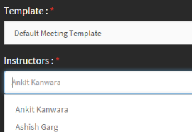

# Adobe Connect 集成

作者可以在创建课程的过程中使用 Adobe Connect 创建虚拟教室课程。 要为 Adobe Learning Manager 帐户启用 Adobe Connect，请与所在公司的管理员联系。

## 使用 Adobe Connect 创建虚拟教室 (VC) 课程 {#createvirtualclassroomvccoursewithadobeconnect}

1. 在“我的课程”页面上，单击“添加模块”并选择“虚拟教室”。 此时会显示“创建虚拟教室”对话框。
1. 在&#x200B;**实时虚拟培训工具**&#x200B;选项中，选择&#x200B;**Adobe Connect**。

   

   *创建虚拟教室*

1. 输入标题、描述、虚拟教室日期、开始时间和结束时间。

   如果未为您的帐户配置 Adobe Connect，则会显示一条警告消息，如上方的屏幕截图所示。 模板、讲师和其他 Adobe Connect 选项已禁用。 您需要联系您的管理员来为您的帐户配置 Adobe Connect。

1. Adobe Learning Manager 应用程序会从 Adobe Connect 中提取默认模板（会议、培训和活动）以及讲师列表（具有主持人权限的用户）。 根据需要选择模板。
1. 从讲师列表中选择虚拟教室课程的讲师。

   

   *从列表中选择讲师*

1. 提供虚拟教室课程的完成条件。 学习者参与课程的时长占课程总时长的百分比必须达到一定数值，才能视为已完成课程。该数值即为完成条件。 例如，假设课程持续时间为 1 小时。 如果选择 50% 作为完成条件，那么如果学习者参与课程的时长只有 30 分钟，也将视为完成课程。
1. 单击&#x200B;**[!UICONTROL “完成”]**。

## 共享 Adobe Connect 的模板 {#sharedtemplatesofadobeconnect}

默认情况下，Adobe Connect 帐户中创建的所有共享模板都会提取到 Adobe Learning Manager 应用程序。 您可以在 Adobe Connect 帐户中将其设为共享模板，以便添加自定义模板。

## 使用Live Hub创建虚拟教室课程

Live Hub是Adobe Learning Manager的原生、AI支持的虚拟教室解决方案，使组织能够交付实时培训，而无需依赖第三方会议工具。

管理员为您的帐户启用Live Hub后，该帐户将与其他支持的提供商（例如Adobe Connect）一起出现在&#x200B;**实时虚拟培训工具**&#x200B;列表中。

Live Hub还包括一个基于AI的讲师查找器，该查找器根据您的虚拟教室要求、所需技能和会话详细信息向讲师提供建议。 这有助于您识别合适的讲师，而无需手动搜索整个讲师列表。

有关详细信息，请查看[创建Live Hub会话](../../getting-started-with-live-hub/create-a-live-hub-session.md)。