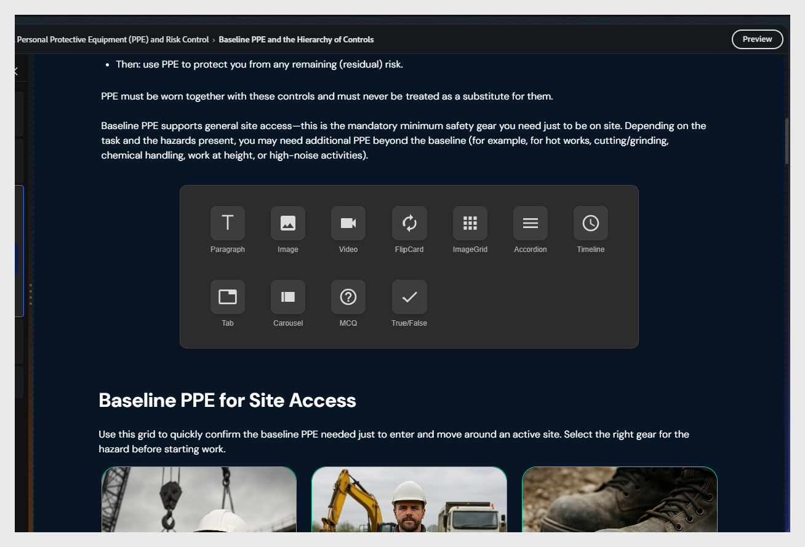

# 添加内容组件

在两个现有元素之间进行选择。 出现+按钮。 选择它以打开组件选取器。

可用组件：

| **组件** | **用于** |
|----------------|---------------------------------------------------|
| **段落** | 正文文本和说明 |
| **图像** | 插图、屏幕截图、图表 |
| **视频** | 嵌入的MP4或链接视频 |
| **翻转卡** | 术语或定义对，显示交互 |
| **图像网格** | 网格布局中的多个图像 |
| **折叠面板** | 可展开的章节，分步步骤 |
| **时间轴** | 顺序事件或流程步骤 |
| **制表符** | 并行内容 — 比较、区域变体 |
| **轮播** | 一系列可滑动的图像或内容卡 |
| **MCQ** | 内联未分级知识检查 |
| **True/False** | 内联未分级的True或False检查 |

>[!NOTE]
>
>使用&#x200B;**折叠面板**&#x200B;执行分步学习程序，学习者可以通过控制节奏来获得好处。 将&#x200B;**翻转卡**&#x200B;用于术语或定义内容。

## 在主题内移动内容块

您可以使用工具栏中的编辑选项或AI对主题中的内容块进行重新排序。

