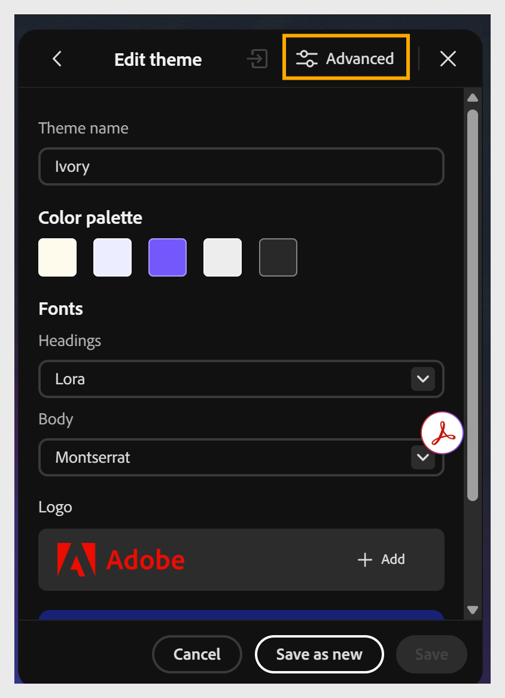

# Content Composer中的高级主题自定义

## 在应用程序中自定义高级主题属性

使用高级主题属性可更精细地控制各个元素，如课程名称、主题名称、块标题、子标题、字幕和段落。

1. 选择&#x200B;**主题**，将鼠标悬停在已应用的主题上，选择&#x200B;**编辑**，然后选择&#x200B;**高级**。
   

2. 在“字体属性”面板中，为您的课程设置&#x200B;**字体配对**：

   - 选择&#x200B;**标题**&#x200B;下拉列表并为所有标题选择字体。

   - 选择&#x200B;**正文**下拉列表并为正文选择字体。
     

3. 设置元素列表： **课程名称**、**主题名称**、**块标题**、**副标题**、**题注**&#x200B;和&#x200B;**段落；**&#x200B;选择要自定义的元素。

4. 在[!UICONTROL 视觉属性]面板中，您可以调整课程中的布局和间距。

   - 使用内容密度选项设置元素之间的间距量。

   - 若要设置&#x200B;**卡片/图像圆角半径**，请拖动滑块或输入一个值，以设置卡片和图像的圆度。 例如，将半径设置为17像素。

   - 选择“**课程**”以更改课程的背景颜色或图像。

   - 选择“**主题**”以设置主题的背景颜色或边框。

   - 选择&#x200B;**页眉/页脚**&#x200B;以设置页眉和属性。

   内容书写器会在您进行更改时自动在画布中预览这些更改。

5. 对于所选元素，请根据需要自定义其属性：

   - 选择&#x200B;**字体样式**，例如“大写”。

   - 使用&#x200B;**+**&#x200B;和&#x200B;**-**&#x200B;控件设置&#x200B;**字体大小**。

   - 选择&#x200B;**字体颜色**。

   - 应用格式，例如&#x200B;**粗体**、*斜体*、<u>下划线</u>或&#x200B;~~删除线~~。

   - 设置&#x200B;**文本对齐方式**。

6. 在右侧画布中预览您所做的更改。 使用“**当前课程**”和“**测试课程**”选项卡检查您的更改在不同课程中的显示方式。
   

7. 选择“**另存新档**”或“**保存**”。
