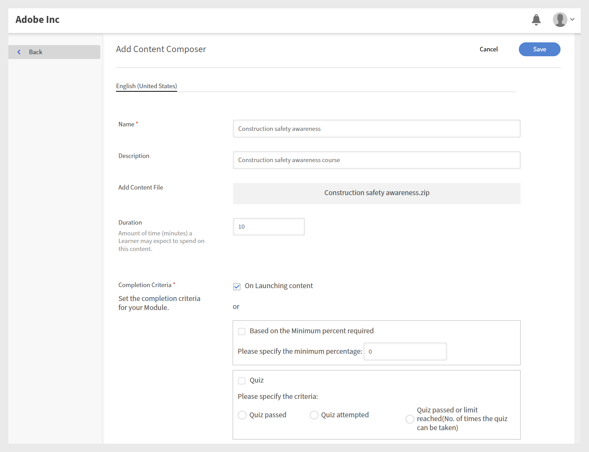

# Adobe Learning Manager Content Composer和Adobe Learning Manager如何协同工作

内容书写器处理创作。 Adobe Learning Manager可处理交付、注册、跟踪和报告。 这两个产品通过发布步骤相连接。 从Content Composer发布后，课程将成为ALM内容库中的一个模块，您可以将该模块组合到课程中并分配给学习者。

## 内容书写器控制哪些内容

- 课程和主题结构

- 课程内容 — 文本、图像、视频、组件和知识检查

- 课程结束测验，包括问题类型和答案选项

- 视觉主题

- 完成标准和成功标准

- 用于报告的SCORM版本

## Adobe Learning Manager可以控制什么

- 学习者注册和访问

- 模块元数据 — 持续时间、标签、唯一ID、到期

- 课程组合 — 将内容编辑器模块与其他学习内容相结合

- 学习者跟踪、报告和成绩单

- 课程版本控制

- 通知和提醒

## 从课程创建到学习者完成

1. **在Content Composer中创作课程**：在Content Composer中创建课程，包括课程、主题、主题、测验和完成设置。 在发布之前配置课程设置 — 完成标准、成功标准和测验评分。
有关详细信息，请参阅[配置课程设置](#settings)。

2. **Publish到Adobe Learning Manager：**&#x200B;创作完成后，通过&#x200B;**导出**&#x200B;设置将Content Composer连接到您的ALM帐户并发布课程。 Content Composer将课程作为符合SCORM规范的模块发送至ALM内容库。
   

3. **在ALM：**&#x200B;中配置模块发布后，课程将在ALM内容库中显示为模块。 ALM作者可配置模块元数据（包括持续时间、标签、唯一ID和到期设置），并将模块与其他学习内容一起添加到ALM课程。
   

>[!NOTE]
>
>如果在Adobe Learning Manager (ALM)中设置完成和成功标准，则这些设置优先于内容书写器中定义的设置。

4.**Publish the ALM课程：** ALM作者将模块组装到ALM课程中，添加课程图像和设置，然后发布该课程。 只有完成此步骤后，才能注册学习者。

有关详细信息，请参阅[Adobe Learning Manager](https://experienceleague.adobe.com/zh-hans/docs/learning-manager/using/get-started/getting-started-author)。

有关更多信息，请参阅[在ALM上以作者身份创建课程](https://experienceleague.adobe.com/zh-hans/docs/learning-manager/using/authors/courses)。

5.**学习者完成课程：**&#x200B;学习者通过Adobe Learning Manager访问课程、启动Content Composer模块、完成课程和测验，并根据在步骤1中配置的完成和成功标准获得分数。

有关更多信息，请参阅[以学习者身份访问课程](https://experienceleague.adobe.com/zh-hans/docs/learning-manager/using/get-started/getting-started-learner)。

6.ALM记录学习者进度：完成状态、测验分数和学习者数据均记录在ALM中，并可通过学习者成绩单和管理报告提供。

7.**使用版本控制更新课程**：当您更新Content Composer中的内容并重新发布时，ALM将创建模块的新版本。 ALM作者可以更新现有课程以使用最新版本。
