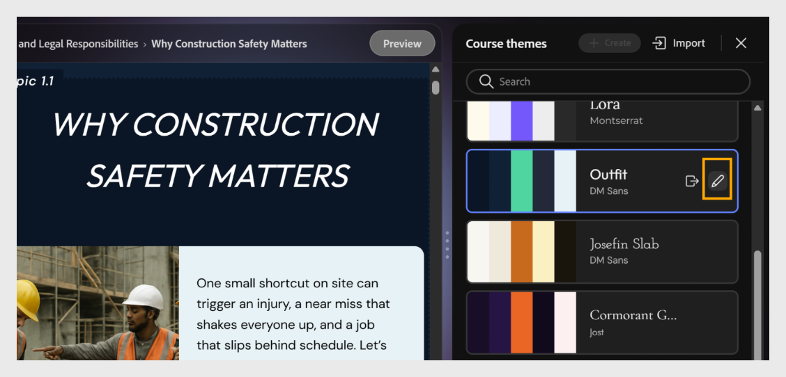
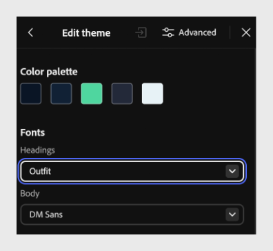

# 更改字体

更新标题和正文字体，以更好地匹配您的内容或品牌。

1. 从工具栏中选择&#x200B;**主题**，然后将鼠标悬停在已应用的主题上，然后选择&#x200B;**编辑**。 此时将打开&#x200B;**编辑主题**&#x200B;面板，显示主题的调色板和字体。

   

2. 在&#x200B;**字体**&#x200B;下，选择&#x200B;**标题**&#x200B;下拉列表，并为课程中的所有标题选择字体。 例如，选择“**套装**”。

   

3. 选择&#x200B;**正文**&#x200B;下拉列表并为课程中的正文选择字体。 例如，选择&#x200B;**DM Sans**。

   

4. 选择“**保存**”以用您的更改覆盖现有主题，或选择“**保存**&#x200B;**为新**”以创建新的自定义主题，同时保持原始主题不变。

   

>[!NOTE]
>
>无法直接编辑默认主题。 要自定义默认主题，请编辑该主题，然后选择“另存为新”以根据原始主题创建自定义主题。
