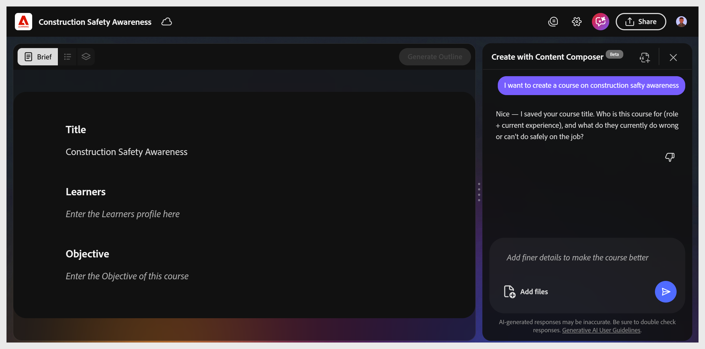

# 完成课程简介

**摘要**&#x200B;阶段包含三个字段：**标题**、**学习者**&#x200B;和&#x200B;**目标**。 助手在对话中填写这些内容，提出价值，提供替代方案，并要求在每个字段进行确认。 在激活&#x200B;**生成大纲**&#x200B;按钮之前，所有三个字段都必须包含内容。

## 设置课程标题

助理会根据您的提示建议两个职务选项。 选择您喜欢的选项，或在聊天输入中键入您自己的选项。 画布将立即更新。

### 定义学习者

助理会询问学习者身份、角色、经验水平以及当前苦苦挣扎的方面。 在聊天中键入您的答案，或选择建议的选项。

**提示：**&#x200B;既要提及学习者已了解的知识，也要提及学习者不了解的内容。 这会在生成的课程中形成词汇和情景选择。

## 编写目标

助理会询问学习者在完成课程后能够执行哪些操作。 以操作动词开始将目标编写为行为。

**目标示例：**

危险识别，了解健康和安全法律规定的雇主和雇员责任。 风险控制。 使用安全装备。

接受目标后，**生成大纲**&#x200B;将变为蓝色并变为活动状态。

>[!TIP]
>
>目标推动着所有东西下游。 它控制AI使用源文件的哪些部分、轮廓的构建方式以及测试内容。
