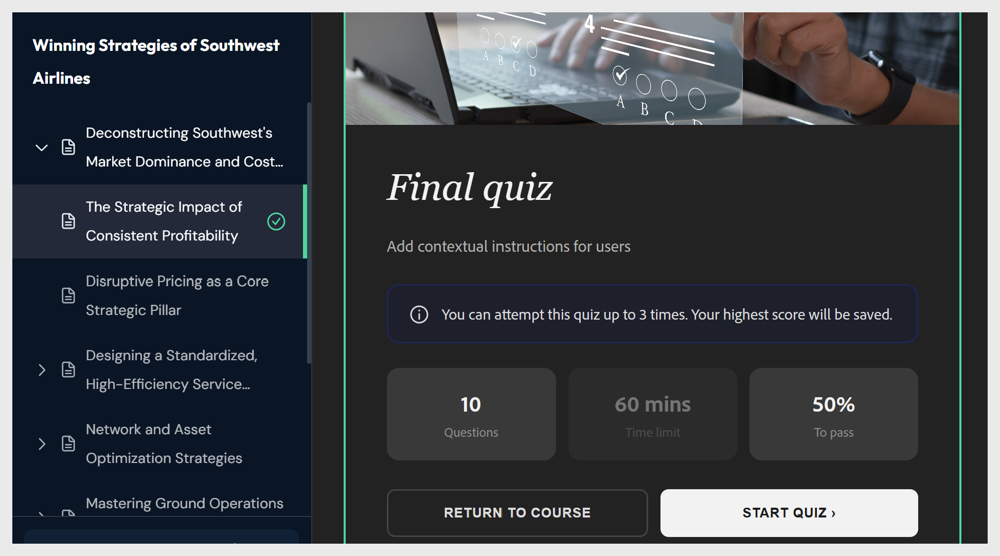

# Adobe Learning Manager Content Composer常见问题

获取有关使用Content Composer的常见问题解答。

**“生成大纲”按钮呈灰显状态。 我该怎么办？**

在激活&#x200B;**生成大纲**&#x200B;之前，所有三个&#x200B;**Brief**&#x200B;字段、**Title**、**学习者**&#x200B;和&#x200B;**Objective，**&#x200B;必须包含内容。 检查仍以斜体显示占位符文本的任何字段的画布，例如&#x200B;*在此处输入学习者配置文件*&#x200B;或&#x200B;*输入本课程的目标*。 填写空字段，该按钮将立即激活。

**无法选择大纲来重命名课程。 为什么？**

在当前Beta版中，轮廓编辑是对话式的。 无法在画布上选择课程或主题进行重命名或重新排序。 在助理聊天面板中以纯语言键入更改。

示例：

- “将第1课重命名为‘网络钓鱼的运作方式’”

- “将主题1.3移至第2课中的第一个主题”

- “删除第4课并在第3课间分发其主题”

**生成的大纲与我想要的大纲不匹配。 出了什么问题？**

大纲反映了提示和简要。 如果觉得课程结构不对劲，最常见的原因可能是某个提示，同时涵盖了太多主题，或者学习目标没有指明课程应培养的特定技能或行为。

**AI跳过了我上传文件的重要部分。 如何解决此问题？**

内容编辑器会优先处理源文件中与学习目标最相关的部分。 如果跳过某个部分，则可能不会反映在目标中。

要解决此问题，请执行以下操作：

1. 返回&#x200B;**Brief**&#x200B;面板，并更新目标以明确命名缺少的主题。

2. 让助理重新生成大纲：“重新生成大纲，确保包含数据保留策略部分。”

您也可以在大纲对话中手动添加缺少的内容作为新主题：“向第2课添加名为‘数据保留策略’的新主题。”

**我可以将Content Composer与Adobe Captivate一起使用吗？**

数字 内容书写器和Adobe Captivate不共享往返工作流程。 无法在Content Composer中打开Captivate项目，也无法在Content Composer中打开Captivate项目。

Captivate导出的MP4可以作为&#x200B;**视频**&#x200B;组件插入到Content Composer中。

**我是否可以使用Content Composer进行合规培训或监管培训？**

是。 这是最有力的例子之一。 在“管理源文件”中上传策略或过程文档，然后选择“将输出限制为文件中的内容”，以便AI仅根据您提供的内容生成，而不是使用一般知识进行补充。

**为什么未对知识检查评分？**

Content Composer中的知识检查旨在课程期间学习强化功能，而不是进行评分。 它们会立即向学习者提供反馈，但不会生成评分或完成记录。

仅进行课程结束测验评估。 如果您需要可提高学习者分数的测验，请使用测验，而不是知识检查组件。

**测验问题与课程所教的内容不匹配。 如何解决此问题？**

Content Composer使用AI生成测验问题，而AI输出具有不确定性。 这些问题可能并不总是完全反映你的预期。 在课程生成后查看所有测验问题，直接在课程编辑器中编辑任何需要调整的测验问题，并在发布之前验证内容是否准确。

## 关于“共享以供审阅”

**内容编辑器中的“共享以供审阅”是什么？**

利用“共享以供审阅”，您可以在发布之前将课程分发给审阅者以获取反馈。 审阅者在浏览器中打开课程，在任何组件上添加注释并尝试测试，无需安装Content Composer或订阅。

**审阅者是否需要内容书写器许可证？**

数字 审阅者不需要订阅或安装Content Composer。 任何获得审阅链接的人员均可在浏览器中打开课程。

**审阅者是否需要Adobe ID才能参与？**

是。 查看课程需要登录，因此需要Adobe ID才能参与。 登录后，审阅者可以打开课程、添加注释、尝试测试并使用@mentions标记作者或其他审阅者。

**审阅者是否可以编辑课程内容？**

数字 审阅访问权限仅限注释。 审阅者可以添加、回复、解决和筛选评论，但不能更改课程文本、图像或结构。

审阅文件存储在哪里？ 审阅文件托管在Adobe的云中。 作者无需管理文件存储，也无需将课程文件直接发送给审阅者。

### 共享和访问

**谁可以访问审阅链接？**

默认情况下，只有您通过姓名或电子邮件邀请的人员才能访问该项目。 在发送链接之前，请在“共享项目”面板的“谁有权访问”部分中验证这一点。

**是否可以邀请不是Adobe用户的外部利益相关者？**

是的，您可以通过电子邮件地址邀请任何人。 但是，他们需要Adobe帐户才能登录和查看课程。

**我可以在审阅开始后添加审阅人吗？**

是。 随时打开共享项目面板，添加姓名或电子邮件地址，然后选择邀请发表评论。 新审阅者会立即收到邀请。

**我可以在共享后删除审阅者吗？**

是。 在共享项目面板中，在谁有权访问下找到审阅者并将其删除。 如果他们尝试使用以前共享的链接打开课程，则会看到“拒绝访问”消息。

**如果审阅者失去访问权限会发生什么？**

他们可以在“拒绝访问”屏幕上选择“请求访问”。 课程所有者会收到恢复访问权限的通知。

### 评论和反馈

审阅者是否可以评论课程的特定部分？

是。 审阅者可以选择任何课程组件（文本块、图像或测验问题），并直接在该元素上添加评论。 注释在上下文上保持与所添加注释的组件的链接。

**多个审阅人是否可以同时发表评论？**

是。 所有审阅人都会在注释面板中看到彼此的注释，并且可以相互回复、解决或对@mention。

**我可以筛选评论以查找未解决的反馈吗？**

是。 使用“注释”面板中的“已解决”过滤器可仅显示未解决的注释。 您还可以按审阅者进行筛选以查看来自特定人员的反馈，或按“时间”以查找最新的评论。

**如何在评论中标记其他审阅人？**

键入@后接他们的姓名或电子邮件地址，然后从下拉菜单中选择他们。 已标记的用户会收到通知。 这需要审阅者使用Adobe ID登录。

#### 测验和学习者访问权限

**审阅者是否可以尝试测试？**

是。 审阅者可以尝试该测试，重试次数不超过指定的次数。 他们的分数不会被记录，也不会影响课程或任何LMS报告。

**共享以供审阅与为学习者共享有何区别？**

共享以供审阅提供课程访问权限，并启用注释面板 — 适用于提供反馈的同事和利益相关者。 “共享给学习者”提供对课程的访问权限，但不包含注释，适用于未通过LMS注册的学习者。 学习者分数也不会通过直接链接记录。

### 更新和关闭审阅

**我是否需要在作出更改后创建新的审阅？**

数字 更新课程后，审阅URL将保持不变。 选择“**共享**”以通知审阅者有可用的更新版本。

**当我更新课程时，审阅者是否会收到通知？**
审阅者在更新后打开审阅链接时，会看到一个通知横幅。 他们可以选择“重新加载”以查看最新版本。

**课程更新后，旧评论是否会保留？**

是。 现有注释在更新时仍存在。 审阅人和作者可以继续解决有关更新版本的注释。

**更新课程后，学习者链接会发生什么情况？**

现有学习者链接将继续显示之前的版本。 在每次更新后生成一个新链接并与学习者共享，以确保他们访问最新内容。

**如何查看项目更新？**

如果在您审阅课程时，作者更新了课程，则会显示一条通知。

- 选择&#x200B;**重新加载**&#x200B;以加载最新版本，或取消通知以继续查看当前版本。 重新加载是安全的 — 即使在项目更新后，您现有的评论也会持续存在，因此您不会丢失任何已添加的反馈。

## 以审阅者身份尝试测试

作为审阅者，您可以尝试测试指定次数，但不会记录您的分数。

- 选择“**开始测验**”以尝试进行测验。

  

- 完成后即会显示结果。 从这里，您可以选择审阅答案以了解对错的问题，或选择重新参加测试以重试。

  

