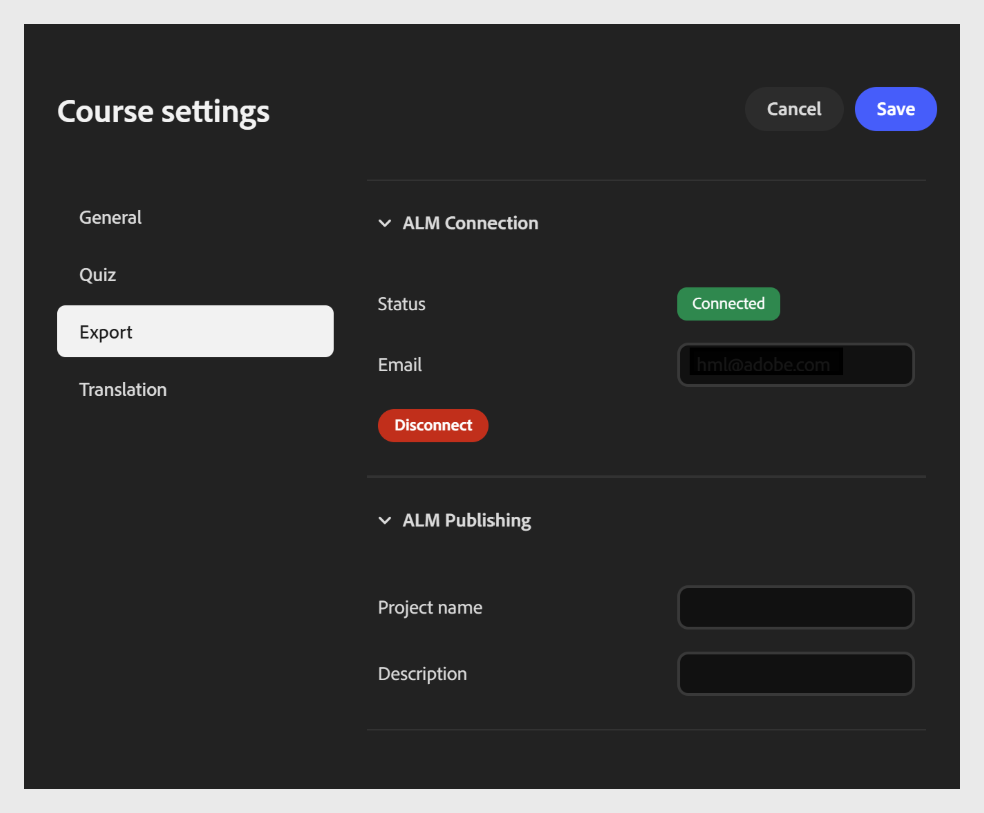

# Publish从Content Composer到Adobe Learning Manager的课程

使用&#x200B;**导出**&#x200B;选项卡可将课程连接到Adobe Learning Manager (ALM)，并将其直接发布到ALM内容库。 要设置连接，请在&#x200B;**电子邮件**&#x200B;字段中输入您的电子邮件。 确保您拥有具有相同电子邮件登录ID的ALM帐户。 连接后，您可以将课程作为模块发布到ALM。

每次课程都会一次性设置此连接。 建立后，您无需在每次发布或导出时重新连接。

它分为两个部分：

- “ALM连接”部分

- “ALM发布”部分

**配置导出设置**

1. 打开&#x200B;**课程设置**&#x200B;并选择左侧的&#x200B;**导出**&#x200B;选项卡。

2. 展开&#x200B;**ALM连接**&#x200B;部分（如果尚未展开）。

   - 输入与您的Adobe Learning Manager帐户关联的&#x200B;**电子邮件**&#x200B;地址。

   - 选择&#x200B;**授权**&#x200B;以登录并将课程连接到您的ALM帐户。
     

   - 授权后，确认&#x200B;**状态**&#x200B;字段从&#x200B;**断开连接**&#x200B;更新为&#x200B;**已连接**。
     

## Adobe Learning Manager发布详细信息

连接帐户后，在“ALM发布”部分中配置发布详细信息。

- 输入&#x200B;**项目**&#x200B;名称以标识课程。 此名称将作为课程标题显示在ALM内容库中。

- 输入&#x200B;**描述**，即在ALM内容库中与其一起显示的课程的简短摘要，帮助学习者和管理员了解其目的。

- 选择&#x200B;**Publish**&#x200B;以将课程作为模块发送到ALM内容库。