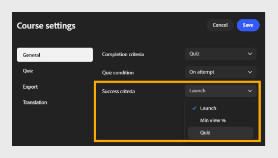

# 设置完成和成功标准

## 完成标准

**完成条件**：选择下拉列表，然后选择将课程标记为完成的时间。

- **启动：**一旦学习者打开课程，无论他们查看多少内容，都会将课程标记为完成。
  

- 在学习者查看指定百分比的课程内容后，**最小查看次数%：**将课程标记为完成。
  

- **测验：根据学习者的测验活动将课程标记为完成。 选择测验条件：**

  - 无论结果如何，**尝试测试时：**&#x200B;均会在学习者尝试测试后立即标记完成。

  - **通过：**&#x200B;仅在学习者通过测验时标记完成。

  - **通过或达到限制时：**当学习者通过或达到允许的最大尝试次数时，将标记完成，以先到者为准。
    

## 成功标准

**成功标准**&#x200B;确定学习者在参加课程后是标记为通过还是失败。 与完成标准不同，成功标准是基于分数的。

>[!NOTE]
>
>可用选项取决于&#x200B;**导出设置**&#x200B;中选择的SCORM版本。 如果选择&#x200B;**SCORM 1.2**，则完成和成功条件将合并为一个设置。 如果选择&#x200B;**SCORM 2004**，则完成和成功标准将显示为单独的设置，如下所述。*

- **成功标准**：选择下拉列表，然后选择课程衡量成功的方式。

- **启动：**仅通过启动课程即可将学习者标记为通过。
  

- **最小视图%**：学习者在查看指定的内容百分比时将其标记为通过。 例如，输入80会要求学习者查看至少80%的课程。
  

- **测验：**&#x200B;根据学习者的测验分数是否达到及格分数阈值，将学习者标记为通过或失败。 选择测验条件：

  - **尝试时：学习者一旦尝试测试，即标记为成功。**

  - **通过：仅当学习者通过测试时，才标记为成功。**

  - **通过或达到限制：当学习者通过或达到允许的最大尝试次数时，将标记为成功。**

  

>[!NOTE]
>
>学习者可以完成课程，但仍会不及格，例如，如果他们完成所有内容，但在测验中的分数不够高。 完成标准和成功标准是相互独立的；应根据您跟踪学习者进度和表现的方式，仔细设置这两个标准。 为任一条件选择“测验”时，请在&#x200B;**测验设置**&#x200B;选项卡中配置测验重试次数和通过分数。

## 为什么完成和成功标准对报告很重要

- 完成标准控制学习者在ALM成绩单、完成信息板中的状态何时更改为“已完成”，以及从LMS中提取的任何合规性或审核导出 — 这些标准用于衡量进度而不是绩效。

- 成功标准控制与完成状态一起记录的“通过/失败”值，这是大多数合规性和认证报告所依赖的值。

- 如果在同一模块的&#x200B;**Adobe Learning Manager**&#x200B;内容库中也配置了完成和成功标准，则这些设置优先于在Content Composer中设置的设置。 尽早确定应拥有这些规则的产品，并避免在两个位置设置冲突的值。

- 将条件与您需要证明的内容相匹配：“启动”或“最低”视图%足以显示认知内容，而基于测验的标准可为您提供有辩护理由的记录，表明学习者已展示知识，而不仅仅是他们打开了课程。
