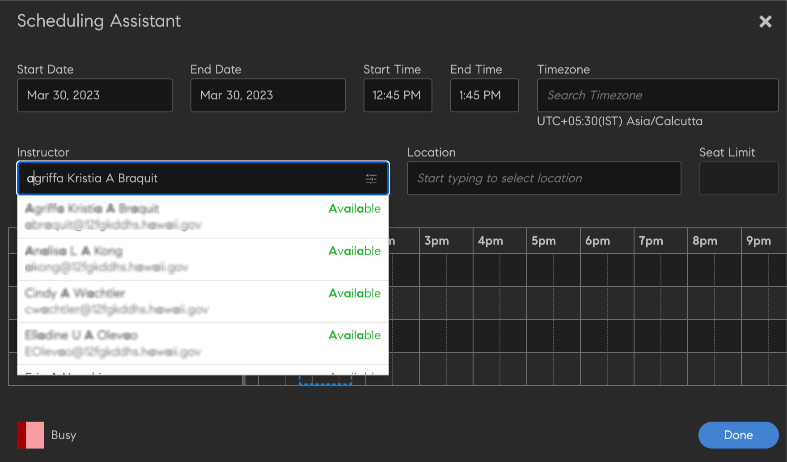

# 创建、修改和发布课程

要了解如何在Learning Manager中创建课程、认证和学习计划，请阅读本文。

作者可以创建学习对象，例如课程、认证和学习方案等。 学习者可以使用这些学习对象，管理员可以跟踪学习者的进度。

## Learning Manager中的课程 {#coursesincaptivateprime}

AdobeLearning Manager允许作者使用一个或多个与虚拟培训、自学培训、课堂培训和活动相关的模块创建课程。 管理员可以使用这些课程创建课程实例、注册学习者、分配徽章并为这些课程启用反馈。 他们还可以使用这些课程创建学习计划、学习计划和认证。

作者可以使用由任何电子学习工具创建的电子学习内容。 其他支持的课程格式包括视频文件、PDF、doc、docx、PPT和PPTX。

## 创建课程 — 基本工作流程 {#createacoursebasicworkflow}

要创建课程，请执行以下步骤：

1. 以作者身份登录AdobeLearning Manager，仅作者有权创建课程。 在“Getting Started”（开始使用）页面上，单击 **[!UICONTROL 创建课程]**.
1. 在 **课程概述** 页面中，输入课程名称。 输入此课程的简短描述，该描述显示在课程卡上。 该说明不得超过140个字符。 然后输入课程的详细概述，该概述显示在“课程详细信息”页面上。 描述不得超过1,500个字符。

   作者在向课程添加模块时可以查看模块说明。

1. 要提供课程的其他语言版本，请单击页面左上角的“添加新语言”。 选择希望提供的课程语言。 点击 **[!UICONTROL 保存]**. 有关详细信息，请参阅 [添加不同语言的内容](/help/migrated/authors/feature-summary/content-library.md).
1. **修改课程设置**-

   1. 在“课程设置”页面上，选择课程的技能。 从“技能”下拉列表中，选择所需的技能。 然后，从“级别”下拉列表中选择所需的级别。
   1. 选择课程技能、级别并设置技能的积分。 如果需要，添加更多技能。
   1. 从 **注册类型** 从下拉列表中，选择注册类型。

   注册类型如下：

   * **经理指派：** 只有经理才能指定这些课程。 学习者无法注册此类课程。
   * **经理批准：** 经理可批准此类课程。 学习者可以注册此类课程，但必须在经理批准后才能注册成功。 学习者申请注册此类课程时，经理会收到通知请求。 经理批准后，此类课程才会显示学习者已注册。
   * **自助注册：** 学习者可直接自行注册此类课程。

1. 要保存更改，请单击 **[!UICONTROL 保存]**. 要发布课程，单击 **[!UICONTROL 发布]**.

## 创建课程 — 高级工作流程 {#createacourseadvancedworkflow}

1. 以作者身份登录AdobeLearning Manager，仅作者有权创建课程。 在“Getting Started”（开始使用）页面上，单击 **[!UICONTROL 创建课程]**.
1. 在 **课程概述** 页面中，输入课程名称。 输入此课程的简短描述，该描述显示在课程卡上。 该说明不得超过140个字符。 然后输入课程的详细概述，该概述显示在“课程详细信息”页面上。 描述不得超过1,500个字符。
1. 要提供课程的其他语言版本，请单击页面左上角的“添加新语言”。 选择希望提供的课程语言。 点击 **[!UICONTROL 保存]**. 有关详细信息，请参阅 [添加不同语言的内容](/help/migrated/authors/feature-summary/content-library.md).
1. **修改课程设置**-

   1. 在“课程设置”页面上，选择课程的技能。 从“技能”下拉列表中，选择所需的技能。 然后，从“级别”下拉列表中选择所需的级别。
   1. 选择课程技能、级别并设置技能的积分。 如果需要，添加更多技能。
   1. 从 **注册类型** 从下拉列表中，选择注册类型。

   注册类型如下：

   * **经理指派：** 只有经理才能指定这些课程。 学习者无法注册此类课程。
   * **经理批准：** 经理可批准此类课程。 学习者可以注册此类课程，但必须在经理批准后才能注册成功。 学习者申请注册此类课程时，经理会收到通知请求。 经理批准后，此类课程才会显示学习者已注册。
   * **自助注册：** 学习者可直接自行注册此类课程。

1. 选择为课程设置价格还是使其免费。 如果要将课程设置为付费课程，请选择相应选项 **[!UICONTROL 付费]**，并指定价格。 该价格随后会显示在学习者的课程卡和课程概述页面上。

   注意：配置Adobe Commerce连接器后，此选项才会启用。

1. 如果希望学习者能够取消注册您的课程，请启用该复选框 **学习者可以自行取消注册**.
1. **实例配置**

   如果启用此选项，则处于“进行中”状态的学习者可以访问其他实例并在那里注册。 学习者随后可以保留上一个实例的进度。

   发布课程后，如果返回“设置”页面，则该选项不再可编辑。

   您可以为以下课程类型启用该选项：

   * 自学
   * 教室
   * 活动
   * 混合

   注意：复制课程时，如果您已在源课程中启用“实例配置”选项，则该选项在目标课程中仍为禁用。

   **不支持实例切换**：

   * 付费课程
   * 经理指派的注册类型课程。

   如果通过目录共享，实例切换配置将不会传播到配对帐户，则该选项在目标课程中仍为禁用状态。

1. **多次注册**

   使用此功能，您可以在一个或不同的期间注册多个课程实例中的学习者。

   启用切换 **多注册** 在学习者的各种课程注册之间进行切换。 如果启用了实例切换，则无法使用多个注册。

1. 选择在参加您的课程前必须完成的预修课程。 单击“课程”字段并从课程列表中选择。
1. 启用 **启用** **先决条件** 复选框，用于将预修课程设为必修课程。
1. 添加关键字作为与课程相关的标签。 这些标签可帮助学习者在搜索时轻松找到您的课程。 所有这些标签根据所添加的模块自动添加。 如果要向本课程添加其他标签，可自行添加。
1. 添加关键字作为与课程相关的标签。 这些标签可帮助学习者在搜索时轻松找到您的课程。 所有这些标签根据所添加的模块自动添加。 如果要向本课程添加其他标签，可自行添加。
1. 在“自动弃用”字段中，选择课程弃用的日期。 管理员必须先启用“自动弃用”选项。
1. 要保存更改，请单击 **[!UICONTROL 保存]**. 要发布课程，单击 **[!UICONTROL 发布]**.

## 游戏点数

您可以在课程和课程实例级别分配游戏点数。 这样，您就可以为不同的课程或实例授予点数。 我们鼓励学习者参加特定课程，或者首选特定的课程实例，而不是其他课程。

1. 在课程实例级别，选择 **[!UICONTROL 游戏点数]**.


*设置游戏点数*

1. 选择 **[!UICONTROL 编辑]**.
1. 如果选择“使用课程级别设置” ，则会显示以下选项：

   * **[!UICONTROL 完成时]**：如果希望学习者在完成课程时获得100点，请选择此切换。
   * **更多规则**

      * **[!UICONTROL 提早完成]**：如果选择此选项，则前30名学习者在完成课程时会获得100点。
      * **[!UICONTROL 及时完成]**：如果选择此选项，学习者在999天内完成课程可获得100点。

1. 如果您选择 **[!UICONTROL 使用自定义设置]**，将显示以下选项：

   * **[!UICONTROL 完成时]**：如果希望学习者在完成课程时获得100点，请选择此切换。
   * **更多规则**

      * **[!UICONTROL 提早完成]**：如果选择此选项，您可以确定将授予多少名学习者指定点数。
      * **[!UICONTROL 及时完成]**：如果选择此选项，您可以确定在指定时间内完成课程的学习者将获得的点数。

   

   *设置提早和及时完成*

1. 选择 **[!UICONTROL 保存]**.

## 汇总学习资源

作者可以决定是要在学习计划级别聚合学习资源，还是将其保留在单个课程级别。

作为作者，请选择 **[!UICONTROL 学习路径]** > **[!UICONTROL 设置]**. 点击 **[!UICONTROL 编辑]**.

在 **[!UICONTROL 资源]** 部分，“显示在学习路径级别汇总的组成课程资源”启用后，将显示“学习路径”级别是否显示课程级别的资源。

>[!NOTE]
>
>在“学习路径”的“设置”页面上，管理员还可以启用此选项，以在“学习路径”级别显示课程级别的资源。

## 日程安排助理

管理预订讲师和课堂中的冲突。 如果您希望在指定讲师参加课程之前知道其在什么时间和日期可以参加，请使用“计划助理”。

在创建虚拟教室或客户关系课程的课程时，单击“计划助手”。


*启动计划编制助理*

此时将启动“计划编制助理”窗口。


*“调度助手”对话框*

在“计划助理”上，您可以：

* 按姓名搜索讲师。
* 按技能搜索讲师。

### 按姓名搜索讲师

在“讲师”字段中，键入讲师姓名或搜索部分讲师姓名。 此时会显示讲师列表，您可以从中选择讲师。



*搜索讲师*

可以选择多名讲师，但一次只能指定一名讲师。 选定的时间将在时间冲突窗口中突出显示。 讲师旁边会显示一个叉形图标，单击可删除该讲师。


*搜索多个讲师*

### 按技能搜索讲师

搜索具有单个或多个技能的讲师。 搜索使用AND运算符。

技能只能按部分或完整技能名称搜索，而不能按技能级别搜索。

在“助理”中，输入讲师姓名、所在位置和名额限制。

此外，您还可以搜索技能，单击讲师搜索框右侧的筛选图标后，即可显示该技能。 下面的屏幕截图显示了按钮。


*按技能搜索讲师*

### 用户组过滤器

在“讲师”字段中选择筛选条件。 有一个 **[!UICONTROL 用户组]** 筛选作者或自定义作者可以使用“用户组”中的值找到合适的讲师。

如果同时应用了这两个过滤器，则会显示属于该用户组且具有所选技能的讲师列表。

这适用于“课程”或“实例”页面上的“计划助手”。


*按用户组筛选*

### “实例”页

您也可以从“实例”页访问“调度助手”，如下所示。

“计划助理”还可以在实例页面上找到，管理员和自定义管理员/作者也可使用。


*从“实例”页调度讲师*

### 搜索位置

通过在模块和“计划助理”页面上同时指定教室名称和位置区域名称，您可以搜索位置。

## 富文本格式

创建课程、学习计划、认证或工作辅助时，作者可以输入不同类型的内容（如文本、图像），或应用各种文本格式设置选项。

创建课程时，您可以在“课程概述”字段中看到富文本编辑器。 您可以设置内容格式、添加图像和超链接等。


*启动富文本编辑器*

同样，在创建以下内容时，您可以使用富文本编辑器修改说明：

**学习计划**


*使用富文本编辑器制作学习计划*

**认证**


*使用富文本编辑器进行认证*

**工作辅助**


*使用富文本编辑器提供工作辅助*

此外，您可以将富文本编辑器用于其他语言。

## 富文本描述支持无头用户界面

### 为什么需要CSS？

富文本由HTML标记组成。 按原样呈现标记将导致浏览器应用默认样式。 这通常与公司的风格指南不符。 需要CSS才能符合准则。

### 默认样式

附加的CSS样式表包含Learning Manager应用的样式。 我们已根据大多数用例对该样式进行调整。 下载附加的CSS文件，并按照您的习惯和构建系统将其导入Web应用程序。 所定义的CSS类的命名空间位于ql-editor类下，不会干扰您现有的样式。

### 自定义样式

默认样式可能无法满足每个人的需求。 可以通过覆盖提供的CSS来完成自定义。 所有样式均作为后代选择器包装在ql-editor下。 使用的类如下：

* 缩进： **li.ql-indent-$number**. $number从1到9不等
* 大小： **ql-size-small**， **ql-size-large**， **ql-size-huge**

* 对齐方式： **ql-align-center**， **ql-align-justify**， **ql-align-right**

* 颜色： **ql-color-$color**. $color =白色、红色、橙色、黄色、绿色、蓝色、紫色
* 背景： **ql-bg-$color**. $color =黑色、红色、橙色、黄色、绿色、蓝色、紫色
* html标签：p、ol、ul、pre、blockquote、h1、h2、h3、h4、h5、h6

[用于自定义的CSS文件。](assets/ql-headless.css)

### 支持呈现富文本的API更改概述

客户在构建无头界面时，需要在正在开发的自定义用户界面中显示学习对象。 为此，客户通常使用 [GET/learningObjects](https://learningmanagereu.adobe.com/docs/primeapi/v2/#!/learning_object/get_learningObjects) 公开的API。 Learning Manager现已支持为概述字段捕获“富文本”，因此API响应中学习对象的数据模型也会显示同样的内容。 请参阅以下API响应的模型片段中名为“richTextOverview”的字段。 另请注意，为实现向后兼容性，之前公开的字段（“概述”）保持不变。

```
{ 
 "data": [ 
 { 
 "id": "string", 
 "type": "string", 
 "attributes": { 
 … 
 "localizedMetadata": [ 
 { 
 "description": "string", 
 "locale": "string", 
 "name": "string", 
 "overview": "string", 
 "richTextOverview": "string" 
 } 
 ], 
 … 
 }, 
 "relationships": { 
 … 
 } 
 } 
 } 
 ] 
} 
```

已使用概述字段的客户在无头界面中不会受到影响，他们像往常一样只能看到纯文本。 如果客户希望利用富文本概述，则必须在作者UI中为其学习对象创建格式丰富的概述，之后，Learning Manager除了会像以前一样返回API响应模型中的纯文本之外，还会开始返回富文本概述。

但是，要在UI中呈现此富文本，客户需要添加CSS。 以下各节将对此进行详细说明。

## 允许多次尝试 {#allowmultipleattempts}

管理员启用多次尝试后，作者可以在课程或模块级别为交互式电子学习模块配置多次尝试。


*为交互式电子学习模块配置多次尝试*

<table>
 <tbody>
  <tr>
   <td>
    <p><b>Option</b></p></td>
   <td>
    <p><b>描述</b></p></td>
  </tr>
  <tr>
   <td>
    <p>设置尝试时间</p></td>
   <td>
    <p>您可以将模块的尝试次数设置为不限次数或提供确切的限制。<span style="font-size: 0.8125rem;">启用后，学习者将可以看到尝试信息。 学习者可以选择单击“重新尝试”按钮以重新尝试模块。</span></p></td>
  </tr>
  <tr>
   <td>
    <p>模块完成或通过后停止新尝试</p></td>
   <td>
    <p>要配置何时停止学习者选择新尝试选项，请选中“模块完成或通过后停止新尝试”复选框。 模块成功完成后，“重新尝试”选项将从学习者视图中删除。</p></td>
  </tr>
  <tr>
   <td>
    <p>在尝试之间锁定模块0:0:1格式：天/小时/分钟</p></td>
   <td>
    <p>您可以选中复选框“<b>在尝试之间锁定模块0:0:1格式：天/小时/分钟</b>”。 模块锁定后，学习者将无法访问模块，直到规定的锁定时间结束为止。 </p>
    <p>您可以通过选择“<b>播放器关闭</b>'或'<b>完成</b>'复选框。</p></td>
  </tr>
  <tr>
   <td>
    <p>播放器关闭</p></td>
   <td>
    <p>如果选择的标准为“ ”，则每次启动模块均视为新尝试<b>播放器关闭</b>‘。 关闭播放器时，系统会向学习者提示模块锁定详细信息和尝试详细信息。</p></td>
  </tr>
  <tr>
   <td>
    <p>完成</p></td>
   <td>
    <p>如果尝试的结束基于 <b>完成</b>，则它将根据内容成功标准进行计算。 在内容发送完成信息之前，不允许学习者重新尝试模块。 尝试结束后，学习者会收到模块锁定和尝试详细信息。</p></td>
  </tr>
  <tr>
   <td>
    <p>设置完成模块的时间限制</p></td>
   <td>
    <p>作者可以选中“<b>设置完成模块的时间限制</b>”。</p>
    <p>每次启动播放器均视为新尝试，系统会在启动期间向学习者提示时间详细信息。</p>
    <p><b>注：</b><span style="font-size: 0.8125rem;">时间结束后，尝试将自动结束。 关闭播放器也会结束当前尝试。</span></p></td>
  </tr>
  <tr>
   <td>
    <p>模块级别的多次尝试</p></td>
   <td>
    <p>从“设置尝试级别”下拉列表中选择“模块级别”的尝试，即可在单个模块级别配置相关选项。</p></td>
  </tr>
 </tbody>
</table>

## 课程模块 {#coursemodules}

### 添加模块 {#addmodules}

您现在可以添加“内容”、“预习”和“测试”模块。 **内容** 模块是构成课程的主要模块。 **准备工作** 模块中包括一些基本信息，可帮助学习者为课程做好准备。 这些模块对于学习者而言并非必修模块。 **测试** 模块用于在学习者已经了解内容，希望进行测试以满足合规性要求时帮助他们跳过内容。

要添加内容模块，请执行以下步骤：

1. 点击 **[!UICONTROL 添加模块]**. 您可以看到四个添加模块的选项。 第一个选项是添加自学模块。 这些是您创建并添加到AdobeLearning Manager中的模块库的模块。 第二个选项是设置虚拟教室。 第三个是设置教室模块，第四个是活动模块。

   

   *为课程添加模块*

   **自学模块：** 在此模式下，您可以按自己的进度开始和完成课程模块。 您可以设置自己的计划。

   单击该选项后，将显示已添加到模块库的自学模块列表。 您可以滚动浏览列表并选择要添加的列表，也可以通过在搜索字段或模块标签中输入模块名称来搜索模块。

   选择模块后，单击 **[!UICONTROL 添加]**. 这些模块现在显示在“内容”部分下。

   您还可以重新排列模块。 拖动任何模块并将其上移或下移，并按适当顺序排列模块。

   **虚拟教室模块：** 在该模式下，学习者可以参加在线讲座，并由受过培训的讲师提供协助。 输入标题、描述并设置会话的持续时间。 您还可以指定会议URL和执行会话的讲师。 要保存更改，请单击 **[!UICONTROL 完成]**.

   

   *添加虚拟教室模块*

   在通过虚拟教室配置对话框创建课程时，请将 **会议系统** 到您创建的团队连接。 选择是否要为事件设置会议组织者。

   如果您选择 **是** 对于会议组织者，必须输入组织者的名称。 键入名称，然后选择组织者。

   **绕过大厅**

   * 如果您选择 **是**，任何学习者都可以加入会议。
   * 如果您选择 **否**&#x200B;中，学习者需向组织者发送请求，而组织者可决定允许或拒绝其加入会议。

   **注：** 学习者必须在Microsoft Teams上可用， 但是，学习者能以访客身份加入Learning Manager。

   **教室模块：** 在该模式下，学习者可以参加面对面讲座，并由受过培训的讲师提供协助。 输入标题、描述并设置会话的持续时间。 您还可以指定教室的位置和执行会话的讲师。 要保存更改，请单击 **[!UICONTROL 完成]**.

   

   *添加教室模块*

   创建课程时，在“虚拟教室配置”对话框中，将会议系统与您创建的Microsoft Teams连接相关联。 选择是否要为事件设置会议组织者。

   如果选择是，即需要为事件设置会议组织者，则必须输入组织者的名称。 键入组织者的名称，然后选择组织者。

   **绕过大厅**

   * 如果选择是，则任何学习者都可以加入会议。
   * 如果选择否，则学习者需向组织者发送请求，而组织者可决定允许或拒绝其加入会议。

   **注：** 如果学习者希望以访客身份加入Microsoft Teams，则必须输入电子邮件。 电子邮件必须存在于Learning Manager中。

   **活动模块：** 在该模式下，学习者必须完成一组活动，如研讨会、练习、调查表和其他学习活动。 输入标题、描述和外部URL以供参考。 要保存更改，请单击 **[!UICONTROL 完成]**.

   

   *添加活动模块*

   在课程中就活动类型“文件提交”添加活动模块及添加基于xAPI的模块时，您可指定持续时间。

1. 同样，为“预习”和“测试”模式添加模块。
1. 根据自己的喜好，选择“有序”或“无序”模块的排序类型。

   如果您选择 **有序**，模块会按照创建的先后顺序显示。 如果您选择 **无序**，模块未排序。 学习者可以按任何顺序完成模块。

1. 从“必修模块”下拉列表中，选择学习者完成课程所需的模块数量。
1. 为课程添加封面图像和横幅图像。 目录由管理员创建。 有关详细信息，请参阅 [目录](/help/migrated/administrators/feature-summary/catalogs.md).

   **注：** 建议尺寸为：

   * **封面图像：** 300 px x 300 px
   * **横幅图像：** 1600 px x 140 px

1. 在页面右上角，单击 **[!UICONTROL 保存]**.

## 清单 {#create-checklist}

评估对任何学习管理系统来说都是一个重要的方面。 在线评估是评估学习者对主题理解程度的最佳方法之一。 但通常情况下，有必要通过观察某人如何执行必要任务来评估其对工作的理解程度。

您可以考虑对商店员工或仓库工人进行日常任务评估。 这可以是修理咖啡机的步骤，或是打包材料所涉的步骤。 讲师可以根据清单评估员工完成此类任务的情况，并在评估活动中给予“通过”或“失败”的评价。

### 创建清单 {#createachecklist}

只有作者才能创建清单。 清单是一种“活动”模块。 在设置“活动”模块时，作者可以将“活动”选为 **清单**，如下所示：


*创建清单*

选择选项后 **清单**，您会看到一些其他选项。

**清单类型：** 选择任何选项， **是/否** 或 **1-5**. 如果选择“是/否”，则清单将包含只能回答“是”或“否”的问题。 如果选择“1-5”，您将看到Likert清单，并需要按照五分制对问题进行评分。

**通过标准：**

<table>
 <tbody>
  <tr>
   <td>
    <p>如果您已选择 <b>是/否</b>然后……</p></td>
   <td>
    <p>如果您已选择 <b>1-5</b>然后……</p></td>
  </tr>
  <tr>
   <td>
    <p>将“Pass criteria”（通过标准）作为响应的数量设置为“Yes”（是）。 例如，如果输入3，如果学习者收到至少三个，将视为通过该课程 <b>是 </b>讲师评估后的响应。</p></td>
   <td>
    <p>将通过标准设置为1-5之间任意数字的阈值。 例如，如果输入2和4，当学习者至少获得此结果时，将视为通过该课程 <b>二 </b>得分大于或等于的评估 <b>四</b>.</p></td>
  </tr>
 </tbody>
</table>

选择要对学习者进行评估的讲师。

此外，如果您有任何评论或备注，您可以在 **讲师注意事项** 文本字段。

现在，请添加清单问题。 点击 **[!UICONTROL 添加]**. 您最多只能添加150个问题。


*添加清单问题*

要添加更多问题，请单击 **[!UICONTROL 添加更多]**.

保存更改、添加模块并发布课程。

### 添加技能 {#addskills}

在此页面上，输入以下详细信息：

1. 选择课程技能、级别并设置技能的积分。 如果需要，添加更多技能。

   

   *为课程添加技能*

1. 选择注册类型。 选项如下：

   * **经理指派：** 只有经理才能指定这些课程。 学习者无法注册此类课程。
   * **经理批准：** 经理可批准此类课程。 学习者可以注册此类课程，但必须在经理批准后才能注册成功。 学习者申请注册此类课程时，经理会收到通知请求。 经理批准后，此类课程才会显示学习者已注册。
   * **自助注册：** 学习者可直接自行注册此类课程。

1. 如果希望学习者能够取消注册您的课程，请启用该复选框 **学习者可以自行取消注册**.
1. 选择在参加您的课程前必须完成的预修课程。 单击“课程”字段并从课程列表中选择。

   

   *添加先决条件课程*

1. 启用 **先决条件** 复选框，用于将预修课程设为必修课程。
1. 添加关键字作为与课程相关的标签。 这些标签可帮助学习者在搜索时轻松找到您的课程。 所有这些标签根据所添加的模块自动添加。 如果要向本课程添加其他标签，可自行添加。
1. 单击文本区域并从建议中选择个人资料，添加此课程的目标受众个人资料。
1. 为课程添加资源文件作为补充材料。 拖动材质，例如文本、视频或音频文件。
1. 此课程即以推荐课程形式可供拥有这些配置文件的学习者使用。 您还可以在此部分为学习者附加其他资源。 学习者可下载这些文件以供日后参考。 完成所有更改后，点击 **[!UICONTROL 保存]** 右上角的。 这会将您的课程保存为草稿。 默认情况下，课程保存为草稿。

## 为模块分配讲师 {#assigninstructorsformodules}

1. 为课程创建模块后，可以为模块分配讲师。 在“作者”信息板中，单击 **[!UICONTROL 课程目录]**.
1. 单击要为其模块分配讲师的课程。
1. 从 **添加模块** 部分，单击要对其分配讲师的模块。
1. 在 **讲师** 字段中，指定要对其分配讲师角色的用户的用户名。

   

   *为用户分配讲师角色*

1. 要重新发布更新后的课程，单击 **[!UICONTROL 重新发布]**.

## 观察清单

除讲师之外，经理现在还可以查看清单模块。 人员经理以及非层级化经理（如商店经理或位置经理）可以查看并完成清单。

课程作者可以在设置清单模块时，在“审阅人”部分中选择这些角色选项，将人员经理和非层级经理（如果适用）添加为审阅人。 这可以在课程实例级别完成。


*在活动模块中添加审阅人*

选择“”**[!UICONTROL +经理]**“”选项会自动启用学习者所在组织层次结构中的经理来查看清单。 您不需要单独搜索和添加经理姓名。

如果您的帐户管理员已使用“活动字段”选项设置了非层次结构经理角色（如位置经理或站点经理），则这些经理角色将可供您选择并使他们能够查看清单。

您不需要单独搜索和添加经理姓名。 学习者注册清单课程时，会自动向其经理/商店经理发送通知，供其与任何选定的讲师一起审阅。 该工作流程使得作者可以方便地不提及经理的个人姓名。

在上面提供的示例屏幕截图中，选择“**[!UICONTROL +商店经理]**“”选项会自动启用与学习者对应的非层次结构经理来查看清单。 请注意，此处的“商店”将由管理员定义的活动字段替换。

清单模块的更新还包括学习者注册其中包含清单模块的课程时向讲师和经理发送通知。 审阅者会在Learning Manager通知中心以及讲师/经理信息板中收到清单操作到期的通知。

<!---->

当审核者以讲师/经理身份登录时，他们将能够从“核对清单”菜单和“通知”菜单中查看有关所有待定核对清单审核项的信息。


*认证批准*

单击“审阅清单”后，审阅者可以完成评估。


*查看待定的清单查看项*

报告可以通过核对清单下载，核对清单中包含学习者评估、审阅者姓名、角色和电子邮件的详细信息。

清单报告csv包含新的和更新的字段：

* 审阅者姓名，而不是讲师姓名
* 审阅者电子邮件，而不是讲师电子邮件
* 审阅者角色 — 可能的值为“经理”、“存储/位置经理”、“讲师”

## 预览课程 {#previewacourse}

课程创建并保存为草稿后，您可以学习者身份预览课程，然后发布课程，以便其显示在课程目录中。

要预览课程，单击 **[!UICONTROL 学习者预览]**.


*学习者预览课程*

此时将打开课程 **概述** 页面，您可以在其中查看模块、模块顺序以及与课程相关的其他详细信息。


*查看模块和其他相关详细信息*

如要查看学习者体验本课程的情形，请单击各个模块开始播放。 此时会在流体播放器中播放课程。

## 发布课程 {#publishacourse}

以学习者身份预览课程后，您可以发布课程，以供学习者使用。 请注意，课程仍处于草稿模式。

典型的课程生命周期如下所示：

* **草稿**  — 作者完成创建并保存课程。 在此状态下，学习者尚无法使用该课程。
* **已发布**  — 作者完成课程发布。 在此状态下，学习者可注册课程。 在此状态下，您还可以编辑课程。
* **已弃用**  — 发布课程后，如果作者不希望课程继续显示在学习者的课程目录中，可将其移动至已弃用状态。
* **已删除**  — 课程从AdobeLearning Manager应用程序中完全移除后，即显示为删除状态。 只有作者才能删除处于“草稿”或“已弃用”状态的课程。


*课程生命周期的工作流程*

要发布您创建的课程，请单击 **[!UICONTROL 发布]** （位于页面的右上角）。


*发布课程*

在弹出的确认消息中，单击 **[!UICONTROL 确定]**.

该课程现已显示在课程目录中。

## 查看课程 {#viewacourse}

作者可以查看所有可用课程的列表。 要查看Learning Manager帐户中的所有课程，请单击“课程目录”。 要查看Learning Manager中自己创建的所有课程，请单击 **[!UICONTROL 我的课程]**.

在课程卡上，将鼠标悬停在选项上，然后单击 **[!UICONTROL 查看课程]**.


*查看课程*

此时会显示课程信息窗口。 课程处于只读模式。 要修改课程，单击 **[!UICONTROL 编辑]**.

## 弃用课程 {#retireacourse}

如果弃用课程，则新学习者无法再注册该课程。 已注册的学习者可以参加课程。

要弃用课程，将鼠标悬停在课程卡的选项上，然后单击“弃用课程”。


*弃用课程*

在弹出的确认窗口中，单击 **[!UICONTROL 是]**.

## 复制课程 {#duplicateacourse}

您可以创建课程副本，然后修改课程。 如果要备份课程，您可以复制课程。

## 搜索课程 {#searchforcourses}

AdobeLearning Manager能让您轻松快速找到您想选择的课程。 您可以通过以下方式搜索课程：

**搜索字段：** 单击屏幕右上角的搜索栏。 **课程目录** 页面。 输入课程名称或与课程关联的任意关键字。 您还可以使用在课程创建期间添加的标签进行搜索。 标签可在“搜索课程”字段中进行搜索，即标签会在您输入时显示在搜索字段中。


*搜索课程*

**过滤课程列表：** 您可以按状态筛选课程，例如“全部”、“已发布”、“草稿”和“已弃用”。 根据您的选择，可以查看过滤后的课程列表并选择所需课程。

作者还可对课程进行排序，以便查找所需课程。 点击 **[!UICONTROL 排序方式]** 并可选择字母升序、字母降序、课程创建日期、课程更新日期和课程效果。


*过滤课程列表*

## 为学习者注册课程 {#enrolllearnersinacourse}

要为学习者注册课程，或允许经理为课程指派学习者，必须切换到“管理员”模式，因为只有管理员才有权为学习者注册课程。

要切换到“管理员”模式，

1. 单击个人资料图片，然后选择“管理员” 。
1. 在管理员模式下，单击 **[!UICONTROL 课程]** 在左侧窗格中。 在此页面上，您可以查看Learning Manager帐户中所有作者创建的所有课程。
1. 要注册学习者，将鼠标悬停在课程卡上，即可看到此选项 **注册学习者**. 单击此选项。

   

   *为学习者注册课程*

1. 在“注册学习者”对话框的右上角，会显示该选项 **默认实例** 已选中。 作者创建课程后，该课程的默认实例即会创建。

   

   *查看课程的默认实例*

1. 在“包含学习者”字段中输入学习者姓名，然后选择学习者。 您也可以在此处添加用户组。 如果要注册Learning Manager帐户中的所有学习者，则输入“全部” 。 您还可以在团队中注册学习者。

   

   *将学习者添加到课程*

1. 如果希望将任何学习者排除在课程之外，则在 **排除学习者** 字段。
1. 注册学习者后，单击 **[!UICONTROL 继续]**. 在“注册学习者”对话框中，您可以查看注册摘要。

   

   *查看课程注册摘要*

1. 要注册所有学习者到课程，单击 **[!UICONTROL 注册]**. 这些学习者已成功注册本课程。 学习者会收到参加课程的通知。 要注册更多学习者，请重复注册流程。

## 对Connect VC模块课程实例页面的更改 {#connect-vc}

检索Connect课程时，您可以创建两种类型的会议室：

* 动态
* 持久

长期URL始终是固定的。 但是对于没有Connect以及自己的会议室的用户，他们必须在运行时使用动态会议室。 然后，人们可以加入他们的会议。


*动态会议室选项*

您现在可以更改URL中长期会议室的 **课程实例** 页面。

<!--|  |  |
|---|---|-->

## 从课程中取消注册学习者 {#unenrolllearnersfromacourse}

创建课程时，作者可以启用该选项 **学习者可以自行取消注册**，以便参加课程的学习者可以取消课程注册。

管理员还可以从课程中取消注册学习者。


*从课程中取消注册学习者*

有关详细信息，请参阅 [取消注册学习者](/help/migrated/administrators/feature-summary/courses.md).

## 为Captivate和演示者添加课程模块 {#addcoursemodulesforcaptivateandpresenter}

您还可以使用“发布”菜单，将课程模块从Adobe Captivate和Adobe Presenter软件发布到Learning Manager。

1. 在Captivate中，单击 **[!UICONTROL 发布]** > **[!UICONTROL 发布到Learning Manager]**.
1. 提供子域名或电子邮件ID并单击 **[!UICONTROL 提交]**. 如果您有多个帐户，系统会提示您选择帐户。
1. 使用Adobe凭据登录。 如果没有AdobeID，请单击 **[!UICONTROL 创建帐户]**. 授权后，您将被定向到模块发布页面。
1. 提供有关模块的所有基本信息，然后单击“发布”。

您可以在Learning Manager“模块”页面上看到已发布的模块。 有关详细信息，请参阅 [将项目发布到AdobeLearning Manager](https://helpx.adobe.com/captivate/classic/publish-project-to-captivate-prime.html).

## 课程效果 {#courseeffectiveness}

课程效果分数能帮助作者评估未能满足学习者需求的课程并作出相应修改。 通过评估课程效果来了解课程对学习者是否有帮助。 它结合了学习者针对课程内容提出的反馈、 学习者的课程测试结果以及经理根据学习者课程所学内容的评估反馈。

向内 **我的课程**，作者可以在课程缩略图上查看课程效果评级，如下图所示。 您可以看到此课程的评级为100。

<!---->

综合L1、L2和L3反馈值，得出课程效果评分值。 要查看各个反馈详情，请单击课程效果值。 此时会弹出菜单，如下所示。


*课程效果计算*

在此示例截图中，1名用户（共1名）收到了全部三种类型的反馈，因此分数为100/100。 您可以从此表中了解缺失的反馈，以便提高整体效果。 要查看课程效果的计算方式，请单击弹出菜单右下角的向下箭头。

<!---->

根据上面显示的饼图，经理提供的L3反馈的权重更大。

## 认证和学习计划 {#certificationsandlearningprograms}

作者和管理员均可通过作者应用程序为学习者创建认证和学习计划。 在主页中，单击“认证”或“学习计划”以创建相应的学习对象。

要了解如何创建和管理认证和学习计划，请参阅  [认证](/help/migrated/administrators/feature-summary/certifications.md) 和  [学习计划](/help/migrated/administrators/feature-summary/learning-programs.md).

## 外部认证的必修课程 {#mandatorycoursesforexternalcertification}

在Learning Manager的早期版本中，外部认证的学习者若要完成证书，并不一定需要完成课程。

现在可以通过启用该选项将课程设为必修 **将完成证书所需的课程设为必修** 在“课程表”选项卡中。


*设置必修课程以完成证书*

将课程设置为必修时：

* 仅当学习者完成课程后，经理的“提交内容”页面才会列出该学习者。
* 学习者只有在完成课程后才能上传文件。

## 常见问题解答 {#frequentlyaskedquestions}

+++如何删除课程的“寻求经理指派”？

请执行以下步骤：

1. 以作者身份登录Learning Manager。
1. 打开课程。
1. 在左侧窗格中，单击 **[!UICONTROL 设置]** > **[!UICONTROL 编辑]**.
1. 在 **注册类型** 下拉列表，更改注册类型 **经理指派** 收件人 **经理批准** 或 **自助注册**.

1. 更改注册类型后，请重新发布课程。

+++

+++如何合并课程？

您可以通过学习计划合并课程。

1. 以管理员身份登录Learning Manager。
1. 在左侧窗格中，单击 **[!UICONTROL 学习计划]**.
1. 要添加学习计划，请单击 **[!UICONTROL 添加]**.
1. 输入学习计划的详细信息，然后单击 **[!UICONTROL 保存]**.
1. 创建学习计划后，单击 **[!UICONTROL 目录]**.
1. 在课程卡上，单击 **[!UICONTROL 添加]**，如下所示。 重复上述流程，添加所有想要添加的课程。


在学习计划中添加完全部所需的课程后，单击 **[!UICONTROL 发布]**.

在学习计划中，您只能添加自行注册的课程，不能添加经理指派或经理批准的课程。 这是Learning Manager中的默认行为。

+++

+++如何确保学习者看不到所有课程？

可以通过目录来实现。 默认目录包含默认情况下添加到Learning Manager中的所有课程。

您必须禁用默认目录并创建自定义目录。

1. 以管理员身份登录Learning Manager。
1. 在左侧窗格中，单击 **[!UICONTROL 目录]**.
1. 单击创建目录 **[!UICONTROL 创建]**. 输入详细信息，然后单击 **[!UICONTROL 保存]**.

1. 在新创建的“目录”选项中，您可以选择可添加的不同学习类型，例如学习计划、认证或课程。
1. 在“学习计划”部分，单击 **[!UICONTROL 添加内容]**.
1. 在左侧窗格中，单击 **[!UICONTROL 内部共享]** 或 **[!UICONTROL 外部共享]** 取决于目标受众。

1. 要添加用户组，请单击 **[!UICONTROL 添加用户组]**.
1. 在“目录”页面上，禁用 **D[!UICONTROL 默认目录]**，并启用您创建的目录。


+++

+++如何重新注册已完成的课程？

课程完成后无法恢复。 学习者 **无法重新注册** 已完成的课程。

+++

+++学习者如何在完成课程后查看课程？

学习者可以在完成课程后单击课程中的“重新访问”按钮来查看课程。

请执行以下步骤：

1. 以学习者身份登录。
1. 打开已完成的课程。
1. 点击 **[!UICONTROL 重新访问]**.

+++

+++如何在课程中添加资源文件？

创建课程时，您可以在课程中添加与其相关的视频、音频、pdf或文本文件，以便学习者获取其他培训材料。


+++

+++如何在模块上设置多次尝试？

**先决条件：** 管理员必须启用该选项 **多次尝试** 英寸 **“设置”>“常规”** 在管理员应用程序中。

作为作者，需要在“课程概述”页面上启用该选项 **允许多次尝试**.

欲了解更多信息，请参见 [有关多次尝试的部分](courses.md#Allowmultipleattempts).

+++

+++能否下载并修改已上传到AdobeLearning Manager的内容？

不能，上传到Learning Manager的内容是已发布的zip文件，而不是源文件。 因此，即使下载了内容，也无法在创作工具中进行编辑。 您需要源文件来编辑内容。

+++

