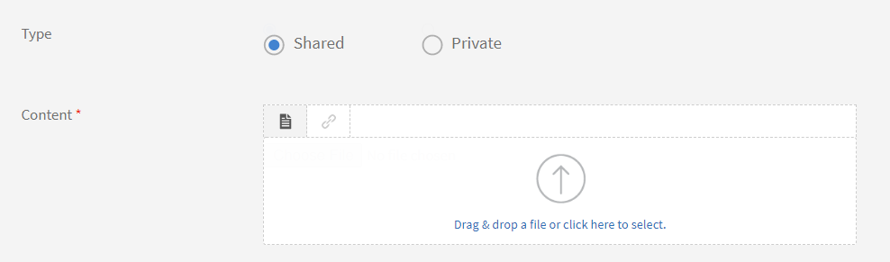

# 工作辅助

**工作辅助**&#x200B;是一个培训内容存储库，可供学习者访问，无需任何注册或完成标准。 学员可参考这些工作辅助，获取在公司内执行任何活动或任务的相关协助。

工作辅助可单独使用，也可与 Adobe Learning Manager 中的课程一起使用。

作者可为学习者创建工作辅助。 使用工作辅助为学习者提供参考材料(例如提示、检查清单、指南等)，以便他们可以持续使用从而完成相关任务。

## 创建工作辅助 {#createjobaid}

1. 在作者登录中，从左侧窗格中选择&#x200B;**[!UICONTROL 工作辅助]**。
1. 在显示的页面的右上角选择&#x200B;**[!UICONTROL 创建]**。
1. 键入名称、描述和标签。 选择技能和关联级别。 如果不想让任何其他作者将该工作辅助用于分配其相应的课程，可将其工作辅助的内容设置为隐私。

   仅现有技能可用于工作辅助。 技能并不一定要选择。

1. 在内容部分中上传工作辅助内容。

   支持上传的文件格式包括视频、pdf、pptx 和 docx。 不支持上传项目压缩文件或任何交互式内容。

1. 输入工作辅助的持续时间（以分钟为单位）。
1. 单击&#x200B;**[!UICONTROL “保存”]**。

   此时即发布了工作辅助。

## 添加不同语言的工作辅助 {#addcontentfordifferentlanguages}

1. 若要添加不同语言的工作辅助，请选择&#x200B;**添加新语言**&#x200B;选项卡，然后选择所需的语言。 使用此方法，您可以添加支持多种语言的内容。

   

   *为内容添加新语言*

1. 对新语言重复执行工作辅助上传流程。
1. 如果要删除一种语言，请选择&#x200B;**[!UICONTROL 添加新语言]**&#x200B;选项卡，然后清除您的选择。

   完成更改后，选择保存。

## 受支持的工作辅助类型 {#typesofsupportedjobaids}

以下为工作辅助支持的文件格式。

* PDF
* PPT
* PPTX
* XLS
* XLSX
* DOC
* DOCX
* 所有视频文件格式

>[!NOTE]
>
>不支持Zip文件和图像文件。

## 多语言工作辅助

Adobe Learning Manager (ALM)中的多语言工作辅助允许作者和管理员在单个工作辅助条目中提供多种语言的支持文档、指南或资源。 不同区域的学习者可以访问其首选语言的相关材料，这可以提高理解、合规性和用户体验。

**用例**

* 全球员工支持：向多样化的员工提供多种语言的安全手册、流程指南或参考文档。
* 法规遵从性：确保所有员工都能以他们的母语收到相同的法规遵从性文档。
* 一致的入职培训：以本地语言为世界各地的新员工提供入职培训清单或常见问题解答。
* 减少重复：在单个条目中管理工作辅助的所有语言版本，从而简化更新和报告。

### 主要功能

* 多语言支持：在单个工作辅助中，为每种支持的语言附加唯一的文件或URL。
* 本地化的名称和描述：以每种语言输入工作辅助的名称和描述。
* 统一管理：在一个位置编辑、更新和报告所有语言版本。
* 向后兼容性：现有单一语言工作辅助会自动复制到所有添加的语言，直到上传新文件为止。

### 创建多语言工作辅助

1. 转到“作者”角色并选择“工作辅助”。
2. 选择创建工作辅助。
3. 使用默认语言输入工作辅助的名称和描述。
4. 添加默认语言的主要内容文件或URL。
5. 保存工作辅助。

### 添加其他语言

1. 在工作辅助编辑器中，选择添加语言。
2. 从列表中选择所需的语言。
3. 对于每种添加的语言：
   * 输入本地化的名称和描述。
   * 上传相应的内容文件或提供特定语言的URL。
4. 对所有所需语言重复此操作。

### 编辑和管理语言

1. 要更新特定语言的文件或说明，请选择语言选项卡并根据需要进行更改。
2. 如果在发布工作辅助后添加了语言，则会自动将原始文件指派给新语言，直到上传唯一的文件为止。
3. 根据需要删除或替换任何语言的文件。

### Publish和学习者体验

1. 添加完所有语言和文件后，发布工作辅助。
2. 学习者会看到其选定内容语言以及相应文件或URL的工作辅助。
3. 如果学习者的语言不可用，则显示默认语言文件。

### 报告的角色

* 下载工作辅助报告以查看与每个工作辅助关联的所有文件和语言的详细信息。
* 报告包括用于跟踪的语言、文件名和使用情况数据。

### 最佳实践

* 提供名称、描述和内容文件的准确翻译。
* 定期审查和更新文件，以确保不同语言的一致性。
* 使用明确的命名约定来区分不同语言的文件。
* 通过切换内容语言来测试学习者体验，以验证文件交付是否正确。

多语言工作辅助使您可以在一个条目中向全球受众提供支持资源，减少重复，并确保每个学习者都收到使用他们首选语言的正确信息。 此功能提高了Adobe Learning Manager中的可访问性、合规性和管理效率。

## 撤消/重新发布工作辅助 {#withdrawrepublishjobaids}

单击工作辅助旁边的设置图标并选择“撤消”，即可撤消已经发布的工作辅助。

*编辑、退出或预览已发布的工作辅助*

单击“撤消”选项卡即可查看已撤销的工作辅助。 单击设置图标并选择“发布”，即可重新发布已经撤消的工作辅助。

## 支持工作辅助中的 HTML 包

工作辅助现支持将标准 HTML 包作为一种新的内容类型。 通过此增强功能，学习者可以从工作辅助播放器中打开视图并下载 HTML 包。

创建工作辅助时，作者可以上传标准 HTML 程序包以及其他支持的文件格式。

*支持HTML包*

HTML 程序包必须包含以下内容：

* Index.html 文件。
* Index.html 文件必须位于 zip 文件的根文件夹中。

将内容指定为以 zip 文件形式上传，且该文件包中需包含 Index.html 文件。

所有内容、资源和资产都必须在 HTML 程序包中引用，并且可以通过 Index.html 访问。

## 常见问题解答 {#frequentlyaskedquestions}

+++如何创建工作辅助？

以作者身份，在工作辅助页面单击&#x200B;**[!UICONTROL “创建”]**。 添加所需的详细信息并保存工作辅助。

创建工作辅助后，您就可以在创建课程时将工作辅助添加至课程。

+++

### 更多此类内容

* [管理员工作辅助](../../administrators/feature-summary/job-aids.md)
* [学习者工作辅助](../../learners/feature-summary/job-aids.md)
