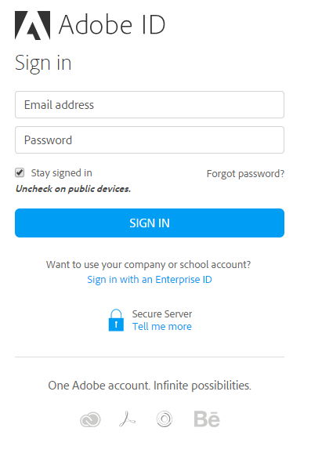

# 用户登录

当您第一次使用 Adobe Learning Manager 时，需要通过以下步骤来创建帐户：

1. 使用管理员发送给您的欢迎电子邮件中的安全链接启动 Adobe Learning Manager。

   此时会显示登录屏幕。

1. 单击“登录”。

*登录到Adobe Learning Manager*

1. 输入Adobe ID、密码，然后单击&#x200B;**[!UICONTROL 登录]**。

   如果忘记密码，请单击&#x200B;**[!UICONTROL 忘记密码？]** 链接并提供创建Adobe ID时所用的电子邮件ID。

1. 或者，可以单击&#x200B;**[!UICONTROL “使用企业 ID 登录”链接]**&#x200B;来使用企业 ID。

>[!NOTE]
>
>首次登录后，Adobe ID就会与您的公司帐户关联。 对于任何后续登录，您可以将欢迎电子邮件中的帐户 URL (第二个 URL) 设置为书签。
