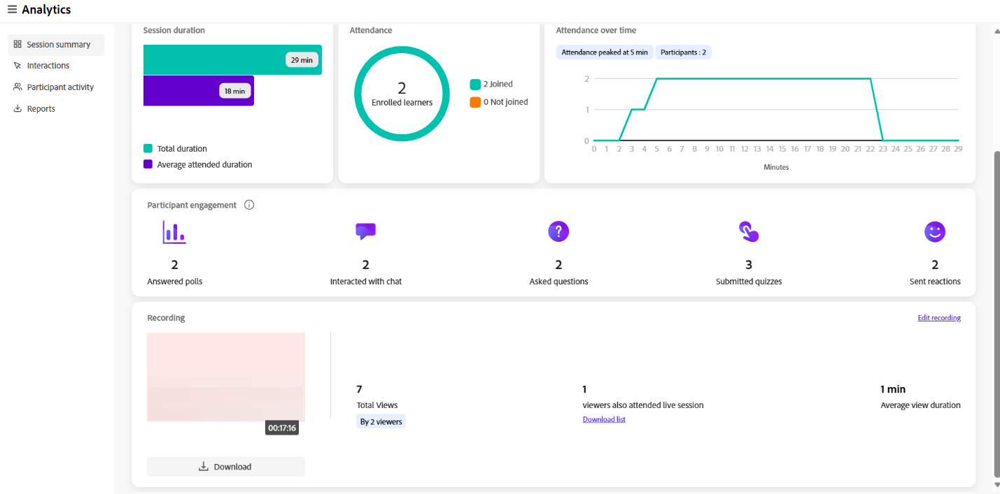
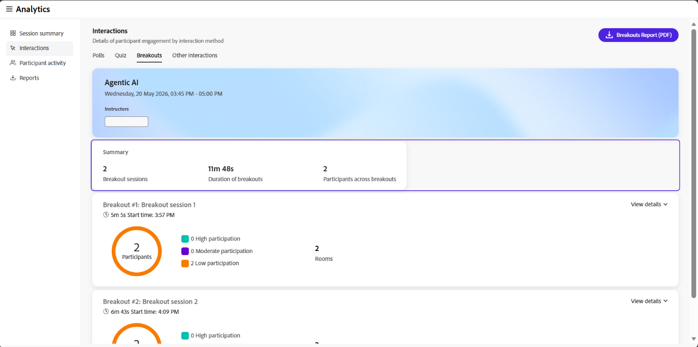
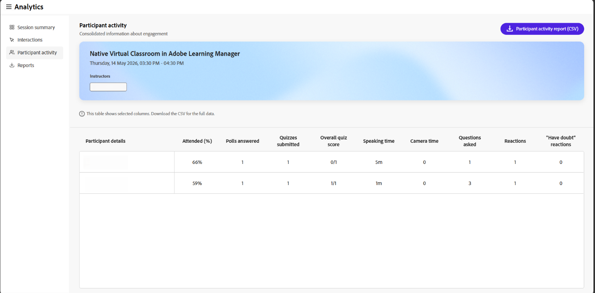

# “会话”操控板的组件

## 概述

Live Hub中的“会话”信息板包含多个部分，其中提供了有关会话表现和学习者参与情况的详细介绍。

每个组件可帮助讲师分析参与情况、了解学习者行为并评估实时中心会话的有效性。

## 会话摘要

会话摘要提供实时会话和录制会话（包括会话录制）的概述。 其中包括一些详细信息，例如注册和加入的学习者数量、会话持续时间、不同时间的出勤情况、参与者参与以及录制视图等。

选择&#x200B;**会话摘要(PDF)**&#x200B;以下载摘要。

*选择会话摘要(PDF)以下载摘要。*

您可以查看以下详细信息：

* **会话持续时间**：查看实时会话总持续时间和学习者平均出席持续时间。

* **出席情况**：查看已注册的学习者数，以及已加入和未加入的学习者数。

* **不同时间的出席情况**：查看整个会话的出席情况如何变化，包括出席高峰期和出席总数。

* **参与者参与**：查看学习者在会话期间的参与情况，包括应答的投票、聊天交互、提问、提交的测验和发送的反应数。

### 录音

查看与会话录制相关的见解。 这些见解可帮助您了解学习者参与情况和录制使用情况。 您还可以下载录制并访问报告以供进一步分析。

* **总查看次数**：录制的总查看次数以及唯一查看者的数量。

* **也参加实时会话的查看者**：参加实时会话且随后观看录制的学习者数量。 选择&#x200B;**下载列表**&#x200B;以查看学习者列表。

* **平均观看持续时间**：学习者观看录制的平均时间。

*显示录制见解的会话仪表板视图。*

从录制选项中，可以使用以下操作：

* 选择&#x200B;**下载**&#x200B;以下载录制。

* 选择&#x200B;**编辑录制**&#x200B;以修改录制。 此时会在录音播放器中打开录音。

## 交互

查看学习者如何通过“交互”进行交互和参与会话。 跨参与工具跟踪对投票、问答指标和与会者反应的响应。

在左侧面板中选择&#x200B;**交互**&#x200B;以查看与会者的参与情况。

“交互”面板包含以下选项卡：

### 投票

“投票”选项卡允许您查看添加到投票中的问题和答复。 还可从&#x200B;**轮询**&#x200B;选项卡下载所有轮询交互的报告。 该报告包括：

* 参与者详细信息，包括名字、姓氏和电子邮件地址。

* 轮询编号、轮询类型和轮询问题。

* 每个参与者对投票的响应。

*显示轮询交互的会话仪表板视图。*

### 测验

该选项卡允许您在实时会话期间查看测验指标。 它包含以下面板：

* 以ZIP格式下载测验互动报告。

* 查看插图，其中显示提交测试、未完成测试或未尝试测试的学习者。

* 测验中的问题数。 选择&#x200B;**查看列表**&#x200B;以查看所有问题。

* 选择&#x200B;**查看详细报告**&#x200B;以按问题列表、问题、排行榜和个人答复查看参与者报告。

* 答案的平均准确率。 选择&#x200B;**查看排行榜**&#x200B;以查看分数。

* 尝试测试所用的平均时间。

*显示测验交互的会话仪表板视图。*

## 拆分

查看学习者在实时课堂上参与分组讨论的方式。 本节提供分组讨论活动的摘要以及每个分组讨论会话的详细见解。

* **分出会话**：会话期间执行的分出会话总数。

* **分组的持续时间**：所有分组的会话的合并持续时间。

* **分组讨论中的参与者**：分组讨论中的参与者数。

选择&#x200B;**分组报告(PDF)**&#x200B;以下载该报告。

*显示分组讨论会话见解的会话仪表板视图。*

对于每个分组会话，您可以查看会话名称、持续时间以及开始时间。 您还可以查看：

* **参与者**：分组会话中的参与者总数。

* **参与者分布**：按参与者级别划分的参与者细目。 可用级别包括“高”、“中”和“低”。

* **会议室**：已创建的临时会议室数。

选择&#x200B;**查看详细信息**&#x200B;以展开分组讨论会话并查看会议室级别的见解。 选择“**隐藏详细信息**”以再次折叠它。

### 分组讨论会议室详细信息

在展开视图中，每个文件室都显示以下内容：

* **说明**：为会议室中的参与者提供的提示或活动。

* **聊天记录**：选择&#x200B;**聊天记录**&#x200B;以查看在聊天室中交换的聊天。

* **讲师在会议室**：一个表格，其中列出了每位讲师的姓名、分组讨论时间和发言时间。

* **会议室中的参与者**：一个表，其中列出了每位参与者的姓名、分组讨论时间、发言时间和参与级别。

*列出分组讨论室的讲师和参与者详细信息的表格。*

## 其他交互

从右上角下拉列表中选择&#x200B;**下载交互报告**&#x200B;以下载&#x200B;**问答**&#x200B;和&#x200B;**反应**&#x200B;报告。

*显示下载交互报告选项的会话仪表板视图。*

### 问答量度

查看问答度量的以下属性：

* 询问的问题总数。

* 未回答的问题数。

* 提出问题的与会者人数。

* 询问了多个问题的与会者数量，他们可能是最有前途的人。

* 回答一个问题所用的平均时间。

### 反应

查看学习者在会话期间的反应，包括同意、分歧、掌声和笑声。

在图形上查看以下详细信息：

* 全部反应。

* 至少回应一次的与会者数。

* 总点击数。

* 独特与会者。

* 唯一与会者完成的每个反应的总点击量的图形表示。

## 参与者活动

**参与者活动**&#x200B;部分提供了会话期间单个学习者参与情况的综合视图。 它可帮助讲师分析参与级别并跟踪不同活动中的学习者互动。

在左侧面板中，选择&#x200B;**参与者活动**&#x200B;以查看详细的学习者级别见解。 选择&#x200B;**参与者活动报告(CSV)**&#x200B;以下载完整报告。

*显示参与者活动报告详细信息的表。*

该表显示了学习者活动的以下信息：

* **参与者详细信息**：参与者的姓名和电子邮件ID。

* **参加持续时间**：参与者参加会话的百分比。

* **已应答的投票**：参与者已应答的投票数。

* **已提交的测验**：参与者提交的测验数。

* **总测验分数**：参与者在测验中获得的分数。

* **说话者时间**：参与者在会话期间说话的持续时间。

* **相机时间**：学习者的相机处于活动状态的持续时间。

* **问题解答**：参与者提出的问题数。

* **反应**：参与者分享的反应次数。

* **有疑问的反应**：参与者在会话期间表示有疑问的次数。

## 报告

以讲师身份从集中中心下载不同活动的报告。 这些报告捕获现场表演和录制的表演中与会者的互动和互动。

要下载报告，请执行以下操作：

1. 在左侧面板中，选择&#x200B;**下载报告**。

1. 选择&#x200B;**下载所有(.zip)**&#x200B;以下载所有活动的合并报告。

   
   *选择“下载全部(.zip)”以下载合并报告。*

1. 选择每个报告旁边的下载图标可单独下载它们。
