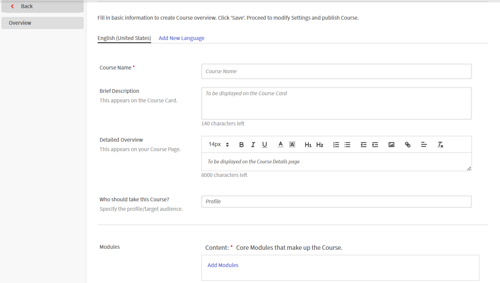

# 创建Live Hub (Beta)会话

通过Live Hub在Adobe Learning Manager课程中实时提供讲师指导培训。 您可以将实时中心会话与自学内容相结合，打造混合式学习体验。

将虚拟教室模块添加到课程时，请选择将主持实时会话的虚拟培训工具。 您可以选择&#x200B;**实时中心**，即Adobe的内置AI支持的虚拟培训解决方案，或使用外部提供商，例如&#x200B;**Adobe Connect**。

>[!NOTE]
>
> 只有当管理员在实时中心设置中启用实时中心后，该实时中心才会显示为“实时虚拟培训工具”选项。 如果未启用，请改用Adobe Connect等外部提供方。 查看[启用Live Hub](../administrators/feature-summary/enable-live-hub.md)以了解更多信息。

创建Live Hub课程时，您可以：

* 向课程添加一个或多个实时中心会话。

* 手动选择讲师或使用AI辅助的讲师建议。

* 使用单个默认实例配置课程，或者为不同的计划或访问群体创建多个实例。

本文介绍如何创建Live Hub课程、分配讲师和配置课程实例。

## 创建实时中心课程

添加虚拟教室模块时，会自动创建默认实例。 当您想要为所有学习者提供单个会话或标准计划时，此功能非常有用。

要创建实时中心课程，请执行以下操作：

1. 以作者身份登录Adobe Learning Manager 。

1. 选择&#x200B;**创建课程**。

1. 在&#x200B;**课程目录**&#x200B;页面上，选择&#x200B;**添加**，然后输入以下详细信息：

   1. 课程名称

   1. 简要描述

   
   *请先输入课程名称和简要说明，然后再向课程中添加模块。*

1. 在&#x200B;**模块**&#x200B;部分中选择&#x200B;**内容** > **添加模块**。  此时会弹出&#x200B;**选择模块类型**&#x200B;窗口。

1. 选择“**虚拟教室**”，然后输入课程详细信息，包括标题、描述、时区、开始日期和结束日期以及开始和结束时间。

1. 在&#x200B;**实时虚拟培训工具**&#x200B;中选择&#x200B;**实时中心**。

   
   *选择Live Hub为会话启用AI支持的讲师建议。*

1. 使用下列选项之一添加讲师：

   1. 在&#x200B;**讲师**&#x200B;字段中输入讲师姓名。

   1. 选择&#x200B;**使用AI查找讲师**&#x200B;以查看AI推荐的讲师。 有关详细信息，请查看[使用讲师查找器添加讲师](#add-instructors-using-instructor-finder)。

1. 选择&#x200B;**添加** > **保存**。

1. 在&#x200B;**课程技能**&#x200B;部分中选择所需技能。

1. 选择&#x200B;**技能级别**，然后审阅或更新&#x200B;**最大积分**。

   
   *分配技能和技能级别，以定义学习者通过完成课程获得的积分。*

1. 选择&#x200B;**保存** > **Publish**。 课程在Adobe Learning Manager中成功创建。

## 创建课程实例

管理员可以创建课程的一个或多个实例，将其提供给不同的受众、计划或位置。 每个实例都有自己的会话详细信息，因此您可以为同一课程的每个实例分配不同的讲师、讲师查找器建议和计时。

要创建课程实例，请执行以下操作：

1. 以作者身份登录Adobe Learning Manager 。

1. 打开课程，然后从左侧面板中选择&#x200B;**实例**。

   
   *添加虚拟教室模块时自动创建默认实例。*

1. 选择&#x200B;**添加新实例**。

1. 输入&#x200B;**实例名称**、**开始日期**&#x200B;和&#x200B;**完成截止日期**。 选择&#x200B;**显示更多选项**&#x200B;以配置其他设置。

   
   *输入实例名称、开始日期和完成截止日期以创建新课程实例。*

1. 选择“**保存**”。  新实例将添加到&#x200B;**实例**&#x200B;列表中。

   
   *新实例与默认实例一起出现在“实例”列表中。*

1. 在&#x200B;**会话**&#x200B;下选择数字以查看&#x200B;**会话详细信息**。

   
   *会话详细信息显示仍需要配置哪些计时、讲师和位置字段。*

1. 选择会话详细信息旁边的编辑（铅笔）图标以打开会话配置面板。

   
   *为特定会话实例配置计划、讲师和位置。*

1. 在&#x200B;**讲师**&#x200B;字段中，手动输入姓名，或为AI推荐的讲师选择&#x200B;**使用AI查找讲师**。 有关详细信息，请查看[使用讲师查找器添加讲师](#add-instructors-using-instructor-finder)。

1. 输入&#x200B;**位置**&#x200B;详细信息，然后选择&#x200B;**保存**。 会话会按照配置的时间表、讲师和位置详细信息进行更新。

## 使用“讲师查找器”添加讲师

使用&#x200B;**讲师查找器**&#x200B;接收会话的AI讲师建议，而不是手动搜索和添加讲师。 Instructor Finder会根据课程详细信息和所需技能来筛选讲师，同时还会考虑公司的假日日历、讲师可用性以及讲师利用率，以便提出最适合的讲师建议。 查看[添加和管理讲师](./instructor-management.md)以了解更多信息。

>[!NOTE]
>
> 只有当管理员在Live Hub设置中启用了“讲师查找器助手”时，才会显示“讲师查找器”。 查看[启用Live Hub](../administrators/feature-summary/enable-live-hub.md)以了解更多信息。

要使用“讲师查找器”添加讲师，请执行以下操作：

1. 导航到&#x200B;**虚拟教室**&#x200B;模块中的&#x200B;**讲师**&#x200B;部分。

1. 选择&#x200B;**使用AI查找讲师**。  将在右侧打开&#x200B;**AI Assistant**&#x200B;面板。

   
   *使用AI Assistant面板根据会话的详细信息获取讲师和时隙建议。*

1. 查看推荐讲师列表。

1. 导航到要分配的讲师，然后选择&#x200B;**添加**。  所选讲师将作为标记添加到&#x200B;**讲师**&#x200B;字段中。

## 为学习者注册课程

学习者可以通过以下两种方式注册实时中心课程：

1. **管理员**&#x200B;根据组织要求为学习者注册了课程。 有关详细信息，请查看[创建课程实例和学习路径](https://experienceleague.adobe.com/zh-hans/docs/learning-manager/using/admin/courses)。

1. 学习者可以直接从&#x200B;**目录**&#x200B;页面自行注册课程。 如果课程配置为自助注册，则学习者可立即注册并从&#x200B;**我的学习**&#x200B;中访问课程。 有关详细信息，请查看[我的学习](https://experienceleague.adobe.com/zh-hans/docs/learning-manager/using/learner/courses)。

注册后，学习者便会添加到课程中并在其Adobe Learning Manager帐户中收到通知。 根据帐户的电子邮件通知设置，学习者还可能会收到通过电子邮件加入课程的邀请。

## 自定义实时中心会议室品牌

管理员可以自定义实时中心会议室的外观，以符合您组织的品牌形象。 使用Adobe Learning Manager中的&#x200B;**主题**&#x200B;设置跨实时中心会话应用品牌颜色、徽标和视觉样式。

自定义品牌有助于打造一致的学习体验，并确保实时培训课程反映贵组织的身份。

有关配置主题的详细信息，请参阅[颜色主题](../administrators/feature-summary/themes.md#color-themes)文章。
