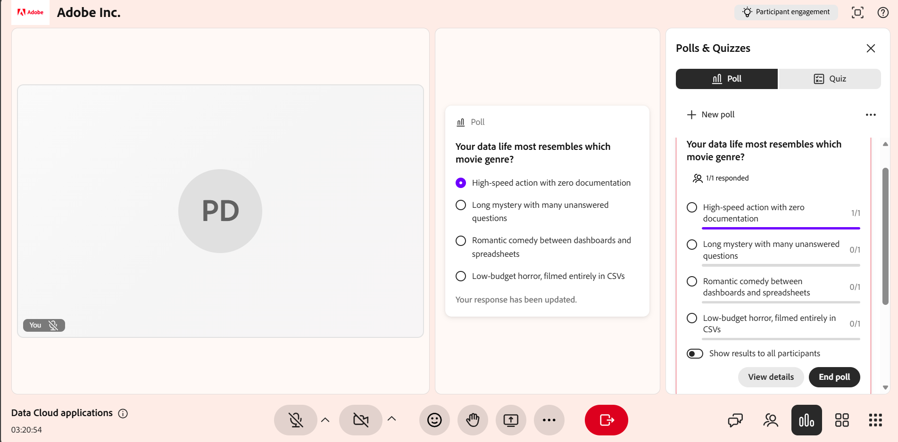

# 创建和启动投票

利用投票，让您的Live Hub会议更具交互性和吸引力。 在&#x200B;**投票和测验**&#x200B;面板中，您可以通过选择问题类型（如多选题或简答题）手动创建投票，或者使用带有&#x200B;**破冰机**&#x200B;和&#x200B;**知识检查**&#x200B;选项的AI生成投票。

在实时会话期间，您可以启动和关闭投票、实时监控响应、查看参与者答案并选择是否与学习者共享结果。 本文介绍了如何在Live Hub会话期间创建、管理和共享投票。

## 手动创建投票

创建投票，在实时会话中提问并收集学习者的响应。 您可以提前或动态创建投票，以检查理解情况、收集反馈并鼓励参与。

手动创建意见调查：

1. 从控制栏中选择。

1. 选择“**投票**”选项卡，然后选择“**构建您自己的投票**”。

   
   *选择“轮询”选项卡中的“构建您自己的投票”以手动创建投票。*

1. 在&#x200B;**投票**&#x200B;选项卡中，从下拉菜单中选择以下问题类型之一：

   1. 多项选择

   1. 简短的回答

1. 根据选定的问题类型配置投票：

   1. **多项选择**：在单独的行中输入每个回答选项。 默认情况下，有三个选项字段可用。 您可以执行以下操作：

      1. 要添加更多选项，请选择&#x200B;**添加选项**。

      1. 要允许多个选择，请启用&#x200B;**多个正确答案**。

   1. **简短的回答**：不需要回答选项。 学习者在文本字段中输入响应。

1. 选择&#x200B;**“保存”**。

## 使用AI创建意见调查

您可以使用&#x200B;**投票和测验**&#x200B;面板中的AI辅助选项来生成投票问题，而无需手动创建投票问题。 有两种可用的AI轮询类型：

* **破冰机投票**：生成介绍性或对话性问题以鼓励在会话开始时或在休息后恢复参与时进行参与。

* **知识检查轮询**：生成知识检查问题，帮助讲师了解学习者对主题的关注程度并根据需要调整方法。

### 创建破冰器投票

创建破冰器意见调查，在会话开始时吸引学习者。 破冰机民调可帮助讲师了解学习者首选项、期望或先前知识，并鼓励讲师尽早参与会议。

要创建破冰器投票，请执行以下操作：

1. 从控制栏中选择。

1. 选择&#x200B;**投票**&#x200B;选项卡，然后选择&#x200B;**破冰器投票**。

1. 查看生成的问题和答案选项，并根据需要进行修改。 您可以执行以下操作：

   * 编辑问题。

   * 更新或删除现有的应答选项。

   * 将问题类型更改为&#x200B;**简短的答案**。

   * 选择&#x200B;**添加选项**&#x200B;以包含其他选项。

   * 如果存在选择题，请启用&#x200B;**多个正确答案**。

   
   *使用“投票”选项卡中的AI生成和自定义破冰机投票。*

1. （可选）选择&#x200B;**重新生成投票**&#x200B;以生成新问题。

1. （可选）使用拇指向上或拇指向下选项提供关于所生成内容的反馈。

1. 选择&#x200B;**“保存”**。

### 创建知识检查轮询

创建知识检查投票以评估学习者在会话期间的理解程度，并评估学习者对主题的理解程度。 这些调查可帮助讲师识别知识差距、验证关键概念并根据学习者响应调整会话节奏或重点。

要创建知识检查轮询，请执行以下操作：

1. 从控制栏中选择。

1. 选择&#x200B;**轮询**&#x200B;选项卡，然后选择&#x200B;**知识检查**。

1. 查看生成的问题和答案选项，并根据需要进行修改。 您可以修改以下内容：

   * 编辑问题。

   * 更新或删除现有的应答选项。

   * 更改问题类型。

   * 选择&#x200B;**添加选项**&#x200B;以包含其他选项。

   * 如果存在多项选择问题，则启用&#x200B;**有多个答案**。

   
   *在“轮询”选项卡中生成并自定义带有AI的知识检查轮询。*

1. （可选）选择“**重新生成投票**”以用新问题替换当前问题。

1. （可选）使用拇指向上或拇指向下选项提供关于所生成内容的反馈。

1. 选择&#x200B;**“保存”**。

## 启动投票

创建并保存投票后，该投票会显示在&#x200B;**投票**&#x200B;选项卡下的&#x200B;**投票和测验**&#x200B;面板中。 您可以在会话期间随时访问保存的投票，并启动投票以吸引学习者并实时收集响应。

要启动投票，请执行以下操作：

1. 从控制栏中选择。

1. 选择“**投票**”选项卡。

1. 从列表中选择保存的投票。

1. 选择&#x200B;**启动投票**。

>[!NOTE]
>
> 学习者可以看到轮询，讲师可以实时查看投票结果。 学习者可以在调查仍在进行时更新其回复。

*选择“启动轮询”以在会话期间开始收集响应。*

## 与参与者共享投票结果

您可以在会话期间随时与参与者共享投票结果。 选择&#x200B;**向所有参与者共享结果**&#x200B;以使结果实时可见。 共享结果后，投票会显示&#x200B;**实时结果**&#x200B;标记，表示学习者可以查看投票结果。

*选择“向所有参与者共享结果”以实时显示投票结果。*

## 关闭投票

当您不再希望参与者回复时，可以关闭投票。

要关闭投票：

1. 从控制栏中选择。

1. 导航到&#x200B;**轮询**&#x200B;选项卡中的活动轮询。

1. 选择&#x200B;**结束投票**。

*选择“结束轮询”以停止收集响应并关闭轮询。*

投票结束后，**已关闭**&#x200B;状态显示在投票问题上方。

## 查看投票结果

讲师可在会话期间查看投票结果。 当学习者提交或更新其响应时，这些结果会实时更新。 默认情况下，投票视图显示每个选项响应的总体分布。

要查看详细回复，请执行以下操作：

1. 打开&#x200B;**投票**&#x200B;选项卡。

1. 选择活动或已关闭的投票。

1. 选择&#x200B;**查看响应**。

此时会打开一个弹出窗口，显示参与人姓名、其选定答案以及允许多项响应的多个问题条目。

*在“投票响应”窗口中查看参与者姓名及其选定的答案。*

学习者可以在提交或更新响应时实时查看投票结果。

## 管理已关闭的投票

投票关闭后，可以从投票的选项菜单（三个点）管理投票。 使用这些选项可以重复使用轮询、创建副本或从会话中删除轮询。

要管理已关闭的投票，请执行以下操作：

1. 从中，选择&#x200B;**轮询**&#x200B;选项卡。

1. 导航到已关闭的投票，然后选择选项(**...**) 菜单。

   
   *使用“选项”菜单重置、复制或删除已关闭的投票。*

1. 选择下列选项之一：

| **选项** | **描述** |
|----|----|
| **重置** | 永久删除对投票的所有响应，同时保持投票本身不变。 使用此选项再次运行同一轮询并收集一组新的响应。 |
| **重复** | 创建投票的副本（包括其问答选项），以便您可以重复使用或调整它，而无需从头开始重新构建。 |
| **删除** | 从会话中永久删除投票及其所有响应。 此操作无法撤消。 |

>[!NOTE]
>如果在复制、删除或重置投票时遇到错误，请参阅[实时集线器故障排除指南](../kb/troubleshooting-guide-for-live-hub.md#poll-tab-issues) ，以获取常见错误消息的列表以及如何解决这些错误消息。
