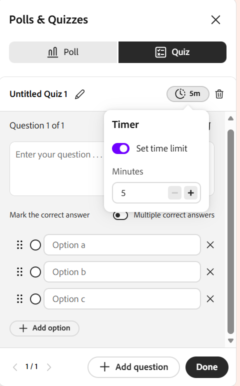

# 创建和管理测验

作为讲师，测试功能可让您衡量学习者在实时中心会话期间对主题的掌握程度。 与快速单问题轮询不同，测验允许您构建一个结构化、多问题评估，其中包含多选和多答问题、分数以及时间限制和随机问题或选项顺序等设置。

本文将逐步介绍讲师可以执行的每项测验操作，从创建测验到分享测验结果。

## 创建测验

您可以创建一个测验来评估学习者在会话期间的理解情况。 测验可以包括不同的问题类型，并支持通过评分来跟踪绩效。 如果没有可用的测验，您可以从&#x200B;**测验**&#x200B;选项卡中创建一个新测验。

要创建测验，请执行以下操作：

1. 从&#x200B;**投票和测验**&#x200B;面板中选择&#x200B;**测验**&#x200B;选项卡。

   
   *从“投票和测验”面板中选择“测验”选项卡。*

1. 选择“**创建新测验**”。 此时将打开名为&#x200B;**无标题测验1**&#x200B;的新测验。

1. 在问题字段中，输入您的问题。

1. 在“选项”字段中输入您的答案选项。 默认情况下提供三个选项。 您可以：

   1. 选择&#x200B;**+添加选项**&#x200B;以添加其他选项。

   1. 选择某个选项旁边的&#x200B;**X**&#x200B;以将其删除。

   1. 拖动选项旁的手柄以对其重新排序。

1. 标记正确答案：

   1. 要设置单个正确答案，请选择正确选项旁边的单选按钮。

   1. 要允许多个正确答案，请启用&#x200B;**多个正确答案**&#x200B;切换开关，然后为每个正确选项选择单选按钮。

1. 若要添加其他问题，请选择&#x200B;**+添加问题**。

   
   *显示创建测验选项的“测验”选项卡界面。*

1. 选择&#x200B;**完成**。

1. 选择&#x200B;**“保存”**。 该测试现已推出。

## 设置测验的时间限制

您可以设置可选的时间限制，以便学习者必须在固定的持续时间内完成测试。 时间限制是从测验顶部的计时器设置的。

要设置时间限制，请执行以下操作：

1. 选择测验顶部的计时器图标。

1. 启用&#x200B;**设置时间限制**。

1. 以分钟为单位设置持续时间。

*显示设置测验时间限制的选项的“测验”选项卡界面。*

## 编辑测验

在启动测试之前更新问题、修改答案选项或重新排序问题。 测试一旦启动，便无法编辑。

编辑测验：

1. 选择“**测验**”选项卡。

1. 导航至要编辑的测验。

1. 选择编辑（铅笔）图标。

1. 执行以下任一操作：

   1. 编辑问题文本。

   1. 更新或删除应答选项。

   1. 选择正确答案。

   1. 使用&#x200B;**添加问题**&#x200B;添加新问题。

   1. 如果不再需要某个问题，请将其删除。

   
   *显示编辑测验选项的“测验”选项卡界面。*

1. 选择&#x200B;**保存**&#x200B;以应用更改。

## 启动测试

创建并保存测验后，测验会显示在带有&#x200B;**新建**&#x200B;标签的&#x200B;**测验**&#x200B;选项卡中。 启动可使学习者看到测验，并允许他们实时尝试提问。

要启动测试，请执行以下操作：

1. 选择“**测验**”选项卡。

1. 从保存的测验列表中，选择&#x200B;**启动测验**。

启动测试后，该测试会显示在&#x200B;**投票和测验**&#x200B;面板中，供学习者进行回答。 如果设置了时间限制，您还可以通过在实时测验期间选择&#x200B;**+1分钟**&#x200B;来延长测验的持续时间。

*测试选项卡界面，其中显示了为参与者启动的测试。*

>[!NOTE]
>如果在创建或启动测试时遇到错误，请参阅[Live Hub故障排除指南](../kb/troubleshooting-guide-for-live-hub.md#quiz-tab-issues)，获取常见错误消息的列表以及如何解决这些错误消息。

## 查看测验结果

在会话期间和之后查看测验结果，以监控学习者的表现和参与情况。 当学习者尝试并完成测试时，结果会实时更新。

要查看测验结果，请执行以下操作：

1. 从中，选择&#x200B;**测验**&#x200B;选项卡。

1. 导航到活动或已完成的测验。

1. 选择&#x200B;**查看结果**。

*“测验”选项卡界面显示“查看详细信息”选项，可用于访问和查看测验结果。*

**测验**&#x200B;面板显示包含以下详细信息的结果：

* 学习者配置文件

* 尝试的问题数

* 分数

* 完成测验所需的时间

## 查看参与者的详细响应

从结果列表中选择单个参与者以查看详细的响应。 您可以看到学习者如何回答每个问题。

*显示学习者详细结果的测验响应弹出窗口。*

## 关闭测验

在学习者完成响应或要停止提交时，使用此选项可结束活动测验。

要关闭测试，请执行以下操作：

1. 选择&#x200B;**关闭测验**。 所有学习者的测试将立即停止。

1. 测验状态更新为&#x200B;**已关闭**。

*显示已关闭测验状态的“测验”选项卡界面。*

## 与参加者共享测验结果

结束或关闭测验后，您可以与参加者共享测验结果。 要使结果对所有人可见，请启用&#x200B;**与参与者共享结果**&#x200B;切换开关。

启用结果共享后，测验将带有&#x200B;**实时结果**&#x200B;标记。 这意味着结果会向学习者显示。

*启用与参与者共享结果功能，以便与学习者共享结果。*

## 管理测验

您可以从选项(**...**)管理已保存或已关闭的测验 **投票和测验**&#x200B;面板中的菜单。 这些选项使您可以清除响应、重复使用测验或从会话中删除测验。

要管理测验，请执行以下操作：

1. 从中，选择&#x200B;**测验**&#x200B;选项卡。

1. 导航到测验并选择选项(**...**) 菜单。

   
   *“测验”选项卡界面显示“重置”、“复制”和“删除”测验的选项。*

1. 选择下列选项之一：

| **选项** | **描述** |
|----|----|
| **重置** | 永久删除对测验的所有响应，同时保持测验本身的完整性。 使用此选项再次运行同一测试并收集一组新的响应。 |
| **重复** | 创建测验的副本（包括其问题和答案选项），以便您可以重复使用或调整它，而无需从头开始重新构建。 |
| **删除** | 从会话中永久删除测验及其所有响应。 此操作无法撤消。 |
