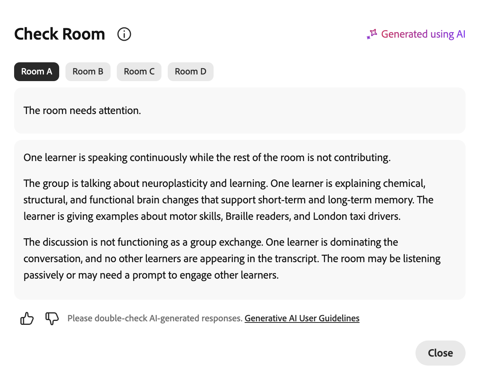

# 创建和管理分组讨论会话

讲师可将实时中心会话拆分为几个较小的互动组，以便开展重点活动和讨论。 您可以创建分组讨论室、自动或手动分配学习者、设置活动说明以及控制会话运行的时长。 在分组讨论会话处于活动状态时，您可以通过AI生成的摘要监视会议室、加入会议室以共享屏幕或聊天并扩展会话。

本指南将逐步介绍讲师可以使用的所有分组讨论会议室操作，从创建会议室到查看会话报告。

## 创建分组会话

分组讨论会将虚拟教室拆分为几个较小的交互式组。 请按照以下步骤创建一个。

要创建分组会话，请执行以下操作：

1. 从控制栏中选择。

   
   *显示“拆分”面板的实时中心界面。*

1. 选择&#x200B;**设置分组会话**。

将打开“拆分”面板。 在此处，您可以配置分组讨论室、分配学习者以及管理分组讨论会话设置。

>[!NOTE]
>如果分组会话未启动，请查看[ Live Hub故障排除指南](../kb/troubleshooting-guide-for-live-hub.md#breakout-session-issues)，以了解常见错误消息的列表以及如何解决这些错误。

## 设计分组讨论

在开始分组会话之前，请使用&#x200B;**“分组讨论”**&#x200B;面板配置会议室、分配学习者并定义活动详细信息。 正确的配置有助于正确放置学习者并了解每次分组活动的目标。

要设计分组会话，请执行以下操作：

1. 从控制栏中选择。  将打开“拆分”面板。

   
   *显示用于配置分接会议室选项的分接面板。*

1. 使用以下选项配置分组会议室：

| **选项** | **描述** |
|----|----|
| 编辑图标 | 选择“编辑”图标以重命名分组会话。 |
| **会议室** | 使用增大或减小控件设置临时会议室数。 最多可有&#x200B;**10**&#x200B;个会议室。 |
| **持续时间** | 定义分组会话将运行多长时间。 最短持续时间为&#x200B;**5分钟**，最大持续时间为&#x200B;**60分钟**。 |
| **分配参与者** | 选择“**自动分配**”以自动将参与者分配给会议室。 您也可以拖放学习者以将其移动到其他房间。 |
| **为会议室单独设置** | 单独自定义每个分组讨论室的说明。 |
| **说明** | 说明活动并概述分组会议的预期成果。 |
| **查看会议室分配** | 在会话开始之前，预览如何在临时会议室中分布学习者。 |
| **开始拆分** | 开始分组讨论并将学习者移动到已分配的会议室。 |
| “放弃”图标 | 放弃当前的分组配置，不保存更改。 |

1. 选择“**保存**”。  分组会话出现在&#x200B;**“分组讨论”**&#x200B;面板中，并带有&#x200B;**“新建”**&#x200B;标记。

## 启动分组会话

配置并保存分组会话后，它将显示在&#x200B;**分组会话**&#x200B;面板中。 开始会话以将学习者移至其分配的会议室。

要启动分组会话，请执行以下操作：

1. 打开&#x200B;**拆分**&#x200B;面板。

1. 导航到带有&#x200B;**New**&#x200B;标记的分组会话。

1. 选择&#x200B;**开始拆分**。  通知会显示&#x200B;**从5秒开始**，然后学习者会转到其分配的分组会议室，并应用配置的设置。

   
   *选择“开始拆分”以开始拆分会话。*

## 管理分组讨论会话

保存分组会话后，它将显示在&#x200B;**分组会话**&#x200B;面板中。 每个保存的会话都会显示其状态（**新建**&#x200B;或&#x200B;**已关闭**）、会议室数量和持续时间。 在此面板中，您可以根据需要编辑、复制或删除会话。

### 编辑分组会话

使用此选项更新现有的分组配置。 编辑可用于状态为&#x200B;**新建**&#x200B;的会话。

要编辑分组会话，请执行以下操作：

1. 打开&#x200B;**拆分**&#x200B;面板。

1. 导航到要更改的分组会话。

1. 选择会话上的编辑（铅笔）图标。

   
   *选择“编辑（铅笔）”图标以更新分拆会话配置。*

1. 根据需要更新配置，例如会议室数量、持续时间或说明。

1. 选择&#x200B;**“保存”**。

### 复制分组会话

通过复制先前创建的会话来重复使用现有的分组设置。

要复制会话，请执行以下操作：

1. 打开&#x200B;**拆分**&#x200B;面板。

1. 导航到要复制的分组会话。

1. 选择更多选项(**...**) 图标。

   
   *“更多选项”菜单显示“重复操作”。*

1. 选择&#x200B;**复制**。

使用相同的文件室配置、参与者分配、说明和持续时间创建新会话。 复制的临时会议室显示在面板顶部，状态为&#x200B;**新建**，名称为&#x200B;**临时会话1 （复制）**。

### 删除分组会话

使用此选项可删除不再需要的分组会话。

要删除分组会话，请执行以下操作：

1. 打开&#x200B;**拆分**&#x200B;面板。

1. 导航到已保存的分组会话。

1. 选择更多选项(**...**) 图标。

1. 选择“**删除**”。  此时会显示确认弹出窗口。

   
   *从确认弹出窗口中选择“删除”以删除分步会话。*

1. 选择&#x200B;**删除**。

## 管理活动分组会话中的活动

在活动分组讨论期间，讲师可以监控会议室活动，与学习者沟通，并通过加入各个分组讨论室与参与者协作。 主会话中提供的大多数协作工具（例如聊天、屏幕共享和白板）也可在临时会议室中使用，并且工作方式相同。

### 查看AI生成的临时会议室摘要

讲师可以在每个分组讨论室中查看AI生成的讨论摘要，以监控参与者对话、评估与活动的对齐方式以及决定何时加入会议室。 随着讨论展开，摘要会在整个会话中自动更新。

>[!NOTE]
>
>在生成摘要之前，分组讨论室需要至少60秒的讨论。 活动少于此活动的文件室将不会在“检查文件室”窗口中显示摘要。

要查看摘要，请执行以下操作：

1. 导航到要审阅的文件室。

1. 选择&#x200B;**检查室**。  此时会出现&#x200B;**检查室**&#x200B;弹出窗口，其中包含工作室的摘要。

   
   *检查会议室弹出窗口显示会议室摘要。*

1. （可选）选择其他文件室。 摘要将更新以显示所选文件室的详细信息。

### 在分组讨论室中使用协作工具

讲师在加入分组讨论区后，可使用主会话中提供的相同协作工具来指导学习者并与之交互。 您可以：

* 与学习者聊天以回答问题并促进讨论。 有关详细信息，请查看[关于聊天面板](./about-the-chat-panel.md)。

* 共享屏幕或演示文稿以解释概念或演示任务。 有关详细信息，请查看[关于屏幕共享](./about-the-screen-sharing.md)。

* 使用白板进行协作以集思广益、批注和交互式活动。 有关详细信息，请查看[关于白板](./about-the-whiteboard.md)。

## 结束分组会话

您可以随时结束分组会话。

1. 导航到&#x200B;**拆分**&#x200B;面板。

1. 在活动分组会话中选择&#x200B;**结束分组**。  所有学习者将被移回主会议室，所有参与者的分组讨论会话也将结束。

   
   *中断会话2，显示结束中断选项以结束中断会话。*

## 查看分组讨论会话报告

分组会话结束后，您可以访问分组会话报告来查看会话活动和参与情况。 该报告包括参与者详细信息、分组讨论的整体和特定会议室摘要、与参与者共享的说明以及会话持续时间和参与情况的概述。

>[!NOTE]
>
>讨论时间少于60秒的分组会议室在报告中不包含摘要。

要查看分组会话报告，请执行以下操作：

1. 导航到&#x200B;**拆分**&#x200B;面板中的已关闭拆分会话。

1. 选择&#x200B;**查看报告**。  将打开包含会话摘要的分组报告弹出窗口。

   
   *显示临时会议室报告的临时会议室报告弹出窗口。*

1. 执行以下任一操作：
   * 选择“**所有会议室**”以查看&#x200B;**分机会话的整体摘要**。
   * 选择一个文件室选项卡以查看该文件室的摘要。

所有分组讨论会议见解也可在&#x200B;**会议仪表板**&#x200B;中找到，您可以在其中查看摘要、分析参与情况并在会议结束后跟踪会议结果。 有关详细信息，请查看[会话仪表板](./components-of-the-session-dashboard.md)的组件。

## 扩展分组会话

如果需要更多时间，您可以从分接控件中选择&#x200B;**将时间延长2分钟**，以延长分接会话处于活动状态时的持续时间。 在每次分出会话期间，可将会话扩展至多两次。 更新后的持续时间会立即应用，让学习者可以继续活动而不会中断。
