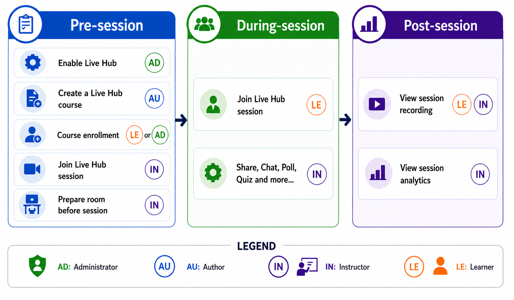

# Live Hub (Beta)快速入门

>[!IMPORTANT]
>
>Beta版功能可能包含缺陷，并按“原样”提供，不附带任何类型的担保。 Adobe自行决定是否正式提供测试版功能。 Adobe没有义务维护、更正、更新、更改、修改或以其他方式支持（通过Adobe支持服务或其他方式）Beta版功能。 如果Beta版功能可以普遍使用，则可能需要遵守附加条款和条件，包括适用的费用。 Beta版功能如有更改，恕不另行通知，包括停用。 我们建议客户谨慎使用，不要以任何方式依赖Beta版功能的不中断或无错误运行或性能。 因此，使用测试版功能完全由客户自行承担风险。 随着功能的发展，产品功能和相关文档可能会发生变化。 本文档反映了当前的Beta版体验，不应将其视为最终或完整的产品文档。

借助Adobe Learning Manager的实时中心，组织可以直接在平台内提供讲师指导的实时培训，无需使用外部工具来交付核心课程。

它为讲师和学习者提供基于浏览器的无缝体验，将会话交付、协作和参与工具结合在单个环境中。 这种集成方法可帮助组织简化培训交付、减少管理开销并保持在整个学习过程中对学习者参与情况的了解。

许多组织依靠单独的工具进行课程管理、会话交付和协作。 这可能会带来以下挑战：

- 在多个培训平台之间切换
- 其他设置和配置要求
- 在学习者参与和参与方面的可见度有限

Live Hub通过将课程交付、协作、参与和跟踪整合到Adobe Learning Manager中的一种统一体验中来解决这些难题。

## 什么是Live Hub

Live Hub是内置的虚拟培训解决方案，允许您：

- 在Adobe Learning Manager中创建和提供实时培训课程。
- 在同一位置管理讲师、学习者和会话。
- 使用集成工具进行沟通、协作和参与。
- 无需交换机系统即可跟踪参与情况和性能。

与第三方集成不同，Live Hub完全嵌入到学习工作流程中，可提供更统一的体验。

## Live Hub的工作原理

提供实时中心课程涉及四个角色，每个角色负责工作流程的不同部分：

- **管理员**：为Learning Manager帐户启用Live Hub。 有关详细信息，请查看[Live中心会话中的管理员](./administrator.md)。
- **作者**：创建实时中心课程。 有关详细信息，请查看[实时中心会话中的作者](./authors-in-live-hub-session.md)。
- **讲师**：准备会议室、开展会话、吸引学习者并审阅录制和分析。 有关详细信息，请查看[实时中心会话中的讲师](./instructors-in-a-live-hub-session.md)。
- **学习者**：加入会话并参与聊天、投票、测验、白板和分组讨论等活动。 查看[Live Hub会话中的学习者](./learners-in-live-hub-session.md)以了解更多信息。

## 实时中心会话工作流程

实时中心会话包括三个关键阶段：**会话前**、**会话期间**&#x200B;和&#x200B;**会话后**。 每个阶段均包括管理员、作者、讲师和学习者的特定任务，以确保
流畅的学习体验。

| **阶段** | **关键活动** |
|---|---|
| **会话前** | 管理员验证是否满足[系统要求](./system-requirements-for-live-hub.md)，并为帐户[启用Live Hub](../administrators/feature-summary/enable-live-hub.md)。 他们还可以为学习者注册课程。 作者[创建Live Hub课程](create-a-live-hub-session.md)，讲师通过[配置布局](./understand-the-live-hub-layout.md)、内容和交互活动为即将开始的会话准备会议室。 |
| **会话期间** | 讲师交付实时会话并使用[聊天](about-the-chat-panel.md)、[投票](./about-the-polls.md)、[测验](./about-the-quiz.md)、[白板](./about-the-whiteboard.md)、[屏幕共享](./about-the-screen-sharing.md)和[分组讨论室](./about-the-breakouts.md)等功能吸引学习者。 学习者可以在整个会话中参与这些活动。 讲师可以[录制会话](./record-a-session.md)，以便学习者稍后查看。 |
| **会话后** | 讲师会审核会话记录、出席报告和[参与分析](./view-the-session-dashboard.md)，以评估学习者参与情况并评估会话的有效性。 学习者可以通过[基于主题的录制](./view-recordings-as-a-learner.md)视图重新访问会话，该视图将录制拆分为可导航的主题，每个主题都具有标题、概述和注释，以便他们能够跳转到任何主题或阅读主题而不是观看。 |

>[!NOTE]
>Adobe Learning Manager移动应用程序上也提供了Live Hub，但存在一些功能限制。 了解支持的移动功能。 查看[使用移动版Live Hub作为学习者](./live-hub-mobile-experience-for-learners.md)，了解更多信息。 要优化您的Live Hub体验，请查看[Live Hub会话的最佳实践](./best-practices-for-a-live-hub-session.md)。