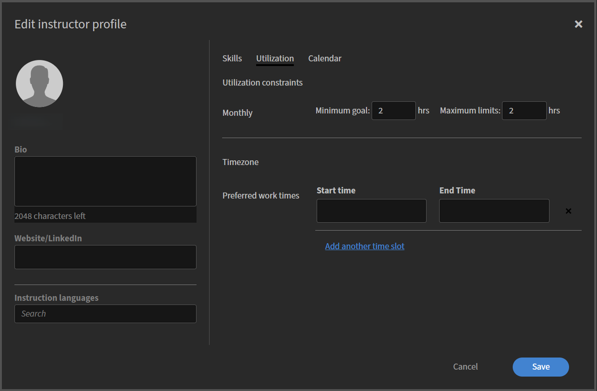

# 添加和管理讲师

讲师提供现场讲座并在Live Hub中吸引学习者。 为了支持准确的时间安排和有效的课程交付，管理员可以添加讲师、构建其用户档案、定义教学技能和语言以及配置可用性。

“讲师”选项卡提供单个位置来管理整个组织中的这些信息。 从此处，您可以将现有Adobe Learning Manager用户添加为讲师，审阅并更新其个人资料，并根据教学需求的不断变化保持其技能、语言和可用性为最新状态。

## 访问“讲师”选项卡

按照以下步骤查看和管理讲师：

1. 登录 Adobe Learning Manager。

1. 导航到&#x200B;**管理员** > **用户**。

1. 在&#x200B;**用户组**&#x200B;中选择&#x200B;**讲师**。

   
   *在用户组中选择讲师以查看和管理讲师。*

## 添加讲师

可使用现有的Adobe Learning Manager用户创建讲师。 如果用户还没有讲师权限，请将他们添加为讲师。

添加讲师：

1. 从&#x200B;**用户组**&#x200B;中选择&#x200B;**讲师**&#x200B;选项卡。

1. 选择&#x200B;**添加讲师**。  此时会弹出窗口&#x200B;**添加讲师**。

   
   *按名称搜索用户，然后选择用户以分配讲师角色。*

1. 按名称搜索用户，然后从搜索结果中选择该用户以分配讲师角色。

1. 选择“**保存**”。  用户现在被分配为讲师角色，并显示在讲师列表中。

## 设置讲师配置文件

讲师个人资料定义了讲师的教学信息、语言、技能、利用率和可用性。 完成用户档案可确保教师准确配对、高效安排课程，并符合课程要求。

要设置讲师配置文件，请执行以下操作：

1. 在“讲师”选项卡中搜索讲师姓名。

1. 选择&#x200B;**添加技能和其他详细信息**。  此时会弹出&#x200B;**编辑讲师配置文件**&#x200B;窗口。

   
   *“编辑讲师配置文件”窗口包含一些选项卡，用于了解基本详细信息、技能、利用率和可用性。*

### 添加基本详细信息

基本详细信息显示在对话框的左侧面板中，无论打开哪个选项卡，基本详细信息始终可见。

要添加基本详细信息，请执行以下操作：

1. 导航到配置文件部分。

1. 输入以下详细信息：

   | **字段** | **操作** |
   |----|----|
   | **简历** | 输入讲师的简短描述（最多2,048个字符）。 |
   | **网站/LinkedIn** | 输入外部个人资料或引用链接。 |
   | **指令语言** | 搜索讲师可以教授的语言。 所选语言显示为标签。 |

## 在配置文件中添加讲师技能

技能界定了讲师可以教授的学科领域和专业知识。 在将讲师与相关课程进行配对以及确保根据课程要求指定合适的讲师方面，这一角色至关重要。

要添加讲师技能，请执行以下操作：

1. 导航至&#x200B;**技能**&#x200B;选项卡。

1. 在&#x200B;**搜索**&#x200B;字段中键入技能名称。 这将填充技能列表。

1. 从列表中选择技能。  所选技能显示为标签。

1. 选择&#x200B;**“保存”**。

### 创造新技能

如果所需技能不可用，可直接从个人资料创建。

添加新技能：

1. 从&#x200B;**技能**&#x200B;选项卡中选择&#x200B;**添加新技能**。 此时会打开&#x200B;**添加技能**&#x200B;面板。

    *输入技能名称和描述，然后选择“完成”以添加新技能。*

1. 在&#x200B;**添加技能**&#x200B;面板中输入以下详细信息：

   1. 技能名称

   1. 描述

1. 选择&#x200B;**完成**。  新技能已添加并显示为标签。

1. 选择“**保存**”。  系统会将相关技能添加到讲师个人资料中。

## 配置讲师利用率

使用&#x200B;**利用率**&#x200B;选项卡可定义讲师的教学能力和首选工作时间。 您可以设置利用率约束以建立教学目标和限制，并指定首选的工作时间以指示讲师何时可以主持会话。 显示的时区继承自讲师的用户配置文件。

要配置讲师利用率，请执行以下操作：

1. 导航到&#x200B;**利用率**&#x200B;选项卡。

1. 输入&#x200B;**每月**&#x200B;期间的&#x200B;**最小目标**&#x200B;和&#x200B;**最大限制**（以小时为单位）。

1. 为首选时间段输入&#x200B;**开始时间**&#x200B;和&#x200B;**结束时间**。

   
   *为讲师的首选工作时间输入开始时间和结束时间。*

1. （可选）选择&#x200B;**添加其他时隙**&#x200B;以添加其他可用性。

1. 选择&#x200B;**“保存”**。 讲师的利用率约束和首选工作时间将更新。

## 管理讲师可用性

使用&#x200B;**日历**&#x200B;选项卡添加讲师的日程安排，并在讲师不可用时标记期间。 日历使用颜色编码标识&#x200B;**已预订**、**节假日**&#x200B;和&#x200B;**不可用**&#x200B;日期。

此日历上显示的&#x200B;**节假日**&#x200B;是根据“节假日”设置配置的。 有关详细信息，请查看[管理假日](./manage-holidays.md)。

标记不可用天数：

1. 导航到&#x200B;**日历**&#x200B;选项卡。

1. 在&#x200B;**添加不可用天数**&#x200B;部分中选择开始日期和结束日期。

   
   *选择开始日期和结束日期以将范围标记为教师日历上不可用。*

1. 选择“**添加**”。  所选日期范围在日历上标记为不可用。

1. 选择&#x200B;**“保存”**。 已更新讲师的可用性设置。
