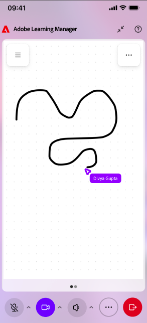

# 以学习者身份使用移动设备上的实时中心(Beta)

使用Adobe Learning Manager移动应用程序从iOS或Android设备加入并参与实时中心会话。 在会话期间，您可以与讲师和参与者互动、回复投票和测验、在分组讨论室中协作，以及直接从移动设备访问共享内容。

>[!NOTE]
>
> 移动应用程序支持核心Live Hub参与功能。 桌面体验中提供的某些功能在移动设备上不可用。 有关桌面上支持功能的完整列表，请参阅[Live Hub快速入门](./getting-started-live-hub.md)。

## 移动设备上的学习者体验

下表汇总了学习者在移动应用程序中可使用的实时中心功能。

| **功能** | **移动体验** |
|----|----|
| 加入会话 | 从Adobe Learning Manager移动应用程序加入实时中心会话。 |
| 音频和视频 | 打开或关闭麦克风和摄像头，然后选择可用的音频设备。 |
| 聊天和提问 | 参与聊天对话并在会话期间提交问题。 |
| 反应和举手 | 做出反应并举手与讲师互动。 |
| 投票 | 响应会话期间发布的投票。 |
| 测验 | 讲师启动的尝试测验。 |
| 临时会议室 | 加入指定的分组讨论室、与其他参与者协作、请求讲师帮助以及查看分组讨论摘要。 |
| 白板和共享内容 | 查看会话期间共享的内容并与之交互。 |
| 微主板 | 查看讲师共享的镜像板。 |
| 隐藏式字幕 | 在会话期间打开或关闭隐藏字幕。 |
| 屏幕共享 | 查看讲师或参加者共享的内容。 |
| 会话录制 | 在会话结束后可访问录制内容时进行访问。 |

## 加入实时中心会话

从Adobe Learning Manager移动应用程序加入您计划的实时中心会话。

在加入之前，您可以查看相机、麦克风和音频设备设置，以确保正确配置了这些设置。

*在加入移动设备上的Live Hub会话之前，请检查您的摄像机、麦克风和音频设备设置。*

>[!NOTE]
>
> 移动应用程序不支持虚拟背景和背景模糊效果。

## 浏览会话界面

加入会话后，主会话视图会显示参与者视频磁贴或共享内容，以及用于通信和参与的控件。

使用会话控件可以执行以下操作：

* 打开或关闭麦克风。

* 打开或关闭相机。

* 举起手。

* 发送反馈。

* 访问聊天和提问。

* 参与投票和测验。

* 加入分组讨论室活动。

* 离开会话。

## 使用隐藏式字幕

隐藏字幕可帮助您在会话期间关注口语内容。

在参加实时中心会话时，您可以随时打开或关闭字幕。

>[!NOTE]
>
> 字幕格式选项（如字体大小和显示样式）在移动应用程序中不可用。

## 在聊天中提问

使用“聊天”面板与讲师和其他参与者进行沟通。

您可以：

* 在会话聊天中发布消息。

* 查看讲师和参加者的留言。

* 在会话期间提交问题。

* 查看讲师提供的回复。

## 对投票做出回应

当讲师启动轮询时，它会自动出现在会话中。

*直接从Adobe Learning Manager移动应用程序响应投票。*

您可以直接从移动应用程序提交回复。 根据轮询的配置方式，您还可以在响应后查看轮询结果。

## 尝试测验

讲师启动测试后，您无需离开会话即可通过移动设备完成测试。

测验结果和答案可见性取决于讲师配置的设置。

## 参与分组会议室

如果在会话中使用了分组讨论室，讲师将为您分配一个会议室。

*分组讨论室视图，其中显示了移动设备上可用的协作选项。*

在临时会议室中，您可以：

* 与其他参与者协作。

* 参与分组活动。

* 请求讲师协助。

* 在可用时查看分类摘要。

讲师负责管理会议室的分工和授课时间。

## 查看共享内容

在会话期间，讲师可以共享演示文稿、白板、镜像板或其他内容。 您可以直接在移动应用程序中查看共享内容，并关注讨论和活动。

*在移动应用程序中直接查看讲师共享的内容。*

## 离开会话

当您准备好退出会话时，请选择&#x200B;**离开**。

*选择“离开”以退出移动应用程序中的会话。*

离开后，系统将提示您提供有关会话体验的反馈。
