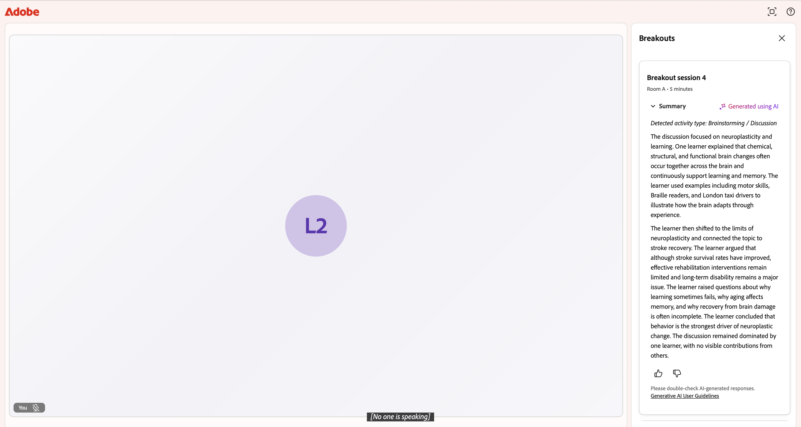

# 参加分组讨论

在Live Hub会话期间，讲师可以将会话拆分为几个较小的分组讨论区，以便进行重点讨论和动手操作。

在分组讨论开始后，您会自动移动到指定的会议室，您可以在其中与组协作、按照活动说明进行操作，并在需要时寻求帮助。 会话结束后，您可以查看在分组讨论室中由AI生成的讨论摘要。 该指南阐述了学习者在分组讨论中的期望和学习者可以做的事情。

## 加入您的分组讨论室

当讲师开始分组讨论时，您会自动从主会议室移动到指定的分组讨论室。 你不需要做任何事来加入。 屏幕顶部显示会话名称和您的会议室，还有一个倒计时器，显示活动剩余的时间。

>[!NOTE]
>
>临时会议室中的对话会得到转录，并使用AI进行处理以生成摘要。 讲师可以审阅这些摘要，以跟踪会议室进展并确定讨论差距。

*活动分组讨论室的学习者视图，其中显示会议室名称、倒计时计时器和会话工具*

## 查看活动说明

讲师可以为分组设置活动或讨论提示。 右侧的&#x200B;**分组讨论**&#x200B;面板显示会话状态（**进行中**）、您的会议室和会话持续时间。

要查看活动提示，请执行以下操作：

1. 如果&#x200B;**拆分**&#x200B;面板已关闭，请选择屏幕右下角的&#x200B;**拆分**（网格）图标。

2. 选择&#x200B;**说明**&#x200B;以展开活动提示，例如“哪些类型的数据可以在Data Cloud中存储和统一？”

在整个讲解中，请参考这些说明，以保持
讨论与活动一致。

## 与您的群协作

在分组讨论室内，您可以使用控制栏上的工具与其他学习者一起工作：

- **麦克风**：静音或取消静音，以便与您的群对话。

- **相机**：打开或关闭视频。

- **反应**：发送快速表情符号反应。

- **举手**：发出您希望说话或引起注意的信号。

- **共享屏幕**：与会议室共享屏幕或演示文稿。

- **聊天**：打开聊天面板以向房间中的其他人发送消息。

- **与会者**：查看谁在您的临时会议室中。

只有房间中的用户才能看到和听到您的声音，因此您可以自由讨论，而不会中断其他休息室。

## 接收讲师发来的消息

讲师可以一次向每个会议室发送广播消息，例如活动提醒或时间检查。 完成此操作后，屏幕上会显示该消息。 阅读消息，然后关闭该消息以返回您的活动。

*在学习者的临时会议室中播放讲师发来的消息*

## 寻求帮助

如果您的小组有疑问或需要讲师加入您的会议室，请在临时会议室顶部选择&#x200B;**寻求帮助**。 此操作会通知讲师，然后讲师可以加入您的会议室以进行协助。 在等待讲师回复的过程中，您可以继续讨论。

*请求帮助选项用于请求讲师的帮助*

发送请求后，该按钮将更改为&#x200B;**取消请求帮助的呼叫**。 例如，如果您不再需要帮助，您的组已自行解决了问题，请选择&#x200B;**取消求助呼叫**&#x200B;以撤回请求。

*用于撤回帮助请求的“取消求助呼叫”选项*

## 返回主房间

分出会话会在计时器上显示的持续时间内运行，讲师可以根据需要延长分出会话。 会话结束后，无论是计时器耗尽，还是讲师提前结束，您都将自动移回主会议室，继续与每个人进行会话。

## 查看您的会议室摘要

临时会话结束后，您可以查看在会议室中由AI生成的对话摘要。 该摘要包括小组讨论的关键点。

只有当分组讨论室至少有60秒的对话时，才会生成摘要。 如果会议室活动时间短于60秒，则无摘要可用。

>[!NOTE]
>
>您只能查看您所在房间的报告。 您看不到来自其他分组讨论区的报告。

如果讲师在同一个分组会话中将您移动到不同的文件室（例如，从A文件室到B文件室），则只会显示最近文件室的摘要。 不会保留您之前所在工作室的摘要。

要查看文件室摘要，请执行以下操作：

1. 从控制栏中选择。  出现“breakouts（拆分）”面板。
1. 导航到要查看其摘要的分组会话卡。
1. 选择分组会话，然后选择&#x200B;**摘要**。  此时会显示AI为您的会议室生成的摘要。

   
   *选择“摘要”以查看您的会议室摘要。*