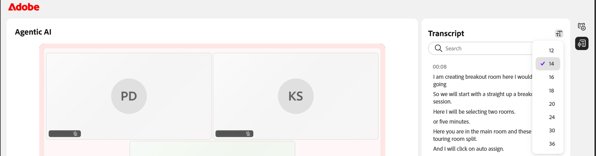

# 录制会话

作为讲师，您可以完全控制会话的捕获、优化和共享方式。 您可以在实时会话期间开始录制、在运行时管理该录制，并在会话结束后查看自动生成的主题、摘要和转录。

除了捕捉会话之外，您还可以编辑录制以移除不必要的部分、启用隐藏式字幕和转录文本。 以下部分将详细介绍这些操作中的每一项。

>[!NOTE]
>
>录制会话时，录制内容只包含主会话。 当参与者进入临时会议室时，录制会自动暂停，当每个人都返回主会话时，录制会恢复。 因此，不会记录临时会议室活动。

## 录制会话

1. 导航到&#x200B;**更多操作**&#x200B;菜单。

1. 选择&#x200B;**开始录制**。  此时会显示确认弹出窗口，指示“**正在录制会话**”。

   
   *从“更多操作”菜单中选择“录制”以开始捕捉会话。*

## 停止、暂停和继续录制

在录制会话时，虚拟教室的顶角会显示一个录制指示器。 可以开始、停止和恢复录制。

### 停止录制

1. 选择录制指示器。  此时会打开一个弹出窗口，其中包含录制操作。

   
   *录制时，使用“录制进行中”选项暂停或停止会话。*

1. 选择&#x200B;**停止录制**。  此时会显示一条确认消息，说明不再录制该会话。

### 暂停录制

要暂停录制，请执行以下操作：

1. 选择录制指示器。

1. 选择&#x200B;**暂停录制**。  将显示一条确认消息，显示&#x200B;**录制和转录已暂停**。

### 继续录制

暂停录制后，将显示“继续录制”选项。 选择&#x200B;**继续录制**&#x200B;以继续暂停的录制。

*暂停时，“录制”暂停选项允许您继续或停止录制。*

## 访问录音

录制的会话可在每个会话的&#x200B;**会话概述**&#x200B;页面上找到。 在这里，您可以播放录制内容或在编辑模式下打开以优化时间轴和转录文本。

要访问录音，请执行以下操作：

1. 导航到所需课程并打开会话。

1. 滚动到&#x200B;**会话概述**&#x200B;页面上的&#x200B;**实时中心**&#x200B;部分。

1. 在&#x200B;**查看录制**&#x200B;卡中，执行以下操作之一：

   * 选择&#x200B;**查看录制**&#x200B;以在播放模式下打开录制。

   * 选择“**编辑**”以在编辑模式下打开录制。

   
   *在“实时中心”部分中查看录制卡，您可以在其中播放或编辑录制。*

## 播放录音

选择查看录制会在录制播放器中打开录制。 播放器会显示会话视频、参与者缩略图和成绩单。

要播放录音，请执行以下操作：

1. 导航到&#x200B;**会话概述**&#x200B;页面。

1. 从&#x200B;**实时中心**&#x200B;部分选择&#x200B;**查看录制**。  录音将以播放模式打开。

   
   *录制播放器处于播放模式，显示会话视频和转录文本面板。*

1. 使用以下播放控件调整观看体验：

| **控件** | **描述** |
|----|----|
| 播放或暂停 | 开始或暂停回放。 |
| 音量 | 调整音频音量。 |
| 进度栏 | 拖动以移动到录制中的特定点。 已用时间和总时间显示在控件旁边。 |
| 回放速度 | 减慢或加快回放。 可用选项为&#x200B;**0.25x**、**0.5x**、**0.75x**、**1x**、**1.25x**、**1.5x**&#x200B;和&#x200B;**2x**。 |
| CC（隐藏字幕） | 在回放期间打开或关闭隐藏式字幕。 选择“抄送”按钮旁的箭头以自定义字幕。 从&#x200B;**小**、**中**&#x200B;或&#x200B;**大**&#x200B;中选择一种字体大小，并从&#x200B;**黑对白**、**黄色对黑**、**白色对黑**、**暗对黄**&#x200B;或&#x200B;**黄色对蓝**&#x200B;中选择一种字幕样式。 |
| 全屏 | 展开录制播放器。 |

## 在录制中生成主题

主题会根据会话讨论流程自动将录制内容划分为有意义的部分。 它们有助于组织更长的录音并改善导航。 您还可以使用关键字搜索主题，以快速导航到录制的相关部分。

## 在录制中查看主题

在生成主题后，您可以浏览和浏览这些主题。 主题被标记为&#x200B;**使用AI生成**。 查看内容，因为应仔细检查AI生成的响应。

要查看和导航主题，请执行以下操作：

1. 在&#x200B;**主题**&#x200B;面板中，浏览主题列表，或使用&#x200B;**搜索**&#x200B;框使用关键字查找主题。

1. 选择一个主题以将其展开，并查看其摘要、详细信息和总持续时间。

1. 选择&#x200B;**播放主题**。  录制内容将从选定的主题部分开始播放。

   
   *主题面板，其中AI生成的主题可帮助您导航录制。*

## 查看转录文本

转录文本提供带有时间戳的会话文本版本，您可以在录制旁阅读该版本。 每个条目都包含说话者的姓名和说话文本的时间。

要查看成绩单，请执行以下操作：

1. 从播放器右侧的面板切换菜单中选择&#x200B;**转录文本**&#x200B;图标。  **转录文本**&#x200B;面板将打开，并显示带有时间戳的转录文本。

1. （可选）使用&#x200B;**搜索**&#x200B;框查找转录文本中的特定单词或短语。

要导航到录制的特定部分，请选择转录文本条目。 录制将跳转到相应的时间戳，并从该点开始回放。

*转录文本面板，其中每个条目链接到其录制中的点。*

### 更改转录文本大小

您可以调整转录文本的大小，以使其更易于阅读。

要更改文本大小，请执行以下操作：

1. 在&#x200B;**转录文本**&#x200B;面板中，选择&#x200B;**转录文本**&#x200B;标题旁边的&#x200B;**文本大小**&#x200B;图标。

1. 从列表中选择文本大小。 可用大小为12、14、16、18、20、24、30和36。 默认大小为14。 转录文本将更新为所选大小。

   
   *选择转录文本大小以使条目更易于阅读。*

## 编辑录音

通过在Live Hub中编辑录音，您可以先优化内容，然后再与学习者共享。 可以修剪时间轴以删除不必要的部分并提高清晰度。 保存编辑内容之前，不会更改原始录制。

要编辑录音，请执行以下操作：

1. 导航到&#x200B;**会话概述** > **实时中心** > **查看录制**，然后选择&#x200B;**编辑**。  录音将在编辑模式下打开。

1. （可选）要重命名录制，请选择录制标题旁边的&#x200B;**编辑（铅笔）**&#x200B;图标，然后输入新名称。

1. 选择录制播放器底部的&#x200B;**编辑时间线**。  录制时间轴中会显示可拖动的进度条。

1. 将标记置于进度条上，以选择要移除的线段。

1. 拖动标记或使用向左和向右箭头键准确移动它。 预览缩览图和时间戳可帮助您找到确切的点。

   
   *定位标记，以选择要移除的时间轴段。*

1. 选择&#x200B;**剪切选区**。 此时将删除录音的选定部分。

1. （可选）使用&#x200B;**还原**&#x200B;或&#x200B;**重做**&#x200B;来撤消或重新应用操作，或选择&#x200B;**取消**&#x200B;以放弃当前选择。

1. 选择&#x200B;**保存编辑**。  更改将被应用于您的录制。

   
   *剪切选区后，“保存编辑”将变为活动状态，以便您可以应用更改。*

您也可以从&#x200B;**会话仪表板**&#x200B;中编辑录制。 有关详细信息，请参阅[会话仪表板的组件](../getting-started-with-live-hub/components-of-the-session-dashboard.md#recordings)。

## 重新生成主题

编辑录制时间轴时，现有主题不再与更新的录制匹配。 您可以重新生成主题以使其与新时间轴同步。

要重新生成主题，请执行以下操作：

1. 从播放器右侧的面板切换开关中选择&#x200B;**主题**&#x200B;图标。  此时会显示“主题”面板。

1. 选择&#x200B;**重新生成**。  在识别主题时，出现&#x200B;**生成主题**&#x200B;消息。 确定主题可能需要一些时间。

   
   *编辑时间轴后，使用提示重新生成与录制同步的主题。*

## 恢复到原始照片

如果要放弃所有编辑并将录制恢复为原始状态，请使用“恢复为原始”选项。

要恢复到原始录制，请执行以下操作：

1. 选择播放器顶部的&#x200B;**恢复到原始照片**&#x200B;图标。  此时会弹出&#x200B;**恢复为原始**&#x200B;确认窗口。

   
   *确认弹出窗口警告无法撤消恢复到原始版本。*

1. 选择&#x200B;**还原**。 此操作将撤消对录音和转录所做的所有更改。 这是不可逆的操作，无法撤消。

1. （可选）如果您不想还原，请选择&#x200B;**取消**。

## 下载录音

您可以下载录制内容以离线访问或在平台外共享。

下载录制是从会话仪表板中进行管理的。 有关详细信息，请参阅[会话仪表板的组件](./components-of-the-session-dashboard.md)。
