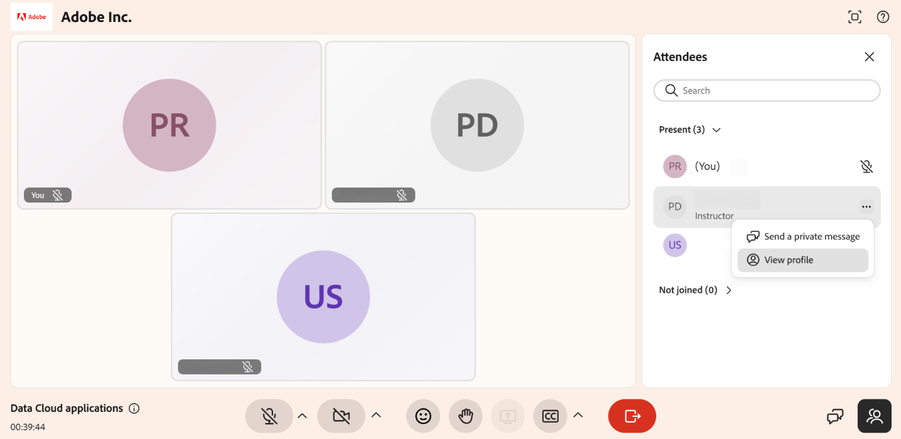

# 使用“与会者”面板作为学习者

作为学习者，您可以使用“与会者”面板查看实时中心会话中的其他人员，并根据讲师已启用的权限与他们进行交互。 在这些选项可用时，您可以查看其他与会者、检查参与者的详细信息并发送私人消息。 本指南介绍了如何打开“与会者”面板以及如何以学习者身份与其他与会者进行交互。

## 访问“与会者”面板

您可以使用“与会者”面板查看会话中的其他与会者，并根据讲师启用的权限与他们进行交互。

要打开面板，请从控制栏中选择。 该面板会列出会话中的所有人，因此您可以查看在场者。

## 与其他与会者互动

在&#x200B;**与会者**&#x200B;面板中，您可以根据讲师启用的权限与参与者进行交互。

要访问这些操作，请在面板中选择参与者姓名旁边的&#x200B;**更多选项(⋯)**&#x200B;图标。

*选择“更多选项”菜单以查看学习者的详细信息并私下向他们发送消息。*

学习者可以执行以下操作：

| **操作** | **描述** |
|----|----|
| **发送私人消息** | 打开与参与者的私人聊天。 |
| **查看个人资料** | 显示学习者的个人资料信息。 |
