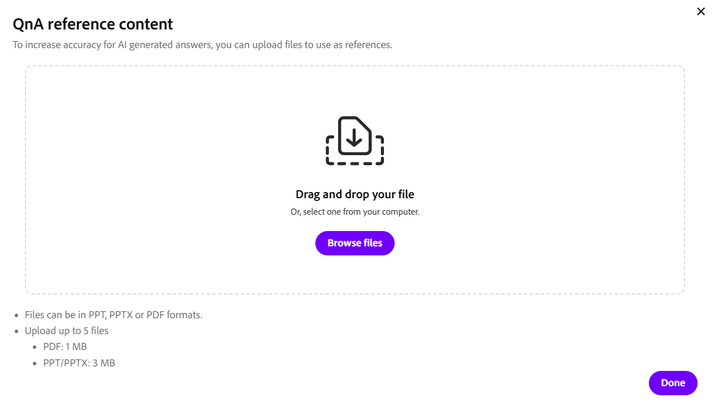

# 以讲师身份使用“聊天”面板

讲师可在聊天面板中管理实时中心会话期间的通信。 通过单个面板，您可以关注公开讨论、进行私人对话并查看AI从聊天中检测到的问题。 您还可以控制对话并通过AI帮助进行回复。

本文将逐步介绍讲师在“聊天”面板中可以执行的操作，从访问面板到管理消息和设置。

## 访问“聊天”面板

在会话期间，使用“聊天”面板管理对话、回复学习者以及监视问题。 该小组提供在一个位置进行公开、私人和基于问题的讨论的机会。

按照以下步骤访问“聊天”面板：

1. 加入Live Hub会话。

1. 从控制栏中选择。 聊天面板将打开，其中默认选择&#x200B;**所有人**&#x200B;选项卡，允许您开始或加入正在进行的对话。

1. 根据需要选择以下选项之一：

   1. 所有人

   1. 私人

   1. 问题

   
   *“聊天”面板将打开“所有人”选项卡，您可以在其中关注公开对话并切换到“私密”和“问题”选项卡。*

1. 键入您的消息并选择&#x200B;**发送**。

## 聊天面板设置

“聊天”面板提供了在会话期间管理对话和自定义聊天体验的选项。 您可以清除消息、控制通知并根据需要调整文本大小。

*聊天面板设置菜单。*

可以从“聊天”面板设置中找到以下选项：

| **选项** | **描述** |
|----|----|
| **清除所有聊天** | 从聊天面板中删除所有消息。 |
| **禁用聊天通知** | 关闭会话的聊天通知。 |
| **文本大小** | 调整聊天消息的大小，以提高可读性。 可用选项为&#x200B;**小**、**中**&#x200B;和&#x200B;**大**。 |

## 回复聊天消息

回复功能允许您直接回复特定邮件，有助于在讨论期间保持上下文并使对话更易于关注。

要在聊天中回复消息，请执行以下操作：

1. 将鼠标悬停在要响应的消息上。

1. 选择&#x200B;**回复**。

   
   *选择“回复邮件”以直接回复该邮件并保持对话上下文。*

1. 在消息输入字段中输入您的响应。

1. 选择&#x200B;**发送**。

回复会在您的回复旁显示原始消息的片段，帮助参与者了解对话的上下文。

### 对消息做出反应

您还可以在不键入回复的情况下对消息做出响应以快速确认或响应。 将鼠标悬停在消息上并选择反应。 所选反应会显示在消息下方，聊天中的其他参与者也可看到。

*消息下方会出现反应，聊天中的每个人都能看到。*

## 编辑聊天消息

您可以使用编辑消息功能在发送消息后对其进行更新，从而帮助您更正或完善您的响应。

编辑聊天中的消息：

1. 将鼠标悬停在要编辑的消息上。

1. 选择&#x200B;**“编辑”**。

   
   *选择“编辑”以更新您已发送的邮件。*

1. 更新输入字段中的消息。

1. 选择&#x200B;**保存**&#x200B;以应用更改，或者选择&#x200B;**取消**&#x200B;以放弃更改。

更新的消息将替换聊天中的原始消息，并标记为&#x200B;**已编辑**。

## 在聊天消息中提及参与者

通过“聊天”面板中的标记功能，可在会话期间直接向特定学习者添加地址。 使用标记可吸引人们对您的消息进行关注，并提高所提及学习者的可见性，在活动讨论期间尤其如此。

在聊天中提及学习者：

1. 在消息输入字段中，键入&#x200B;**@**。

1. 从列表中选择参与者的姓名。

   
   *键入@填充参与者列表，然后从列表中选择名称。*

1. 输入您的消息。

1. 选择&#x200B;**发送**。

加标签的学习者会收到通知，其姓名在消息中突出显示，以便更好地查看。

## 开始私人聊天

通过聊天面板中的&#x200B;**私人**&#x200B;选项卡，您可以在不中断公开讨论的情况下发送私人消息。 您可以开始新的聊天、继续现有对话或与特定学习者沟通。

要开始私人聊天，请执行以下操作：

1. 选择“**私有**”选项卡。 此时会显示参与者列表。

   
   *“私人”选项卡列出了参与者，因此您只能向讲师或单个学习者发送消息。*

1. 您可以执行以下操作：

   1. 选择列表顶部的&#x200B;**仅限讲师**&#x200B;以向其他讲师发送消息。 消息仅对讲师可见。

   1. 选择一个单独的学习者以开始私人对话。

1. 键入您的消息并选择&#x200B;**发送**。 消息仅对您和所选的参与者可见。

### 禁用学习者的私人聊天

默认情况下，学习者可以与其他参与者私下聊天。 作为讲师，您可以控制学习者在会话期间是否可以使用私人聊天。

要禁用学习者的私人聊天，请执行以下操作：

1. 打开&#x200B;**会议室设置**。

1. 选择&#x200B;**参与者权限**。

   
   *关闭“以参与者权限发送私人消息”功能，以防止学习者私下聊天。*

1. 禁用&#x200B;**发送私人消息**。

1. 选择&#x200B;**完成**。

禁用后，学习者将无法再开始或参与私人对话。

## 用AI起草对参与者问题的回复

**问题**&#x200B;选项卡可帮助讲师更高效地管理和回应学习者问题。 AI会自动检测聊天中的问题，并提供建议的响应以在会话期间协助讲师。

要生成AI辅助回复，请执行以下操作：

1. 导航到&#x200B;**问题**&#x200B;选项卡。

1. 将鼠标悬停在检测到的问题上。

1. 选择&#x200B;**使用AI绘制回复**。

   
   *选择使用AI的草稿回复以生成对检测到的问题的建议回复。*

1. （可选）查看和编辑建议的回复。

1. 选择&#x200B;**发送**。

将AI生成的回复添加到聊天中，并可在发送之前进行修改，以确保准确性和相关性。

>[!NOTE]
>如果上传的参考内容未涵盖该问题，则AI Assistant可能会指示一条错误消息，而不是生成答案。 有关详细信息，请参阅[实时中心疑难解答指南](../kb/troubleshooting-guide-for-live-hub.md#answer-generation-toast-issues)。

### 上传文件以获得更好的响应

还可上传参考文件以提高AI生成响应的准确性和相关性。

上传文件：

1. 导航到“聊天”面板的右上角。

   
   *打开“上传”内容引用以添加帮助AI生成更准确响应的文件。*

1. 选择&#x200B;**上载内容引用**。 出现&#x200B;**QnA引用内容**&#x200B;的弹出窗口。

1. 选择&#x200B;**浏览文件**。

   
   *在QnA引用内容窗口中选择“浏览文件”以上传系统中的引用文件。*

1. 从系统上传文件。

AI使用上传的内容在&#x200B;**所有人**&#x200B;选项卡中生成更准确、更相关的问题答案。

>[!NOTE]
>如果上传失败或文件被拒绝，请参阅[Live Hub疑难解答指南](../kb/troubleshooting-guide-for-live-hub.md#upload-content-issues)，以了解常见错误消息的列表以及如何解决它们。

## 删除邮件

使用“删除消息”选项，您可以从聊天中删除消息，以集中讨论并提升相关程度。 您可以删除自己的与主题无关或破坏讨论的邮件。

*删除您自己的消息以保持讨论的重点和相关性。*
