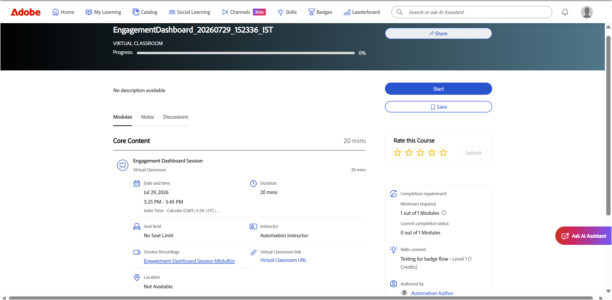

# 以学习者身份查看会话录制

实时中心会话结束后，可在课程页面上找到录制。 作为学习者，您可以观看录制、浏览AI生成的主题以导航到特定部分以及查看视频旁边的时间戳转录文本。

## 访问会话录制

会话录制可从课程页面上的&#x200B;**会话录制**&#x200B;部分获取。 录制链接通常在计划会话结束时间后&#x200B;**四十**&#x200B;分钟左右可用。 如果在处理完成之前访问课程页面，则不会显示录制链接。

>[!NOTE]
>
>讲师录制会话时，只有主会话会包含在录制中。 当参与者进入临时会议室时，录制会自动暂停，当每个人都返回主会话时，录制会恢复。 因此，不会记录临时会议室活动。

要访问录制内容，请执行以下操作：

1. 打开会话的课程页面。

1. 选择“**模块**”选项卡。 此时会显示课程详细信息页面。

   
   *课程页面上的会话录制*。

1. 导航到&#x200B;**会话录制**&#x200B;部分。

1. 选择录制链接。 录制内容会在新的浏览器选项卡中打开。

   
   *录制播放器处于播放模式，显示会话视频和转录文本面板。*

1. 使用以下播放控件调整观看体验：

| **控件** | **描述** |
|----|----|
| **播放/暂停** | 开始或暂停播放。 |
| **卷** | 调整音频音量。 |
| **进度栏** | 移动到录制中的特定点。 已用时间和总持续时间显示在控件旁边。 |
| **播放速度** | 更改播放速度。 可用选项为&#x200B;**0.25x**、**0.5x**、**0.75x**、**1x**、**1.25x**、**1.5x**&#x200B;和&#x200B;**2x**。 |
| **隐藏式字幕(CC)** | 打开或关闭字幕。 选择&#x200B;**CC**&#x200B;旁边的箭头以选择字幕样式和字体大小。 |
| **全屏** | 以全屏模式查看录音。 |

## 在录制中查看主题

AI生成的主题可突出显示关键讨论区域并让您直接跳转到相关部分，从而更轻松地查看录制的内容。

对于&#x200B;**三十**&#x200B;分钟或更长的录制，Live Hub会自动生成AI支持的主题，以将会话分为有意义的部分。

>[!NOTE]
>
> 只有当帐户启用了AI生成的主题，并且讲师尚未在会话中禁用这些主题时，这些主题才可用。

要查看和导航主题，请执行以下操作：

1. 在&#x200B;**主题**&#x200B;面板中，浏览主题列表，或使用&#x200B;**搜索**&#x200B;框使用关键字查找主题。

1. 选择一个主题以将其展开，并查看其摘要、详细信息和总持续时间。

1. 选择&#x200B;**播放主题**。 录制内容将从选定的主题部分开始播放。

   
   *主题面板，其中AI生成的主题可帮助您导航录制。*

## 查看转录文本

转录文本提供带有时间戳的会话文本版本，您可以在录制旁阅读该版本。 每个条目都包含说话者的姓名和说话文本的时间。

要查看成绩单，请执行以下操作：

1. 从播放器右侧的面板切换菜单中选择&#x200B;**转录文本**&#x200B;图标。 **转录文本**&#x200B;面板将打开，并显示带有时间戳的转录文本。

1. （可选）使用&#x200B;**搜索**&#x200B;框查找转录文本中的特定单词或短语。

要导航到录制的特定部分，请选择转录文本条目。 录制将跳转到相应的时间戳，并从该点开始回放。

*转录文本面板，其中每个条目链接到其录制中的点。*

### 更改转录文本大小

您可以调整转录文本的大小，以使其更易于阅读。

要更改文本大小，请执行以下操作：

1. 在&#x200B;**转录文本**&#x200B;面板中，选择&#x200B;**转录文本**&#x200B;标题旁边的&#x200B;**文本大小**&#x200B;图标。

1. 从列表中选择文本大小。 可用大小为12、14、16、18、20、24、30和36。 默认大小为14。 转录文本将更新为所选大小。

   
   *选择转录文本大小以使条目更易于阅读。*
