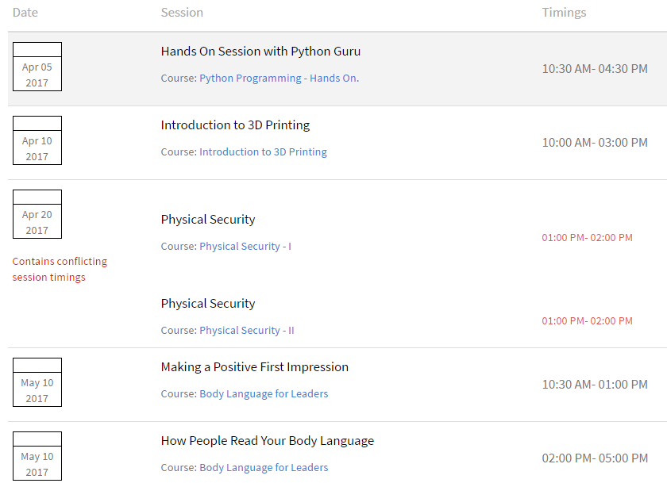
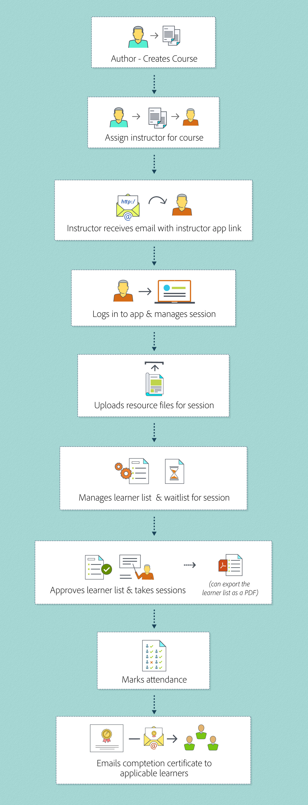

# 面向讲师的 Adobe Learning Manager 入门指南

阅读本文，了解如何以讲师身份快速入门 Adobe Learning Manager。

## 以讲师身份登录 {#loginasaninstructor}

作者将您添加为课程中某个模块的讲师时，您用于注册的电子邮箱地址中会收到一封电子邮件。 该电子邮件包含指向讲师应用程序的链接。 单击链接可转至 Adobe Learning Manager 登录页面。

1. 登录到 Adobe Learning Manager。

   屏幕显示讲师应用程序主页。 您可以查看近期会话的详细信息。

   

   *查看讲师应用程序主页*

管理员还可以在为课程实例添加会话数据时将用户作为作者添加到模块中。

## 以讲师身份管理模块 {#managingmodulesasaninstructor}

请参阅下图，了解 Adobe Learning Manager 中讲师的工作流程：

*讲师的工作流程*
