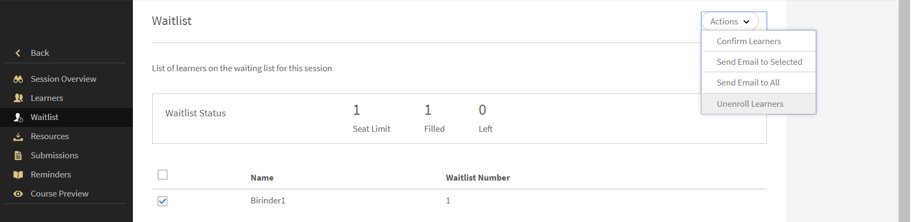
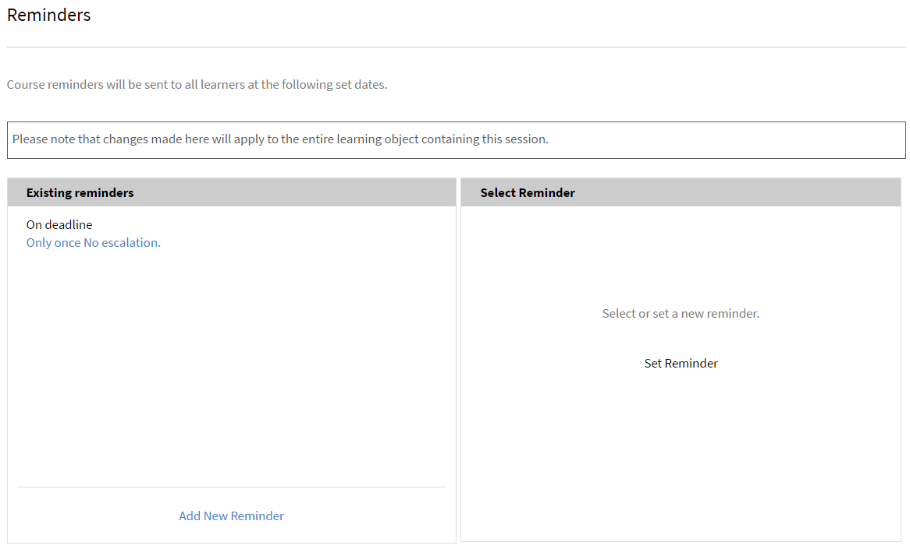

# 管理会话的学习者

阅读本文可了解如何管理与会者、为会话发送课程相关的电子邮件和提醒。

## 查看包含待处理审核的会话或模块 {#pending}

作为讲师，您可以看到包含待处理审核的会话或模块。

在“会话/模块”页面上，您可以看到一个&#x200B;**待处理审核**&#x200B;列，其中显示相应会话/活动的待处理审核数。

## 管理会话的轮候表 {#managewaitlistforyoursession}

作为模块的学习者注册方，您可以从轮候表页面中查看注册和轮候表的最新状态。

1. 在讲师应用程序的左侧导航窗格中，选择“近期会话 > 轮候表”。

   您可以查看名额限制、当前已占用的名额数以及空余名额数。 另有一张表列出了已在轮候的学习者。 如果没有轮候队列，则此表为空。

   
   *查看轮候学习者*

1. 在轮候表中，选择要确认的学习者。
1. 选择“操作 > 确认学习者”。

   您确认的学习者会添加到“已确认学习者”列表中。

讲师可以从会话中取消注册学习者。 这也会将他们从相应的学习中取消注册。 选择&#x200B;**[!UICONTROL 轮候表]**&#x200B;选项卡。 使用复选框选择要取消注册的学习者。 要取消注册，请选择&#x200B;**[!UICONTROL 操作]** > **[!UICONTROL 取消注册学习者]**。

*取消注册学习者*

### 轮候表报告

Adobe Learning Manager的新&#x200B;**[!UICONTROL 轮候表报告]**&#x200B;允许讲师下载课程所有实例的轮候学习者列表。 讲师可以从&#x200B;**[!UICONTROL 会话概述]**&#x200B;页面上的&#x200B;**[!UICONTROL 轮候表]**&#x200B;部分访问此报告。

下面是“轮候表”报告中可用的列：

* 课程名称
* 实例名称
* 实例 ID
* 实例状态
* 用户名
* 电子邮件
* 用户唯一 ID
* 注册日期 (UTC 时区)
* 状态
* 轮候编号
* 轮候表限制
* 名额限制

要从讲师部分下载报告，请执行以下操作：

1. 以&#x200B;**[!UICONTROL 讲师]**&#x200B;身份登录。
2. 从主页选择任何会话。
3. 在&#x200B;**[!UICONTROL 会话概述]**&#x200B;页面中选择&#x200B;**[!UICONTROL 轮候表]**&#x200B;选项。
4. 选择&#x200B;**[!UICONTROL 操作]** > **[!UICONTROL 导出报告]**&#x200B;以下载&#x200B;**[!UICONTROL 轮候表]**&#x200B;报告。

## 标记会话的出席情况 {#markattendanceforyoursession}

您可以查看确认参加会话的学习者数量、他们的姓名、学习者出席情况以及学习者页面中的其他详细信息。

1. 在左侧导航窗格中，单击“近期会话 > 学习者”。
1. 从与会者列表中选择学习者，然后执行以下任一操作：

   * 若要标记出席情况，请单击“操作 > 标记出席情况”。 如果状态被标记为“已参加”，则无法再进行更改。
   * 若要标记缺席情况，请单击“操作 > 未参加”。
   * 若要因取消订阅或其他原因删除学习者，请单击“操作”>“删除学习者”。

   除非出席状态显示为“已参加”，否则学习者无法完成模块。

   
   *标记学习者出席情况*

### 下载用于学习者注册和出勤的二维码

讲师可以下载所分配会话的二维码，以便学习者注册课程实例，并通过扫描二维码来标记出勤或完成情况。

这样，讲师可以独立管理会话参与，而无需管理员帮助。

以下步骤适用于两者：

* 物理教室授课
* 在线教室授课

对于物理教室会话，作为讲师，您必须生成正确的二维码并将其粘贴到学习者参加会话的课堂（或传阅），以便学习者可以扫描二维码并标记注册和/或出勤情况（取决于二维码）。

对于在线教室会话，讲师可通过邮件、消息系统或其他任何方式发送生成的二维码，以便学习者扫描二维码并标记注册和/或出席情况，具体取决于二维码。

#### 下载会话的二维码

1. 使用&#x200B;**讲师**&#x200B;角色登录Adobe Learning Manager。
2. 转到&#x200B;**讲师信息板**。
3. 打开相关的&#x200B;**课程实例**。
4. 选择“**会话**”选项卡。
5. 选择分配给您的会话。
6. 选择&#x200B;**会话QR代码**。
   

您可以下载以下QR代码：

* **注册二维码** — 允许学习者注册课程实例
* **出席二维码** — 标记会话的出席情况
* **注册+出席二维码** — 注册单个扫描中的学习者并标记出席情况

二维码将以PDF形式下载，并且可以在会话期间以数字方式共享或显示。

#### 学习者扫描二维码时会发生什么

* 学习者使用移动设备扫描二维码。
* Adobe Learning Manager会验证学习者和会话。
* 基于QR代码类型：
   * 学习者已注册课程实例，或者
   * 届会的出席及完成情况均会予以记录

所有更新都会自动反映在学习者记录、成绩单和报告中。

#### 备注

* 二维码仅适用于分配给会话的讲师。
* 为课程和会话配置的注册、出勤和完成规则将继续适用。
* 现有学习者进度和报告工作流程保持不变。

#### 用例

* 如果组织有大量现场会话（例如，对专业人员的产品培训），讲师则可以打印特定于会话的二维码，以便通过一次扫描注册和标记出勤情况。

* 在零售、制造业和医疗保健培训中，学习者通常直接从教室参加会议，或不预先注册，可以在门口放置“注册+出席”二维码。 如此一来，学习者就可以通过手机自助服务注册和出席情况。

* 通过合作伙伴或客户的培训活动，现场培训师可以轻松适应会议室、其他会议或其他与会者的变化，而无需咨询管理员获取新的二维码。

### 日历邀请

* 当学习者或讲师注册教室或虚拟教室会话时，Learning Manager会发送日历邀请（ICS文件）。
* 日历邀请包括：
   * 会话日期和时间
   * 会话详细信息
   * 日历描述中的&#x200B;**直接会话加入链接**

参与者可以打开日历事件并直接从他们的日历加入会话。

#### 从Gmail加入会话

1. 打开&#x200B;**Google日历**。
2. 选择会话事件。
3. 在事件详细信息中，单击&#x200B;**会话加入链接**。
4. 会话直接在Adobe Learning Manager或配置的虚拟教室工具中打开。

您无需打开原始电子邮件即可访问会话链接。

#### 从其他日历客户端加入会话

会话链接包含在日历事件正文中，可从以下位置访问：

* Microsoft Outlook
* Apple日历
* 支持ICS文件的其他日历应用程序

#### 备注

* 日历邀请由Learning Manager自动生成。
* 日历邀请中的时区信息会根据学习者选择的时区进行调整。
* 此增强功能适用于新生成的日历邀请。
* 管理员或讲师无需进行其他配置。

## 标记学习者成功次数

讲师可以直接从“学习者”页面将每个学习者的成功状态标记为通过或失败。 此功能可让讲师根据学习者表现准确记录教室或虚拟教室授课的结果。

要标记学习者的学习成功，请执行以下操作：

1. 以讲师身份登录Adobe Learning Manager。
2. 在左侧导航窗格中选择&#x200B;**[!UICONTROL 即将开始的会话]**。
3. 选择&#x200B;**[!UICONTROL 学习者]**。
4. 选择学习者，然后选择&#x200B;**[!UICONTROL 操作]**。
5. 选择以下任一选项以标记选定学习者的学习成功：

   * **[!UICONTROL 标记为已出席和通过]**：标记为通过的学习者已成功完成模块。
   * **[!UICONTROL 标记为已参加和未通过]**：标记为失败的学习者已完成模块，但未通过。

   
   _显示“操作”菜单的学习者页面，其中突出显示了“标记已参加”和“通过”以及“标记已参加”和“失败”选项，用于记录学习者结果_

6. 在确认提示中选择&#x200B;**[!UICONTROL 是]**。

## 向学习者发送电子邮件 {#sendemailstolearners}

您可以向会话的特定或全体与会者发送电子邮件。 如果您想要确认学习者的出席情况，或者想要发送有关会话的消息，那么“发送电子邮件”功能非常有用。 您也可以使用“发送至全体”选项通过电子邮件发送作业和会话材料，或与全体学习者进行常规通信。

若要向学习者发送电子邮件，可从讲师应用程序的“学习者”页面中，执行以下任一操作：

* 若要向特定与会者发送电子邮件，请选择与会者并单击“操作 > 向选定对象发送电子邮件”。
* 若要通过电子邮件向全体与会者发送课程材料或作业，请单击“操作 > 发送至全体”。

## 捕获邀请响应

只有在ACAP管理员启用了&#x200B;**[!UICONTROL 邀请回复]**&#x200B;选项时，讲师才能捕获学习者的邀请响应。 要启用此功能，管理员需要通过[learningmanagersupport@adobe.com](mailto:learningmanagersupport@adobe.com)联系支持团队。

完成后，您可以在&#x200B;**[!UICONTROL 学习者]**&#x200B;部分中查看邀请响应。 转到任何会话，选择&#x200B;**[!UICONTROL 学习者]**，然后从下拉菜单中选择邀请响应。

## 导出学习者列表 {#exportinglearnerslist}

作为讲师，您可以通过将与会者列表导出为 pdf，轻松标记所有学习者的出勤情况。 要导出与会者列表，在左窗格中单击“学习者”。 单击“操作” > “导出学习者列表 (PDF)”。

在确认会话的与会者列表后，您可以将列表导出为 PDF。 此易于打印的 pdf 以表格形式显示学习者。 然后，您可以在此 PDF 中为学习者标记出勤情况、提供分数或者创建或提供备注。

注意此 PDF 右上角的一个二维码。 此功能允许每个学习者使用 Adobe Learning Manager 手机应用扫描该二维码以打卡出勤。

*扫描QR代码以标记与会者*

## 批准或拒绝提交内容 {#approveorrejectsubmissions}

如果学习者上传了文档（例如作业、报告或会话评估），您可以在“提交内容”页面中查看文档。 您可以使用这些材料对学习者进行定级，从而批准或拒绝提交内容。

1. 在左侧窗格中，根据会话的具体安排，单击“近期会话”或“过往会话”。
1. 单击要查看其提交内容的课程。

   在左侧窗格中，单击“提交内容”。

1. 您就可以查看学习者为您所选会话提交的内容。 选择要批准或拒绝的提交内容，然后单击“批准”或“拒绝”。

   根据您的操作，提交内容状态会更改为“已批准”或“已拒绝”。

## 配置会话的提醒 {#configureremindersforyoursession}

1. 在左侧窗格中，单击“近期会话”。
1. 单击要为其设置提醒的课程。 在左侧窗格中，单击“提醒”。
1. 在“选择提醒”磁贴中，单击“设置提醒”。

   
   *为您的会话配置提醒*

1. 执行以下操作：

   * 在“提醒设置”对话框中，选择要何时向学习者发送提醒：截止日期前、截止日期当天或截止日期后。
   * 在“截止日期前天数”字段中，设置要在截止日期前的几天向学习者发送提醒。
   * 设置提醒的重复情况。

   
   *查看提醒设置*

1. 执行以下任一操作：

   * 单击勾号以保存提醒。
   * 单击叉号以取消提醒。

   在提醒设置中设置的日期当天，会向所有学习者自动发送课程提醒。

   如果您已为会话设置提醒，则可在“现有提醒”磁贴下进行查看。 此外，您还可为现有提醒添加附加提醒。

   若要删除现有提醒，请单击该提醒。 从显示的弹出菜单中，单击&quot;删除&quot;图标（垃圾桶图标）以删除提醒。
