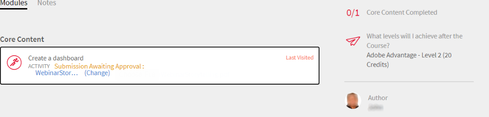

# 模块

阅读本文，了解如何在Learning Manager中以讲师身份管理模块。

## 查看会话概述 {#viewsessionoverview}

1. 在左侧窗格中，单击“即将开始的会话”。
1. 从即将开始的会话列表中，选择要查看其详细信息的会话。

   该应用程序会显示会话概述，其中包含会话名称、地点、计时、注册限制、轮候表限制等详细信息。

   
   *查看即将开始的会话*

## 配置会话详细信息 {#configuresessiondetails}

1. 在左侧窗格中，单击“即将开始的会话”。
1. 选择要更新的会话。
1. 单击右上角的“编辑” 。

   
   *配置会话详细信息*

1. 在“会话概述”页面中，您可以编辑会话时序、日期、地点等。 您还可以编辑或添加以下会话详细信息：

   * 指定“注册限制”以设置会话允许的最大学习者数。
   * 如果要设置会话允许轮候表上的最大学习者数，请指定轮候表限制。
   * 在“允许提交”字段中，选择“是”以允许学习者提交作业。 如果选择“否”，学习者将无法上载会话提交的分配。

   
   *编辑会话详细信息*

1. 单击“保存”。

   不能在此页面中编辑“讲师”字段。

## 上传会话的资源文件 {#uploadresourcefilesforyoursession}

讲师可以上传资源文件（如模块的任务文件或演示文稿）或模块的活动文件。 使用“资源”菜单为模块或会话添加资源文件。

1. 在讲师应用程序中，单击“近期会话”>“资源”。

   您可以查看“资源”页面，该页面已有一个链接，可用于访问作者可能已上传的与您模块关联的课程相关的资源。 此外，讲师还可以上传模块的资源文件。

1. 单击“添加”。

   
   *为会话添加资源*

1. 浏览到计算机中的相应文件。 选择文件，然后单击“打开”。
1. 上传文件后，您可以看到文件以及添加日期。

   注册此模块的学习者在上传文件后即可在“课程”下的“资源”部分看到您的文件。

   要删除资源文件，请选择要删除的一个或多个文件。 在“资源”页面中单击“操作”>“删除文件”。

## 活动模块的文件提交 {#filesubmissionforactivitymodules}

活动模块支持文件提交工作流程。 作为作者，需要创建一个活动模块并选择  **[!UICONTROL 文件提交]** 选项。 如此一来，学习者就可以提交文件。

模块讲师可以批准/拒绝这些文件。 只有在讲师批准提交内容后，模块才能完成。

 
*批准或拒绝文件*

## 评估清单模块 {#evaluate-checklist-module}

学习者参加课程后，讲师会在 **模块**&#x200B;部分。 此页面包含所有活动清单模块以及需要审阅的活动提交模块。 对于每个模块，系统都会为评估对象显示学习者数量。

在下面的页面中，您可以查看模块类型 **提交** 和 **清单**. 对于本示例，我们将使用“清单”模块。

*查看模块列表*

单击“清单”模块。 在 **清单** 页面，您将看到以下内容：

* 模块名称
* 课程名称
* 课程所属的实例
* 通过作者设定的标准
* 清单问题数

*查看清单页面*

如要评估学习者，请单击 **[!UICONTROL 评估]** 在 **[!UICONTROL 清单]** 列。 您还可看到审阅的状态为 **待处理**.

评估学习者并单击 **[!UICONTROL 提交]**. 作为讲师，您必须回答所有评估问题。

*评估核对表*

根据通过标准，“状态”将为“失败”或“通过”。

清单一经评估，便无法重新评估。

讲师还可以查看模块中其他讲师提交的回复。

您可以根据应用的搜索过滤器，将学习者导出为csv。

讲师使用清单评估课程后，学习者会看到模块状态为 **通过** 和课程状态 **已完成**，或者模块状态为 **失败**，课程状态为 **已完成**.

## 针对拒绝活动的讲师评论 {#rejection-comments}

学习者可以在请求拒绝的通知中看到讲师的评论。 然后，学习者可以通过以评论的形式提供更多信息，以重新提交。

工作流程如下：

1. 作者使用活动模块创建课程，指定讲师，然后发布课程。

1. 学习者使用课程，并在完成课程后提交完成证明。

   
   *提交完成证明*

1. 讲师随后选择分配给自己的活动模块。 在模块的“提交”页面中，讲师单击 **编辑**. 然后学习者可以输入注释以供拒绝，并启用“显示注释”选项，以便学习者可以在通知中查看注释。

   
   *输入完成备注*

1. 讲师可以点击 **拒绝**. 提交状态更改为 **标记为拒绝**.

   
   *拒绝提交*

1. 提交后，状态更改为 **被拒绝**.

   
   *查看拒绝状态*

1. 学习者现在会看到一条通知，告知其提交内容已被拒绝。 讲师的评论也会出现在通知中。

   
   *接收拒绝通知*

为了适应这些更改，Adobe已更新以下项的电子邮件模板 **提交被拒绝**.

## 为活动模块添加分数和评论 {#addscoresandcommentsforactivitymodules}

要为已发送以供提交的活动模块添加分数和评论，请执行以下步骤：

1. 在左侧窗格中，单击 **[!UICONTROL 学习者]**.

   
   *选择学习者*

1. 在学习者页面中，单击 **[!UICONTROL 动作]** > **[!UICONTROL 编辑分数和评论]**.

   
   *添加注释*

   对于尚未完成课程的学习者，系统不会显示“分数和评论”输入字段。

   
   *编辑分数和评论*

1. 点击 **[!UICONTROL 保存]**.
