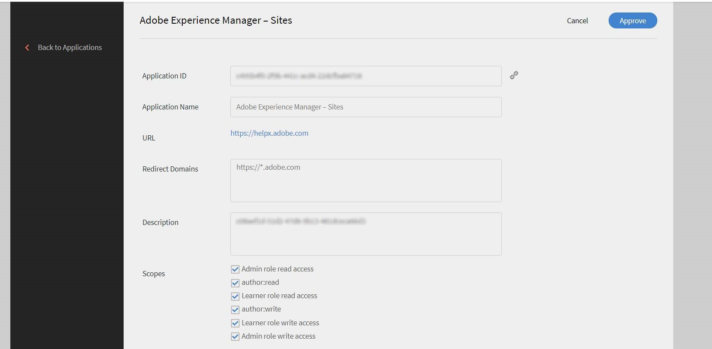

# 将 Adobe Learning Manager 与 AEM 集成

Learning Manager是学习管理系统，具有内置的学习内容管理系统。 用户通过将学习内容上传至 Adobe Learning Manager 来对其进行管理，以便 Adobe Learning Manager 执行版本控制、将学习内容分配至相应课程、定义对学习者的可见性、跟踪使用情况并向管理员报告。

但也有些用户在资产管理系统上存储和管理内容， 然后将内容重新用于各种其他功能。

学习者应用程序中的各种内容条均可嵌入 AEM 站点。 任何登录 AEM 站点的学习者均可在这些内容条中查看其特定的培训数据。

## 下载内容包 {#downloadthecontentpackage}

安装程序以 AEM 内容包的形式提供。 [***下载包***](https://github.com/adobe/adobe-learning-manager-reference-site)。

内容包可以为压缩文件，且与AEM 6.4和AEM 6.5兼容。

## 安装 Adobe Learning Manager 组件 {#installcaptivateprimecomponent}

使用 AEM Package Manager 安装 Adobe Learning Manager 内容包：

>[!NOTE]
>
>有关安装包的信息，请参阅&#x200B;[***如何使用包***](https://experienceleague.adobe.com/docs/experience-manager-65/administering/contentmanagement/package-manager.html?lang=en#how-to-work-with-packages)。

1. 以 AEM 作者示例打开 AEM Package Manager。
1. 单击&#x200B;**[!UICONTROL “上传程序包”]**&#x200B;按钮。
1. 单击&#x200B;**[!UICONTROL 浏览]**&#x200B;并上传内容包。
1. 单击&#x200B;**[!UICONTROL “上传”]**。
1. 上传程序包后，选择内容包并单击&#x200B;**[!UICONTROL “安装”]**&#x200B;以安装内容包。

   

   *安装内容包*

## 生成刷新令牌 {#generatetherefreshtoken}

AEM 管理员需要 Adobe Learning Manager 帐户提供的刷新令牌。Learning Manager集成管理员将生成刷新令牌。

1. 审批 AEM 站点特色应用程序。

   单击&#x200B;**[!UICONTROL 应用程序]** > **[!UICONTROL 特色应用程序]** > **[!UICONTROL Adobe Experience Manager — 站点]**。

   

   *批准应用程序*

1. 单击&#x200B;**[!UICONTROL 应用程序]** > **[!UICONTROL 特色应用程序]**，然后打开AEM站点应用程序。

   复制应用程序 ID 和描述。

1. 单击&#x200B;**[!UICONTROL 开发人员资源]** > **[!UICONTROL 访问令牌]**。

   

   *生成访问令牌*

1. 输入以下详细信息：

   * 客户端 ID，即应用程序 ID。
   * 客户端密钥，在“描述”中提供。

1. 获取OAuth代码。 必须在重定向 URI 中使用 v2 API。
1. 单击&#x200B;**[!UICONTROL 提交]**&#x200B;以获取刷新令牌。

## 在 AEM 中配置小组件 {#configurethewidgetinaem}

对于小组件配置，AEM作者仅需要Learning Manager集成管理员提供的刷新令牌。

您还可在多个页面中设置多个帐户配置。

1. 单击&#x200B;**[!UICONTROL 工具]** > **[!UICONTROL Cloud Service]** > **[!UICONTROL Learning Manager小组件配置]**。
1. 单击&#x200B;**[!UICONTROL 创建]**。
1. 在此处输入刷新令牌。 进行其他设置。
1. 对于欧盟地区，主机名应更改为“learningmanagereu”。
1. 保存并关闭配置。
1. 选择并发布配置。

## AEM 作者 {#aemauthor}

AEM 作者必须首先在 AEM 模板中添加组件

然后，AEM 作者将能够拖放 Adobe Learning Manager 组件并进行相应配置。

Learning Manager组件要求在上一步中创建的配置映射到该页面。  作者可以在&#x200B;**[!UICONTROL 高级]** > **[!UICONTROL 配置]** > **[!UICONTROL 云配置]**&#x200B;下编辑页面属性来映射配置，并提供配置路径。 通过这种方式，作者可以为多个 Adobe Learning Manager 帐户创建配置，并将每个帐户映射到不同的站点页面。如果配置未映射到该页面，则组件将以递归方式从父页面读取配置，直至找到配置。

## 学习者无法注册此类课程。 {#learner}

学习者可以在页面中学习课程。

为能够访问 Adobe Learning Manager 小组件，学习者应是已登录的 AEM 用户。此外，属性&#x200B;**email**&#x200B;应存在于学习者的rep：User节点的“/profile”节点中。 此电子邮件应与 Adobe Learning Manager 帐户中的电子邮件完全相同。

学习者可以在页面中学习课程。

课程进度也会得以保存。

提供以下小组件：

1. 游戏
1. 学习日历
1. 社交小组件
1. 目录小组件
1. 我的学习
1. 根据同事的学习内容作出推荐
1. 由管理员推荐
1. 根据学习者的兴趣作出推荐

若无推荐，则该小组件显示为空白。

## 支持 Skyline

Skyline是AEM的云版本。 必须首先从包管理器安装Skyline。 要在AEM中使用Skyline组件，Learning Manager帐户中必须存在用户。 换句话说，用户的电子邮件地址必须存在于帐户中。

### 部署 Skyline

[GitHub报告](https://github.com/adobe/captivate-prime-aem-components)中提到了配置Skyline的步骤。

## “我的学习”小部件

通过&#x200B;**[!UICONTROL “我的学习”]**&#x200B;小组件，您可以向用户显示来自特定目录或一组目录的培训。

在页面属性的&#x200B;**[!UICONTROL 属性]**&#x200B;部分中，从列出的选项中选择&#x200B;**[!UICONTROL 目录]**。

<!---->

目录选项包含以下选项：

* **[!UICONTROL 目录ID]：**&#x200B;需要显示培训的目录ID，以逗号分隔。
* **[!UICONTROL 排序]：**&#x200B;培训的排序顺序。 选项有名称、日期、创建日期、注册日期等。
* **[!UICONTROL 学习者状态]：**&#x200B;返回所有符合以下筛选条件的培训：已注册、已开始、已完成和未注册。 如果排序选项为dateEnrolled、dueDate或dateEnrolled，则不会显示搜索结果。
* **[!UICONTROL 技能名称]：**&#x200B;用于筛选具体训练的技能。
* **[!UICONTROL 标记名称]：**&#x200B;用于筛选具体结果的标记。

以下是一些可以自定义的附加组件：

**[!UICONTROL 学习对象类型]：**&#x200B;根据学习对象的类型进行筛选。 支持的类型包括课程、认证、工作辅助和学习计划。

在AEM中，内容条中卡片的标题最初为空。 在“属性”中，输入widgets.html中的标题名称。

**自定义**

您可以使用widgets.html自定义布局的外观。 您可以更改显示的内容条卡的外观并自定义主题。

在&#x200B;**[!UICONTROL 常规设置]**&#x200B;部分中，您可以选择内容条卡的主色和副色，并指定用于自定义主题的属性。

```
{ 
 "globalCssText":"@import url('https://fonts.googleapis.com/css2?family=Grandstander:ital,wght@0,100;0,200;0,300;0,400;0,500;0,600;0,700;0,800;0,900;1,100;1,200;1,300;1,400;1,500;1,600;1,700;1,800;1,900&family=Montserrat:ital,wght@0,100;0,200;0,300;0,400;0,500;0,600;0,700;0,800;0,900;1,100;1,200;1,300;1,400;1,500;1,600;1,700;1,800;1,900&display=swap');", 
 "fontNames":"Grandstander", 
 "cardLayout":{ 
 "cardLayoutName":"compact", 
 "cardPrimaryColor":"#376BA4", 
 "cardSecondaryColor":"#F98EB0", 
 "startedStateTextColor":"#ffffff", 
 "continueStateTextColor":"#ffffff", 
 "revisitStateTextColor":"#ffffff", 
 "startedStateColor":"#a0a0a0", 
 "continueStateColor":"#f9a122", 
 "revisitedStateColor":"#7fbc64", 
 "textPrimaryColor":"#ffffff", 
 "textSecondaryColor":"#d93f3f", 
 "navIconColor":"#a0a0a0" 
 } 
}
```

### 忽略高阶学习对象注册

如果已启用&#x200B;**“忽略高阶学习对象注册”**&#x200B;复选框，并且用户直接注册了学习计划或认证，那么在小组件中，该认证或学习计划的课程会呈现给用户。

如果禁用此复选框，则用户尚未直接注册的学习计划或认证中的课程将不会显示。


*选中“忽略高阶学习对象注册”复选框。

然后将该设置应用到小组件。

### 安全性

已添加“客户端 ID”和“客户端密钥”字段。此外，刷新令牌将被屏蔽。在用户创建整个配置后，如果用户再次打开配置进行编辑，或者其他用户打开此配置，则刷新令牌将被屏蔽。
