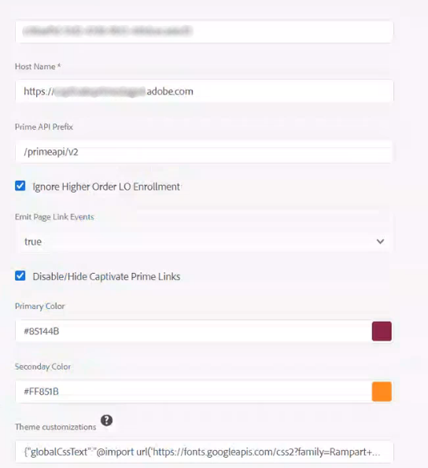

# 将Adobe Learning Manager与AEM集成

Adobe Learning Manager (ALM) 与 Adobe Experience Manager (AEM) 站点集成。 如此一来，您就可以为 Adobe Learning Manager 创建自己的网站和响应式移动界面，并且只需进行最少的编码工作。 通过此集成，您可以为用户创建自定义学习体验。

为了构建此类体验，ALM 以 ZIP 文件的形式为 AEM 站点提供了一个 Adobe Learning Manager 参考站点包（ALM 参考站点包），您可以将其安装在 AEM 站点实例上。

该站点包中包含 AEM 站点网页模板和网站组件以及嵌入式小组件，例如学习目录、嵌入式小组件、日历等。

安装 ALM 参考站点包之后，即可开始为 Adobe Learning Manager 构建网站，并将其托管在 AEM 站点实例上。 然后，您的用户就可以将组件拖放到网站上。

>[!IMPORTANT]
>
>适用于AEM Sites的Adobe Learning Manager (ALM)包为实施提供了快速启动代码块。 此包专为无头部署而设计。 提供的代码库实施后，按照基于Adobe Learning Manager的无头应用程序的标准做法，由实施方负责持续维护和进一步开发。

## 安装 ALM 参考站点包

### 先决条件

* AEM 站点和 Adobe Commerce 的许可证。
* AEM本地版6.5或Adobe Experience Manager -Cloud Service
* Adobe Commerce 2.4.3

在保证 AEM 站点的环境安全后，必须安装 ALM 参考站点包。 此站点包中包含 AEM 网页和网站组件，可帮助您构建学习平台。

引用站点包托管在&#x200B;[**GitHub存储库**](https://github.com/adobe/adobe-learning-manager-reference-site/releases/tag/1.0.0)上。

有关更多信息，请参阅说明文件。

## 下载内容包 {#downloadthecontentpackage}

安装程序以 AEM 内容包的形式提供。 [***下载包***](https://github.com/adobe/adobe-learning-manager-reference-site)。

内容包可以为压缩文件，且与AEM 6.4和AEM 6.5兼容。

## 安装 Adobe Learning Manager 组件 {#installcaptivateprimecomponent}

使用 AEM Package Manager 安装 Adobe Learning Manager 内容包：

>[!NOTE]
>
>有关安装包的信息，请参阅&#x200B;[***如何使用包***](https://experienceleague.adobe.com/docs/experience-manager-65/administering/contentmanagement/package-manager.html?lang=en#how-to-work-with-packages)。

1. 以 AEM 作者示例打开 AEM Package Manager。
1. 单击&#x200B;**[!UICONTROL “上传程序包”]**&#x200B;按钮。
1. 单击&#x200B;**[!UICONTROL 浏览]**&#x200B;并上传内容包。
1. 单击&#x200B;**[!UICONTROL “上传”]**。
1. 上传程序包后，选择内容包并单击&#x200B;**[!UICONTROL “安装”]**&#x200B;以安装内容包。

   

   *安装内容包*

## 在[!DNL Adobe Learning Manager]中创建应用程序

安装 AEM 站点包后，必须配置 ALM 应用程序将学习门户与 AEM 站点连接。

此方案适用于AEM与[!DNL Adobe Learning Manager]一起使用时的情形。

请按以下步骤操作：

1. 以集成管理员身份单击&#x200B;**[!UICONTROL “应用程序”]**。
1. 要创建新应用程序，在页面右上角，单击&#x200B;**[!UICONTROL “注册”]**。
1. 在“注册新应用程序”界面中，输入以下详细信息：

   1. 应用程序名称：正在创建的应用程序的名称。
   1. URL：组织的 URL。
   1. 重定向域：AEM 网站的托管域。 您还可以指定通配符。
   1. 描述：应用程序的描述。
   1. 范围：选择“学习者”角色的读取访问权限和“学习者”角色的写入权限。
   1. 是否仅针对此帐户：如果要将应用程序用于现有 ALM 帐户，请选择“是”。

1. 完成更改后，单击“保存”。

请注意遮挡屏幕中的应用程序凭据。


*应用程序凭据*

要批准应用程序，请单击&#x200B;**[!UICONTROL “批准”]**。

## 获取令牌

1. 在“开发人员资源”选项卡中，单击&#x200B;**[!UICONTROL 用于测试和开发的访问令牌]**。

   

   *选择用于测试和开发的访问令牌*

1. 输入以下详细信息：

   
   *输入令牌详细信息*

   1. 获取 OAuth 代码：输入上一部分的客户端 ID 并更改范围。 单击“提交”以获取Oauth代码。
   1. 获取刷新令牌：输入上一部分中的客户端 ID 和密钥。 此外，请输入上一个步骤中获取的 OAuth 代码。 单击“提交”。
   1. 获取访问令牌：输入上一部分中的客户端 ID 和密钥。 此外，请输入上一个步骤中获得的刷新令牌。 单击“提交”。
   1. 获取访问令牌详细信息：输入上一个步骤中获得的访问令牌。 单击“提交”。

1. 您可以从随后的 JSON 响应中获取详细信息。 响应由访问令牌、刷新令牌、用户角色、帐户 ID、用户 ID 和到期时间组成。 请注意刷新令牌，因为您将重复使用该令牌。

## 在AEM中配置ALM帐户

1. 启动 AEM 实例。
1. 单击“设置”>“Cloud Service”。
1. 单击“Adobe Learning Manager配置”。

   
   *选择Adobe Learning Manager配置*

1. 单击“创建”>“配置文件夹”。 为您的文件夹命名。

   
   *创建配置*

1. 在学习项目中，选择您创建的配置。

1. 输入配置的详细信息。

   
   *创建配置文件夹*

   1. Adobe Learning Manager模式：选择您希望如何为已登录和未登录的学习者提供学习体验。
   1. Adobe Learning Manager URL：输入托管学习服务的ALM实例的URL。
   1. 帐户ID：ALM帐户的ID。
   1. 客户端ID、客户端密钥和作者刷新令牌：输入在ALM中创建应用程序时获得的凭据。
   1. 小组件的自定义：有关更多信息，请参阅[与AEM集成](/help/migrated/integrate-aem-learning-manager.md) `.`

1. 保存并关闭配置。

### AEM + Adobe Learning Manager（已登录/未登录用户）

您现在可以利用 Adobe Learning Manager 向现有和潜在的客户及合作伙伴展示产品和培训内容，无需创建或登录帐户。此功能可为学习者提供快捷简单的培训预览，帮助您推动产品和培训的采用，有助于突显和推广产品功能。如此一来，您就可以有效地展示产品和服务，尤其是向潜在客户和合作伙伴进行展示，从而提高产品知名度。 访问的方便性和可达性均能帮助提高客户兴趣，从而推动培训注册和学习采用。

使用此工作流程，学习者无需登录 Adobe Learning Manager 即可预览培训内容、访问培训信息或搜索培训。此工作流程不适用于本机 Adobe Learning Manager 界面（仅适用于 AEM 站点和其他无头界面）。

**配置和启用学习平台连接器**

本节着重介绍了配置和启用以下连接器所需的步骤：

**培训数据访问**

此连接器支持基于 AEM 站点或其他自定义的无头用户界面，以在学习者登录之前或之后检索培训信息并将其呈现给学习者，实现无缝的培训信息搜索。

只有在使用基于 AEM 站点的界面或其他无头界面时，才需要使用此连接器。

连接器将训练元数据导出到数据存储和检索解决方案以及支持搜索的系统。 因此，您可以将基于 AEM 站点的用户界面或其他自定义的无头用户界面配置为使用这两个服务来检索培训数据、呈现网页并为学习者提供优化的培训搜索功能。例如，基于 AEM 站点的非登录界面可以使用导出的元数据来帮助学习者搜索、浏览和访问显示培训信息的培训页面。

启用此连接器以构建和呈现基于 AEM 站点的网页，并在登录前后为学习者提供自定义体验。 启用此连接器以构建和呈现基于 AEM 站点的网页，并在登录前后为学习者提供自定义体验。

* Adobe Learning Manager CDN基本URL — 在“培训数据访问”连接页面输入数据检索CDN服务路径的基本URL。
* 管理员刷新令牌 — 输入您在之前部分中确定的刷新令牌。
* 培训元数据基本URL — 在“培训数据访问”连接页面输入支持搜索和搜索数据检索服务路径的基本URL。
* Adobe Learning Manager 注册 URL - 输入集成管理员为帐户生成的自注册 URL，学习者可通过该 URL 注册培训。

### AEM +Adobe Learning Manager + Adobe Commerce（已登录/未登录用户）

Adobe Learning Manager 现提供解决方案，帮助您将学习平台与 Adobe Commerce 无缝集成。 此版本能够帮助您轻松地将本机、基于 AEM 站点或其他无头 Adobe Learning Manager 界面连接到 Adobe Commerce。 通过此集成，您可以在学习平台中实现电子商务功能。 您现在可以为客户和商业合作伙伴提供付费培训，还可以在本机和非本机 Adobe Learning Manager 界面上轻松购买培训内容。 学习者无需登录 Adobe Learning Manager 即可预览培训内容、访问培训信息或搜索培训。

用户可以使用现有的AEM应用程序并予以批准，而不是创建新的应用程序。

* Adobe Learning Manager CDN基本URL — 在Adobe Commerce连接页面输入数据检索CDN服务路径的基本URL。
* Adobe Commerce URL — 输入您正在使用的Adobe Commerce实例的URL。
* GraphQL代理路径 — 客户端Learning Manager组件直接访问Adobe Commerce GraphQL端点，因此可能会发生CORS错误。 为了避免此错误，所有调用都必须从与AEM相同的端点执行，或者通过添加CORS标头的代理来执行。
* Adobe Commerce应用商店名称 — 输入您在前面部分中确定的Adobe Commerce应用商店名称。
* Adobe Commerce客户令牌生存期（秒） — 输入客户令牌生存期，以指明登录会话的预定时间段。
* 管理员刷新令牌 — 输入您在之前部分中确定的刷新令牌。

## 自定义网页

使用AEM参考站点和可用小组件自定义您的网页。

1. 启动 AEM 实例。
1. 单击“站点”并打开配置页面。
1. 单击&#x200B;**[!UICONTROL 学习站点]** > **[!UICONTROL 语言管理器]** > **[!UICONTROL 英语]**。 项目中的所有网页都包含在该文件夹中。

   
   *查看所有网页*

1. 选择任意模板并单击&#x200B;**[!UICONTROL 编辑]**。

1. 在页面上，单击组件设置按钮并更改组件的属性。

   
   *“选择设置”按钮*

1. 预览更改或者您可以发布页面。

## 创建网页

除了参考站点包提供的模板之外，您还可以基于 AEM 中的模板创建网页。

1. 在AEM主页面上，单击“创建”>“页面”。

1. 选择要自定义的模板。 单击“下一步”。

1. 输入页面属性。

   
   *页面属性*

1. 要创建页面，请单击&#x200B;**[!UICONTROL 创建]**。

1. 选择新页面，然后单击&#x200B;**[!UICONTROL 编辑]**。

1. 在页面上插入组件，例如，**学习 — 内容**。

   
   *按站点筛选*

1. 选择将在页面上显示的所需目录过滤器。

## 从 Blueprint 创建站点

ALM参考站点包提供了一个“学习站点蓝图”，可让您为学习平台创建网站。 AEM 蓝图允许您直接通过 AEM 站点组件构建网页。 您无需使用任何模板。

1. 在AEM起始页上，单击&#x200B;**[!UICONTROL 站点]**。

1. 单击&#x200B;**[!UICONTROL 创建]** > **[!UICONTROL 站点]**。

1. 单击“学习站点蓝图”。

   

   *从Blueprint创建站点*

1. 单击“下一步”。

1. 在属性页面上，输入页面元数据。 单击“创建”。

   
   *选择学习站点蓝图*

1. 单击“主页”超链接即可导航至您创建的站点主页。 在此页面上，您可以自定义小组件和目录组件。

## 为您的网站编写代码

除了使用内置模板和使用 WYSIWYG 组件从头开始创建网站之外，您还可以编写代码并构建网站。

代码位于[参考站点 GitHub 存储库](https://github.com/adobe/adobe-learning-manager-reference-site)，助您轻松上手。

模板的主要部分包括：

* core：包含所有核心功能（如OSGi服务、侦听器或调度器）以及组件相关Java代码（如servlet或请求过滤器）的Java包。
* ui.apps：包含项目的/apps（和/etc）部分，即JS&amp;CSS客户端库、组件和模板。
* ui.content：包含使用ui.apps中的组件的示例内容
* ui.frontent：包含 React 组件。

所有代码都在存储库中，以便您能够正常使用。

## 导入 Adobe Learning Manager 组件并将其添加到现有网页或模板

安装 AEM 参考站点包会将 Adobe Learning Manager 组件添加到 AEM 站点实例中。 默认情况下，您可以将这些组件添加到我们提供的现有网络项目（网站）学习站点中。 这些组件也可在您通过“学习站点蓝图”创建的网站中使用。

但是，如果您想将这些新添加的 Adobe Learning Manager 组件用于现有 Web 项目或网站，则应通过以下步骤导入这些组件。

1. 安装ALM参考站点包。

1. 打开 Web 项目并导航至 HTML 文件（适用于要在其中添加 Adobe Learning Manager 组件的网页或网页模板）。
1. 加入会议

   打开 HTML 文件并将以下代码片段添加到页面组件，以便在呈现页面中存在的学习组件之前执行代码。

   *`<sly data-sly-use.configModel="com.adobe.learning.core.models.GlobalConfigurationModel"/>`*
   *`<meta name="cp-config" content="${configModel.config}" />`*

   上面的代码将映射的配置添加到页面的 meta 标签中，这是呈现学习组件所必需的。 有关更多详细信息，请参阅[Adobe Learning Manager参考站点](https://github.com/adobe/adobe-learning-manager-reference-site/blob/master/ui.apps/src/main/content/jcr_root/apps/learning/components/page/customheaderlibs.html)。

1. 确保已将配置映射到Web项目。
1. 打开要导入AEM Sites组件的Learning Manager模板。
1. 在模板页面编辑器中，导航至“允许的组件”容器并选择&#x200B;**“策略”**。
1. 在“策略”页面中，导航至“属性”>“允许的组件”，然后选择以下组件：“学习 - 内容”、“学习 - 表单”和“学习 - 结构”

以下过程让模板能够满足导入的 Adobe Learning Manager 组件的客户端库依赖关系。

包含这些组件的网页应加载这些库，以便成功呈现和使用组件。

1. 在模板页面编辑器上，单击“页面信息”，然后单击“页面策略”。
1. 在“策略”页面中，导航到“属性”>“客户端库”，并将以下内容添加到模板页面：

   1. learning.site
   1. learning.ui
   1. learning.commerce

保存此模板后，您可以在从此模板派生的所有网页中添加 Adobe Learning Manager 组件。

## 在 AEM 中配置小组件 {#configurethewidgetinaem}

对于小组件配置，AEM作者仅需要Learning Manager集成管理员提供的刷新令牌。

您还可在多个页面中设置多个帐户配置。

1. 单击&#x200B;**[!UICONTROL 工具]** > **[!UICONTROL Cloud Service]** > **[!UICONTROL Learning Manager小组件配置]**。
1. 单击&#x200B;**[!UICONTROL 创建]**。
1. 在此处输入刷新令牌。 进行其他设置。
1. 对于欧盟地区，主机名应更改为“learningmanagereu”。
1. 保存并关闭配置。
1. 选择并发布配置。

## AEM 作者 {#aemauthor}

AEM 作者必须首先在 AEM 模板中添加组件

然后，AEM 作者将能够拖放 Adobe Learning Manager 组件并进行相应配置。

Learning Manager组件要求在上一步中创建的配置映射到该页面。  作者可以在&#x200B;**[!UICONTROL 高级]** > **[!UICONTROL 配置]** > **[!UICONTROL 云配置]**&#x200B;下编辑页面属性来映射配置，并提供配置路径。 通过这种方式，作者可以为多个 Adobe Learning Manager 帐户创建配置，并将每个帐户映射到不同的站点页面。如果配置未映射到该页面，则组件将以递归方式从父页面读取配置，直至找到配置。

## 学习者无法注册此类课程。 {#learner}

学习者可以在页面中学习课程。

为能够访问 Adobe Learning Manager 小组件，学习者应是已登录的 AEM 用户。此外，属性&#x200B;**email**&#x200B;应存在于学习者的rep:User节点的“/profile”节点中。 此电子邮件应与 Adobe Learning Manager 帐户中的电子邮件完全相同。

学习者可以在页面中学习课程。

课程进度也会得以保存。

提供以下小组件：

1. 游戏
1. 学习日历
1. 社交小组件
1. 目录小组件
1. 我的学习
1. 根据同事的学习内容作出推荐
1. 由管理员推荐
1. 根据学习者的兴趣作出推荐

若无推荐，则该小组件显示为空白。

## 支持 Skyline

Skyline是AEM的云版本。 必须首先从包管理器安装Skyline。 要在AEM中使用Skyline组件，Learning Manager帐户中必须存在用户。 换句话说，用户的电子邮件地址必须存在于帐户中。

### 部署 Skyline

[GitHub报告](https://github.com/adobe/captivate-prime-aem-components)中提到了配置Skyline的步骤。

## “我的学习”小部件

通过&#x200B;**[!UICONTROL “我的学习”]**&#x200B;小组件，您可以向用户显示来自特定目录或一组目录的培训。

在页面属性的&#x200B;**[!UICONTROL 属性]**&#x200B;部分中，从列出的选项中选择&#x200B;**[!UICONTROL 目录]**。

<!---->

目录选项包含以下选项：

* **[!UICONTROL 目录ID]：**&#x200B;需要显示培训的目录ID，以逗号分隔。
* **[!UICONTROL 排序]：**&#x200B;培训的排序顺序。 选项有名称、日期、创建日期、注册日期等。
* **[!UICONTROL 学习者状态]：**&#x200B;返回所有符合以下筛选条件的培训：已注册、已开始、已完成和未注册。 如果排序选项为dateEnrolled、dueDate或dateEnrolled，则不会显示搜索结果。
* **[!UICONTROL 技能名称]：**&#x200B;用于筛选具体训练的技能。
* **[!UICONTROL 标记名称]：**&#x200B;用于筛选具体结果的标记。

以下是一些可以自定义的附加组件：

**[!UICONTROL 学习对象类型]：**&#x200B;根据学习对象的类型进行筛选。 支持的类型包括课程、认证、工作辅助和学习计划。

在AEM中，内容条中卡片的标题最初为空。 在“属性”中，输入widgets.html中的标题名称。

**自定义**

您可以使用widgets.html自定义布局的外观。 您可以更改显示的内容条卡的外观并自定义主题。

在&#x200B;**[!UICONTROL 常规设置]**&#x200B;部分中，您可以选择内容条卡的主色和副色，并指定用于自定义主题的属性。

```
{ 
 "globalCssText":"@import url('https://fonts.googleapis.com/css2?family=Grandstander:ital,wght@0,100;0,200;0,300;0,400;0,500;0,600;0,700;0,800;0,900;1,100;1,200;1,300;1,400;1,500;1,600;1,700;1,800;1,900&family=Montserrat:ital,wght@0,100;0,200;0,300;0,400;0,500;0,600;0,700;0,800;0,900;1,100;1,200;1,300;1,400;1,500;1,600;1,700;1,800;1,900&display=swap');", 
 "fontNames":"Grandstander", 
 "cardLayout":{ 
 "cardLayoutName":"compact", 
 "cardPrimaryColor":"#376BA4", 
 "cardSecondaryColor":"#F98EB0", 
 "startedStateTextColor":"#ffffff", 
 "continueStateTextColor":"#ffffff", 
 "revisitStateTextColor":"#ffffff", 
 "startedStateColor":"#a0a0a0", 
 "continueStateColor":"#f9a122", 
 "revisitedStateColor":"#7fbc64", 
 "textPrimaryColor":"#ffffff", 
 "textSecondaryColor":"#d93f3f", 
 "navIconColor":"#a0a0a0" 
 } 
}
```

### 在AEM站点中配置我保存的课程小组件

“已保存的课程”小组件允许学习者直接在其学习页面上查看已添加书签或保存的课程，方便其访问想要重新访问或稍后完成的课程。

要在AEM站点中配置“我保存的课程”小组件，请执行以下操作：

1. 启动AEM站点。
2. 在&#x200B;**[!UICONTROL 编辑]**&#x200B;模式下打开页面。
3. 转到&#x200B;**[!UICONTROL 组件浏览器]**&#x200B;并将&#x200B;**[!UICONTROL 我的学习小部件]**&#x200B;添加到页面。
4. 选择该组件，然后选择&#x200B;**[!UICONTROL 配置]**。
5. 从&#x200B;**[!UICONTROL 属性]**&#x200B;的下拉菜单中选择&#x200B;**[!UICONTROL 我保存的课程]**。
6. 选择“**[!UICONTROL 完成]**”，然后在“**[!UICONTROL 预览]**”或“**[!UICONTROL Publish]**”模式下刷新页面。

小组件会向学习者显示已保存的课程。


### 忽略高阶学习对象注册

如果已启用&#x200B;**“忽略高阶学习对象注册”**&#x200B;复选框，并且用户直接注册了学习计划或认证，那么在小组件中，该认证或学习计划的课程会呈现给用户。

如果禁用此复选框，则用户尚未直接注册的学习计划或认证中的课程将不会显示。



*选中“忽略高阶学习对象注册”复选框。

然后将该设置应用到小组件。

### 安全性

已添加“客户端 ID”和“客户端密钥”字段。此外，刷新令牌将被屏蔽。在用户创建整个配置后，如果用户再次打开配置进行编辑，或者其他用户打开此配置，则刷新令牌将被屏蔽。
