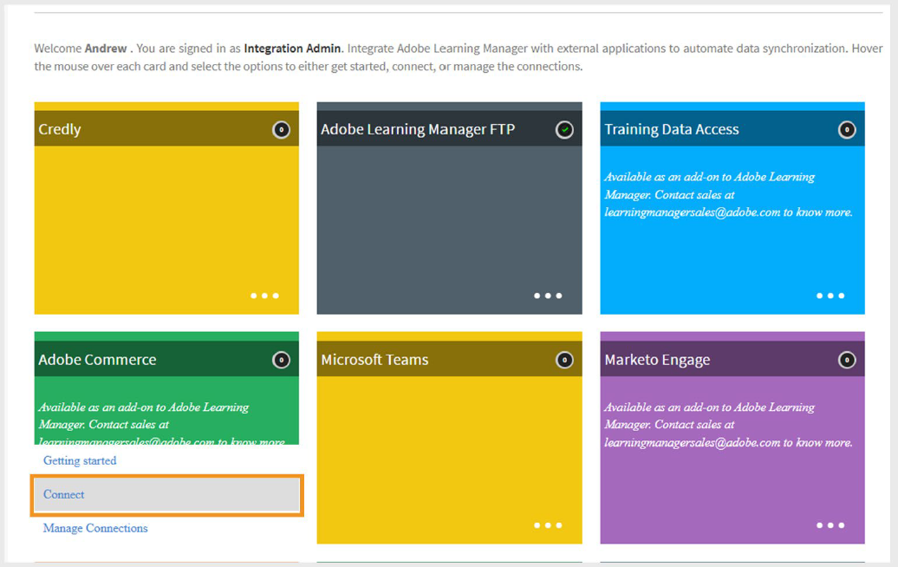

# Adobe Learning Manager中的Adobe Commerce连接器

## Adobe Commerce 连接器

>[!NOTE]
>
>仅当Adobe Learning Manager作为&#x200B;**加载项**&#x200B;出售到Adobe Experience Manager时，此功能才可用。 还可为&#x200B;**试用**&#x200B;帐户启用连接器。

Adobe Learning Manager与Adobe Commerce集成，后者是一个可扩展且可伸缩的电子商务解决方案，可让您为B2B和B2C客户提供多渠道商务体验。 使用Adobe Commerce连接器将Adobe Learning Manager与Adobe Commerce连接，以在您的学习平台中启用付费培训和电子商务功能。

启用连接器后，Learning Manager会将培训数据发送至Adobe Commerce，以便学习者购买课程、学习路径或认证。 连接器还会收集购买信息以验证交易并授予学习者培训访问权限。

## 先决条件

在设置Adobe Commerce连接器之前，请确保执行以下操作：

- 启用[RabbitMQ](https://experienceleague.adobe.com/en/docs/commerce-cloud-service/start/overview)或任何其他消息代理。
- 启用[CRON](https://experienceleague.adobe.com/en/docs/commerce-cloud-service/start/overview#cron_consumers_runner)作业。

要启用这些功能，请编辑以下文件：

- .magento.app.yaml
- .magento/services.yaml
- .magento.env.yaml

其他设置要求：

- 使用自定义模块覆盖选项限制。 此步骤为可选步骤，但建议在处理大型数据集时使用此步骤。
- 启用所有&#x200B;**异步API**。 大型培训数据集以异步方式导出。 当Learning Manager调用Adobe Commerce API时，请求会排队，并由在Commerce端创建产品的消费者处理。 必须启用异步处理，因为默认情况下它在Adobe Commerce中不可用。
- 在Adobe Commerce的“付款成功”页面上，为Learning Manager添加&#x200B;**返回链接**。
   - 使用此[返回URL](https://learningmanager.adobe.com/app/learner#/postPayment)：
- 将&#x200B;**索引**&#x200B;从&#x200B;**保存时**&#x200B;更改为&#x200B;**已计划**。 有关详细信息，请参阅[知识库](https://experienceleague.adobe.com/en/support?support-tab=home#home)。
- 应用所需的&#x200B;**修补程序**。 有关说明，请参阅[应用修补程序文档](https://experienceleague.adobe.com/en/docs/commerce-cloud-service/start/overview)。
- 在云基础架构（暂存和生产）上为Adobe Commerce配置&#x200B;**快速**。 有关详细信息，请参阅[快速设置](https://devdocs.magento.com/cloud/cdn/configure-fastly.html)。

## 配置连接器

要配置Adobe Commerce连接器，请执行以下操作：

1. 以集成管理员身份登录Adobe Learning Manager.
2. 将鼠标悬停在&#x200B;**Adobe Commerce**&#x200B;连接器图块上，然后选择&#x200B;**连接**。

   
   _选择“连接”以配置Adobe Commerce连接器_

3. 键入以下详细信息：

   - 连接名称
   - 访问令牌
   - ADOBE COMMERCE URL
   - 商店代码
4. 从以下选项中选择接口类型：

   - Native Learning Manager
   - 使用AEM Sites进行自定义

   
   _键入Adobe Commerce配置所需的详细信息_

5. 选择&#x200B;**连接**。

## 设置培训定价

启用连接后：

- 作者可以设置课程、学习路径或认证的价格。
- 发布后，学习者可以通过Adobe Learning Manager或自定义AEM网站购买培训。

## 购买流程

### 原生Adobe Learning Manager

- 学习者登录Adobe Learning Manager以购买课程、学习路径或证书。
- 学习者单击“立即购买”后，系统会将他们重定向到Adobe Commerce以完成付款。
- 付款后，系统会提示学习者返回Adobe Learning Manager以开始培训。
- 学习者必须单独登录Adobe Commerce才能完成购买。
- 学习者会收到来自Learning Manager和Adobe Commerce的购买确认电子邮件。 可以根据需要启用或禁用Adobe Commerce电子邮件。

### 自定义AEM Sites

使用自定义AEM站点时：

- 学习者可以通过AEM网站浏览和购买课程。
- AEM站点使用从Adobe Learning Manager同步的元数据来进行搜索和显示。
- 已登录和访客用户可以浏览。 但是，只有已登录的用户才能购买。
- 登录后，学习者可以将课程添加到购物车、预览详细信息并完成购买。

## 将课程导出到 Adobe Commerce

### 计划导出

要计划导出，请执行以下操作：

1. 选择&#x200B;**导出培训元数据**，然后选择&#x200B;**配置计划**。
2. 选择&#x200B;**启用使用此连接的培训元数据导出**。
3. 选择&#x200B;**启用计划**&#x200B;并设置&#x200B;**开始日期**、**时间**&#x200B;和&#x200B;**间隔**。

   
   _启用计划的导出_

4. 选择&#x200B;**“保存”**。

### 按需导出

作者为培训设置价格后，集成管理员必须导出培训数据：

1. 选择&#x200B;**导出培训元数据**，然后选择&#x200B;**按需**。
2. 选择日期范围。
3. 选择“**执行**”以导出。

   
   _创建按需导出_

4. 成功后，定价的课程和学习路径将移至Adobe Commerce以供购买。
