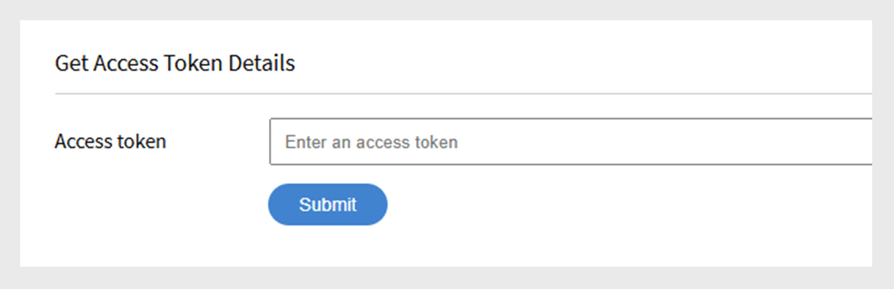

# Adobe Learning Manager开发人员手册

## 概述

Adobe Learning Manager提供了RESTful API，使开发人员能够有效地集成和自定义应用程序或工作流。 《开发人员手册》提供有关如何使用这些API的指导，内容涵盖身份验证、数据模型以及与其他应用程序的集成等主题。 此外，本指南[API参考文档](https://learningmanager.adobe.com/docs/primeapi/v2/)可帮助开发人员创建与Adobe Learning Manager的各种功能交互的外部应用程序或后端工作流，这些功能包括课程创建、跟踪学习者进度、技能映射、认证、游戏化和成绩单。

本手册涵盖以下内容：

* OAuth2.0身份验证
* API对象模型
* 包括、字段和其他参数
* 真实使用案例

>[!IMPORTANT]
>
>本开发人员手册专门介绍Adobe Learning Manager的V2 API。 本指南中描述的所有示例、请求结构和身份验证工作流程均特定于/primeapi/v2/端点。 有关旧版本或弃用的API的信息，请参阅[API参考文档](https://learningmanager.adobe.com/docs/primeapi/v2/)。

## API使用场景

开发人员可以使用Learning Manager API增强或集成Learning Manager与其他企业应用程序。 您可以使用任何技术创建Web、桌面或移动应用程序。 开发人员可以访问Learning Manager数据，但您可以控制应用程序的使用位置和使用方式。

## 使用OAuth 2.0进行身份验证

要安全地访问Adobe Learning Manager API，您必须使用Adobe Learning Manager的OAuth 2.0机制进行身份验证。 此过程包括注册应用程序、生成授权代码、将其交换为刷新令牌以及最后使用刷新令牌获取访问令牌。

### 注册应用程序

将Adobe Learning Manager与外部应用程序集成以增强多功能性。 这些步骤包括访问集成管理员界面、注册应用程序以及获取客户端ID和密钥。 从Adobe Learning Manager生成OAuth 2.0身份验证令牌，包括授权、刷新和访问令牌。 使用OAuth 2.0流安全地验证和授权您的应用程序。 访问令牌的有效期为七天。

1. 以集成管理员身份登录Adobe Learning Manager 。
2. 在左侧窗格中选择&#x200B;**[!UICONTROL 应用程序]**。

   

3. 选择“**[!UICONTROL 注册]**”并添加以下信息：

   * **[!UICONTROL 应用程序名称]**：键入应用程序名称（最多50个字符）。
   * **[!UICONTROL URL]**：您的公司或应用程序的正式URL。 用于标识和引用。
   * **[!UICONTROL 重定向域]**：指定Adobe Learning Manager在授权后可重定向到的域(例如，[http://learningmanager.adobe.com](http://learningmanager.adobe.com))。  您可以指定多个有效的URL。
   * **[!UICONTROL 描述]**：应用程序功能的简要描述。
   * **[!UICONTROL 范围]**：选择六个可用选项之一以定义应用程序的范围。 根据您在此处提到的选择，您的应用程序可访问Learning Manager API端点。 例如，如果选择“学习者角色”，则应用程序可以只读访问所有Learning Manager学习者API端点。

      * 管理员角色读取/写入权限：允许应用程序以管理员身份访问或修改数据。
      * 学习者角色读/写权限：允许应用程序访问或修改学习者的数据。
      * xAPI读/写访问权限：使应用程序能够访问和发送Experience API (xAPI)语句。

   * **[!UICONTROL 仅针对此帐户？]**

      * **[!UICONTROL 是]** — 如果选择“是”，则其他帐户管理员无法看到该应用程序。
      * **[!UICONTROL 否]** — 如果选择“否”，则其他帐户管理员也可以访问此应用程序，但他们需要使用应用程序ID来访问此应用程序。 应用程序ID在Learning Manager应用程序编辑模式下生成和显示。

     

4. 选择&#x200B;**[!UICONTROL 保存]**&#x200B;以注册应用程序。

   * 注册应用程序后，可在帐户中创建的应用程序列表中找到该应用程序。 选择应用程序，您除了会看到之前输入的字段外，还会看到以下内容：
   * 应用程序ID：这是客户端ID。 此ID将告知Adobe Learning Manager正在请求访问的应用程序。 它包含在用于识别应用程序的API请求中。
   * 应用程序密钥：用于在令牌交换步骤（例如，请求刷新令牌或访问令牌时）对应用程序进行身份验证和验证其身份。

   

## 获取访问令牌

### 从重定向获取授权代码

在获取客户端ID和客户端密钥后，可使用它们请求访问令牌，该令牌用于验证API调用。

要开始授权代码流，请在浏览器中添加以下URL：

```
GET https://learningmanager.adobe.com/oauth/o/authorize?client_id=<Enter your clientId>&redirect_uri=<Enter a url to redirect to>&state=<Any String data>&scope=<one or more comma separated scopes>&response_type=CODE 
```

用户授权应用程序后，Adobe Learning Manager将重定向到指定的redirect_uri，并附加一个查询参数：

[https://yourapp.com/callback?code=abc123xyz](https://yourapp.com/callback?code=abc123xyz)

参数代码与重定向uri一起附加。

### 从代码获取刷新令牌

获取代码后，请使用任意API工具，并添加以下POST请求：

```https://learningmanager.adobe.com/oauth/token ```

**请求正文(x-www-form-urlencoded)**：

```
grant_type=authorization_code  
&code=abc123xyz  
&client_id=<your_client_id>  
&client_secret=<your_client_secret>  
&redirect_uri=<your_redirect_url> 
```

**响应**

```
{ 

  "access_token": "eyJhbGciOiJIUzI1...", 
  "refresh_token": "xTjlfz0jCk6gF1...", 
  "expires_in": 604800, 
  "token_type": "Bearer" 

} 
```

使用授权标头中的access_token发出经过身份验证的API请求。

### 在API调用中使用访问令牌

使用以下方法验证访问令牌：

```
GET https://learningmanager.adobe.com/oauth/token/check?access_token=<access_token> 
```

访问令牌的有效期为七天。 七天后，您必须使用刷新令牌生成新的访问令牌。 如果在现有访问令牌仍然有效的情况下用刷新令牌生成了新的访问令牌，则现有令牌将失效。

### 获取用于测试和开发的访问令牌

使用Adobe Learning Manager API时，开发人员需要有效的OAuth 2.0访问令牌才能对API请求进行身份验证。 通过标准OAuth流程生成此令牌可能会很复杂且耗时，尤其是在快速测试、学习或开发时。 Adobe Learning Manager提供了一个令牌生成工具来简化此过程。

此工具在以下期间是理想的：

* 概念验证(POC)版本

* 早期开发

* API集成问题疑难解答

这些令牌仅供您在开发和调试阶段使用。 请记住，测试令牌会准许访问您的Adobe Learning Manager数据，因此安全地处理它们至关重要。 切勿与他人共享测试令牌、在生产应用程序中使用这些令牌，或将其包含在公共代码存储库中。 像密码一样对待它们，以确保您的帐户和数据的安全。

1. 以集成管理员身份登录到Adobe Learning Manager 。
2. 选择&#x200B;**[!UICONTROL 开发人员资源]**，然后&#x200B;**[!UICONTROL 选择用于测试和开发的访问令牌]**。

   

3. 键入创建应用程序后获取的&#x200B;**[!UICONTROL 客户端ID]**&#x200B;以获取OAuth代码。 然后选择&#x200B;**[!UICONTROL 提交]**。

   

4. 添加&#x200B;**[!UICONTROL 客户端ID]**&#x200B;和&#x200B;**[!UICONTROL 客户端密钥]**&#x200B;以获取刷新令牌。 然后选择&#x200B;**[!UICONTROL 提交]**。 OAuth已在上一步中预填充。

   

5. 添加客户端ID和客户端密钥以获取访问令牌。 然后选择&#x200B;**[!UICONTROL 提交]**。

   

6. 添加访问令牌并选择“提交”以获取访问令牌详细信息。

   

选择&#x200B;**[!UICONTROL 提交]**&#x200B;后，访问令牌将得到验证，您将收到以下JSON对象：

```
{ 
  "access_token": "access token", 
  "refresh_token": "refresh token", 
  "user_role": "admin", 
  "account_id": "1234", 
  "user_id": "123456", 
  "expires_in": 604800 
} 
```

与以往一样，用于测试的访问令牌将在七天后过期。

### 使用API工具测试端点

虽然您可以使用任何第三方API测试工具，但我们将使用Postman来测试端点。 本文档中的示例使用Postman测试端点。

1. 打开Postman并创建一个新请求。
2. 选择授权选项卡。
3. 将身份验证类型设置为持有者令牌。

   
4. 将您从上一节中获得的访问令牌粘贴到“令牌”字段中。

   

5. 在“标题”选项卡中添加以下内容。

   * 键：接受
   * 值： application/json
6. 在URL字段中输入您的API端点。 示例： [https://learningmanager.adobe.com/learningManager/api/v2/users](https://learningmanager.adobe.com/learningManager/api/v2/users)
有关详细信息，请参阅[Adobe Learning Manager API参考](https://learningmanager.adobe.com/docs/primeapi/v2/)。
7. 选择发送以提出API请求。

## API类型

### 管理员API

Adobe Learning Manager的管理员API允许管理员大规模地自动执行和管理学习操作。

使用管理API，开发人员可以：

>[!NOTE]
>
>这份清单并非详尽无遗。

* **管理用户和组**：创建、更新和删除用户，或将用户分配给组。
* **注册学习者**：自动注册课程、学习路径或认证。
* **跟踪学习者进度**：检索课程/模块进度、测验分数和完成状态。
* **生成报告**：访问有关学习者活动、参与和绩效的数据。
* **管理内容**：创建并组织课程和学习对象。

有关详细信息，请查看[Adobe Learning Manager API引用](https://learningmanager.adobe.com/docs/primeapi/v2/)。

### 学习者API

学习者API专为经过身份验证的用户（学习者）设计，通过它，可访问特定于学习者的信息。 这些API允许执行以下任务：

* 访问学习者的课程和进度
* 获取获得的徽章或认证
* 更新学习者个人资料信息
* 查看与已完成课程关联的技能

**关键点：**

* 这些API需要经过身份验证的用户令牌，以确保数据安全和隐私。
* 这些API适用于用户已完全注册并登录，而不是匿名或共享用户的情况。

有关详细信息，请查看[Adobe Learning Manager API引用](https://learningmanager.adobe.com/docs/primeapi/v2/)。

## API设计和常用参数

利用API，开发人员可以访问关键Learning Manager资源，例如用户、课程、技能、认证和学习计划等。 它遵循REST原则，使用HTTP方法(GET、POST、PUT、DELETE)进行数据操作。

| | |
|--|--|
| 方法 | GET，PUT，POST，DELETE |
| 格式化 | application/vnd.api+json， application/json。 [了解有关常用MIME类型的更多信息](https://developer.mozilla.org/en-US/docs/Web/HTTP/Guides/MIME_types/Common_types)。 |
| 基本URL | [https://learningmanager.adobe.com/primeapi/v2/](https://learningmanager.adobe.com/primeapi/v2/) |

### 常用参数

| 参数 | 目的 |
|--|--|
| 包括 | 在一次通话中获取相关资源。 |
| 字段 | 选择特定属性以减少有效负载。 |
| 筛选条件 | 缩小结果范围（例如，按ID、名称） |
| 排序 | 排序结果。 |
| 第[页{限制]，第[页{偏移] | 分页支持。 |

以下是每种情况的简要说明：

### 包括

在构建自定义应用程序或无头LMS时，可使用Adobe Learning Manager API检索有用信息。 该API端点还可以包括额外的“include”参数，以检索与默认接收的数据相关的额外信息。 这些关系是数据模型关系，例如，在调用以获取用户详细信息时，您将收到用户信息以及经理ID与Adobe Learning Manager帐户ID的关系。 使用include参数，您可以提取更多详细信息以及用户详细信息，例如其经理详细信息和Adobe Learning Manager帐户详细信息。
简而言之，**include**&#x200B;参数在API调用中使用，用于在单个响应中获取相关（链接的）资源和主要资源。 当您希望访问嵌套数据或相关数据（如课程模块或映射到学习者的技能）而不进行单独的API调用时，此功能非常有用。

主要优点：

* 减少多个API调用：避免手动请求每个相关资源。
* 提高效率：加快开发、减少服务器负载并加快数据渲染。
* 确保数据一致性：在一致的快照中检索所有相关数据。

**如何使用include参数**

将include参数附加到API URL并指定要包含的相关实体。

**公用包含路径**

| 包含值 | 描述 |
|---|---|
| 实例 | 返回学习对象的所有实例 |
| 注册 | 返回用户的注册详细信息 |
| instances.loResources.resources | 获取实例内的模块和资源 |
| supplementaryResources | 返回关联的补充资源 |
| skills.skillLevel.badge | 获取技能级别及其关联的徽章 |
| 前提学习对象 | 包括预修学习对象 |
| 子学习对象 | 获取子学习对象（用于LP或认证） |
| subLOs.enrollment | 子学习对象注册 |
| instances.badge | 为完成课程实例分配的徽章 |
| subLOs.subLOs.instances.loResources.resources | 在子子学习对象实例中深层嵌套的资源 |

**示例1**

在终结点中使用userID参数检索用户的详细信息。

```
https://learningmanager.adobe.com/primeapi/v2/users/<userID>
```

```
GET https://learningmanager.adobe.com/primeapi/v2/users/<userID>
```

在响应中，您可以看到数据对象与帐户和用户的经理有关系。

```
"relationships": {
            "account": {
                "data": {
                    "id": "1010",
                    "type": "account"
                }
            },
            "manager": {
                "data": {
                    "id": "3400476",
                    "type": "user"
                }
            }
        }
```

使用请求中的include参数，您可以检索有关管理器的详细信息，如下所示：

```
GET https://learningmanager.adobe.com/primeapi/v2/users/<userid>?include=manager
```

**示例2**

要检索课程详细信息，请使用端点调用中的include参数。 以下端点获取课程信息及其关系。

```
GET https://learningmanager.adobe.com/primeapi/v2/learningObjects/<courseID>
```

这些关系在响应中显示如下：

* 实例
* 技能
* 作者

```
"relationships": {
            "authors": {
                "data": [
                    {
                        "id": "3400468",
                        "type": "user"
                    }
                ]
            },
            "instances": {
                "data": [
                    {
                        "id": "course:16444_31598",
                        "type": "learningObjectInstance"
                    }
                ]
            },
            "skills": {
                "data": [
                    {
                        "id": "course:16444_1796",
                        "type": "learningObjectSkill"
                    },
                    {
                        "id": "course:16444_3103",
                        "type": "learningObjectSkill"
                    }
                ]
            }
        }
```

其他关系可能包括（上述回复中不存在）：

* 前提学习对象
* 补充学习对象
* supplementaryResources

要获取实例和技能的详细数据，请在include参数中包含“实例，技能”。

```
GET https://learningmanager.adobe.com/primeapi/v2/learningObjects/<courseID>?include=instances,skills
```

现在，如果您想检索更多与课程实例关联的数据，如loResources（课程的模块信息），请应用loResources作为嵌套包含。

```
GET https://learningmanager.adobe.com/primeapi/v2/learningObjects/<courseID>?include=instances.loResources
```

此外，还可以将技能和实例与嵌套的“包含”相结合。

```
GET https://learningmanager.adobe.com/primeapi/v2/learningObjects/<courseID>?include=instances,instances.loResources,skills
```

**其他包含筛选器**

<table>
  <tbody>
  <tr>
   <td>
    <p style="text-align: left;"><b>学习计划</b></p></td>
   <td>
    <p style="text-align: left;"><b>课程</b></p></td>
  </tr>
  <tr>
  <td><br>subLOs.prerequisiteLOs.enrollment</br><br>subLOs.subLOs.prerequisiteLOs.enrollment</br><br>subLOs.enrollment.loResourceGrades</br><br>subLOs.subLOs.enrollment.loResourceGrades</br><br>subLOs.subLOs.instances.loResources.resources.room</br><br>subLOs.instances.loResources.resources.room</br><br>subLOs.supplementaryResources</br><br>subLOs.enrollment</br><br>SubLOs.enrollment.loInstance.loResources.resources</br><br>subLOs.supplementaryLOs.instances.loResources.resources</br>
  </td>
  <td>
  <br>instances.enrollment.loResourceGrades</br><br>enrollment.loInstance.loResources.resources</br>prerequisiteLOs</br><br>作者</br><br>instances.loResources.resources</br><br>supplementalLOs.instances.loResources.resources</br><br>supplementalResources</br><br>instances.badge</br><br>skills.skillLevel.badge</br><br>instances.skill</br><br>instances.resources.instances</br><br>instances.rollllluments</br><br></br>
  </td>
  </tr>
  </table>

#### 字段

API对象的属性和关系称为字段。 在API调用中将字段用作参数以从模型中检索特定属性。 如果不使用Fields参数，则API调用将检索所有可用属性。

例如，在以下API调用中，字段[skill]=name仅获取技能模型的名称属性。

```
GET https://learningmanager.adobe.com/primeapi/v2/users/3400490/userSkills/3400490_1796_1?include=skillLevel.skill&fields[skill]=name
```

#### 分页

API分页是API中使用的一种技术，用于将大型数据集拆分为更小、可管理的块（称为页面），而不是在单个响应中返回整个数据。

分页可以减少客户端和服务器的负载，限制响应大小以避免服务器瓶颈，或者对于在表中显示数据或一次显示一页非常有用。

**Adobe Learning Manager API中的分页工作方式**

Adobe Learning Manager API通过如下参数支持分页：

* 第[页限制]：每页的记录数。
* 页面[偏移]：要跳过的记录数。
* 页面[光标]：指向下一组结果的指针。 基于光标的分页不使用基于偏移的分页（跳过一些记录），而是使用从API返回的唯一标记来获取结果的下一页。

下面介绍如何在API中使用分页：

**页[限制]**

虽然[https://learningmanager.adobe.com/primeapi/v2/users](https://learningmanager.adobe.com/primeapi/v2/users)在单个调用中返回所有用户和相关信息，但使用第[页限制]会将结果数限制为指定值。

要在单个调用中仅返回5条用户记录，请使用以下API：

```
GET https://learningmanager.adobe.com/primeapi/v2/users?page[limit]=5
```

**页[偏移]**

使用此API调用返回三个用户记录，跳过前五个用户，然后从第六个用户开始。

```
GET https://learningmanager.adobe.com/primeapi/v2/users?page[limit]=3&page[offset]=5 
```

**页[光标]**

1. 首先请求限制为5的第一页。

   ```
   GET https://learningmanager.adobe.com/primeapi/v2/users?page[limit]=5
   ```

2. 从links.next复制光标值，并在下一个请求中使用它：

   ```
   "links": {
       "self": "https://learningmanager.adobe.com/primeapi/v2/users?page[limit]=5",
       "next": "https://learningmanager.adobe.com/primeapi/v2/users?page[limit]=5&page[cursor]=3400482"
    }
   ```

3. 发送以下请求：

   ```
   GET https://learningmanager.adobe.com/primeapi/v2/users?page[limit]=5&page[cursor]=3400482
   ```

这将返回下一组10条记录，从上一页中的最后一个项目之后开始。

#### 筛选条件

筛选器参数允许您根据一个或多个字段值缩小API结果的范围。

Adobe Learning Manager API提供筛选参数的各种变体以缩小响应范围。

有关详细信息，请查看[Adobe Learning Manager API引用](https://learningmanager.adobe.com/docs/primeapi/v2/)。

此示例说明如何过滤学习者使用端点注册的作业辅助以及过滤参数：

```
GET https://learningmanager.adobe.com/primeapi/v2/users/3400480/enrollments?filter.loTypes=jobAid
```

#### 排序

sort参数用于根据一个或多个字段以升序或降序对API结果进行排序。

Adobe Learning Manager提供了各种排序选项来对API响应进行排序。 有关详细信息，请查看[Adobe Learning Manager API引用](https://learningmanager.adobe.com/docs/primeapi/v2/)。

为扩展前面的示例，您现在可以按注册日期对用户的学习计划注册进行排序（升序）。

```
GET https://learningmanager.adobe.com/primeapi/v2/users/3400480/enrollments?filter.lotypes=learningProgram&sort=dateEnrolled
```

## API模型概览

Adobe Learning Manager API允许开发人员将Learning Manager对象作为RESTful资源进行访问。 每个 API 端点都表示一个资源，通常为一个徽章之类的对象实例，或此类对象的集合。然后，开发人员使用PUT、GET、POST和DELETE等HTTP谓词对这些对象（集合）执行CRUD操作。


| Adobe Learning Manager 对象 | 描述 |
|----|----|
| 帐户 | 封装Learning Manager客户的详细信息。 |
| 徽章 | 徽章是学习者在课程学习过程中达到特定的阶段性目标时获得的一种成就标志。 |
| 目录 | 目录是学习对象的集合。 |
| 用户 | 用户是 Adobe Learning Manager 中的关键模型。用户通常是使用学习对象的企业内部或外部学习者。 但是，除学习者之外，他们可能还扮演一些其他角色，如作者和经理。 用户 ID、类型、电子邮件是一些内联属性。 |
| 资源 | 这表示模块中的每个内容资源。 “loResource”中封装的所有资源在学习目标方面等效，但在交付类型或内容区域设置方面不同。 |
| userNotification | 此模型包含与学习者相关的通知信息。 |
| 用户技能 | 用户技能表明单个用户达到的单个技能级别。 |
| userBadge | UserBadge将单个徽章与单个用户相关联。 它包含一些详细信息，如徽章获取时间、assertionUrl等。 |
| 技能 | 技能模型由级别和学分组成。 学习者可以在完成相关课程后获得技能。 |
| 技能级别 | 技能级别由一门或多门课程组成，学完这些课程后即可获得相应级别和相关学分。 |
| learningObject | 学习对象是对用户可以注册和学习的各种对象的抽象。 目前Learning Manager的学习对象类型有四种：课程、认证、学习计划和工作辅助。 |
| 学习对象实例 | 学习对象的特定实例。 |
| learningObjectResource | 这等效于模块的概念。 一门课程由一个或多个模块组成。 在 Adobe Learning Manager 中，系统会以多种等效方式提供模块。因此，loResource实质上就是所有这些同等资源的封装。 |
| loResourceGrade | 这封装了用户在其注册的学习对象背景中使用特定资源的结果。 其中包含用户在资源中花费的持续时间、用户进度百分比、通过/失败状态以及用户在任何相关测验中获得的分数等信息。 |
| 日历 | 日历对象是用户可以注册的后续教室或虚拟教室课程的列表。 |
| l1FeedbackInfo | L1 Feedback 封装了学习者针对与学习对象相关的反馈问题提供的答案。 通常，如果配置为收集学习者的此类反馈，则系统会在用户完成学习对象后收集此信息。 |
| 注册 | 此抽象概念封装了与某事务相关的详细信息，该事务表示将特定用户分配给特定的学习对象实例。 |


## 学习者API和端点

以下是处理学习者数据的关键API端点。 这些API指导开发人员与学习者信息交互、跟踪进度、管理注册和检索课程内容。

### 检索所有学习者的详细信息

获取学习者详细信息（姓名、电子邮件、UUID、用户资料等）。 使用API列出帐户中的所有学习者。

```
GET https://learningmanager.adobe.com/primeapi/v2/users
```

### 检索特定学习者的详细信息

如果要按ID查看学习者的配置文件，请使用以下API进行调用。

```
GET https://learningmanager.adobe.com/primeapi/v2/users/<userID>
```

### 列出所有课程、学习计划、工作辅助和认证

检索学习者注册、已完成或管理员已启用的所有学习对象的详细信息。

```
GET https://learningmanager.adobe.com/primeapi/v2/learningObjects
```

### 获取特定学习对象的详细信息

获取有关学习对象的详细信息。 它包括创建日期、发布日期、更新日期和其他信息。

```
GET https://learningmanager.adobe.com/primeapi/v2/learningObjects/<LearningObjectID>
```

### 检索链接到课程的技能列表

显示分配给帐户中所有学习者的技能。

```
GET https://learningmanager.adobe.com/primeapi/v2/skills
```

### 获取技能级别和徽章信息

检查学习者在技能学习旅程中的进度。

```
GET https://learningmanager.adobe.com/primeapi/v2/skills/<skillID>?include=levels
```

### 为帐户创建的所有徽章的列表

调用以下端点以检索为组织中的帐户创建的所有徽章的列表。

```
GET https://learningmanager.adobe.com/primeapi/v2/badges
```

### 检索徽章的信息

获取有关徽章的详细信息，包括徽章名称、徽章图像URL和徽章的状态。

```
GET https://learningmanager.adobe.com/primeapi/v2/badges/<skillID>
```

这将生成以下响应：

```
{
    "links": {
        "self": "https://learningmanager.adobe.com/primeapi/v2/badges/499"
    },
    "data": {
        "id": "499",
        "type": "badge",
        "attributes": {
            "imageUrl": "https://cpcontentsdev.adobe.com/public/account/1010/accountassets/1010/badges/test_57a5ab00555a475a8fc6671562184dc9.png",
            "name": "penguins",
            "state": "Retired"
        }
    }
}
```

## 其他API用法示例

### 创建用户

1. 使用终结点：

   ```
   POST https://learningmanager.adobe.com/primeapi/v2/users
   ```

   处理来自API正文或JSON负载的属性以生成用户，然后向用户提供填写了相应的用户ID。

2. 使用以下负载作为正文：

   ```
   { 
      "data": { 
        "type": "user", 
        "attributes": { 
         "email": "bob@example.com", 
          "name": "Bob", 
          "userType": "INTERNAL" 
        } 
      } 
    }
   ```

有三种必需的属性：

* 电子邮件：用户的电子邮件ID。 对于每个用户，此值应该是唯一的。
* 名称：用户的名称。
* userType：目前，只能使用此端点添加内部用户。 userType应为“INTERNAL”。

您将收到以下JSON对象：

```
{
  "links": {
      "self": "https://learningmanager.adobe.com/primeapi/v2/users"
  },
  "data": {
      "id": "13386404",
      "type": "user",
      "attributes": {
          "avatarUrl": "https://cpcontents.adobe.com/public/images/default_user_avatar.svg",
          "email": "bob@example.com",
          "name": "Bob",
          "pointsEarned": 0,
          "pointsRedeemed": 0,
          "preferredResolution": "AUTO",
          "profile": "Employee",
          "roles": [
              "Learner"
          ],
          "state": "ACTIVE",
          "userType": "Internal",
          "userUniqueId": "bob@example.com"
      },
      "relationships": {
          "account": {
              "data": {
                  "id": "1010",
                  "type": "account"
              }
          },
          "manager": {
              "data": {
                  "id": "3400468",
                  "type": "user"
              }
          }
      }
  }
}
```

### 删除用户

1. 获取要删除的用户的用户ID。

   ```
   GET https://learningmanager.adobe.com/primeapi/v2/users/<userID>
   ```

2. 然后使用DELETE进行以下调用：

   ```
   DELETE https://learningmanager.adobe.com/primeapi/v2/users/<userID>
   ```

此时会显示204响应。 204响应代码表示成功，但没有任何内容可返回。 服务器已成功处理请求，但没有要提供给客户端的任何数据。

检索用户的详细信息后，用户的状态现在为&#x200B;**[!UICONTROL 已删除]**。

### 更新用户详细信息

1. 使用v2 API更新用户的用户详细信息。 学习者可以修改bio、uiLocale、contentLocale、时区。 对于大型帐户，这些是异步调用。 还有许多其他用户属性可以使用此API端点进行更新。 使用/users/{id}端点，其中id是要更新其详细信息的用户的用户ID。

```
PATCH https://learningmanager.adobe.com/primeapi/v2/users/<userID>
```

在请求负载中添加以下内容以从上一部分更新ID为`<userID>`的用户。

更改负载中的任何字段。

```
{
    "data": {
        "id": "3400468",
        "type": "user",
        "attributes": {
            "avatarUrl": "https://cpcontents.adobe.com/public/images/default_user_avatar.svg",
            "binUserId": "3e6d571f-3956-44db-be69-8e458bde649f",
            "bio": "Manager",
            "contentLocale": "de-DE",
            "email": "user@example.com",
            "enrollOnClick": true,
            "fields": {
                "Web": "Web",
                "newfororder": "newvalue",
                "location": "New",
                "test1": "b"
            },
            "gamificationEnabled": true,
            "lastLoginDate": "2025-04-30T09:30:51.000Z",
            "metadata": {
                "level": "5",
                "expertise": "java",
                "sport": "tennis"
            },
            "name": "John Adams",
            "pointsEarned": 8600,
            "pointsRedeemed": 0,
            "preferredResolution": "AUTO",
            "profile": "Employee",
            "roles": [
                "Learner",
                "Admin",
                "Author",
                "Instructor",
                "Integration Admin",
                "Manager"
            ],
            "state": "ACTIVE",
            "timeZoneCode": "213",
            "uiLocale": "en-US",
            "userType": "Internal",
            "userUniqueId": "user@example.com"
        },
        "relationships": {
            "account": {
                "data": {
                    "id": "1010",
                    "type": "account"
                }
            }
        }
    }
}
```

呼叫后，用户的详细信息将更新。

### 创建外部个人资料

外部个人资料是指为外部学习者创建的用户个人资料，这些外部学习者通常不属于组织的内部用户群。 这些学习者可能包括需要参加组织提供的培训或认证计划的客户、合作伙伴、供应商、加盟商或临时承包商。

1. 使用以下端点：

   ```
   POST https://learningmanager.adobe.com/primeapi/v2/externalProfiles
   ```

2. 使用以下负载作为正文：

```
{
    "data": {
      "type": "externalProfile",
      "attributes": {
        "name": "Jonas Albertson",
        "expiry": "2027-12-31T18:29:59.000Z",
        "managerEmail": "jonas@acme.com",
        "seatLimit": 10
      }
    }
}
```

有效负载具有以下属性：

* 名称：外部用户的名称。
* 到期：用户在Adobe Learning Manager中注册的到期日期（采用ISO-8601格式）。
* managerEmail：合作伙伴公司的用户经理的电子邮件地址。
* seatLimit：合作伙伴组织允许的名额数。

进行呼叫后，您将收到以下响应：

```
{
    "links": {
        "self": "https://learningmanager.adobe.com/primeapi/v2/externalProfiles"
    },
    "data": {
        "id": "18805",
        "type": "externalProfile",
        "attributes": {
            "accessKey": "8gte2ne7f4r14",
            "enabled": true,
            "expiry": "2027-12-31T18:29:59.000Z",
            "managerEmail": "jonas@acme.com",
            "name": "Jonas Albertson",
            "seatLimit": 10,
            "url": "https://learningmanager.adobe.com/eplogin?groupid=18805&accesskey=8gte2ne7f4r14"
        }
    }
}
```

这意味着外部用户已成功添加到Adobe Learning Manager。 发送响应用户的URL，用户可通过该URL在平台上注册。

### 提取包含用户ID和经理详细信息的用户报告

可以直接从管理员用户界面（**[!UICONTROL 管理员]** > **[!UICONTROL 用户]** > **[!UICONTROL 内部]**）下载用户报告。 但是，报告不会返回用户ID和相关经理的详细信息。

使用作业API下载报告。 作业API有助于生成报告、批量操作（注册或徽章分配）、认证完成或徽章生成。

下载报告的方法如下：

1. 将以下负载添加到作业API。

   ```
   {
       "data": {
           "type": "job",
           "attributes": {
               "description": "description of your choice",
               "jobType": "generateUsers",
               "payload":{
                   "expandMetadata":true
               }
           }
      }
   }
   ```

2. 使用以下端点。

   ```
   POST https://learningmanager.adobe.com/primeapi/v2/jobs
   ```

3. 从响应中复制作业ID。

   ```
   {
       "links": {
           "self": "https://learningmanager.adobe.com/primeapi/v2/jobs"
       },
       "data": {
           "id": "43118",
           "type": "job",
           "attributes": {
               "dateCreated": "2025-05-26T06:35:35.000Z",
               "description": "description of your choice",
               "jobType": "generateUsers",
               "payload": {
                   "expandMetadata": true
               },
             "status": {
                   "code": "Submitted"
               }
           }
       }
   }
   ```

   在响应中，作业ID为43118。
4. 复制ID后，使用作业API中的ID下载报告。

   ```
   GET https://learningmanager.adobe.com/primeapi/v2/jobs/43118
   ```

5. 从响应中复制S3 URL。
6. 将URL粘贴到浏览器中。 浏览器会提示您保存或打开CSV文件。 将文件保存在您的计算机上。
下载的文件包含以下各列：

internalUserID、userEmail、customerDefinedUniqueUserId、name、managerEmail、userType、state、excludedFromGamification、pointsEarned、profile、roles、dateCreated、lastLoginDate、dateDeleted、uiLocale、contentLocale、timeZoneCode、userSource、group、Active fields、metadata和LastSocialActivityActivityDate。

### 使用作业API生成徽章

1. 获取组织中用户的徽章列表。 使用以下端点：

   ```
   GET https://learningmanager.adobe.com/primeapi/v2/users/3400476/userBadges
   ```

   其中3400476是用户ID。
2. 从响应中复制徽章ID。 例如，3400476_759_COMPETENCY_1796_1是徽章ID。

   ```
   {
    "id": "3400476_759_COMPETENCY_1796_1",
    "type": "userBadge",
    "attributes": {
        "assertionUrl": "https://cpcontentsdev.adobe.com/public/accountassets/1010/badges/assertions/a99566b5aa8f4cfa92380581733c63a9_1626278856926.json",
        "dateAchieved": "2016-02-25T08:45:25.000Z",
        "modelType": "skillLevel"
    },
    "relationships": {
        "badge": {
            "data": {
                "id": "759",
                "type": "badge"
            }
        },
        "learner": {
            "data": {
                "id": "3400476",
                "type": "user"
            }
        },
        "model": {
            "data": {
                "id": "1796_1",
                "type": "skillLevel"
            }
        }
    }
   }
   ```

3. 创建负载并在负载中指定徽章ID 。 有效负载示例如下：

   ```
   {
    "data": {
        "type": "job",
        "attributes": {
            "description": "Acme Corp Badge",
            "jobType": "generateUserBadge",
            "payload": {
                "userBadgeId": "3400476_759_COMPETENCY_1796_1"
            }
        }
    }
   }  
   ```

   呼叫后，您将在响应中获取作业ID。
4. 从响应中获取作业ID，并在以下终结点中使用作业ID进行调用。

   ```
   GET https://learningmanager.adobe.com/primeapi/v2/jobs/<jobsID>
   ```

5. 从响应中复制徽章URL，并在浏览器中打开该URL。 证书将作为PDF下载。

### 在Adobe Learning Manager中创建用户

POST/users端点可帮助您使用无头模式创建用户。 创建包含详细信息的用户，例如AdobeLearning Manager原生用户界面中的注册流程。

例如，

```
POST https://learningmanager.adobe.com/primeapi/v2/users
```

将以下正文添加到请求：

```
{   
   "data":  
     {  
       "type": "user",  
       "attributes": {  
         "bio": "",  
         "contentLocale": "fr-FR",  
         "email": "user@work.com",  
         "enrollOnClick": true,  
         "fields": {  
           "Learning Categories": [  
             "Business"  
           ],  
           "Categories": "IT"  
         },  
         "gamificationEnabled": true,  
         "name": "Test User",  
         "profile": "Engineer",  
         "userType": "INTERNAL",  
         "userUniqueId": "user@work.com"  
       },  
       "relationships": {  
         "account": {  
           "data": {  
             "id": "108079",  
             "type": "account"  
           }  
         }
         }  
       }  
    } 
```

进行调用后，将显示以下响应：

```
{
    "links": {
        "self": "https://learningmanager.adobe.com/primeapi/v2/users"
    },
    "data": {
        "id": "13385627",
        "type": "user",
        "attributes": {
            "avatarUrl": "https://cpcontents.adobe.com/public/images/default_user_avatar.svg",
            "email": "user@work.com",
            "name": "Test User",
            "pointsEarned": 0,
            "pointsRedeemed": 0,
            "preferredResolution": "AUTO",
            "profile": "Engineer",
            "roles": [
                "Learner"
            ],
            "state": "ACTIVE",
            "userType": "Internal",
            "userUniqueId": "user@work.com"
        },
        "relationships": {
            "account": {
                "data": {
                    "id": "1010",
                    "type": "account"
                }
            },
            "manager": {
                "data": {
                    "id": "3400468",
                    "type": "user"
                }
            }
        }
    }
}
```

新用户将添加到Adobe Learning Manager。

### L1帖子反馈

1. 检索学习者的课程、实例和注册数据。 使用以下终结点：

   ```
   GET /enrollments
   ```

2. 检查是否为该课程实例启用了L1反馈。

   ```
   GET https://learningmanager.adobe.com/primeapi/v2/learningObjects/<loID>/instances/<loInstanceID>/l1Feedback
   ```

3. 提交L1反馈。

   ```
   POST /enrollments/{id}/l1Feedback
   ```

所需负载示例：

```
{
    "data": {
      "id": "course:7454218_10333537_11257863",
      "type": "feedback",
      "attributes": {
        "questions": [
          {
            "answer": "8",
            "questionId": "1",
            "mandatory": true,
            "questionType": "scaleTen"
          }
        ],
        "score": 80
      }
    }
  }
```

### 获取课程的模块级别信息

1. 按ID检索学习对象的详细信息。

   ```
   GET https://learningmanager.adobe.com/primeapi/v2/learningObjects/<loID>
   ```

   ```
   {
    "links": {
        "self": "https://learningmanager.adobe.com/primeapi/v2/learningObjects/course:1171899"
    },
    "data": {
        "id": "course:1171899",
        "type": "learningObject",
        "attributes": {
            "authorNames": [
                "James Adams"
            ],
            "dateCreated": "2017-11-01T15:28:09.000Z",
            "datePublished": "2017-11-01T15:28:20.000Z",
            "dateUpdated": "2017-11-01T15:28:20.000Z",
            "duration": 60,
            "effectiveModifiedDate": "2017-11-01T15:28:20.000Z",
            "effectivenessIndex": 0,
            "enrollmentType": "Self Enroll",
            "hasOptionalLoResources": false,
            "hasPreview": false,
            "isExternal": false,
            "isMqaEnabled": false,
            "isPrerequisiteEnforced": false,
            "isSubLoOrderEnforced": false,
            "loFormat": "Self Paced",
            "loResourceCompletionCount": 3,
            "loType": "course",
            "moduleResetEnabled": false,
            "state": "Published",
            "unenrollmentAllowed": true,
            "catalogLabels": [
                {
                    "catalogLabelValueIds": [
                        {
                            "name": "Sales",
                            "id": "catalogLabel:13_31"
                        }
                    ],
                    "description": "",
                    "mandatory": false,
                    "name": "Department",
                    "values": [
                        "Sales"
                    ]
                }
            ],
            "localizedMetadata": [
                {
                    "locale": "en-US",
                    "name": " Test course 2"
                }
            ],
            "rating": {
                "averageRating": 0,
                "ratingsCount": 0
            }
        },
        "relationships": {
            "authors": {
                "data": [
                    {
                        "id": "3400468",
                        "type": "user"
                    }
                ]
            },
            "instances": {
                "data": [
                    {
                        "id": "course:1171899_2067352",
                        "type": "learningObjectInstance"
                    }
                ]
            },
            "skills": {
                "data": [
                    {
                        "id": "course:1171899_1797",
                        "type": "learningObjectSkill"
                    }
                ]
            }
        }
    }
   }
   ```

2. 使用include参数检索以下内容：

   a.列出学习对象的所有模块。

   ```
   GET https://learningmanager.adobe.com/primeapi/v2/learningObjects/course:1171899?include=instances.loResources
   ```

   b.列出模块中的所有内容。

   ```
   GET https://learningmanager.adobe.com/primeapi/v2/learningObjects/course:1171899?include=instances.loResources.resources
   ```

### 检查模块进度

1. 使用课程ID从目录中检索学习对象。

   ```
   GET https://learningmanager.adobe.com/primeapi/v2/learningObjects?page[limit]=10&filter.loTypes=course&sort=name&filter.ignoreEnhancedLP=true&id=<courseID>
   ```

2. 使用注册ID获取学习者的注册详细信息。

   ```
   GET https://learningmanager.adobe.com/primeapi/v2/enrollments/<enrollmentID>
   ```

   从响应中复制学习对象资源等级ID。
3. 在以下终结点中使用该ID。

   ```
   GET https://learningmanager.adobe.com/primeapi/v2/loResourceGrades/<courseResourceGradeID>
   ```

您将在响应中获取有关模块进度的信息。

### 实施学习者模拟

在使用Adobe Learning Manager作为后端实施无头LMS时，组织可能需要支持人员模拟学习者以进行故障排除或获取帮助。 API驱动的模拟方法可确保安全访问，同时保持学习者凭据的机密性，并支持会话状态中的无缝过渡。

Adobe Learning Manager通过一个专用的API使学习者可以在无头LMS环境中进行模拟。 该功能允许支持人员临时采用学习者的身份，使他们能够诊断问题、测试功能或通过模拟学习者的体验提供实际操作帮助。 使用缓存的管理访问令牌激活模拟，该令牌用于以编程方式生成学习者访问令牌。 通过此流程，系统可像以学习者身份登录一样运行。

>[!IMPORTANT]
>
>用户必须请求特殊的API访问权限才能使用此功能，并且系统必须处理会话切换、授权和其他指标，以确保模拟期间的透明度和可问责性。

**API终结点详细信息**

```
POST /oauth/learnerToken
```

**完整URL示例**

```
https://learningmanager.adobe.com/oauth/o/learnerToken?learner_email=foo@acme.com&force=false
```

**查询参数：**

* learner_email： （字符串）要模拟的学习者电子邮件。
* force： （布尔值）是否强制生成新令牌（如果存在）。

**请求正文：**

```
{
    "client_id": "your-client-id",
    "client_secret": "your-client-secret",
    "refresh_token": "your-admin-refresh-token"
}  
```

**示例响应：**

```
{
    "access_token": "generated-token",
    "refresh_token": "new-refresh-token",
    "user_role": "learner",
    "account_id": "123456",
    "user_id": "7891011",
    "expires_in": 604800
}  
```

**示例cURL：**

```
curl --location --request POST 'https://learningmanager.adobe.com/oauth/o/learnerToken?learner_email=foo@acme.com&force=false' \
--header 'Content-Type: application/json' \
--data-raw '{
  "client_id": "xxxx",
  "client_secret": "xxxx",
  "refresh_token": "xxxx"
}'
```


### 错误代码

使用Adobe Learning Manager (Adobe Learning Manager) API时，开发人员可能会在请求期间遇到各种HTTP错误代码。 这些错误提供有关错误原因以及如何修复的重要反馈。 了解这些代码有助于开发人员快速排除问题故障、提高API可靠性并确保更顺畅的集成。 下表提供了Adobe Learning Manager API返回的常见HTTP错误代码的指南，以及这些错误发生的说明和典型情况。 任何构建、测试或调试连接到Adobe Learning Manager的应用程序时，本节都至关重要。

| HTTP状态 | 含义 | 故障排除 |
|---|---|---|
| 400 | 错误请求 | 检查请求中是否存在缺失或格式错误的参数。 验证必填字段并更正格式。 例如，筛选器、字段或包含参数的语法无效。 |
| 401 | 未经授权的令牌无效或缺失 | 确保您的访问令牌正确并包含在授权标头中。 验证令牌是否处于活动状态。 在请求令牌时，还应使用正确的客户端ID和客户端密钥。 |
| 403 | 禁止入内。 无访问权限 | 您没有访问资源的权限。 验证令牌的作用域是否正确（admin：read、learner：write等）。 |
| 404 | 未找到资源 | 终结点或资源ID不正确或不存在。 确保资源存在于参数列表中。 |
| 406 | 不可接受 — 接受标头不正确 | 将此标头添加到您的请求中：接受：application/vnd.api+json <br>Adobe Learning Manager API严格要求此内容类型。</br> |
| 500 | 内部服务器错误 | 这是服务器端的问题。 请稍后重试，如果问题仍然存在，请向Adobe Learning Manager支持团队报告。 |


<!--# Application developer manual

>[!NOTE]
>
>Learning Manager V1 API is now deprecated. We recommend that you use V2 APIs to interact with Learning Manager.


## Overview {#overview}

[Adobe Learning Manager](http://www.adobe.com/in/products/learningmanager.html) is a cloud-hosted, learner-centric, and self-service learning management solution. Customers can access Learning Manager resources programmatically using the Learning Manager API to integrate it with other enterprise applications. The API can also be used by Adobe partners to enhance the value proposition of Learning Manager, by extending its functionality or by integrating it with other applications or services.

### Usage scenario {#usagescenario}

Using Learning Manager API, developers can build self-contained applications that extend the functionality of Learning Manager or integrate Learning Manager with other enterprise applications workflows. You can develop a web application, desktop client or a mobile app using any technology of your choice. As a developer you can access your application data from within Learning Manager. The deployment of the application that you develop is external to the Learning Manager platform and you have full control over the software development lifecycle as the application evolves. Typically, applications are developed by a customer organization for use with their Learning Manager account, and these applications are private to that specific customer organization. Also, Adobe partners can build generic applications with Learning Manager API, that can be used by a large set of Learning Manager customers.

## Learning Manager API {#apidescription}

The Learning Manager API is based on principles of REST, and exposes key elements of the Learning Manager Object Model to application developers through HTTP. Before knowing the details of the API endpoints and the HTTP methods, developers can become familiar with the various Learning Manager objects, their attributes and inter-relationships. Once the models are understood, it will be useful to get a basic understanding of the structure of API requests and responses, and a few common programming terms that we use generically across the API.

For details of the various API endpoints and methods, refer to the  [Learning Manager API documentation](https://learningmanager.adobe.com/docs/primeapi/v2/).

## Learner APIs

Adobe Learning Manager - Learner APIs allow you to create a custom learning experience for your users. The usage of these APIs need a valid user token and are to be used only for the purpose of workflows where there is a fully licensed/registered Learner.
 
>[!IMPORTANT]
>
>They are not to be used, as is, for any sort of data retrieval to support any non-logged in user/shared users or any other such cases.
 
The non-logged in use cases require special handling. 

**Reach out to the Solution Architecture team, in case you have any questions on the appropriate use of these APIs and ensure that a Solution Architect has vetted a solution before you deploy it**.

## API authentication {#apiauthentication}

When writing an application that makes API calls to Learning Manager, you have to register your application using the Integration Admin app. 

Learning Manager APIs use OAuth 2.0 framework to authenticate and authorize your client applications. 

**Procedure**

**1. Set up your application**

You can set up your application with client id and client secret to use the proper end points. Once you register your application, you can get the clientId and clientSecret. Get URL should be used in browser as it authenticates the Learning Manager users using their pre-configured accounts such as SSO, Adobe ID, and so on. 

```
GET https://learningmanager.adobe.com/oauth/o/authorize?client_id=<Enter your clientId>&redirect_uri=<Enter a url to redirect to>&state=<Any String data>&scope=<one or more comma separated scopes>&response_type=CODE.
```

After successful authentication, your browser redirects to the redirect_uri mentioned in the above URL. A parameter **code** is appended along with the redirect uri.

**2. Get refresh token from code**

`POST https://learningmanager.adobe.com/oauth/token Content-Type: application/x-www-form-urlencoded`

Body of the post request:

```
client_id: 
<enter your clientid>
 & 
 client_secret: 
 <enter your clientsecret>
  & 
  code: 
  <code from step 1></code>
 </enter>
</enter>
```

**3.** **Obtain an access token from refresh token**

URL to obtain access token: 

POST [https://learningmanager.adobe.com/oauth/token/refresh](https://learningmanager.adobe.com/oauth/token/refresh) Content-Type: application/x-www-form-urlencoded

Body of the post request:

```
client_id: 
<enter your clientid>
 & 
 client_secret: 
 <enter your clientsecret>
  & 
  refresh_token: 
  <refresh token>
   
  </refresh>
 </enter>
</enter>
```

**URL to verify access token details**

`GET https://learningmanager.adobe.com/oauth/token/check?access_token=<access_token>`

**Usage limitation**

An access token is valid for seven days. After a day, you have to generate a new access token using refresh token. If you generate a new access token from refresh token while an existing access token is still valid, the existing token is returned. 

Some of the frequently used terms in Learning Manager API are explained below for your reference. 

**Includes**

Developers can access a single API object model and also multiple models associated with that model. To access the subsequent related models, you need to understand the relationship of each model with other models. **Includes** parameter enables developers to access the dependant models. You can use comma separator to access multiple models. For sample usage and more details on **includes**, refer to sample API model section in this page. 

**API request**

The API requests can be made by making a HTTP Request. Depending upon the end point and method developer may have a choice of various HTTP verbs such as GET, PUT, POST, DELETE, PATCH, etc. For some requests query parameters can be passed. When making a request for a specific data model, the user can also request for related models as described in the JSON API specifications. The structure of a typical API Request is described in [sample model usage](/help/migrated/integration-admin/feature-summary/developer-manual.md#api-usage-illustration).

**API response**

When an API request is made by a client, a SON document is obtained according to the JSON API specification. The response also contains the HTTP Status code, which the developer can verify to perform the appropriate next steps in his application logic. The structure of a typical API Response is described in  [sample model usage](/help/migrated/integration-admin/feature-summary/developer-manual.md#api-usage-illustration).

**Errors**

When an API request fails, an Error response is obtained. The HTTP Status code returned in the response indicates the nature of error. Error codes are represented with numbers for each model in the API reference. 200, 204, 400 and 404 are some of the common errors represented in APIs indicating HTTP access issues.  

**Fields**

API object's attributes and its relationships are collectively called Fields. Refer to [JSON API for more information.](http://jsonapi.org/format/#document-resource-object-fields) You can use Fields as a parameter while making API calls to fetch one or more specific attributes from the model. In absence of the Fields parameter, the API call fetches all the available attributes from the model. For example, in the following API call, fields[skill]=name fetches you the name attribute of the skill model alone. 

`https://learningmanager.adobe.com/primeapi/v2/users/{userId}/userSkills/{id}?include=skillLevel.skill&fields[skill]=name `

**Pagination**

Sometimes, an API request results in a long list of objects to be returned in the response. In such cases, the pagination attribute enables the developer to fetch the results sequentially in terms of multiple pages, where each page contains a range of records. For example, pagination attribute in Learning Manager enables you to set the maximum number of records to be displayed in a page. Also, you can define the range value of records to be displayed on page. 

**Sorting**

Sorting is allowed in API models. Based on the model, choose the type of sorting to be applied for the results. Sorting can be applied in ascending or descending order. For example, if you specify `code sort=name`, then it is ascending sort by name. If you specify `code sort=-name`, it is descending sort by name. Refer to [JSON API spec for more information](http://jsonapi.org/format/#fetching-sorting). 

## API usage illustration {#samplemodel}

Let us consider a scenario where a developer wants to get skill name, max points assigned for skill level and points earned by the learner for that skill.

A userSkill model in Learning Manager APIs consists of id, type, dateAchieved, dateCreated, pointsEarned as default attributes. So, when a developer uses GET method to acquire details of userSkill model, the current data pertaining to the default attributes is shown in the response output. 

But, in this scenario, the developer wants to get the skill name, and points of skill level for the user. Learning Manager API enables you to access this related information using relationship fields and include parameter. The associated models for userSkill are obtained in relatioships tag. You can get the details of each associated models by calling these models along with the userSkill. To get this information, use **`code include`** parameter with dot (period) separated values for each of the associated models. You can use comma as separator to request another model like user include=skillLevel.skill,course

**API Call**

`https://learningmanagerqe1.adobe.com/primeapi/v1/users/%7buserId%7d/userSkills/%7bid%7d?include=skillLevel.skill&fields%5bskill%5d=name&fields%5bskillLevel%5d=maxCredits&fields%5buserSkill%5d=pointsEarned`

For example userId can be 746783 and the userSkills id: 746783_4426_1. 

**Response of API call**

```
\{ 
 "links": {"self": "https://learningmanager.adobe.com/primeapi/v2/users/746783/userSkills/746783_4426_1?include=skillLevel.skill&fields[userSkill]=pointsEarned&fields[skillLevel]=maxCredits&fields[skill]=name"}, 
 "data": { 
 "id": "746783_4426_1", 
 "type": "userSkill", 
 "attributes": {"pointsEarned": 5}, 
 "links": {"self": "https://learningmanager.adobe.com/primeapi/v2/users/746783/userSkills/746783_4426_1"} 
 }, 
 "included": [ 
 { 
 "id": "4426", 
 "type": "skill", 
 "attributes": {"name": "Java"}, 
 "links": {"self": "https://learningmanager.adobe.com/primeapi/v2/skills/4426"} 
 }, 
 { 
 "id": "4426_1", 
 "type": "skillLevel", 
 "attributes": {"maxCredits": 10} 
 } 
 ] 
} 

```

## Learning Manager models {#models}

The Learning Manager API allows developers to access Learning Manager objects as RESTful resources. Each API endpoint represents a resource, typically an object instance like Badge, or a collection of such objects. The developers then use the HTTP verbs such as PUT, GET, POST and DELETE to perform the CRUD operations on those objects (collections).

+++V1 API

The following diagram represents the various elements of the Learning Manager Object Model in V1 API.


The following table describes various elements of the Learning Manager V1 object model: 

<table border="1" cellspacing="0" cellpadding="0">
 <tbody>
  <tr>
   <td>
    <p><strong>Serial No</strong></p></td>
   <td>
    <p><strong>Learning Manager Object</strong></p></td>
   <td>
    <p><strong>Description</strong></p></td>
  </tr>
  <tr>
   <td>
    <p>1.      </p></td>
   <td>
    <p>user</p></td>
   <td>
    <p>User is the key model in Learning Manager. Users are typically the internal or external learners of an organization who consume learning objects. However they may play some other roles such as author and Manager along with learner role. User id, type, email are some of the inline attributes. </p></td>
  </tr>
  <tr>
   <td>
    <p>2.      </p></td>
   <td>
    <p>course</p></td>
   <td>
    <p>Course is one of the learning objects supported in Learning Manager, that consists of one or more modules. </p></td>
  </tr>
  <tr>
   <td>
    <p>3.      </p></td>
   <td>
    <p>module</p></td>
   <td>
    <p>Module is a building block to create learning objects in Learning Manager. Modules can be of four different types such as Class room, virtual class room, activity and self-paced. Use this module model to get the details of all modules in an account. </p></td>
  </tr>
  <tr>
   <td>
    <p>4.      </p></td>
   <td>
    <p>certification</p></td>
   <td>
    <p>Certification is awarded to learners based on successful completion of courses. Courses are required in the application before you use certifications. </p></td>
  </tr>
  <tr>
   <td>
    <p>5.      </p></td>
   <td>
    <p>learning program</p></td>
   <td>
    <p>Learning programs are uniquely designed courses meeting specific learning requirements of users. Typically, learning programs are used to drive learning goals spanning across individual courses. </p></td>
  </tr>
  <tr>
   <td>
    <p>6.      </p></td>
   <td>
    <p>badge</p></td>
   <td>
    <p>Badge is a token of accomplishment that learners get when they reach specific milestones as they progress within a course. </p></td>
  </tr>
  <tr>
   <td>
    <p>7.      </p></td>
   <td>
    <p>skill</p></td>
   <td>
    <p>Skills model consists of levels and credits. Skills can be acquired by learners after relevant course completion. </p></td>
  </tr>
  <tr>
   <td>
    <p>8.      </p></td>
   <td>
    <p>certificationEnrollment</p></td>
   <td>
    <p>This model provides details of an enrollment by a user to a single certification.</p></td>
  </tr>
  <tr>
   <td>
    <p>9.  </p></td>
   <td>
    <p>courseEnrollment</p></td>
   <td>
    <p>This model provides details of an enrollment by a user to a single course. </p></td>
  </tr>
  <tr>
   <td>
    <p>10.  </p></td>
   <td>
    <p>courseInstance</p></td>
   <td>
    <p>A course can have one or many instances associated with it. You can get Course instance </p></td>
  </tr>
  <tr>
   <td>
    <p>11.  </p></td>
   <td>
    <p>courseSkill</p></td>
   <td>
    <p>A courseSkill model specifies the progress of a single skill that is achieved by completing a course.</p></td>
  </tr>
  <tr>
   <td>
    <p>12.  </p></td>
   <td>
    <p>courseModule</p></td>
   <td>A courseModule model specifies how a module is included  in a course. For instance, whether the module is used for pretest or for content.</td>
  </tr>
  <tr>
   <td>
    <p>13.  </p></td>
   <td>learningProgramInstance</td>
   <td>
    <p>A learning program can consist of multiple instances imbibing similar properties of a learning program or customized instances. </p></td>
  </tr>
  <tr>
   <td>
    <p>14.  </p></td>
   <td>
    <p>job aid</p></td>
   <td>
    <p>Job aid is a learning content accessible to learners without any enrollment or completion criteria. You can fetch, updated date, state, id information along with its related models such as job aid version, authors and skill level. </p></td>
  </tr>
  <tr>
   <td>
    <p>15.  </p></td>
   <td>
    <p>jobAidVersion</p></td>
   <td>
    <p>Job aid can have one or many versions associated to it based on number revisions in content and number of uploads. This model provides details of a single job aid version. </p></td>
  </tr>
  <tr>
   <td>
    <p>16.  </p></td>
   <td>
    <p>learningProgramInstanceEnrollment</p></td>
   <td>
    <p>Learning program consists of one or many instances. Learners can enroll to a learning program instance by themselves or assigned by administrator. This model provides details of an enrollment by a user to a single learning program instance. </p></td>
  </tr>
  <tr>
   <td>
    <p>17.  </p></td>
   <td>
    <p>moduleVersion</p></td>
   <td>
    <p>A module can have one or many versions based on its revised content uploads. Use this model to obtain specific info about any single module version. </p></td>
  </tr>
  <tr>
   <td>
    <p>18.  </p></td>
   <td>
    <p>skillLevel</p></td>
   <td>
    <p>A skill level comprises of one or many courses to be consumed in order to acquire a level along with its associated credits. </p></td>
  </tr>
  <tr>
   <td>
    <p>19.  </p></td>
   <td>
    <p>userBadge</p></td>
   <td>
    <p>UserBadge relates a single badge with a single user. It contains details such as when was it achieved, assertionUrl and so on. </p></td>
  </tr>
  <tr>
   <td>
    <p>20.  </p></td>
   <td>
    <p>userSkill</p></td>
   <td>
    <p>UserSkill indicates how much of a single skill level is achieved by a single user.</p></td>
  </tr>
 </tbody>
</table>

+++

+++V2 API

Following are the various elements of the Learning Manager class diagram in V2 API.


<table>
 <tbody>
  <tr>
   <th><b>Learning Manager Object</b></th>
   <th><b>Description</b></th>
  </tr>
  <tr>
   <td>account</td>
   <td>Encapsulates the details of a Learning Manager customer.</td>
  </tr>
  <tr>
   <td><code>
     badge
    </code></td>
   <td>Badge is a token of accomplishment that learners get when they reach specific milestones as they progress within a course. <br></td>
  </tr>
  <tr>
   <td><code>
     catalog
    </code></td>
   <td>Catalog is a collection of learning objects.</td>
  </tr>
  <tr>
   <td><code>
     user
    </code></td>
   <td>User is the key model in Learning Manager. Users are typically the internal or external learners of an organization who consume learning objects. However, they may play some other roles such as author and Manager along with learner role. User id, type, email are some of the inline attributes. </td>
  </tr>
  <tr>
   <td>resource</td>
   <td>This is used to model each content resource that a module seeks to encapsulate. All resources encapsulated within <code>
     an
    </code> <code>
     loResource
    </code> are equivalent in terms of the learning objective, but they differ from each other in terms of delivery type or content locale.<br></td>
  </tr>
  <tr>
   <td>userNotification</td>
   <td>This model contains notification information pertaining to a learner.<br></td>
  </tr>
  <tr>
   <td>userSkill</td>
   <td>UserSkill indicates how much of a single skill level is achieved by a single user.<br></td>
  </tr>
  <tr>
   <td>userBadge</td>
   <td>UserBadge relates a single badge <code>
     with
    </code> a single user. It contains details such as when was it achieved, <code>
     assertionUrl
    </code> and so on. <br></td>
  </tr>
  <tr>
   <td>skill</td>
   <td>Skills model consists of levels and credits. Skills can be acquired by learners after relevant course completion. <br></td>
  </tr>
  <tr>
   <td>skillLevel</td>
   <td>A skill level comprises of one or many courses to be consumed in order to acquire a level along with its associated credits. <br></td>
  </tr>
  <tr>
   <td>learningObject</td>
   <td>A Learning Object is an abstraction for various kinds of objects which users can enroll into and learn from. Currently Learning Manager has the four types of Learning Objects – Course, Certification, Learning Program <code>
     and
    </code> Job Aid.<br></td>
  </tr>
  <tr>
   <td>learningObjectInstance<br></td>
   <td>A specific instance of a learning object.<br></td>
  </tr>
  <tr>
   <td>learningObjectResource</td>
   <td>This is equivalent to the concept of <code>
     module
    </code>. A course is composed of one <code>
     of
    </code> more modules. In Learning Manager, a module can be delivered in a variety of equivalent ways. Therefore the <code>
     loResource
    </code> essentially encapsulates all those equivalent resources.<br></td>
  </tr>
  <tr>
   <td>loResourceGrade<br></td>
   <td>This encapsulates the outcome of the user consuming a specific resource in the context of a learning object he is enrolled into. It has information such as the duration spent by <code>
     user
    </code> in the resource, percentage progress made by the user, pass/fail status and the score obtained by the user in any associated quiz.<br></td>
  </tr>
  <tr>
   <td>calendar<br></td>
   <td>A calendar object is a list of <code>
     upcoming classroom
    </code> or virtual classroom courses that the user can enroll into.<br></td>
  </tr>
  <tr>
   <td>l1FeedbackInfo<br></td>
   <td>L1 Feedback encapsulates the answers provided by a learner for the feedback questions associated with Learning Objects. Typically this is collected after the user completes a Learning Object if configured to collect such feedback from learners.<br></td>
  </tr>
  <tr>
   <td>enrollment<br></td>
   <td>This abstraction encapsulates the details pertaining to the transaction representing the assignment of a specific user to a specific learning object instance.<br></td>
  </tr>
 </tbody>
</table>

+++

List of object attributes and relationships.

+++account

**Attributes** 
dateCreated  
gamificationEnabled  
id  
locale  
loginUrl  
logoUrl  
name  
subdomain  
themeData  
timeZoneCode

**Relationships** 
contentLocales(localizationMetadata)  
gamificationLevels(gamificationLevel)  
timeZones(timeZone)  
uiLocales(localizationMetadata)

+++

+++badge

**Attributes** 
id  
imageUrl  
name  
state

+++

+++catalog

**Attributes** 
dateCreated  
dateUpdated  
description  
id  
isDefault  
isInternallySearchable  
isListable  
name  
state

+++

+++data

**Attributes** 
id  
names

+++

+++gamification

**Attributes** 
color  
name  
points

+++

+++learningObject

**Attributes** 
authorNames  
dateCreated  
datePublished  
dateUpdated  
effectivenessIndex  
enrollmentType  
id  
imageUrl  
isExternal  
isSubLoOrderEnforced  
loType  
state  
tags

**Relationships** 
authors(user)  
enrollment(learningObjectInstanceEnrollment)  
instances(learningObjectInstance)  
prerequisiteLOs(learningObject)  
skills(learningObjectSkill)  
subLOs(learningObject)  
supplementaryLOs(learningObject)  
supplementaryResources(resource)

+++

+++learningObjectInstance

**Attributes** 
completionDeadline  
dateCreated  
enrollmentCount  
id  
isDefault  
seatLimit  
state  
validity

**Relationships** 
badge(badge)  
l1FeedbackInfo(feedbackInfo)  
learningObject(learningObject)  
loResources(learningObjectResource)  
localizedMetadata(localizationMetadata)  
subLoInstances(learningObjectInstance)

+++

+++learningObjectInstanceEnrollment

**Attributes** 
dateCompleted  
dateEnrolled  
dateStarted  
hasPassed  
id  
progressPercent  
score  
state

**Relationships** 
learner(user)  
learnerBadge(userBadge)  
learningObject(learningObject)  
loInstance(learningObjectInstance)  
loResourceGrades(learningObjectResourceGrade)

+++

+++learningObjectResource

**Attributes** 
externalReporting  
id  
loResourceType  
resourceType  
version

**Relationships** 
learningObject(learningObject)  
loInstance(learningObjectInstance)  
localizedMetadata(localizationMetadata)  
resources(resource)

+++

+++learningObjectResourceGrade

**Attributes** 
dateCompleted  
dateStarted  
dateSuccess  
duration  
hasPassed  
id  
progressPercent  
score

**Relationships** 
loResource(learningObjectResource)

+++

+++learningObjectSkill

**Attributes** 
credits  
id  
**Relationships** 
learningObject(learningObject)  
skillLevel(skillLevel)

+++

+++recommendation

**Attributes** 
id  
reason

**Relationships** 
learningObject(learningObject)

+++

+++resource

**Attributes** 
authorDesiredDuration  
completionDeadline  
contentStructureInfoUrl  
contentType  
contentZipSize  
contentZipUrl  
dateCreated  
dateStart  
desiredDuration  
downloadUrl  
extraData  
hasQuiz  
hasToc  
id  
instructorNames  
isDefault  
locale  
location  
name  
onlyQuiz  
reportingInfo  
reportingType  
seatLimit

+++

+++skill

**Attributes** 
description  
id  
name  
state

**Relationships** 
levels(skillLevel)

+++

+++skillLevel

**Attributes** 
id  
level  
maxCredits  
name  
**Relationships** 
badge(badge)  
skill(skill)

+++

+++user

**Attributes** 
avatarUrl  
bio  
contentLocale  
email  
fields  
id  
name  
pointsEarned  
profile  
roles  
state  
timeZoneCode  
uiLocale

**Relationships** 
account(account)  
manager(user)

+++

+++userBadge

**Attributes** 
assertionUrl  
dateAchieved  
id  
modelType

**Relationships** 
badge(badge)  
learner(user)  
model(learningObject)

+++

+++userCalendar

**Attributes** 
course  
courseType  
dateStart  
enrolled  
id  
month  
quarter

**Relationships** 
containerLO(learningObject)  
course(learningObject)

+++

+++userNotification

**Attributes** 
actionTaken  
channel  
dateCreated  
id  
message  
modelIds  
modelNames  
modelTypes  
read  
role

+++

+++userSkill

**Attributes** 
dateAchieved  
dateCreated  
id  
pointsEarned

**Relationships** 
learnerBadge(userBadge)  
learningObject(learningObject)  
skillLevel(skillLevel)  
user(user)

+++

## Application development process {#registration}

## Pre-requisites {#prerequisites}

As a developer you have to create a trial account on Learning Manager, so that you can have full access to all the roles within that account. To be able to write an application, a developer has to create some users and courses and get the account to a reasonable state so that the application being developed can have access to some sample data.

## Create client id and secret {#createclientidandsecret}

1. In **Integration Admin** login, click **[!UICONTROL Applications]** on the left pane. 

   

   *Select Applications on Integration Admin*

1. Click **[!UICONTROL Register]** at the upper-right corner of the page to register your application details. Registration page appears. 

   

   *Register the application*

   It is mandatory to fill up all the fields in this page. 

   **Application Name**: Enter your application name. It is not mandatory to use the same application name, it can be any valid name. 

   **URL**: If you know the exact URL where the application is hosted, you can mention it. If you are not aware, then you can mention your company URL. Valid URL name is mandatory in this field. 

   **Redirect Domains**: Enter the domain name of the application where you want the Learning Manager application to redirect after OAuth authentication. You can mention multiple URLs here but you have to use the valid URLs such as `http://google.com`, `http://yahoo.com` and so on. 

   **Description:** Enter the brief description for your application. 

   **Scopes:** Choose one of the four available options to define the scope of your application. Based on your choice mentioned here, Learning Manager API endpoint are accessible for your application. For example, If you chose **Learner role read access**, then all the Learning Manager learner API end points are read-only accessible to your application. 

   **For this account only?**   
   **Yes** - if you choose Yes, then the application is not visible to other account administrators.  
   **No** - if you choose No, other account admins can also access this application but they need to use the application id to access this application. Application id is generated and displayed in Learning Manager application Edit mode. 

   If you choose **Admin role read and write access** as scope while registering the application and choose **Admin role read access** while authoring the APIs, you can still have write access for the application as the app registration scope supersedes the authorization workflow. 

1. Click **[!UICONTROL Register]** at the upper-right corner after filling up the details in the registration page.

## Application development and testing {#applicationdevelopmentandtesting}

The Learning Manager API can be used by developers to build any application. Developers have to ensure that their accounts consist of some valid users and courses. They can create a few dummy users and courses and simulate activity in the trial account, so that they can test functionality of the application.

## Application deployment {#applicationdeployment}

We recommend that the Learning Manager Administrator or an Integration Administrator for the production account, to take ownership of making the application available to users within their organization. Once the application has been tested and is considered ready for production, inform the administrator of the production account. Ideally, the administrators want to generate a new client-id and client-secret for the application in the production account, and perform the necessary steps to incorporate them inside the application in a secure manner. The actual procedure for deploying applications varies from enterprise to enterprise, and the Learning Manager Administrator of your organization has to take support from the IT/IS department within your organization to complete the deployment.

## External application approval {#externalapplicationapproval}

You can add external applications by clicking **Approve** at the upper-right corner of the **Applications** page. Provide the external application id and click **Save.**


*Add and approve an external application*

## Frequently Asked Questions

+++Does Learning Manager have an E-commerce integration?

Adobe Learning Manager does not have an E-commerce integration. However, we provide APIs so that you can create your own headless LMS and implement E-commerce features.
+++
-->