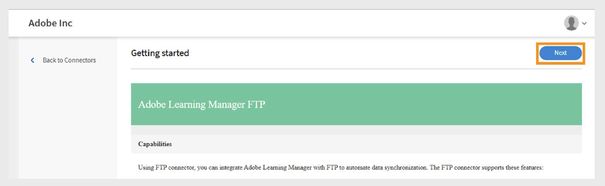

# Adobe Learning Manager中的FTP连接器

## 简介

FTP（文件传输协议）是一种标准网络协议，用于通过Internet或本地网络在客户端和服务器之间传输文件。 它使用户能够在远程服务器上上传、下载和管理文件。 为了确保文件传输安全，通常使用SFTP（SSH文件传输协议）和FTPS（FTP安全）等变体。 FTP广泛应用于企业环境中，实现系统间的数据自动交换，例如在Adobe Learning Manager和外部平台之间同步用户或培训数据。

本文档为集成管理员提供了有关在Adobe Learning Manager中设置并使用FTP连接器的分步指导。 FTP连接器使用安全文件传输协议实现Learning Manager与外部系统之间的自动数据交换。

您将学习如何配置FTP连接、映射数据字段、计划自动用户导入或导出以及监视同步活动。 本指南支持与外部学习平台或HR系统的顺畅和安全集成。 您可以导入内部用户和xAPI语句，以及导出用户技能、学习者成绩单和xAPI数据。

集成管理员必须生成用于迁移用户、用户数据或学习内容的CSV文件，并将其上传到Adobe Learning Manager FTP帐户中指定的文件夹。 然后，Adobe Learning Manager会根据定义的计划读取、合并和导入数据。

根据需要或通过设置满足组织需求的计划来执行这些操作。

## FTP集成的好处

- 减少数据管理中的手动工作量和人为错误。
- 同时集成来自多个外部源的数据。
- 支持按需和计划数据操作。
- 允许在不同的系统格式之间进行详细的字段映射。

## 先决条件

在配置FTP连接器之前，请确保您的环境满足以下要求：

- 具有FTP连接器权限的集成管理员角色。
- 稳定的互联网连接，有足够的带宽用于文件传输。
- 允许所需端口上的FTP通信的防火墙配置。
- 所需的端口访问，具体取决于您的安全要求

### 权限和访问

确保您拥有以下权限：

- 访问以生成和管理SSH密钥（如果使用SSH身份验证）。
- 在指定的FTP文件夹中创建和更新CSV文件的权限。

## 关键功能

### 使用FTP连接器导入和导出数据

Adobe Learning Manager中的FTP连接器简化了外部系统与Adobe Learning Manager帐户之间的数据交换。 它支持按计划按需执行导入或导出操作，从而减少手动操作，并确保提供准确的最新信息。

该方法支持与多个外部系统的集成。 如果不同系统生成单独的CSV文件，则Adobe Learning Manager会合并数据并将其导入为单个批。

### 将数据导入Adobe Learning Manager

_用户数据导入_

将结构化CSV文件上传到指定的FTP文件夹，以导入内部用户数据。 Adobe Learning Manager会根据您配置的计划读取并处理这些文件，以使用户信息保持最新。

_多源集成_

如果您使用的是多个外部系统，则每个系统都可以生成自己的CSV文件。 Adobe Learning Manager会将文件合并为单个批处理数据，从而更轻松地管理来自不同源的用户记录。

_xAPI导入_

此连接器还支持xAPI (Experience API)语句。 从第三方学习系统导入这些内容，以跟踪和报告多个平台上的学习活动。

### 从Adobe Learning Manager导出数据

_学习者数据导出_

将用户数据（如技能进度、课程完成情况和性能度量）导出到指定的FTP位置。 将此数据用于外部报表或分析。

_学员成绩单_

生成并导出详细的成绩单以及课程完成、认证和学习路径，以支持合规性和凭据验证。

### 属性映射

将CSV文件列映射到Adobe Learning Manager用户属性。 您可以根据需要重复使用和更新映射配置，从而轻松适应数据需求的变化。

### 时间安排和自动化

将导入和导出任务安排为定期运行，如每天、每周或自定义间隔。 这样可以确保无需手动操作即可实现一致的数据更新。

## 配置FTP连接器

配置FTP连接器以在Adobe Learning Manager和外部系统之间建立安全的数据同步。

配置FTP连接器：

1. 以集成管理员身份登录。
2. 选择&#x200B;**Adobe Learning Manager FTP**，然后选择&#x200B;**开始使用**。

   
   _Adobe Learning Manager FTP连接器界面显示“开始使用”按钮_

3. 选择“**下一步**”以继续进行FTP连接器设置向导。

   
   _“配置”页面显示“下一步”按钮，以继续进行FTP连接器设置_

### 配置身份验证

Adobe Learning Manager支持三种身份验证方法，每种方法都有不同的安全级别和复杂性要求。

#### 基本身份验证

此方法使用传统的用户名和密码凭据进行FTP访问。 虽然实现起来更简单，但是它比基于SSH的替代方案提供更低的安全性。

1. 选择&#x200B;**使用密码创建基本身份验证**。
2. 在提供的字段中键入FTP用户名和密码。 在继续之前，请验证输入的凭据是否正确。

   
   _包含用户名和密码字段的FTP身份验证表单，显示已选择的基本身份验证选项_

#### 现有SSH密钥身份验证

如果已建立用于安全身份验证的SSH密钥对，请使用此方法。

1. 选择&#x200B;**使用现有SSH密钥创建身份验证**。
2. 将公钥内容复制并粘贴到提供的文本字段中。 确保公钥格式正确（通常从ssh-rsa或ssh-ed25519开始）。

   
   _用于公钥输入的SSH密钥身份验证接口_

#### 生成新的SSH密钥

使用此选项专门为此FTP连接创建新的SSH密钥对。

1. 选择&#x200B;**通过生成新的SSH密钥创建身份验证**。
2. 选择&#x200B;**生成SSH密钥**&#x200B;以创建新的密钥对。 安全地下载和存储生成的私钥。 将自动为FTP连接配置公钥。

   
   _具有“生成SSH密钥”按钮和其他配置选项的SSH密钥生成屏幕_

## 使用FileZilla连接到FTP

FileZilla是用于FTP连接管理的可选工具。 当您需要手动上传文件、验证目录结构或解决Adobe Learning Manager自动流程之外的连接问题时，可以使用该选项。

### FileZilla安装和设置

FileZilla是一种免费的开源FTP客户端，为文件传输操作提供了一个用户友好的界面。

要将FTP连接到FileZilla：

1. 从[官方网站](https://filezilla-project.org/)下载并安装FileZilla。
2. 打开&#x200B;**FileZilla**。
3. 选择&#x200B;**文件**，然后选择&#x200B;**站点管理器**。
4. 选择&#x200B;**新站点**。
5. 键入以下详细信息：
   - **FTP域：**&#x200B;要连接到的FTP服务器的地址，例如ftp.example.com。 您可以在Adobe Learning Manager的“FTP连接器”页面上找到您的主机域。
   - **端口：**&#x200B;默认FTP端口为21。 但是，Adobe Learning Manager使用端口22进行安全连接。
   - **FTP用户名：**&#x200B;访问FTP服务器所需的登录名。
   - **FTP密码：**&#x200B;密码已链接到您的FTP用户名。
6. 选择&#x200B;**连接**。
7. 连接后，您可以通过在本地（左）和远程（右）面板之间拖放来传输文件。

## 在Adobe Learning Manager中使用FTP连接器

### 使用FTP连接器导入内部用户

用户导入功能允许自动将员工数据从HR系统和其他外部源同步到Adobe Learning Manager。

### 映射属性

属性映射将创建您的外部数据与Adobe Learning Manager支持的数据结构之间的连接，以确保数据加载到正确的字段中。 此步骤为必须操作。

要映射属性，请执行以下操作：

1. 在&#x200B;**FTP连接器**&#x200B;页面中选择&#x200B;**内部用户**。
2. 选择&#x200B;**列映射**。
3. 在&#x200B;**映射属性**&#x200B;页面中：
   - **左侧**&#x200B;显示Adobe Learning Manager中的必填字段。
   - **右侧**&#x200B;显示CSV列名称。 最初，这一面是空的下拉菜单。
   - 选择&#x200B;**选择CSV**&#x200B;以上传示例CSV文件。 这样将在右侧下拉列表中填充CSV中的列名称。 请参阅[此文章](https://experienceleague.adobe.com/zh-hans/docs/learning-manager/using/integration/migration-manual#csv)。
   - 将每个Adobe Learning Manager字段映射到相应的CSV列。

   
   _属性映射界面在左侧显示Adobe Learning Manager字段，在右侧显示CSV列下拉列表_

4. 选择&#x200B;**保存**&#x200B;以完成映射。

保存后，配置的帐户在管理员应用中显示为&#x200B;**数据源**。 然后，管理员可以计划导入或触发手动同步。

### 导入xAPI语句

xAPI语句导入功能可将外部学习数据导入Adobe Learning Manager，从而实现详细的学习活动跟踪。

_配置源_

xAPI源配置可在外部学习系统与Adobe Learning Manager的活动跟踪之间建立连接。

要配置源：

1. 导航至xAPI配置部分。
2. 在配置列表中选择&#x200B;**添加新配置**。

   
   _配置管理页面，其中包含“添加新配置”按钮和现有配置列表_

3. 键入&#x200B;**名称**&#x200B;和&#x200B;**源文件名**：
   - **名称：**&#x200B;此xAPI源的描述性标识符（例如，LMS集成或外部培训系统）。
   - **源文件名：**&#x200B;将上传到FTP文件夹的准确文件名（必须完全匹配，包括文件扩展名）。

   
   _显示名称字段和源文件名字段的配置表单_

4. 选择&#x200B;**保存**&#x200B;以创建基本配置。

_添加筛选器（可选）_

过滤器允许您根据特定条件选择性地导入xAPI语句。

要为源添加筛选器，请执行以下操作：

1. 在左侧窗格中选择&#x200B;**筛选器**。
2. 选择&#x200B;**添加新筛选器**。

   
   _使用“添加新筛选器”按钮筛选配置页面_

3. 配置以下项：
   - **名称：**&#x200B;筛选器规则的描述性名称。
   - **条件：**&#x200B;比较运算符（等于、包含、大于等）。

   
   _显示名称字段和条件的筛选器创建对话框_

4. 选择&#x200B;**添加新筛选器**&#x200B;以添加更多筛选器。
5. 在&#x200B;**操作**&#x200B;列下，根据需要选择&#x200B;**保存**&#x200B;或&#x200B;**删除**。
6. 添加筛选器后，选择&#x200B;**保存**。

_映射字段_

要映射字段，请执行以下操作：

1. 在左侧窗格中选择&#x200B;**映射**。
2. 在&#x200B;**映射**&#x200B;页面上，您将在左侧看到JSON字段路径，在右侧看到CSV列名称。

   
   _为导入源添加映射_

3. 默认情况下，映射以下必填字段：
   - **actor.mbox：**&#x200B;这表示学习者（表演者）的电子邮件地址
操作)。 它唯一地标识了活动执行者。
   - **verb.id：**&#x200B;这是学习者执行的操作的标识符，例如
已完成、已尝试或已通过。 它指定了学习者的操作。
   - **object.id：**&#x200B;这表示学习者与之交互的学习对象或活动，
例如课程、模块或学习路径。
4. 选择&#x200B;**添加新映射**&#x200B;以映射其他字段。
5. 对于每个字段，选择适当的&#x200B;**数据类型**（字符串、数字、布尔值或日期）。
6. 选择&#x200B;**保存**&#x200B;以完成映射。

## 安排导入

自动计划确保一致的数据同步，无需手动干预，
维护当前学习活动记录。

要计划导入，请执行以下操作：

1. 在左侧窗格中选择&#x200B;**配置计划**。

   
   _计划配置页面，显示启用选项和计时控件_

2. 选择&#x200B;**启用使用此连接导入xAPI语句。**
3. 选择&#x200B;**启用计划**&#x200B;以设置自动导入。
4. 设置以下参数：
   - **开始日期：**&#x200B;计划的导入应在何时开始。
   - **时间：**&#x200B;一天中的导入执行时间。
   - **在以下时间后重复：**&#x200B;导入应运行的频率（每日、每周、自定义间隔）。
5. 选择&#x200B;**“保存”**。

## 按需运行（可选）

按需执行可在常规计划操作之外提供即时数据导入。

何时使用按需导入：

- 在计划之前测试新配置
- 处理紧急或时间敏感数据更新
- 处理一次性数据迁移或更正。 解决导入问题

要手动导入xAPI语句，请执行以下操作：

1. 在左侧窗格中选择&#x200B;**按需**。
2. 选择&#x200B;**执行**。

   
   具有“执行”按钮的&#x200B;_按需执行页_

## 查看执行状态

通过状态监控，可以主动管理导入操作并快速发现问题。

要查看执行状态，请执行以下操作：

1. 选择&#x200B;**执行状态**&#x200B;以查看所有导入运行的列表。
2. 该页面显示：

   - **开始日期：**&#x200B;导入操作开始的时间。
   - **持续时间：**&#x200B;处理所需的总时间。
   - **导入类型：**&#x200B;是计划导入还是按需导入。
   - **当前状态：**&#x200B;实时状态信息。
      - **正在进行：**&#x200B;导入当前正在运行
      - **已完成：**&#x200B;成功完成，记录计数
      - **失败：**&#x200B;诊断信息出错

## 解决导入失败问题

执行状态部分按时间顺序提供了所有导入任务的全面摘要，从而允许管理员监视操作并快速确定问题。

状态指示器：

- **成功：**&#x200B;导入已完成，未出现错误。
- **警告符号：**&#x200B;表示执行过程中出现失败或问题。
- **正在进行：**&#x200B;导入操作当前正在运行。
- **待处理：**&#x200B;导入已计划但尚未开始。

发生故障时，系统会在失败的导入运行旁显示警告指示器。 选择错误报告链接以下载详细的错误报告。
