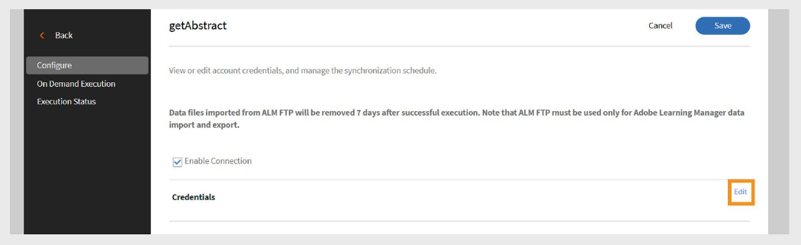
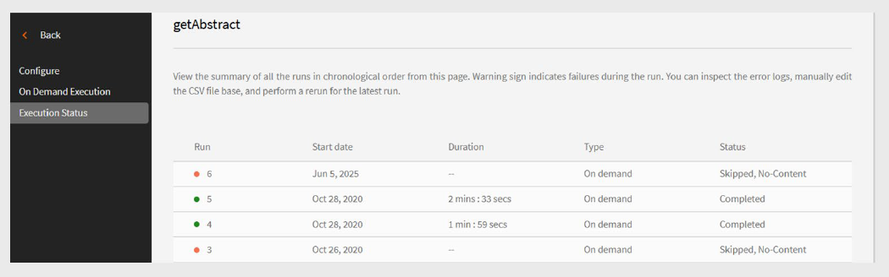

# Adobe Learning Manager的getAbstract连接器

## 简介

**getAbstract连接器**&#x200B;专为[getAbstract.com](https://www.getabstract.com/)的企业客户设计。 它允许学习者直接通过Adobe Learning Manager发现和使用getAbstract内容。 连接器还允许管理员自动导入用户参与数据并跟踪学习者完成记录。

Adobe Learning Manager希望为学习者提供持续的、自我指导的学习机会，重点放在领导力和软技能上。 管理员使用getAbstract连接器将组织的getAbstract帐户连接到Adobe Learning Manager，而不是在内部开发所有内容。

- 自动将getAbstract内容导入Adobe Learning Manager。
- 跟踪学习者对课程和学习路径的使用情况。

本文介绍了在Adobe Learning Manager中配置和管理getAbstract连接器的步骤。

## 先决条件

- 在配置连接器之前，请确保已为您的帐户启用&#x200B;**迁移**&#x200B;功能。
- 从您的getAbstract帐户代表获取&#x200B;**客户端ID**&#x200B;和&#x200B;**客户端密钥**。 检索课程元数据和用户使用数据时需要这些凭据。

## 配置 getAbstract 连接器

getAbstract连接器使Adobe Learning Manager管理员能够集成来自getAbstract的高质量精选内容，从而增强学习体验。

配置getAbstract连接器：

1. 以集成管理员身份登录。
2. 在主页上选择&#x200B;**getAbstract**。
3. 从&#x200B;**连接器**&#x200B;磁贴上的以下选项中进行选择：

   - **入门**：连接器概述。
   - **连接**：创建新连接。
   - **管理连接**：查看或修改现有连接。

   
   _getAbstract图块显示三个配置选项_

## 创建新连接

要创建新连接，请执行以下操作：

1. 选择&#x200B;**连接**。

   
   _选择“在getAbstract磁贴上连接”以创建新连接_

2. 键入&#x200B;**连接名称**。
3. 键入&#x200B;**客户端ID**&#x200B;和&#x200B;**客户端密钥**。

   
   _在getAbstract连接页面上键入连接、客户端ID和客户端密钥_

4. 选择&#x200B;**保存**&#x200B;以创建连接。

## 管理getAbstract连接器

在导入数据之前，您必须配置连接器并设置同步计划。 配置后，连接器会自动提取使用情况数据，使您可监控学习者进度并在学习计划和报告中包含getAbstract内容。

### 启用连接

要启用连接，请执行以下操作：

1. 在&#x200B;**getAbstract**&#x200B;磁贴上选择&#x200B;**管理连接**。

   
   _管理连接以配置和计划数据导入_

2. 选择连接。
3. 在左侧导览窗格中选择&#x200B;**配置**。
4. 选择&#x200B;**启用连接**，然后选择&#x200B;**保存**。

   
   _启用连接以将数据从getAbstract导入到Adobe Learning Manager_

### 编辑连接

要编辑连接，请执行以下操作：

1. 在&#x200B;**getAbstract**&#x200B;磁贴上选择&#x200B;**管理连接**。
2. 选择连接。
3. 在左侧导览窗格中选择&#x200B;**配置**。
4. 选择&#x200B;**编辑**&#x200B;以更新&#x200B;**客户端ID**&#x200B;和&#x200B;**客户端密钥**。

   
   _编辑凭据，包括客户端ID和客户端密钥_

5. 选择&#x200B;**“保存”**。

### 计划同步

要计划同步，请执行以下操作：

1. 在&#x200B;**getAbstract**&#x200B;磁贴上选择&#x200B;**管理连接**。
2. 选择连接。
3. 在左侧导览窗格中选择&#x200B;**配置**。
4. 在&#x200B;**计划同步**&#x200B;部分下选择&#x200B;**启用计划**。

   
   _安排将数据从getAbstract导入到Adobe Learning Manager_

5. 选择UTC格式的开始日期和时间。
6. 键入同步应在几天后重复。
7. 选择&#x200B;**“保存”**。

将保存同步设置。 连接器将按计划运行，并将数据从getAbstract导入Adobe Learning Manager。

## 运行按需同步

使用&#x200B;**按需同步**&#x200B;选项，您可以手动将getAbstract中的数据导入Adobe Learning Manager。 当您想要立即更新学习者活动数据，而无需等待下一个计划的同步时，此功能非常有用。

要运行按需数据导入，请执行以下操作：

1. 在&#x200B;**getAbstract**&#x200B;磁贴上选择&#x200B;**管理连接**。
2. 选择连接。
3. 从左侧窗格中选择&#x200B;**按需执行**。
4. 选择&#x200B;**开始日期**。

   
   _运行即时数据从getAbstract导入到Adobe Learning Manager的按需请求_

5. 选择下列选项之一：

   - **在执行期间禁用对Adobe Learning Manager的访问**：如果同步可能会导致停机，建议使用该选项。
   - **在执行期间启用对Adobe Learning Manager的访问**：建议使用此选项以避免服务中断。
6. 选择“**执行**”以导入从开始日期到现在的所有数据。

### 查看执行历史记录

**执行状态**&#x200B;页按顺序列出了所有同步运行。 如果运行出现错误，则会显示警告图标。 您可以检查错误日志，修复CSV文件，并根据需要重新运行最新的同步。

要查看执行历史记录，请执行以下操作：

1. 在左侧窗格中选择&#x200B;**执行状态**。
2. 您可以看到以下列：
   - **运行**
   - **开始日期**
   - **持续时间**
   - **类型**（已计划或按需）
   - **状态**（正在进行或完成）

   
   _查看按需导入和计划导入的执行状态_

>[!NOTE]
>
>如果删除并重新创建连接，则仍将显示以前运行的执行历史记录。 您只能重新运行最新的同步。

### 成功同步的要求

要确保同步正常工作，请执行以下操作：

- 在指定的同步日期内，有效的用户源文件必须位于getAbstract FTP文件夹中。
- 文件应遵循命名格式：
   - report_export_yyyy_MM_dd_HHmmss.xlsx或，
   - report_export_yyyy_MM_dd.xlsx

下载[示例getAbstract用户订阅源文件](https://experienceleague.adobe.com/docs/learning-manager/assets/report-export-20170401175342.xlsx?lang=en)以了解格式。
