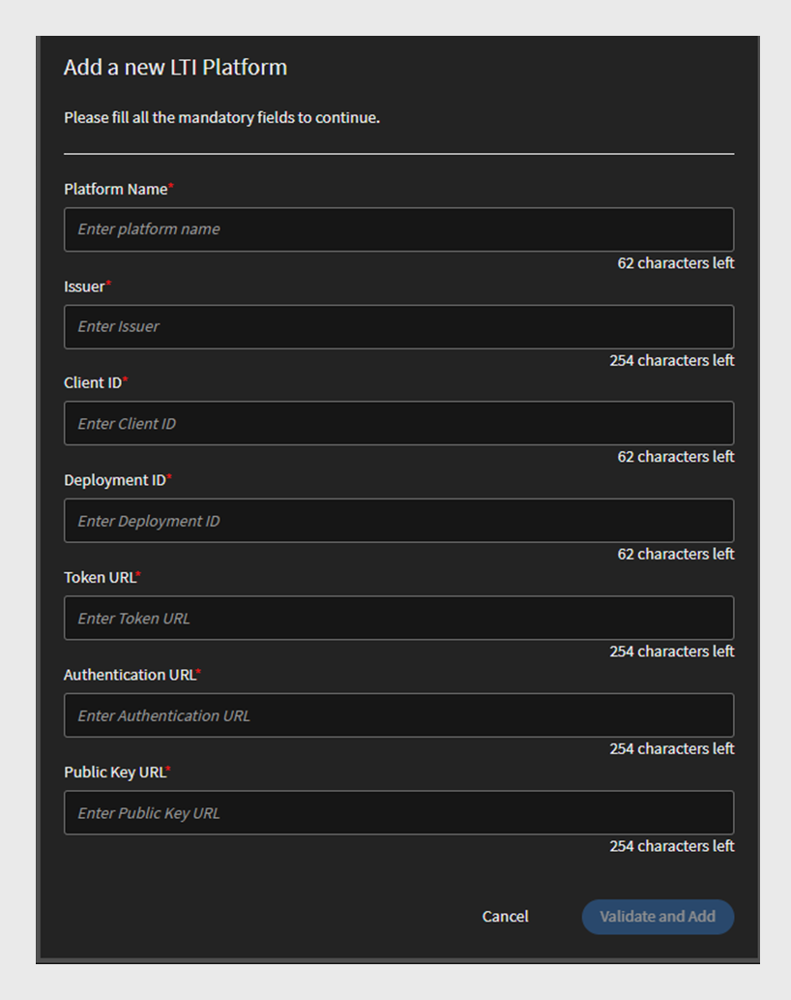
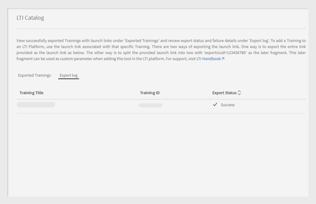

# LTI集成

## 什么是LTI？

学习工具互操作性(LTI)是用于集成教育环境中的丰富学习应用程序的IMS标准。 用户可直接在其LMS中访问外部内容提供商提供的外部学习内容，而无需登录或导航到其他LMS。

## LTI与Adobe Learning Manager集成

Adobe Learning Manager现在支持LTI版本1.3，使其既可以充当工具提供商，也可以充当工具消费者。 此功能增强了Adobe Learning Manager和其他学习管理系统(LMS)之间的互操作性。

**LTI作为工具提供程序**：LTI作为工具提供程序允许外部系统与LMS集成。 Adobe Learning Manager充当LTI工具提供商，允许其他LMS平台直接在其LMS中从Adobe Learning Manager访问学习对象。

**LTI作为工具使用者**：LTI作为工具使用者允许LMS通过学习工具互操作性(LTI)集成外部工具。 在这种情况下，LMS是使用外部工具提供的服务。 Adobe Learning Manager作为LTI工具消费者，可集成第三方学习工具，允许Adobe Learning Manager学习者使用Adobe Learning Manager内第三方工具中的学习对象。

## 在ALM中设置LTI连接器

按照以下步骤在Adobe Learning Manager中启用LTI集成：

1. 以&#x200B;**[!UICONTROL 集成管理员]**&#x200B;身份登录。
2. 在主页上，选择&#x200B;**[!UICONTROL 应用程序]** > **[!UICONTROL 特色应用程序]**。
3. 在&#x200B;**[!UICONTROL 应用程序]**&#x200B;页面上选择&#x200B;**[!UICONTROL LTI集成]**。
4. 选择&#x200B;**[!UICONTROL 启用LTI集成]**&#x200B;选项，然后选择&#x200B;**[!UICONTROL 保存]**。

_启用LTI集成_

>[!NOTE]
>
>启用后，您将无法修改或禁用LTI集成选项。

这将在管理员帐户中创建新的LTI集成侧栏。

_LTI侧边栏_

已在&#x200B;**[!UICONTROL 自定义角色]**&#x200B;部分的&#x200B;**[!UICONTROL 帐户权限]**&#x200B;下添加了新的自定义角色&#x200B;**[!UICONTROL LTI集成]**。 管理员可将此角色分配给用户，以使其可访问&#x200B;**[!UICONTROL LTI集成]**&#x200B;部分。 管理员还需要向这些用户授予&#x200B;**[!UICONTROL 目录]**&#x200B;权限，以便导出课程。 通过此设置，可完全访问“LTI”和“目录”部分以导出课程。

_LTI集成自定义角色_

## Adobe Learning Manager（LTI工具提供商）

作为LTI提供商，Adobe Learning Manager允许您将目录中的课程导出为可与外部LMS平台共享的LTI包。

### 创建并与外部LMS共享LTI凭据 — 管理员工作流程

请按照以下步骤与外部LMS共享LTI凭据：

1. 以&#x200B;**[!UICONTROL 管理员]**&#x200B;身份登录。
2. 在主页上，选择&#x200B;**[!UICONTROL LTI集成]** > **[!UICONTROL LTI工具配置]**。 您可以在此页面上看到配置凭据。
3. 管理员可以与外部LMS共享这些凭据以进行LTI站点注册。

   
   _LTI工具配置凭据_

   * **[!UICONTROL 令牌URL]**： LMS请求访问令牌以与LTI工具进行身份验证和授权通信的URL。
   * **[!UICONTROL 目标链接URL]**：从LMS启动LTI工具时重定向用户的目标URL。
   * **[!UICONTROL 公钥集URL]**：提供用于验证安全令牌以进行安全通信的公钥的URL。
   * **[!UICONTROL 重定向URL]**：在LTI工具上完成操作后发送用户的URL，通常会将其重定向回LMS。

### 外部LMS设置

外部LMS管理员使用Adobe Learning Manager管理员共享的凭据注册Adobe Learning Manager并生成凭据。 这些凭据将添加到Adobe Learning Manager中，这是将Adobe Learning Manager设置为工具提供商的最后一步。 以下是外部LMS生成的凭据：

* **[!UICONTROL 颁发者或平台ID]**：将LTI启动请求发送到工具提供程序的LMS或平台的唯一标识符。
* **[!UICONTROL 客户端ID]**：LMS为授权目的分配给LTI工具的唯一标识符。
* **[!UICONTROL 部署ID]**：将特定LTI工具部署链接到LMS以管理多个实例的标识符。
* **[!UICONTROL 令牌URL]**： LMS请求访问令牌以验证和授权与LTI工具的交互的端点。
* **[!UICONTROL 身份验证URL]**： LMS发送用户以验证和启动LTI连接的URL。
* **[!UICONTROL 公钥URL]**：提供LTI工具使用的公钥的URL，用于验证安全令牌并确保安全通信。

### 将Adobe Learning Manager添加为工具提供商 — 管理员工作流程

请按照以下步骤将Adobe Learning Manager添加为工具提供程序：

1. 以&#x200B;**[!UICONTROL 管理员]**&#x200B;身份登录。
2. 在主页上，选择&#x200B;**[!UICONTROL LTI集成]** > **[!UICONTROL LTI平台]**。
3. 选择“**[!UICONTROL 添加]**”，然后输入外部LMS共享的凭据。

   
   _添加新的LTI平台_

4. 添加所有这些值后，选择&#x200B;**[!UICONTROL 验证]**&#x200B;和&#x200B;**[!UICONTROL 添加]**。

### 导出LTI包 — 管理员工作流程

您可以使用LTI工具将培训作为可下载的学习内容包从目录中导出，并可使用学习工具互操作性(LTI)标准与外部学习管理系统(LMS)或平台共享。

按照以下步骤从Adobe Learning Manager导出课程：

1. 以&#x200B;**[!UICONTROL 管理员]**&#x200B;身份登录。
2. 在主页上，选择&#x200B;**[!UICONTROL LTI集成]** > **[!UICONTROL LTI包导出]**。
3. 选择&#x200B;**[!UICONTROL 新包导出]**。

   
   _导出LTI包_

4. 从列表中选择所需的目录。 您可以看到目录中可用的课程列表。
5. 选择所需课程，然后选择&#x200B;**[!UICONTROL 导出为LTI]**。
6. 选择课程以查看启动链接。
7. 选择&#x200B;**[!UICONTROL 下载链接]**&#x200B;图标以下载包。 包是一个压缩文件，其中包含成功导出的IMSCC文件。

使用此启动链接或IMSCC文件，您可以将Adobe Learning Manager课程导出到外部LMS。 学习者可以在其LMS中使用Adobe Learning Manager课程。

>[!NOTE]
>
>如果管理员在创建启动链接后编辑课程或更新模块，链接将自动更新。 但是，如果管理员在创建启动链接后弃用课程，则弃用的课程将无法在LTI使用者中启动。

## Adobe Learning Manager作为LTI消费者 — 管理员工作流程

作为LTI消费者，Adobe Learning Manager允许您使用外部LTI提供商提供的活动、工具、内容和小组件。
要将Adobe Learning Manager添加为LTI消费者，您需要外部LTI提供商提供以下凭据：

* 启动登录 URL
* 目标链接URL
* 重定向 URL
* 公钥类型

请按照以下步骤将Adobe Learning Manager添加为LTI消费者：

1. 以&#x200B;**[!UICONTROL 管理员]**&#x200B;身份登录。
2. 在主页上，选择&#x200B;**[!UICONTROL LTI集成]** > **[!UICONTROL LTI工具注册]**。
3. 选择&#x200B;**[!UICONTROL 添加]** > **[!UICONTROL 新建LTI工具]**。

   >[!NOTE]
   >
   >您可以通过上传.csv文件来导入多个LTI工具。

4. 从LTI提供商输入上述凭据。

   
   _添加新的LTI工具_

5. 完成后，选择&#x200B;**[!UICONTROL 验证]**&#x200B;和&#x200B;**[!UICONTROL 添加]**。
6. 您可以看到以下屏幕：

   
   _注册凭据_

7. 与LTI提供商共享这些凭据以进行注册。 注册完成后，您可以从LTI提供商处获取启动链接或IMSCC文件以导入课程。

### 创建LTI内容 — 作者工作流程

LTI提供商为您提供启动链接或IMSCC文件，以将其课程添加到Adobe Learning Manager。 请按照以下步骤从外部LMS添加课程：

1. 以&#x200B;**[!UICONTROL 作者]**&#x200B;身份登录。
2. 选择&#x200B;**[!UICONTROL 内容库]** > **[!UICONTROL 添加]** > **[!UICONTROL LTI模块]**。

   
   _添加LTI内容 — 作者_

3. 键入&#x200B;**[!UICONTROL Name]**&#x200B;和&#x200B;**[!UICONTROL Description]**。
4. 从LTI提供程序键入&#x200B;**[!UICONTROL 启动链接]**&#x200B;和&#x200B;**[!UICONTROL 自定义参数]**。
5. 从&#x200B;**[!UICONTROL 工具提供商]**&#x200B;下拉菜单中选择您的[!UICONTROL LTI提供商]。
6. 在&#x200B;**[!UICONTROL 添加到文件夹]**&#x200B;选项中搜索并选择&#x200B;**[!UICONTROL 公共]**。 课程因此可供所有作者使用。
7. 选择&#x200B;**[!UICONTROL 保存]**。
创建内容后，您可以在创建课程时添加此内容。

### 使用LTI内容创建课程 — 作者工作流程

请按照以下步骤创建一个包含LTI内容的课程：

1. 以&#x200B;**[!UICONTROL 作者]**&#x200B;身份登录。
2. 在主页上，选择&#x200B;**[!UICONTROL 课程]** > **[!UICONTROL 添加]**。
3. 键入课程的&#x200B;**[!UICONTROL 名称]**&#x200B;和&#x200B;**[!UICONTROL 描述]**。
4. 在&#x200B;**[!UICONTROL 模块]**&#x200B;选项中，选择&#x200B;**[!UICONTROL 添加模块]** > **[!UICONTROL 自学模块]**。
5. 选择您创建的&#x200B;**[!UICONTROL LTI内容]**，然后选择&#x200B;**[!UICONTROL 保存]**。
6. 输入所需的详细信息，如&#x200B;**[!UICONTROL 技能]**、**[!UICONTROL 作者]**&#x200B;和&#x200B;**[!UICONTROL 注册类型]**。
7. 完成后，发布课程。 Adobe Learning Manager学习者可以从外部LTI提供商处参加LTI课程。

## LTI导出失败情景

以下类型的课程无法导出为LTI课程：

* **包含活动模块的课程**：包含基于特定活动的模块的课程。
* **多种交付类型的课程**：多种交付类型的课程包括自学模块、虚拟或教室模块、活动模块和混合学习。
* **具备先决条件的课程**：需要预完成的课程。
* **包含多个注册的课程**：包含多个注册的课程
* **具有多个实例的课程**：提供多个交付实例的课程。

| 默认实例 | 一个或多个非默认实例 | 期望 | 错误消息 |
|---|---|---|---|
| 活动 | 无 | 导出 | 无 |
| 活动 | 活动 | 不导出 | 多个实例 |
| 活动 | 已弃用 | 不导出 | 多个实例 |
| 活动 | 已删除 | 导出 | 无 |
| 已弃用 | 无 | 不导出 | 报废Def实例 |
| 已弃用 | 活动 | 不导出 | 报废Def实例，多个实例 |
| 已弃用 | 已弃用 | 不导出 | 报废Def实例，多个实例 |
| 已弃用 | 删除 | 不导出 | 报废Def实例 |

* **具有多个问题解答的课程**：启用了MQA的课程。
* **启用了实例切换的课程**：允许学习者在实例之间切换的课程。
* **付费课程**：需要为注册付款的课程。
* **课程属于学习路径、认证或学习计划**：课程属于学习路径或计划。
* **非自助注册类型的课程**：限制学习者自助注册的课程。
* **教室或虚拟教室课程**：教室或虚拟教室授课的课程。
* **包含非必修模块的课程**：包含可选模块或非必修模块的课程。

_导出状态_

## LTI限制

以下是LTI消费者和LTI提供商的LTI限制：

* 能够导出影响学习者课程消费体验的混合课程。
* 能够通过课堂、虚拟教室或活动模块导出自学课程，从而影响学习者的课程体验。
* 能够导出共享的课程，例如LinkedIn学习和Go1课程。
* 能够在ALM中启动具有过去注册日期的课程，这会影响学习者的课程访问和体验。
* 学习者无法在iOS ALM移动应用程序上使用LTI课程，这会对课程使用体验造成影响。
* 学习者无法在ALM移动应用程序中离线下载和访问LTI课程，因为这些课程由第三方平台提供。
* 管理员只能查看已启用的目录，而无法查看已禁用的目录。
* ALM对姓名（63个字符）和电子邮件（64个字符）的长度进行了限制，禁止超出这些限制的外部LTI学习者访问。
* 课程完成同步或等级同步延迟是由第三方LTI系统造成的。
* 团队学习者通过团队应用程序或浏览器使用LTI课程时，不会显示课程同步消息，影响学习者通知。
* 用户数据报告无法导出通过LTI注册的用户的数据。
* 当作者在工具使用者中添加启动链接（需要手动选择）时，无法自动识别工具提供程序名称。
* 通过CSV批量上传工具需要对重音字符进行UTF-8编码以避免导入错误。
* LTI帐户管理员无法共享包含LTI模块的课程、学习路径或认证。
* 当用户为已完成的ALM课程重新打开播放器时无法重新同步评分，这会影响学习者的分数更新，并需要手动重新触发程序。
* ALM仅允许活动用户和试用用户使用LTI课程。
* 在Moodle中启用的等级同步会阻止ALM播放器启动，从而影响学习者的课程访问和体验。
* LTI活动字段是单值，不支持多个值。
* 如果在迁移没有核心内容的课程时导出失败，则失败原因不可用。
* 外部LTI课程等级不会显示在学习者成绩单中，而L2测验页面也不会显示分数，从而影响学习者的表现跟踪。

## 最佳实践

建议使用支持LTI的课程创建目录，以防止导出失败并使导出课程更轻松。

显示成功导出状态的LTI目录
