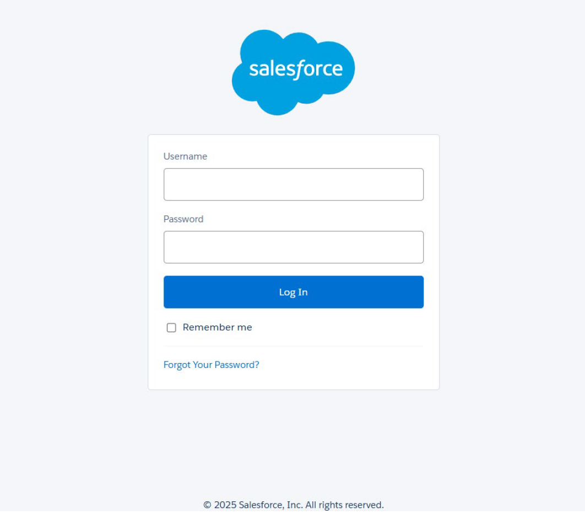

# 适用于Adobe Learning Manager的Salesforce连接器

## 简介

Salesforce连接器集成您的Salesforce和Adobe Learning Manager (ALM)帐户，可实现自动用户导入、数据同步和学习记录导出。 本指南介绍如何在Salesforce中配置连接器、管理用户数据和集成学习见解。

适用于Adobe Learning Manager的Salesforce连接器通过自动导入用户、支持自定义数据映射以及将学习记录导出到Salesforce来实现顺畅集成。

通过学习本指南，您将学习如何：

- 在Salesforce和Adobe Learning Manager之间建立安全连接。
- 从Salesforce配置自动用户导入流程。
- 有效地将Salesforce字段映射到Adobe Learning Manager属性。
- 将学习记录导出回Salesforce以进行综合报告。
- 设置筛选和计划以进行目标数据同步。

## 什么是Salesforce连接器？

Salesforce连接器是一个强大的集成工具，可在您的Salesforce CRM和Adobe Learning Manager之间建立无缝桥梁。 此连接器通过在两个平台之间自动同步用户信息、联系数据和学习记录来消除手动数据输入。

## 关键功能

### 属性映射

它有助于在Salesforce字段和Adobe Learning Manager用户属性之间创建灵活的链接。 您可以将名称、电子邮件和经理等标准字段映射到Learning Manager中的相应属性。 连接器还支持两个平台上的自定义字段，包括用于保持数据准确性的所需字段验证，并允许您保存映射配置以供将来导入时重复使用。

### 自动导入用户

它通过消除了手动CSV文件管理的自动导入流程，简化了用户入门培训和维护。

- 直接从Salesforce用户对象导入，无需中间文件格式。
- 实时同步用户配置文件更改。
- 支持标准用户和外部联系人。

### 自动计划导入

配置自动同步计划，以便在无需手动干预的情况下维护数据货币。 从“每日”、“每周”或“自定义间隔计划”选项中选择。

- 全局组织的时区配置。
- 峰值/非峰值调度可优化系统性能。

### 用户过滤器

- 将过滤条件应用于特定用户群体，并优化数据同步效率。
- 针对目标培训计划的基于角色的筛选。
- 用于区域实施的地理或位置过滤
- 使用Salesforce标准和公式进行自定义字段筛选。

## 先决条件

在配置Salesforce连接器之前，请确保您的环境满足以下要求：

- [Salesforce组织URL](https://myorg.salesforce.com)
- Salesforce和Adobe Learning Manager的管理员登录凭据。
- Salesforce中的系统管理员权限或等效权限。
- 具有适当许可的活动Adobe Learning Manager帐户

## 配置 Salesforce 连接器

借助Adobe Learning Manager中的Salesforce连接器，集成管理员能够在Salesforce和Adobe Learning Manager之间自动同步用户数据和学习记录。

要创建Salesforce连接器，请执行以下操作：

1. 以集成管理员身份登录。
2. 选择&#x200B;**Salesforce**，然后选择&#x200B;**连接**。

   
   _显示Salesforce连接器的Adobe Learning Manager连接器页面，其中突出显示了“连接”按钮_

3. 键入Salesforce组织URL并选择&#x200B;**连接**。 您将转到Salesforce登录页面。

   
   _显示用户名和密码输入字段的Salesforce登录表单_

4. 使用您的用户名和密码登录。 完成任何额外的身份验证步骤，例如双重身份验证或回答安全问题。

   验证成功后，将显示“连接器概述”页面，确认系统之间已建立连接。

   
   _显示成功连接状态的Salesforce连接器概述页面_

### 映射属性

了解属性映射属性映射可创建Salesforce数据字段与Adobe Learning Manager用户属性之间的基本连接，从而确保用户信息在系统之间准确传输。

#### 映射要求

- 所有必需的Adobe Learning Manager字段必须映射到相应的Salesforce字段
- 映射配置在多个导入之间可重复使用和永久保留

要映射属性，请执行以下操作：

1. 导航至Salesforce连接器概述页面。
2. 选择&#x200B;**内部用户**，然后选择&#x200B;**配置映射**。
3. 选择下列选项之一：

   - **用户：**&#x200B;员工或内部团队成员使用的标准Salesforce帐户
   - **联系人：**&#x200B;客户、合作伙伴或供应商等外部个人。

4. 将Adobe Learning Manager的活动字段与映射页面上的Salesforce列进行匹配。 **管理器**&#x200B;字段必须映射到用户管理器电子邮件字段。

   
   _在左侧显示Adobe Learning Manager用户属性的字段映射界面，在右侧显示Salesforce字段下拉列表选项_

5. 选择&#x200B;**保存**&#x200B;以完成映射。

## 导入用户和联系人

Salesforce连接器允许Adobe Learning Manager与您的Salesforce帐户连接，并根据您的配置自动导入用户。

- **内部用户**：拥有Salesforce用户帐户的员工和员工。
- **外部联系人**：客户、合作伙伴、供应商和其他外部利益相关者。
- **混合导入**：单个同步进程中的用户和联系人组合。
- **已筛选的导入**：基于特定条件的目标同步。

Salesforce连接器允许Adobe Learning Manager与您的Salesforce帐户连接，并根据您的配置自动导入用户。

除了标准Salesforce用户之外，连接器还支持导入联系人。 这有助于将培训计划扩展到外部利益相关者，例如客户或合作伙伴。

要导入联系人，请执行以下操作：

1. 在&#x200B;**连接器**&#x200B;页面上选择&#x200B;**Salesforce**。
2. 在连接页面上选择&#x200B;**导入内部用户**。

   
   _突出显示了“导入内部用户”选项的Salesforce连接器页面_

3. 在&#x200B;**导入用户**&#x200B;页面上选择&#x200B;**联系人**。
4. 为&#x200B;**导入前筛选联系人**&#x200B;选项选择&#x200B;**是**。 **
5. 配置下列选项：

   - **选择“联系人”列：**&#x200B;选择要导入Adobe Learning Manager的字段。
   - **指定值：**&#x200B;选择表示所选字段的值。
   - 将Salesforce属性映射到Adobe Learning Manager字段

   
   _显示筛选选项和字段映射的联系人导入配置_

6. 选择&#x200B;**“保存”**。
7. 如果选择&#x200B;**否。 那么将导入所有联系人**。您可以直接映射字段，无需筛选联系人。

## 导出学习记录

学习记录导出功能使您能够与Salesforce共享Adobe Learning Manager数据，从而创建将学习结果与CRM数据结合在一起的全面报告和分析功能。

### Salesforce 中的自定义对象

从Adobe Learning Manager导出学习记录之前，请在Salesforce中创建自定义对象。 自定义对象允许您存储特定于您的组织或行业需求的数据。 有关详细信息，请查看[Salesforce自定义对象](https://trailhead.salesforce.com/en/content/learn/modules/data_modeling/objects_intro)。

### 安装Adobe Learning Manager包

Adobe提供可创建必要自定义对象的预构建包：

- [包1](https://test.salesforce.com/packaging/installPackage.apexp?p0=04t1k0000008WPJ)：核心学习对象和字段
- [包2](https://test.salesforce.com/packaging/installPackage.apexp?p0=04t1k0000008WPT)：扩展学习分析对象
- [包3](https://test.salesforce.com/packaging/installPackage.apexp?p0=04t1k0000008WPi)：其他报表和集成对象

>[!IMPORTANT]
>
>将包URL中的[test.salesforce.com](https://acrobat.adobe.com/home/test.salesforce.com)替换为实际的Salesforce组织域。

### 包安装过程

要安装程序包，请执行以下操作：

1. 以管理员身份登录至Salesforce.
2. 导航到浏览器中的每个程序包URL。
3. 按照每个包对应的安装向导进行操作，并向将访问学习数据的用户授予相应的权限。
4. 在Salesforce中重命名自定义对象的名称。
5. 选择活动，然后单击&#x200B;**保存**。

>[!NOTE]
>
>确保已授予系统管理员对软件包安装后添加的所有活动字段的访问权限。

### 导出记录

要将记录导出到Salesforce，请执行以下操作：

1. 在&#x200B;**Salesforce**&#x200B;连接器页面中选择&#x200B;**导出统一记录**。
2. 从以下选项中选择事件：

   - 新用户添加
   - 培训注册
   - 培训完成
   - 技能注册
   - 技能完成

3. 在&#x200B;**带有**&#x200B;选项的“链接”事件中选择&#x200B;**联系人对象**。 这可确保在Salesforce中创建存在于Adobe Learning Manager中但不存在于Salesforce中的用户。

   
   _显示事件选择和链接选项的学习记录导出配置_

>[!NOTE]
>
>您可以在单个帐户中创建多个连接。 每个连接在Salesforce中最多可支持三个自定义对象。 要为同一Salesforce帐户创建多个连接，最多可以安装三个程序包。 安装的程序包数量应与所需的连接数量相匹配。

## Salesforce应用程序设置

Adobe Learning Manager提供了一个Salesforce应用程序包。 在您的Salesforce实例中安装和配置程序包后，销售用户可以直接在Salesforce门户中访问并完成培训。 该应用程序允许用户在不离开Salesforce的情况下发现新课程、查看个性化推荐和使用内容。

### 访问Salesforce应用程序

设置Salesforce应用程序：

1. 以集成管理员身份登录。
2. 选择&#x200B;**应用程序**，然后选择&#x200B;**特色应用程序**。
3. 选择&#x200B;**Salesforce**。

   
   _显示“精选应用程序”部分的“Adobe Learning Manager应用程序”页面，其中突出显示了Salesforce应用程序磁贴_

4. 请注意，**应用程序ID**&#x200B;和&#x200B;**客户端密钥**&#x200B;显示在说明文本框中。

   
   _Adobe Learning Manager中的Salesforce应用程序详细信息页面，在描述框中显示应用程序ID和客户端密钥_

5. 选择“**批准**”以启用该应用程序。

### 生成访问令牌

要生成访问令牌，请执行以下操作：

1. 在Adobe Learning Manager中导航到&#x200B;**开发人员资源**。
2. 选择&#x200B;**用于测试和开发的访问令牌**。
3. 在&#x200B;**获取OAuth代码**&#x200B;部分中，键入客户端ID（应用程序ID），并且范围必须设置为&#x200B;**admin:read，admin:write**。
4. 选择&#x200B;**提交**。
5. 在&#x200B;**获取刷新令牌**&#x200B;部分中，键入&#x200B;**客户端ID**&#x200B;和&#x200B;**客户端密钥**。
6. 选择&#x200B;**提交**&#x200B;并记下刷新令牌和访问令牌。

>[!IMPORTANT]
>
>记下生成的刷新令牌和访问令牌。

### 创建Salesforce帐户

如果您没有Salesforce帐户，请按照以下步骤操作，使用与您的Adobe Learning Manager帐户相同的电子邮件地址创建一个。 您可以使用开发人员版或企业版。 请务必使用与您的Adobe Learning Manager帐户关联的同一电子邮件ID进行注册。

1. 转到[Salesforce开发人员注册页面](https://developer.salesforce.com/signup)。
2. 使用与您的Adobe Learning Manager帐户使用的相同电子邮件地址键入所需的详细信息。
3. 检查收件箱并通过Salesforce发送的电子邮件验证您的帐户。
4. 设置密码并登录Salesforce。
5. 登录后，请记下您的Salesforce URL（例如https://yourorg.lightning.force.com），以便在配置过程中使用。

### 安装Adobe Learning Manager包

本节介绍如何在Salesforce环境中安装Adobe Learning Manager包。

>[!IMPORTANT]
>
>Adobe Learning Manager应用程序仅支持Salesforce Lightning视图。 在继续之前，请确保已启用Lightning Experience 。

#### 安装程序包

要安装程序包，请执行以下操作：

1. 打开[Adobe Learning Manager包URL](https://login.salesforce.com/packaging/installPackage.apexp?p0=04t1k0000008WOQ)。
2. 在“登录”页面中键入您的用户名和密码。
3. 选择&#x200B;**安装**。 在安装页面上，保持选中“仅限管理员安装”选项；不要更改此选项。
4. 选择&#x200B;**完成**。 系统将引导您转到&#x200B;**已安装的包**&#x200B;页，您可以在该页中看到Adobe Learning Manager已安装的包。

您将重定向到“已安装的包”页面，在该页面中，您可以验证Adobe Learning Manager包的安装

#### 配置应用程序

要配置应用程序，请执行以下操作：

1. 选择&#x200B;**应用程序启动器**（设置旁边的9点网格图标）
2. 搜索Adobe Learning Manager。
3. 要配置应用，请选择&#x200B;**配置**。
4. 选择“**新建**”并添加以下详细信息：

   - **配置**：输入您选择的名称。
   - **ClientID**：输入从第一部分获取的值。
   - **ClientSecret：**&#x200B;输入从第一部分获取的值。
   - **RefreshToken：**&#x200B;输入从第一部分获取的值。
   - **LearningManagerBaseURL：**&#x200B;托管Adobe Learning Manager的站点的URL。

### 远程站点配置

Salesforce需要远程站点设置以允许与Adobe Learning Manager等外部服务通信。

#### 添加远程站点设置

添加远程站点设置：

1. 在Salesforce中，选择右上角的&#x200B;**设置**。
2. 选择页面右上角的&#x200B;**设置**。
3. 在&#x200B;**快速查找**&#x200B;中搜索&#x200B;**远程站点设置**。
4. 选择&#x200B;**新建远程站点**。
5. 输入详细信息：

   - **远程站点名称：**&#x200B;键入您选择的名称（例如，Adobe Learning Manager）。
   - **远程站点URL：**&#x200B;键入托管Adobe Learning Manager的URL。
6. 选择&#x200B;**“保存”**。

### 设置通知

配置通知以使用户了解学习活动和更新。

#### 创建自定义通知

要启用通知，请执行以下操作：

1. 选择右上角的&#x200B;**设置**。
2. 搜索&#x200B;**自定义通知**，然后选择&#x200B;**新建**。
3. 键入以下详细信息：

   - **自定义通知名称：** LearningManagerNotification
   - **API名称：** LearningManagerNotification

4. 选择&#x200B;**桌面**&#x200B;和&#x200B;**移动设备**&#x200B;作为支持的渠道。
5. 选择&#x200B;**“保存”**。

#### 启用移动推送通知（可选）

对于希望在移动设备上接收通知的用户：

要为移动设备启用推送通知，请按以下步骤操作：

1. 在手机上安装Salesforce移动应用程序。
2. 使用凭据登录应用。
3. 转到&#x200B;**设置**，然后选择&#x200B;**通知传递设置**。
4. 添加适用于 iOS 和 Android 版本的 Salesforce。

### 用户配置和权限

本节介绍如何在Salesforce中设置Adobe Learning Manager应用程序的用户访问权限和权限。

#### 了解用户配置文件

Adobe Learning Manager应用程序支持与Adobe Learning Manager中的角色相对应的各种用户配置文件：

- 管理员
- 集成管理员
- 讲师
- 学习者
- 自定义配置文件（根据需要）

#### 分配或创建用户配置文件

您可以使用现有配置文件，也可以为Adobe Learning Manager用户创建自定义配置文件：

**使用现有配置文件**

1. 导航到&#x200B;**设置**，然后选择&#x200B;**用户**。
2. 选择&#x200B;**配置文件**。
3. 选择与用户角色一致的配置文件
4. 在安装包期间将此配置文件分配给用户。

**创建自定义配置文件**

1. 导航到&#x200B;**设置**，然后选择&#x200B;**个用户。 &#x200B;**
2. 选择&#x200B;**配置文件**。
3. 单击&#x200B;**新建配置文件**。
4. 根据现有配置文件为Adobe Learning Manager用户量身定制，创建自定义配置文件。

#### 配置配置文件

要配置配置文件：

1. 安装包后，选择&#x200B;**配置**，然后选择&#x200B;**新建**。
2. 键入以下详细信息：

   - **配置名称**
   - **客户端ID**
   - **客户端密钥**
   - **LearningManagerBaseURL**
   - **禁用重定向**

>[!NOTE]
>
>确保已启用Adobe Learning Manager应用程序，以便所有学习者查看。

#### 设置用户权限

选择用户并分配访问Adobe Learning Manager应用程序所需的权限。

#### 更新个人资料设置

1. 选择一个配置文件（例如，标准配置文件），然后选择&#x200B;**编辑**。
2. 在&#x200B;**自定义应用程序设置**&#x200B;部分中，选中&#x200B;**Adobe Learning Manager**&#x200B;复选框以使应用程序可访问。
3. 在&#x200B;**“自定义选项卡设置”**&#x200B;部分中，将&#x200B;**“学习者主页”**&#x200B;设置为&#x200B;**“默认值”**。
4. 选择&#x200B;**保存**&#x200B;以应用更改。

分配了配置文件的学习者现在可以在Salesforce中访问Adobe Learning Manager应用程序。

您已成功配置适用于Adobe Learning Manager的Salesforce连接器。 用户现在可以直接在Salesforce中访问其学习内容，从而改进了对您组织的培训计划的采用和参与。
