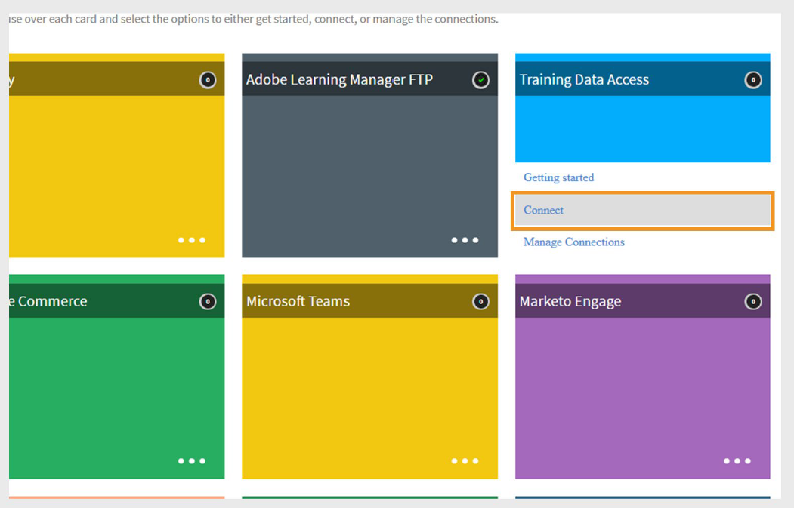

# Adobe Learning Manager中的培训数据访问连接器

## 简介

**培训数据访问连接器**&#x200B;允许您创建无头学习体验，该体验可以是独立的，也可以集成到使用&#x200B;**Adobe Experience Manager (AEM)站点**&#x200B;构建的自定义界面中。 此连接器具有搜索和筛选功能，可帮助您检索并向学习者显示最新培训内容。

>[!IMPORTANT]
>
>- 仅当Adobe Learning Manager作为&#x200B;**加载项**&#x200B;出售到Adobe Experience Manager时，此功能才可用。
>- 通过此连接器检索的课程数据每24小时刷新一次
>- 此连接器不是构建无头或基于AEM的非登录体验的自助式连接器。 请联系Adobe，为您的用例规划正确的方法。

## 工作原理

启用连接器后，Adobe Learning Manager会显示一组公共API，这些API提供培训元数据，例如课程、学习路径和证书。 您可以使用这些API构建一个自定义的品牌前端，该前端显示培训内容并支持搜索和筛选功能。

## 配置培训数据访问连接器

您可以将Adobe Learning Manager与数据存储和搜索系统集成，以将培训元数据推送到AEM Sites或其他无头体验。

要配置连接器，请执行以下操作：

1. 以集成管理员身份登录Adobe Learning Manager.
2. 将鼠标悬停在&#x200B;**培训数据访问**&#x200B;磁贴上，然后选择&#x200B;**连接**。

   
   _选择“连接”以配置培训数据访问连接器_

3. 键入&#x200B;**连接名称**。
4. 选择&#x200B;**接口类型**：

   - **Native Learning Manager**：标准登录体验，默认可用。
   - **无头界面**：高级选项，为未登录的无头前端公开公共API。

   
   _键入培训数据访问连接器配置所需的详细信息_

5. 选择&#x200B;**连接**。 Adobe Learning Manager会自动生成&#x200B;**基本URL**&#x200B;和&#x200B;**CDN URL**。 您将在自定义站点或应用程序中使用这些URL获取培训数据。

>[!NOTE]
>
>享受高级计划的客户与标准客户收到的API URL不同。

## 导出培训元数据

要导出培训元数据：

1. 在连接器页面上选择&#x200B;**导出培训元数据**。
2. 选择&#x200B;**启用使用此连接的培训元数据导出**&#x200B;以开始将您的培训数据推送到搜索和检索系统。
3. 选择&#x200B;**启用计划**&#x200B;并设置开始日期、时间和间隔。

   
   _计划导出培训元数据_

4. 选择&#x200B;**“保存”**。

   - 这会自动将所有课程、学习路径和证书图像上传到&#x200B;**CDN**。
   - 它还会将关联的元数据导出到您的搜索系统。

### 按需导出

- **按需运行导出：**&#x200B;转到&#x200B;**按需**，设置&#x200B;**开始日期**，然后选择&#x200B;**执行**&#x200B;以在需要时运行导出。
- **检查执行状态：**&#x200B;在&#x200B;**执行状态**&#x200B;页面上查看导出进度和历史记录。

## 在AEM中构建和发布网站

要在无头网站或基于AEM Sites的网站上显示培训数据，请执行以下操作：

1. **从[Adobe的GitHub存储库](https://github.com/adobe/adobe-learning-manager-reference-site/releases/tag/1.0.0)安装AEM包**（前提条件）。
2. 使用&#x200B;**基本URL**、**CDN URL**、**客户端ID**、**客户端密钥**&#x200B;和&#x200B;**管理员刷新令牌**&#x200B;在AEM中创建配置。
3. 使用AEM组件构建站点。
4. 为学习者Publish站点。
5. 有关完整的设置详细信息，请参阅[此文章](https://experienceleague.adobe.com/zh-hans/docs/learning-manager/using/integration/aem-sites/adobe-learning-manager-integration-aem)和[此文章](https://experienceleague.adobe.com/zh-hans/docs/learning-manager/using/integration/aem-sites/integrate-aem-learning-manager)。

### 学习者体验

一旦该网站启用：

- 该网站显示通过搜索系统从Adobe Learning Manager检索到的所有&#x200B;**课程**、**学习路径**&#x200B;和&#x200B;**证书**。
- **未登录**&#x200B;的学习者可以浏览和查看课程详细信息。
- 当学习者单击注册课程、学习路径或证书时，系统会提示他们&#x200B;**登录**&#x200B;以完成注册并开始培训。

## 未登录体验

利用未登录体验，您可以为未登录用户创建实时体验。 例如，未登录体验可充当营销活动的登陆页面，以鼓励注册。

Adobe Learning Manager中的未登录体验可使用&#x200B;**培训数据访问**&#x200B;连接器进行配置。 连接器提供以下产品：

- 标准产品
- 高级产品

### 标准产品

标准产品是构建Adobe Learning Manager的本机版本。 用户可以构建仅演示、未登录的无头体验。 演示无头体验不可扩展，不应在生产环境中使用。

### 高级产品

高级产品可帮助用户构建由&#x200B;**培训数据访问**&#x200B;连接器配置的无头界面。 如此一来，用户可以实时获取课程和学习路径的相关数据，如姓名、描述、作者、技能、持续时间等。对于混合式学习情景，您还可以获得实时名额限制、已占用名额、轮候表限制和轮候表数量。 客户可以使用这些API创建搜索和筛选功能，并为未登录学习者创建完整的课程摘要。

客户可以购买高级计划来构建这种高度可扩展的非登录体验。

>[!NOTE]
>
>请联系支持团队或CSM以购买高级计划。

用户购买计划后，CSM团队将为他们激活高级计划。 使用培训数据访问连接器，用户可以使用前面提到的功能设置未登录体验。
