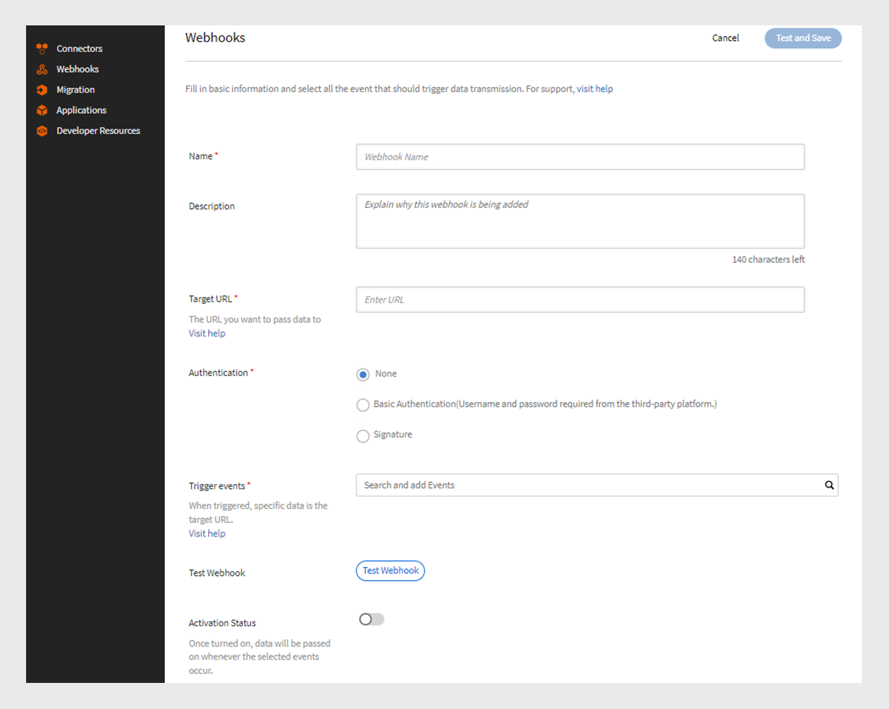

# Webhook

Webhook允许一个实体在特定事件发生时自动向另一个实体发送实时数据或通知。 这样，应用程序就可以向其他应用程序提供信息，而无需经常请求这些信息。 例如，如果用户完成学习管理系统(LMS)课程，Webhook会自动将该信息发送到其他平台，如CRM或报告工具。 Webhook通常用于集成中，以自动化流程并减少系统之间手动更新的需求。 通过提供要向其发送数据的回调URL来设置Webhook。

## Webhook与API

Webhook和API都有助于系统相互通信，但工作方式不同。 通过API，仅在用户请求时共享信息。 例如，如果学习者需要课程进度数据，则会向API发送请求，然后该API会提供信息。 另一方面，当事件发生时，Webhook会立即自动发送数据。 例如，如果学习者完成课程，则学习者无需手动请求即可立即将数据发送到监听程序URL。

## 什么是实时API？

实时API允许应用程序在事件发生时立即交换数据。 传统API需要等待用户请求信息，而实时API则会在数据发生时共享数据。 Webhook充当实时API，每当发生指定事件时帮助立即共享数据。 实时API可确保无需任何手动请求即可立即传输此数据，从而使系统可即时保持更新。

## Webhook事件

Webhook事件是系统中发生的特定操作，可自动将数据发送到侦听器URL。 例如，当学习者注册课程时，将触发Webhook事件并将注册详细信息发送到侦听器URL。
Webhook事件分为两类：

* **实时事件**：事件得到处理并实时发送到目标URL
* **非实时事件**：事件在指定时间批量处理并发送，而不是实时发送

## 监听程序URL

监听器URL是在事件发生时接收数据信息的端点或目标。 每当发生特定事件（例如用户注册了课程），系统就会自动将详细信息发送到此URL，而无需任何手动请求。 监听程序URL是提供所有这些更新的地址。
Webhook会以JSON格式发送相关信息。 以下是Adobe Learning Manager中触发的事件有效负载示例：

```
{
  "accountId": 1010,
  "events": [
    {
      "eventId": "d5fb7071-10a9-46b2-9f9e-79dde346c052",
      "eventName": "COURSE_ENROLLMENT_BATCH",
      "timestamp": 1727414643000,
      "eventInfo": "1727414643000-047210-84242-0",
      "data": {
        "userId": 4279332,
        "loId": "course:7374992",
        "loInstanceId": "course:7376092_10250977",
        "loType": "course",
        "enrollmentSource": "ADMIN_ENROLL",
        "dateEnrolled": 1727414643
      }
    }
  ]
}
```

## 创建和管理Webhook — 集成管理员

按照以下步骤在Adobe Learning Manager中创建Webhook集成：

1. 以&#x200B;**[!UICONTROL 集成管理员]**&#x200B;身份登录。
2. 在主页上，选择&#x200B;**[!UICONTROL Webhook]** > **[!UICONTROL 添加Webhook]**。

   
   _添加Webhook_

3. 键入Webhook的&#x200B;**[!UICONTROL 名称]**&#x200B;和&#x200B;**[!UICONTROL 描述]**。
4. 键入侦听器URL作为要在其中传递事件数据的&#x200B;**[!UICONTROL 目标URL]**。
5. 选择任一身份验证方法：
Webhook中的身份验证是一种安全方法，用于确保发送到侦听器URL的数据来自受信任的源。
   * **[!UICONTROL 无]**：无需身份验证。
   * **[!UICONTROL 基本]**：这是基于凭据的身份验证。 输入用户名和密码。
   * **[!UICONTROL 签名]**：系统创建特殊签名并将其添加到Webhook数据。 接收服务器会检查此代码，以确保数据是真实的，且尚未更改。 生成签名并使用它进行身份验证。 以JSON格式下载签名。
6. 从&#x200B;**[!UICONTROL 触发事件]**&#x200B;下拉列表中选择Webhook事件。

   >[!NOTE]
   >
   >您还可以通过从添加Webhook页面选择测试Webhook选项来测试Webhook。

7. 选择&#x200B;**[!UICONTROL 激活状态]**&#x200B;切换以启用Webhook。 启用后，每当发生所选事件时，都将传递数据。

>[!NOTE]
>
>您最多可以创建和管理5个Webhook。

### 编辑Webhook — 集成管理员

遵循这些步骤，从Adobe Learning Manager编辑Webhook：

1. 以&#x200B;**[!UICONTROL 集成管理员]**&#x200B;身份登录
2. 在主页上选择&#x200B;**[!UICONTROL Webhook]**。
3. 选择要编辑的Webhook。

   
   _编辑Webhook_
4. 选择&#x200B;**[!UICONTROL 编辑]**&#x200B;以修改Webhook的详细信息，然后选择&#x200B;**[!UICONTROL 保存]**。

### 删除Webhook — 集成管理员

遵循这些步骤，从Adobe Learning Manager编辑Webhook：

1. 以&#x200B;**[!UICONTROL 集成管理员]**&#x200B;身份登录。
2. 在主页上选择&#x200B;**[!UICONTROL Webhook]**。
3. 选择要删除的Webhook。
4. 选择&#x200B;**[!UICONTROL 删除]**&#x200B;以删除Webhook。


_删除Webhook_

### 弃用Webhook — 集成管理员

请按照以下步骤弃用Webhook：

1. 以&#x200B;**[!UICONTROL 集成管理员]**&#x200B;身份登录。
2. 在主页上选择&#x200B;**[!UICONTROL Webhook]**。
3. 选择要编辑的Webhook。
4. 选择&#x200B;**[!UICONTROL 编辑]**&#x200B;并禁用&#x200B;**[!UICONTROL 激活状态]**&#x200B;以弃用Webhook。


_弃用Webhook_

## 实时事件

| S.No | Webhook事件 | 描述 |
|---|---|---|
| 1 | CI_STATS | 在课程实例的名额或轮候表可用性发生变化时触发。 |
| 2 | COURSE_ENROLLMENT | 在学习者注册课程时触发。 |
| 3 | COURSE_COMPLETED | 在学习者完成课程时触发。 |
| 4 | LEARNING_PATH_ENROLLMENT | 在学习者注册学习路径时触发。 |
| 5 | LEARNING_PATH_COMPLETED | 在学习者完成学习路径时触发。 |
| 6 | CERTIFICATION_ENROLLMENT | 学习者注册认证时触发。 |
| 7 | CERTIFICATION_COMPLETED | 在学习者完成认证时触发。 |
| 8 | COURSE_UNENROLLMENT | 在学习者取消课程注册时触发。 |
| 9 | LEARNING_PATH_UNENROLLMENT | 在学习者取消注册学习路径时触发。 |
| 10 | CERTIFICATION_UNENROLLMENT | 在学习者取消注册认证时触发。 |
| 11 | LEARNING_OBJECT_DRAFT | 在创建处于草稿状态的学习对象时触发。 |
| 12 | LEARNING_OBJECT_DELETION | 删除学习对象时触发。 |
| 13 | LEARNING_OBJECT_MODIFICATION | 在修改学习对象期间触发。 |
| 14 | LEARNING_OBJECT_INSTANCE_MODIFICATION | 在创建或修改学习对象实例期间触发。<div><b>注意：</b>建议仅在发布课程后使用课程实例。</div> |
| 15 | LEARNING_OBJECT_INSTANCE_DELETION | 在删除学习对象实例期间触发。 |

## 非实时事件

| S.No | Webhook事件 | 描述 |
|---|---|---|
| 1 | COURSE_ENROLLMENT_BATCH | 管理员/经理/平台在课程中注册学习者时触发。 |
| 2 | COURSE_COMPLETED_BATCH | 在管理员/经理/平台将课程标记为已完成时触发。 |
| 3 | LEARNING_PATH_ENROLLMENT_BATCH | 在管理员/经理/平台为学习者注册学习路径时触发。 |
| 4 | LEARNING_PATH_COMPLETED_BATCH | 在管理员/经理将学习路径标记为已完成时触发。 |
| 5 | CERTIFICATION_ENROLLMENT_BATCH | 管理员/经理/平台在认证中注册学习者时触发。 |
| 6 | CERTIFICATION_COMPLETED_BATCH | 在管理员/经理/平台将认证标记为已完成时触发。 |
| 7 | LEARNER_PROGRESS | 模块完成后，跟踪学习者的进度。 |
| 8 | COURSE_UNENROLLMENT_BATCH | 在管理员/经理/平台取消注册课程中的学习者时触发。 |
| 9 | LEARNING_PATH_UNENROLLMENT_BATCH | 在管理员/经理/平台从学习路径中取消注册学习者时触发。 |
| 10 | CERTIFICATION_UNENROLLMENT_BATCH | 在管理员/经理/平台取消注册学习者时触发。 |
| 11 | LEARNING_OBJECT_MODIFICATION_BATCH | 在通过迁移工作流程修改学习对象时触发。 |
| 12 | LEARNING_OBJECT_INSTANCE_MODIFICATION_BATCH | 在通过迁移工作流程创建或修改学习对象实例时触发。 |

## Webhook的最佳实践

Webhook支持服务之间的实时事件驱动通信。 但是，实施不当可能会导致事件丢失、系统性能缓慢或安全风险。 以下是实施Webhook的最佳实践，侧重于容错性、可靠性和安全性。

### 容错

ALM Webhook系统的容错为订阅者提供建议，以供其处理潜在问题，例如事件丢失、重复事件和乱序交付。

ALM的连接超时配置为10秒，套接字超时配置为5秒。 期望客户端在收到消息后立即确认消息。 这是为了确保客户端在处理消息时不会滞后。 如果存在耗时的下游处理过程，客户端仍应立即确认该事件，然后在其终端处理下游处理过程。

#### 数据保留

事件会保留7天。 如果在此时间内未处理这些文档，则会永久失去这些文档。 如果恢复是在最后一天进行的，并且需要更多时间，则系统不会延长保留期。
如果生成事件的速度快于事件的使用速度，则某些事件可能会丢失。 尽管这种情况并不常见，但订阅者应进行监控，以防其成为长期问题。

#### Webhook禁用

当订阅者无法响应Webhook事件时，ALM系统使用指数回退重试Webhook，以避免订阅者不知所措。

重试过程以5秒的初始间隔开始。 如果订户没有响应，等待时间将增加一倍，达到10、20、40和80秒，最终增加到最多5分钟。 达到5分钟后，系统将继续每5分钟重试一次，直到7天的保留期结束为止。 如果订阅者在此整个期间仍未响应，则将自动禁用Webhook。 我们将定期向订户发送提醒电子邮件。

#### 重复事件

如果订阅者在处理某个事件后需要超过5秒的时间作出响应，则系统可能会尝试再次处理同一事件。 建议使用事件ID来跟踪已处理的事件。 此外，如果Webhook在发送事件后崩溃，但在保存该事件之前处理了该事件，则可能会重试同一组事件。 建议使用批处理ID或单个事件ID来识别和忽略任何重复项。

#### 无序事件

ALM试图将事件保持正确的顺序，但有时事件可能会无序传递，尤其是在实时和非实时事件之间。

如果管理员一次在课程中注册多名学习者，则注册事件会标记为非实时。 但是，如果学习者快速完成课程，则该完成事件将标记为实时事件，并且可能会在注册事件之前交付。

#### 容错建议

为防止发生这些故障，订阅者应主动监视Webhook事件，并对遗漏事件、重复交付或序列无序等问题设置警报。

## Webhook事件的特定准则

1. 如果首先收到LEARNER_PROGRESS事件，则忽略下列事件：

   * COURSE_ENROLLMENT
   * COURSE_ENROLLMENT_BATCH
   * LEARNING_PATH_ENROLLMENT
   * LEARNING_PATH_ENROLLMENT_BATCH
   * CERTIFICATION_ENROLLMENT
   * CERTIFICATION_ENROLLMENT_BATCH

2. 如果LEARNER_PROGRESS事件发生在以下事件之后，请将其忽略：

   * COURSE_COMPLETED
   * COURSE_COMPLETED_BATCH
   * LEARNING_PATH_COMPLETED
   * LEARNING_PATH_COMPLETED_BATCH
   * CERTIFICATION_COMPLETED
   * CERTIFICATION_COMPLETED_BATCH

3. 使用timestamp字段确定是忽略还是处理事件（LEARNER_PROGRESS事件除外）。


## 事件的有效负载示例

+++CI_STATS

```
{
  "accountId": 1234,
  "events": [
    {
      "eventId": "01234567-0458-4450-b5dd-6bc1edr4560",
      "eventName": "CI_STATS",
      "timestamp": 1725604147,
      "eventInfo": "1725604145-LoSt",
      "data": {
        "loInstanceId": "course:1234567_123456775",
        "waitlistCount": 0,
        "enrollmentCount": 10,
        "seatLimit": 30
      }
    }
  ]
}
```

+++

+++COURSE_ENROLLMENT

```
{
  "accountId": 1234,
  "events": [
    {
      "eventId": "29123ec1-4576-4ec5-a057-3a6dr45t9d6",
      "eventName": "COURSE_ENROLLMENT",
      "timestamp": 1725524713,
      "eventInfo": "1725524713000-040366-10488-0",
      "data": {
        "userId": 1234567,
        "loId": "course:1234567",
        "loInstanceId": "course:1234567_1234567",
        "loType": "course",
        "enrollmentSource": "SELF_ENROLL",
        "dateEnrolled": 1725524713
      }
    }
  ]
  }
```

+++

+++COURSE_ENROLLMENT_BATCH

```
{
  "accountId": 1234,
  "events": [
    {
      "eventId": "29572ec1-4576-4ec5-a057-3wsd43r59d6",
      "eventName": "COURSE_ENROLLMENT_BATCH",
      "timestamp": 1725524713,
      "eventInfo": "1725524713000-040366-10488-0",
      "data": {
        "userId": 1234567,
        "loId": "course:1234567",
        "loInstanceId": "course:12345678_123456788",
        "loType": "course",
        "enrollmentSource": "ADMIN_ENROLL",
        "dateEnrolled": 1725524713
      }
    }
  ]
  }
```

+++

+++COURSE_COMPLETED

```
{
  "accountId": 1234,
  "events": [
    {
      "eventId": "c1a3168c-6c98-4ed3-b0b0-ba3da5087c1c",
      "eventName": "COURSE_COMPLETED",
      "timestamp": 1725523823,
      "eventInfo": "1725523823000-040363-12018-0",
      "data": {
        "userId": 12345678,
        "loId": "course:12345671",
        "loInstanceId": "course:1234567_12345674",
        "loType": "course",
        "enrollmentSource": "SELF_ENROLL",
        "dateCompleted": 1725523818,
        "hasPassed": true
      }
    }
  ]
}
```

+++

+++COURSE_COMPLETED_BATCH

```
{
  "accountId": 1234,
  "events": [
    {
      "eventId": "c1a3168c-6c98-4ed3-b0b0-ba3da5087c1c",
      "eventName": "COURSE_COMPLETED_BATCH",
      "timestamp": 1725523823,
      "eventInfo": "1725523823000-040363-12018-0",
      "data": {
        "userId": 112345678,
        "loId": "course:12345678",
        "loInstanceId": "course:1234567_12345678",
        "loType": "course",
        "enrollmentSource": "ADMIN_ENROLL",
        "dateCompleted": 1725523818,
        "hasPassed": true
      }
    }
  ]
}
```

+++

+++LEARNING_PATH_ENROLLMENT

```
{
  "accountId": 1234,
  "events": [
    {
      "eventId": "96ed0791-338f-4c4c-83bc-9fwfr4564965",
      "eventName": "LEARNING_PATH_ENROLLMENT",
      "timestamp": 1725604249,
      "eventInfo": "1725604248000-040653-71396-0",
      "data": {
        "userId": 11234567,
        "loId": "learningProgram:123456",
        "loInstanceId": "learningProgram:12345_134567",
        "loType": "learningProgram",
        "enrollmentSource": "SELF_ENROLL",
        "dateEnrolled": 1725604248
      }
    }
  ]
}
```

+++

+++LEARNING_PATH_ENROLLMENT_BATCH

```
{
  "accountId": 1234,
  "events": [
    {
      "eventId": "96edft791-338f-4c4c-83bc-9f7erf94965",
      "eventName": "LEARNING_PATH_ENROLLMENT",
      "timestamp": 1725604249,
      "eventInfo": "1725604248000-040653-71396-0",
      "data": {
        "userId": 12345678,
        "loId": "learningProgram:12347",
        "loInstanceId": "learningProgram:12345_12345",
        "loType": "learningProgram",
        "enrollmentSource": "ADMIN_ENROLL",
        "dateEnrolled": 1725604248
      }
    }
  ]
  }
```

+++

+++LEARNING_PATH_COMPLETED

```
{
  "accountId": 1234,
  "events": [
    {
      "eventId": "e207104e-d554-4027-944b-08fty6fdddf",
      "eventName": "LEARNING_PATH_COMPLETED",
      "timestamp": 1725604392,
      "eventInfo": "1725604391000-040653-314618-0",
      "data": {
        "userId": 11080928,
        "loId": "learningProgram:12345",
        "loInstanceId": "learningProgram:12345_95662",
        "loType": "learningProgram",
        "enrollmentSource": "SELF_ENROLL",
        "dateCompleted": 1725604380,
        "hasPassed": true
      }
    }
  ]
  }
```

+++

+++LEARNING_PATH_COMPLETED_BATCH

```
{
  "accountId": 1234,
  "events": [
    {
      "eventId": "e207104e-d554-4027-944b-086debefdddf",
      "eventName": "LEARNING_PATH_COMPLETED",
      "timestamp": 1725604392,
      "eventInfo": "1725604391000-040653-314618-0",
      "data": {
        "userId": 12345678,
        "loId": "learningProgram:12345",
        "loInstanceId": "learningProgram:12345_95662",
        "loType": "learningProgram",
        "enrollmentSource": "ADMIN_ENROLL",
        "dateCompleted": 1725604380,
        "hasPassed": true
      }
    } 
    ]
    }
```

+++

+++CERTIFICATION_ENROLLMENT

```
{
  "accountId": 1234,
  "events": [
    {
      "eventId": "8bdfr76-148e-4128-80e9-b89123456755",
      "eventName": "CERTIFICATION_ENROLLMENT",
      "timestamp": 1725604672,
      "eventInfo": "1725604672000-040654-559128-0",
      "data": {
        "userId": 12345678,
        "loId": "certification:1234567",
        "loInstanceId": "certification:123456_160299",
        "loType": "certification",
        "enrollmentSource": "SELF_ENROLL",
        "dateEnrolled": 1725604672
      }
    }
  ]
}
```

+++

+++CERTIFICATION_ENROLLMENT_BATCH

```
{
  "accountId": 1234,
  "events": [
    {
      "eventId": "8b2ee776-148e-4128-80e9-12345678",
      "eventName": "CERTIFICATION_ENROLLMENT_BATCH",
      "timestamp": 1725604672,
      "eventInfo": "1725604672000-040654-559128-0",
      "data": {
        "userId": 123456788,
        "loId": "certification:1234567",
        "loInstanceId": "certification:12345678_160299",
        "loType": "certification",
        "enrollmentSource": "ADMIN_ENROLL",
        "dateEnrolled": 1725604672
      }
    }
  ]
  }
```

+++

+++CERTIFICATION_COMPLETED

```
{
  "accountId": 1234,
  "events": [
    {
      "eventId": "b8b63bf8-7521-4bc0-bc51-7f951ff63ea9",
      "eventName": "CERTIFICATION_COMPLETED",
      "timestamp": 1725604769,
      "eventInfo": "1725604768000-040654-756257-0",
      "data": {
        "userId": 12345678,
        "loId": "certification:1245678",
        "loInstanceId": "certification:1234567_160299",
        "loType": "certification",
        "enrollmentSource": "SELF_ENROLL",
        "dateCompleted": 1725604740
      }
    }
  ]
  }
```

+++

+++CERTIFICATION_COMPLETED_BATCH

```
{
  "accountId": 1234,
  "events": [
    {
      "eventId": "b8b63bf8-7521-4bc0-bc51-7f951ff63ea9",
      "eventName": "CERTIFICATION_COMPLETED_BATCH",
      "timestamp": 1725604769,
      "eventInfo": "1725604768000-040654-756257-0",
      "data": {
        "userId": 12345678,
        "loId": "certification:134567",
        "loInstanceId": "certification:1234567_160299",
        "loType": "certification",
        "enrollmentSource": "ADMIN_ENROLL",
        "dateCompleted": 1725604740
      }
    }
  ]
  }
```

+++

+++LEARNER_PROGRESS

```
{
  "accountId": 1234,
  "events": [
    {
      "eventId": "dd04d3a4-c3df-44fa-a1cf-7edd6e3d2075",
      "eventName": "LEARNER_PROGRESS",
      "timestamp": 1725604552,
      "eventInfo": "1725604551000-297002-5823-0",
      "data": {
        "loId": "course:7542090",
        "loType": "course",
        "userId": 12345678,
        "loInstanceId": "course:1234567_11234567",
        "dateStarted": 1725604380,
        "progressPercent": 50
      }
}
]
}
```

+++

+++COURSE_UNENROLLMENT

```
{
  "accountId": 1234,
  "events": [
    {
      "eventId": "f3417817-8cb8-40ea-a441-813bec1c7724",
      "eventName": "COURSE_UNENROLLMENT",
      "timestamp": 1725515824,
      "eventInfo": "1725506253000-040298-24078-0",
      "data": {
        "userId": 12345671,
        "loId": "course:12345678",
        "loInstanceId": "course:12345678_14450088",
        "loType": "course",
        "enrollmentSource": "ADMIN_ENROLL",
      }
    }
  ]
}
```

+++

+++COURSE_UNENROLLMENT_BATCH

```
{
  "accountId": 1234,
  "events": [
    {
      "eventId": "f3417817-8cb8-40ea-a441-8123e45724",
      "eventName": "COURSE_UNENROLLMENT_BATCH",
      "timestamp": 1725515824,
      "eventInfo": "1725506253000-040298-24078-0",
      "data": {
        "userId": 123456781,
        "loId": "course:12345678",
        "loInstanceId": "course:12345678_14450088",
        "loType": "course",
        "enrollmentSource": "SELF_ENROLL"
    }
   }
  ]
}
```

+++

+++LEARNING_PATH_UNENROLLMENT

```
{
  "accountId": 1234,
  "events": [
    {
      "eventId": "8e5df878-1dfd-47ac-9bfe-7d123456d1",
      "eventName": "LEARNING_PATH_UNENROLLMENT",
      "timestamp": 1725516573,
      "eventInfo": "1725506667000-040299-28209-0",
      "data": {
        "userId": 12345678,
        "loId": "learning_program:1234567",
        "loInstanceId": "learning_program:1234567_109139",
        "loType": "learning_program",
        "enrollmentSource": "SELF_ENROLL",
       
      }
    }
]
}
```

+++

+++LEARNING_PATH_UNENROLLMENT_BATCH

```
{
  "accountId": 1234,
  "events": [
    {
      "eventId": "8e5df878-1dfd-47ac-9bfe-7d4952e3edd1",
      "eventName": "LEARNING_PATH_UNENROLLMENT",
      "timestamp": 1725516573,
      "eventInfo": "1725506667000-040299-28209-0",
      "data": {
        "userId": 1234567,
        "loId": "learning_program:1234567",
        "loInstanceId": "learning_program:1234567_109139",
        "loType": "learning_program",
        "enrollmentSource": "ADMIN_ENROLL"
      }
    }
]
}
```

+++

+++CERTIFICATION_UNENROLLMENT

```
{
  "accountId": 1234,
  "events": [
    {
      "eventId": "7902766b-54d8-472d-b933-7e89d1b75ef8",
      "eventName": "CERTIFICATION_UNENROLLMENT",
      "timestamp": 1725517341,
      "eventInfo": "1725507900000-040304-1065-0",
      "data": {
        "userId": 12345678,
        "loId": "certification:1234567",
        "loInstanceId": "certification:12345678_162078",
        "loType": "certification",
        "enrollmentSource": "SELF_ENROLL"
      }
    }
  ]
}
```

+++

+++CERTIFICATION_UNENROLLMENT_BATCH

```
{
  "accountId": 1234,
  "events": [
    {
      "eventId": "7902766b-54d8-472d-b933-7e89d1b75ef8",
      "eventName": "CERTIFICATION_UNENROLLMENT_BATCH",
      "timestamp": 1725517341,
      "eventInfo": "1725507900000-040304-1065-0",
      "data": {
        "userId": 12345678,
        "loId": "certification:1234567",
        "loInstanceId": "certification:1234567_162078",
        "loType": "certification",
        "enrollmentSource": "SELF_ENROLL"
      }
    }
  ]
}
```

+++

+++LEARNING_OBJECT_DRAFT

```
{
  "accountId": 1234,
  "events": [
    {
      "eventId": "1712349f-26ec-453c-b56a-cdf18a841948",
      "eventName": "LEARNING_OBJECT_DRAFT",
      "timestamp": 1725519188,
      "eventInfo": "1725519188000-040344-48604-0",
      "data": {
        "loId": "course:12345671",
        "loType": "course"
      }
    }
  ]
}
```

+++

+++LEARNING_OBJECT_DELETION

```
{
  "accountId": 1234,
  "events": [
    {
      "eventId": "023456-5517-4c09-9cde-d953cdd8582c",
      "eventName": "LEARNING_OBJECT_DELETION",
      "timestamp": 1725605296,
      "eventInfo": "1234567800-040656-662792-0",
      "data": {
        "loId": "course:1234567",
        "loType": "course"
      }
    }
   ]
}
```

+++

+++LEARNING_OBJECT_MODIFICATION

```
{
  "accountId": 1234,
  "events": [
    {
      "eventId": "22345668-af3e-4dd3-a515-ce19d7234873",
      "eventName": "LEARNING_OBJECT_MODIFICATION_BATCH",
      "timestamp": 1725523081,
      "eventInfo": "123456000-039736-54153-0",
      "data": {
        "loId": "learningProgram:1234567",
        "loType": "learningProgram"

      }
    }
  ]
}
```

+++

+++LEARNING_OBJECT_MODIFICATION_BATCH

```
{
  "accountId": 1234,
  "events": [
    {
      "eventId": "2234567068-af3e-4dd3-a515-ce19d7234873",
      "eventName": "LEARNING_OBJECT_MODIFICATION_BATCH",
      "timestamp": 1725523081,
      "eventInfo": "123456700-039736-54153-0",
      "data": {
        "loId": "learningProgram:1234567",
        "loType": "learningProgram"

      }
    }
  ]
}
```

+++

+++LEARNING_OBJECT_INSTANCE_MODIFICATION

```
{
  "accountId": 1234,
  "events": [
    {
      "eventId": "b131da98-ab8d-43e9-b671-e79131cd69dc",
      "eventName": "LEARNING_OBJECT_INSTANCE_MODIFICATION",
      "timestamp": 1725603298,
      "eventInfo": "1723456000-040649-741781-0",
      "data": {
        "loInstanceId": "course:12345678_14453691",
        "loId": "course:12345678",
        "loType": "course"
        
      }
    }
  ]
}
```

+++

+++LEARNING_OBJECT_INSTANCE_MODIFICATION_BATCH

```
{
  "accountId": 1234,
  "events": [
    {
      "eventId": "b23458-ab8d-43e9-b671-e79131cd69dc",
      "eventName": "LEARNING_OBJECT_INSTANCE_MODIFICATION_BATCH",
      "timestamp": 1725603298,
      "eventInfo": "112345000-040649-741781-0",
      "data": {
        "loInstanceId": "course:12345678_14453691",
        "loId": "course:1234568",
        "loType": "course"

      }
    }
  ]
}
```

+++

+++LEARNING_OBJECT_INSTANCE_DELETION

```
{
  "accountId": 1234,
  "events": [
    {
      "eventId": "1234560-d73a-457b-83f3-666ba9654edb",
      "eventName": "LEARNING_OBJECT_INSTANCE_DELETION",
      "timestamp": 1725605491,
      "eventInfo": "17223456700-040657-236307-0",
      "data": {
        "loInstanceId": "course:1234567_14453849",
        "loId": "course:1234567",
        "loType": "course"

      }
    }
  ]
}
```

+++

