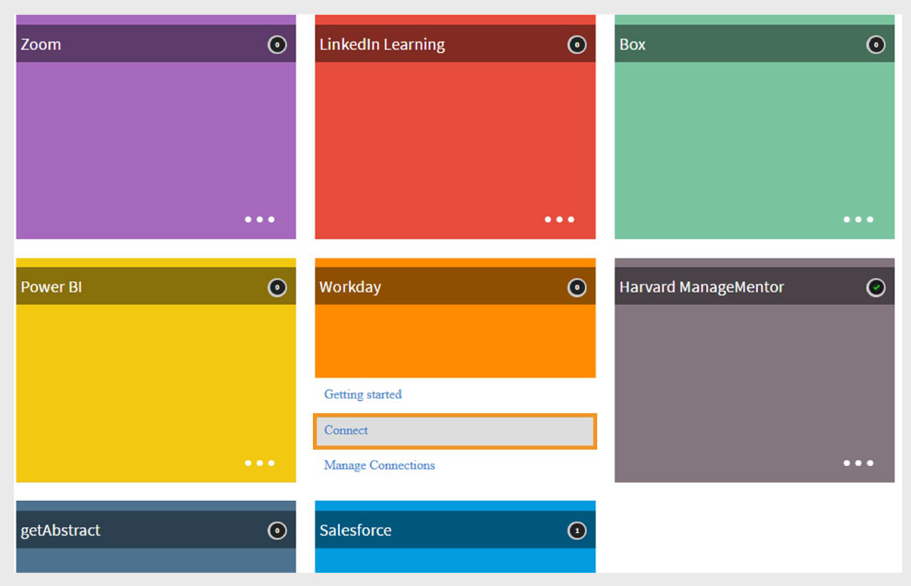

# Adobe Learning Manager中的Workday连接器

## 简介

**Workday**&#x200B;是一个基于云的系统，可帮助组织管理员工和财务数据。 它主要用于招聘、工资和绩效跟踪等HR任务。 连接到Adobe Learning Manager后，它可以在两个平台之间自动同步用户和技能数据。

利用Workday连接器，可将Adobe Learning Manager与组织的Workday租户无缝集成。 这种集成实现了两个系统之间用户数据和技能的自动同步，提高了数据的准确性，减少了手动工作。

## 主要优点

- 将用户从Workday导入到Adobe Learning Manager。
- 在Workday和Adobe Learning Manager之间映射属性。
- 将用户技能从Adobe Learning Manager导出到Workday。
- 安排数据同步任务自动运行。

## 先决条件

在配置Workday连接器之前，请向您的Workday管理员获取以下详细信息：

- 主机URL
- 租户ID
- 用户名
- 密码

## 配置Workday连接器

您可以在Adobe Learning Manager中配置Workday连接器，以便从Workday导入用户数据、将用户技能导出回Workday以及安排自动同步，以使两个系统都保持最新。

要配置Workday连接器，请执行以下操作：

1. 以集成管理员身份登录Adobe Learning Manager.
2. 将鼠标悬停在&#x200B;**Workday**&#x200B;磁贴上，然后选择&#x200B;**连接**。

   
   _配置Workday连接器以导入和导出数据_

3. 键入以下连接详细信息：
   - **连接名称**：您选择的连接名称。
   - **主机Url**：由您的Workday管理员提供。
   - **租户**：你的Workday管理员的内部标识符。
   - **用户名和密码**：Workday管理员创建具有所需安全权限的集成系统用户(ISU)，并将其共享给集成管理员。

   
   _添加必要的详细信息以配置Workday连接器_

4. 选择&#x200B;**连接**&#x200B;以完成设置。

>[!NOTE]
>
>您可以在帐户中设置多个Workday连接。

## 从Workday导入用户

### 映射属性

您可以使用Workday连接器将活动用户从Workday租户导入Adobe Learning Manager。 此集成通过保持员工记录同步而简化了用户管理。 除了Workday之外，Adobe Learning Manager还支持从FTP和Salesforce等其他数据源导入用户。

在导入用户之前，您必须在Workday和Learning Manager之间映射用户属性。

1. 导航到Workday连接器中的&#x200B;**概述**&#x200B;页面。
2. 在&#x200B;**导入**&#x200B;部分下选择&#x200B;**内部用户**。

   
   _选择内部用户以映射用户属性_

3. 使用&#x200B;**映射属性**&#x200B;选项在两个系统之间链接字段：
   - 在&#x200B;**Adobe Learning Manager**&#x200B;列中，选择相应的Adobe Learning Manager属性。
   - 在&#x200B;**Workday**&#x200B;列中，使用下拉菜单选择匹配的Workday属性。

   
   _将Workday属性映射到Adobe Learning Manager字段_

   >[!NOTE]
   >
   >Adobe Learning Manager目前支持从Workday导入多达&#x200B;**69个用户属性**。 您可以使用Adobe Learning Manager中的&#x200B;**活动字段**&#x200B;功能启用其他字段。 要添加自定义Workday属性，请联系您的客户成功客户经理(CSAM)。

4. 选中&#x200B;**排除临时工**&#x200B;复选框以避免导入临时工。
5. 根据需要应用过滤器，例如，导入特定管理器下的用户。

>[!IMPORTANT]
>
>确保UUID、电子邮件地址和员工姓名均唯一。 不正确或重复的值可能会导致集成失败。

## 支持的Workday属性

支持的Workday属性列表：

```
wd:User_ID wd:Worker_ID manager wd:Personal_Data.wd:Name_Data.wd:Preferred_Name_Data.wd:Name_Detail_Data.@wd:Formatted_Name wd:Personal_Data.wd:Name_Data.wd:Legal_Name_Data.wd:Name_Detail_Data.@wd:Formatted_Name wd:Personal_Data.wd:Name_Data.wd:Legal_Name_Data.wd:Name_Detail_Data.wd:Prefix_Data.wd:Title_Descriptor wd:Personal_Data.wd:Name_Data.wd:Preferred_Name_Data.wd:Name_Detail_Data.wd:Prefix_Data.wd:Title_Descriptor wd:Personal_Data.wd:Name_Data.wd:Preferred_Name_Data.wd:Name_Detail_Data.wd:First_Name wd:Personal_Data.wd:Name_Data.wd:Preferred_Name_Data.wd:Name_Detail_Data.wd:Last_Name wd:Personal_Data.wd:Name_Data.wd:Legal_Name_Data.wd:Name_Detail_Data.wd:First_Name wd:Personal_Data.wd:Name_Data.wd:Legal_Name_Data.wd:Name_Detail_Data.wd:Last_Name wd:Personal_Data.wd:Contact_Data.wd:Address_Data.0.@wd:Formatted_Address wd:Personal_Data.wd:Contact_Data.wd:Address_Data.0.wd:Postal_Code wd:Personal_Data.wd:Contact_Data.wd:Email_Address_Data.0.wd:Email_Address wd:Personal_Data.wd:Contact_Data.wd:Address_Data.0.wd:Country_Region_Descriptor wd:Personal_Data.wd:Contact_Data.wd:Phone_Data.0.@wd:Formatted_Phone wd:Personal_Data.wd:Contact_Data.wd:Phone_Data.0.wd:Country_ISO_Code wd:Personal_Data.wd:Contact_Data.wd:Phone_Data.0.wd:International_Phone_Code wd:Personal_Data.wd:Contact_Data.wd:Phone_Data.0.wd:Phone_Number wd:Personal_Data.wd:Primary_Nationality_Reference.wd:ID.1.$ wd:Personal_Data.wd:Gender_Reference.wd:ID.1.$ wd:Personal_Data.wd:Identification_Data.wd:National_ID.0.wd:National_ID_Data.wd:ID wd:Personal_Data.wd:Identification_Data.wd:Custom_ID.0.wd:Custom_ID_Data.wd:ID wd:User_Account_Data.wd:Default_Display_Language_Reference.wd:ID.1.$ wd:Role_Data.wd:Organization_Role_Data.wd:Organization_Role.0.wd:Organization_Role_Reference.wd:ID.1.$ wd:Employment_Data.wd:Worker_Job_Data.0.wd:Position_Data.wd:Position_Title wd:Employment_Data.wd:Worker_Job_Data.0.wd:Position_Data.wd:Business_Title wd:Employment_Data.wd:Worker_Job_Data.0.wd:Position_Data.wd:Business_Site_Summary_Data.wd:Name wd:Employment_Data.wd:Worker_Job_Data.0.wd:Position_Data.wd:Business_Site_Summary_Data.wd:Address_Data.@wd:Formatted_Address
wd:Employment_Data.wd:Worker_Job_Data.0.wd:Position_Data.wd:Job_Classification_Summary_Data.0.wd:Job_Classification_Reference.wd:ID.1.$ wd:Employment_Data.wd:Worker_Job_Data.0.wd:Position_Data.wd:Job_Classification_Summary_Data.0.wd:Job_Group_Reference.wd:ID.1.$ wd:Employment_Data.wd:Worker_Job_Data.0.wd:Position_Data.wd:Work_Space__Reference.wd:ID.1.$ wd:Employment_Data.wd:Worker_Job_Data.0.wd:Position_Data.wd:Job_Profile_Summary_Data.wd:Job_Family_Reference.0.wd:ID.1.$ wd:Employment_Data.wd:Worker_Job_Data.0.wd:Position_Data.wd:Job_Profile_Summary_Data.wd:Job_Profile_Name wd:Employment_Data.wd:Worker_Job_Data.0.wd:Position_Data.wd:Job_Profile_Summary_Data.wd:Job_Profile_Reference.wd:ID.1.$ wd:Employment_Data.wd:Worker_Job_Data.0.wd:Position_Data.wd:Business_Site_Summary_Data.wd:Address_Data.0.wd:Country_Reference.wd:ID.2.$ wd:Employment_Data.wd:Worker_Job_Data.0.wd:Position_Data.wd:Worker_Type_Reference.wd:ID.1.$ wd:Employment_Data.wd:Worker_Job_Data.0.wd:Position_Data.wd:Business_Site_Summary_Data.wd:Address_Data.0.@wd:Formatted_Address wd:Employment_Data.wd:Worker_Job_Data.0.wd:Position_Data.wd:Job_Profile_Summary_Data.wd:Management_Level_Reference.wd:ID.1.$ wd:Employment_Data.wd:Worker_Status_Data.wd:Active wd:Employment_Data.wd:Worker_Status_Data.wd:Active_Status_Date wd:Employment_Data.wd:Worker_Status_Data.wd:Hire_Date wd:Employment_Data.wd:Worker_Status_Data.wd:Original_Hire_Date wd:Employment_Data.wd:Worker_Status_Data.wd:Retired wd:Employment_Data.wd:Worker_Status_Data.wd:Retirement_Date wd:Employment_Data.wd:Worker_Status_Data.wd:Terminated wd:Employment_Data.wd:Worker_Status_Data.wd:Termination_Date wd:Employment_Data.wd:Worker_Status_Data.wd:Termination_Last_Day_of_Work wd:Organization_Data.wd:Worker_Organization_Data.0.wd:Organization_Data.wd:Organization_Code wd:Organization_Data.wd:Worker_Organization_Data.0.wd:Organization_Data.wd:Organization_Name wd:Organization_Data.wd:Worker_Organization_Data.0.wd:Organization_Data.wd:Organization_Type_Reference.wd:ID.1.$ wd:Organization_Data.wd:Worker_Organization_Data.0.wd:Organization_Data.wd:Organization_Subtype_Reference.wd:ID.1.$ wd:Qualification_Data.wd:Education.0.wd:School_Name wd:Qualification_Data.wd:External_Job_History.0.wd:Job_History_Data.wd:Job_Title wd:Qualification_Data.wd:External_Job_History.0.wd:Job_History_Data.wd:Company wd:Management_Chain_Data.wd:Worker_Supervisory_Management_Chain_Data.wd:Management_Chain_Data.0.wd:Manager.Employee_ID Primary Work Email wd:Organization_Type_Reference_Cost_Center_ID wd:Organization_Type_Reference_Cost_Center_Name wd:Organization_Type_Reference_Company wd:Organization_Subtype_Reference_Department
wd:Organization_Subtype_Reference_Division wd:Universal_ID wd:Employment_Data.wd:Worker_Job_Data.0.wd:Position_Data.wd:Business_Site_Summary_Data.wd:Address_Data.0.wd:Country_Region_Descriptor wd:Employment_Data.wd:Worker_Job_Data.0.wd:Position_Data.wd:Business_Site_Summary_Data.wd:Address_Data.0.wd:Country_Region_Reference.wd:ID.2.$ wd:Personal_Data.wd:Contact_Data.wd:Address_Data.0.wd:Municipality
```

## 将用户技能导出到Workday

您可以将所有活动用户技能从Adobe Learning Manager导出到Workday。 弃用的技能不会导出。

>[!IMPORTANT]
>
>- 不要尝试同时将多个Adobe Learning Manager帐户的技能导出到同一Workday帐户。
>- 如果多个Adobe Learning Manager帐户使用同一个Workday帐户，请确保各个帐户的技能名称一致，以避免冲突。

### 配置计划导出

要配置计划的导出，请执行以下操作：

1. 选择&#x200B;**“用户技能”**，然后在&#x200B;**“Workday概述”**&#x200B;页面中选择&#x200B;**“配置计划”**。

   
   _选择“用户技能”以计划导出_

2. 选中&#x200B;**使用此连接启用用户技能导出**&#x200B;复选框。
3. 选择&#x200B;**启用计划**。
4. 设置开始日期、时间和重复时间间隔。

   
   _在Workday连接器中配置计划导出_

5. 选择&#x200B;**保存**&#x200B;以应用计划。

### 按需导出

要创建按需导出，请执行以下操作：

1. 在&#x200B;**Workday概述**&#x200B;页面中选择&#x200B;**按需**。
2. 键入报告的开始日期。
3. 选择&#x200B;**执行**&#x200B;以运行报表。

### 查看执行状态

1. 转到&#x200B;**执行状态**。
2. 查看所有任务的状态并根据需要下载错误报告。

## 正在安排同步任务

您可以将连接器配置为自动运行数据同步任务：

- 安排每天从Workday用户导入至Learning Manager。
- 安排定期将用户技能导出到Workday。

>[!NOTE]
>
>计划可确保两个系统中的用户记录和技能数据始终保持最新。

## 注意事项

- 面向客户端的LMS管理员无法删除从Workday填充的UUID字段。
- **用户清理**&#x200B;功能每次运行最多支持50个用户。 在导入具有UUID的用户时请谨慎。
- 在Workday中，使用Adobe Learning Manager中的技能名称和级别在技能项目级别映射技能。
