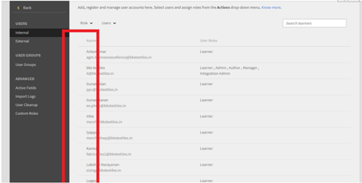
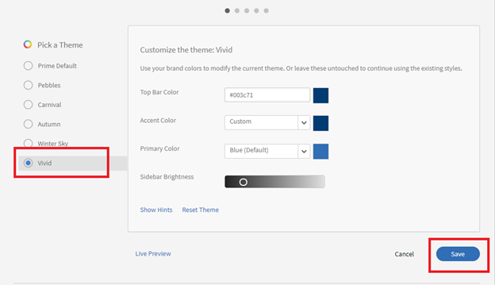

# Adobe Learning Manager 中未显示选择按钮

## 问题

由于缺少单选按钮，管理员无法执行以下操作（不是详尽列表）：

* 分配或删除角色。
* 发送欢迎电子邮件。
* 删除用户。

## 原因

此问题是帐户的主题不正确所致。

*单选按钮不可见*

## 解决方法

重新加载主题并修复单选按钮的外观。 执行以下操作：

1. 以管理员身份单击&#x200B;**[!UICONTROL “品牌推广”]**。
1. 在“**主题**”部分，单击“**[!UICONTROL 编辑]”。**
1. 选取任意主题并保存更改。

   

   *选择任意主题*

1. 恢复为上一个主题并保存更改。
1. 注销 Adobe Learning Manager 然后重新登录。
