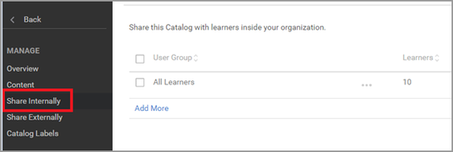

# 无法在 Adobe Learning Manager 中搜索课程

## 问题

学习者无法在 Adobe Learning Manager 中搜索课程。

## 场景1：注册更高级的学习对象

### 摘要

有时会出现这样的情况，学习者搜索课程，但系统并未列出相应课程。 然而，如果学习者已注册学习计划/认证，则可以在“学习对象”中查看课程。

### 为什么会出现这个问题？

在Learning Manager中，当学习者注册学习计划/认证时，即代表注册了学习计划/认证。

因此，学习者无法在“**我的学习**”下搜索独立课程。

但是，学习者可以在“学习计划/认证”中查看课程。

## 场景2：学习者无权访问包含课程的目录。

### 摘要

学习者无法在目录或学习信息板中搜索课程。

### 为什么会出现这个问题？

在以下情况下会出现此问题：

* 学习者不在包含课程“**OR**”的目录之中
* 该课程不在学习者有权访问的目录之中。

### 解决方案

1. 以管理员身份登录。

1. 单击“**[!UICONTROL 目录]**”并浏览找到包含该课程的目录。
1. 单击&#x200B;**[!UICONTROL 内部共享]**&#x200B;或&#x200B;**[!UICONTROL 内容]**（取决于上述场景）。

   

   *在内部共享目录*

1. 查看以下场景：

   * 学习者不在目录之中

     如需共享目录，请单击“**[!UICONTROL 添加]**”，添加用户所属的用户组。 单击“**[!UICONTROL 保存]**”。

     

     *添加用户组*

   * 课程不在目录之中

     在“内容”部分，单击“**[!UICONTROL 添加内容]**”并选择需要添加到目录的课程。

     

     *向课程添加内容*
