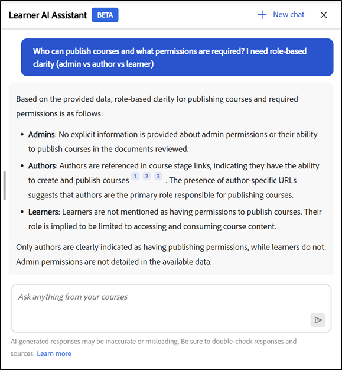
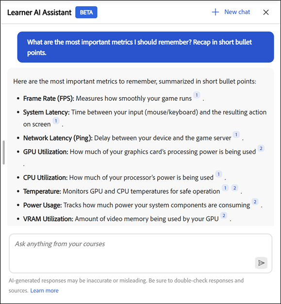
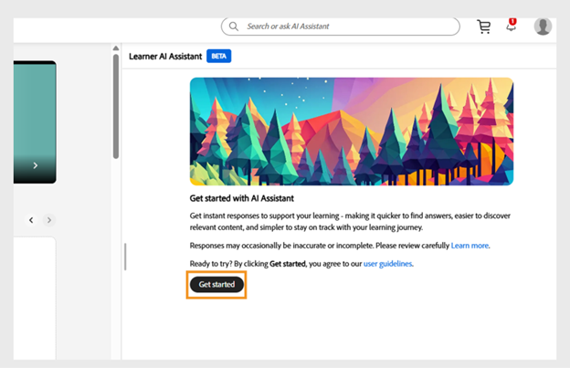

# 简介

学习者的AI Assistant (Beta)可帮助他们从指定的学习内容中快速查找答案，而无需浏览整个课程。 您可以用浅显的语言提出问题，并获得准确、重点突出的答复，并提供指向相关课程内容的源链接。

## 什么是AI Assistant？

AI Assistant是Adobe Learning Manager中由GenAI提供支持的聊天搭配，借助学习者在Adobe Learning Manager中可用的受信任学习内容，为学习者问题提供快速、准确的答案。 其中还包括引用内容，以便学习者了解信息来源。

## 为什么要使用它？

* 学习者面临内容过载问题，通常不知道从何处开始或使用哪个资源。

* 目录和访问规则使得很难发现他们可以使用哪些内容。

* 学习旅程分散于多种格式和培训类型（例如课程、虚拟教室、工作辅助和评估）中。

* 现在没有一种简单统一的方法可以从SCORM、PDF、文档、视频或转录文本等各种格式检索特定信息。

* 不同的学习者角色和行业（如销售、营销、支持、运营）有独特的信息需求，需要快速上下文解答。

## AI Assistant可以转录哪些类型的内容

AI Assistant可以从分配给您的所有类型的学习内容中查找信息，包括：

* **文档：** PDF、Word、PowerPoint、Excel、HTML

* **媒体：**&#x200B;音频(mp3、wav、m4a)、视频(mp4、mov、wmv)

* **交互式内容：** SCORM 1.2、SCORM 2004、

* **学习对象类型：**&#x200B;课程、学习路径、认证、工作辅助

Adobe使用托管在Adobe私有VPC环境中的受信任的第三方处理服务，安全转录您的学习内容。

**重要**

AI Assistant仅使用以下内容：

* 可在管理员为“学习者助理”配置的目录中找到，以及

* Adobe Learning Manager内部目录的一部分。

当前版本不支持将共享、已获取、外部或其他非内部目录用作AI Assistant的内容源。

如果您无权访问课程，则无法访问相关引文链接。 检索答案时不包括第三方库(如LinkedIn Learning或Go1)。

## 对话功能

AI Assistant支持单个问题和多回合对话。 它会提醒您之前在同一会话中提出的查询。

**对话示例：**

您：“什么是退款政策？”
助手：提供摘要
你：“30天后的退款呢？”
助理：返回更具体的信息

## AI Assistant用例

### 即时学习支持（所有学习者）

学习者在工作时通常需要快速答案，而不是整个课程的重播。 AI Assistant可以从分配的学习内容中即时检索精确信息。

**它有哪些帮助：**

* 从课程、工作辅助和文档中直接获得特定问题的答案

* 使用引文跳转到确切引用的部分

* 缩短在多个学习对象之间搜索所花费的时间

### 销售支持和客户对话

在实时客户互动期间，销售团队需要快速、准确的产品和流程信息。 AI助手作为按需知识助手。

**它有哪些帮助：**

* 检索最新的产品功能和定位

* 根据培训内容生成快速销售脚本或谈话要点

* 使用分配的学习材料比较产品版本或产品

* 增强销售知识，而无需重复学习整个课程

**示例2**

**目的：**&#x200B;显示AI Assistant可以帮助销售代表即时回答客户比较问题。

**推荐提示：**&#x200B;比较Adobe Learning Manager和传统的LMS企业培训。 以表格格式显示比较。

### 营销和活动准备

在审阅、发布或利益相关者讨论之前，营销团队通常需要快速刷新。 AI Assistant将复杂的学习内容汇总为可操作见解。

**它有哪些帮助：**

* 将长课程或视频总结为要点

* 在会议前刷新流程或产品知识

* 发现相关的学习内容以深化专业知识

### 运营和流程说明

运营、支持和内部团队依赖准确的流程文档。 AI Assistant可帮助即时澄清政策和工作流程。

**它有哪些帮助：**

* 查找有关内部流程、 SOP和合规性指南的解答

* 明确分步详细信息，而无需浏览冗长的文档

* 减少在重复问题中对行业专家的依赖

### 更快的入门培训和角色转换

新员工和进入新岗位的员工通常很难浏览大型学习目录。 AI Assistant通过引导用户找到相关答案来加速加速改进。

**它有哪些帮助：**

* 回答分配的内容中常见的入门培训问题

* 快速解释特定于角色的概念

* 支持无信息过载的自导学习

### 知识更新和持续学习

有经验的学习者需要快速复习而不是完全的重新培训。 AI Assistant支持在工作流程中持续学习。

**它有哪些帮助：**

* 按需更新知识，无需重新观看课程

* 培训完成后巩固学习成果

* 鼓励经常性、轻松参与学习内容

## 学习者AI助理如何使用内容

学习者AI助手可帮助您在学习时快速找到准确答案。 要有效地使用它，您应了解助理使用了哪些内容、未使用哪些内容，以及如何生成响应。

### AI Assistant使用哪些内容

学习者AI Assistant仅使用在Adobe Learning Manager中分配给您的学习内容回答问题。

* 助手使用您的管理员为学习者AI助手启用的内部目录中的内容。

* 如果您无权访问课程、工作辅助或学习对象，则助理不会使用该对象生成响应。

* 助手在检索信息时会尊重您的角色、组成员资格和目录权限。

### AI Assistant不使用哪些内容

学习者AI Assistant会限制对已分配学习范围的响应。

* 但不使用共享、已获取、外部或其他非内部目录中的内容。

* 它不从LinkedIn Learning或Go1等第三方内容库中检索信息。

* 它不会浏览Internet或访问外部网站来生成答案。

### AI Assistant如何生成答案

学习者AI Assistant会分析分配给您的学习内容，以生成重点响应和上下文响应。

* 每个响应都包含引用原始源内容的引用。

* 您可以选择一则引文以直接导航至相关的课程、模块或文档。

* 引用可帮助您验证信息，并在需要时浏览其他上下文。

### 负责任地使用AI Assistant

使用学习者AI Assistant作为学习辅助工具，可探索、刷新和增强知识。

* 根据可用学习内容，将答复视为指导。

* 有关完整和权威的信息，请参阅引用的原始资料。

### 管理员如何控制访问

管理员可管理学习者AI Assistant的访问权限并控制其使用的内容。

* 管理员将助理分配给特定的用户组。

* 管理员选择助理可以用作内容源的内部目录。

* 这些控件可确保Assistant仅显示经过批准的相关学习内容。

## 关于内置提示

学习者AI Assistant包括一组内置提示，可帮助学习者快速开始处理常见问题和情景。 这些提示可指导学习者如何与助理交互并演示其可提问的问题类型。

每个帐户均可自定义内置提示。 公司可以定制这些提示以反映其学习目标、学习者角色、术语或特定用例。

管理员可与其客户成功经理(CSM)一起配置、修改或更新其帐户的内置提示。 提示自定义在帐户级别进行管理，在当前版本中，无法直接在Adobe Learning Manager用户界面中配置。

向学习者显示的提示可能会因Adobe定义的配置而异。

## 启用学习者AI助手

AI Assistant (Beta)提供AI技术支持，帮助学习者更有效地发现内容并参与其中。 管理员通过将功能分配给特定用户组和目录来控制访问权限。 配置AI Assistant时，应仅使用内部目录。 不支持在AI Assistant响应和引文中显示来自“共享”、“已获取”、“外部”或其他非内部目录的内容。

管理员可以选择要访问AI Assistant功能的用户组和内部目录。 他们应确保分配的目录仅包含适合通过AI响应和引用显示的学习内容，并且这些目录为“内部”、“共享”、“已获取”或“外部”。

在配置AI Assistant (Beta)之前，请确认您拥有管理员凭据，并确定了哪些用户组和目录应有权访问该功能。

### 配置“学习者助理”访问权限

要启用学习者AI Assistant，请执行以下操作：

1.以管理员身份登录Adobe Learning Manager。

2.从主页中选择&#x200B;**设置**。

3.从&#x200B;**设置**&#x200B;菜单中选择&#x200B;**学习者AI Assistant (Beta)**。

4.选择切换开关以启用&#x200B;**学习者AI Assistant (Beta)**。

5.从&#x200B;**合格用户组**&#x200B;选项中选择一个或多个用户组。

6.选择&#x200B;**保存**&#x200B;以应用用户组设置。

7.从&#x200B;**合格目录**&#x200B;选项中选择一个或多个目录。

8.选择&#x200B;**保存**&#x200B;以应用目录设置。

>[!IMPORTANT]
>
>AI Assistant仅支持内部目录。 如果选择共享、已获取、外部或其他非内部目录，则AI Assistant将不会显示其内容，即使该目录显示在“合格目录”列表中也是如此。

## 在Adobe Learning Manager中访问学习者AI助手

Adobe Learning Manager的学习者AI助理(Beta)可帮助您在学习时快速找到答案。 此智能工具通过您的学习者帐户直接回复您有关课程、内容和平台功能的问题。

AI Assistant只能使用管理员为“学习者助理”启用的内部目录中的内容。 仅存在于共享、获得或外部目录中的内容不包括在内。

学习者AI Assistant (Beta)仅适用于选定的学习者。

### 启动AI Assistant

要启动学习者AI Assistant：

1.以学习者身份登录Adobe Learning Manager。

2.在主页上选择&#x200B;**询问AI助手**。

3.在显示&#x200B;**“学习者AI Assistant (Beta)”**&#x200B;屏幕时，选择&#x200B;**“开始使用”**。

>[!NOTE]
>
>首次启动AI Assistant时，必须在使用它之前提供您的同意。 同意对话框将仅在此初次启动时显示。 对于所有后续启动，您将直接转到AI Assistant以输入提示。

4.在文本字段中键入提示。

5.按&#x200B;**Enter**&#x200B;接收响应。 查看您的答案、来源和建议。

Adobe允许在帐户级别进行即时自定义。 要配置或更新内置提示，请与您的Adobe客户成功经理(CSM)联系。

AI Assistant响应包括每次响应都有的引文，因此学习者可以轻松验证信息的来源。 每个引用的参考链接指向原始课程模块、工作辅助或其他学习内容。

学习者可以：

* 选择内嵌的引文号以跳转到确切引用的部分

* 通过选择响应底部的&#x200B;**显示源**，打开源的完整列表

“学习者助理”包含引用以及显示信息来自何处的每个回复。 每个引文直接链接到用于生成答案的原始课程、模块或学习对象。

您可以选择任何引文以在Adobe学习管理器中打开实际课程页面，并在上下文中查看完整内容。 引用可帮助您验证信息、探索其他详细信息并继续从权威来源学习。

## 使用搜索访问AI Assistant

管理员还可以直接从搜索栏启动AI Assistant。 只需键入问题，然后从下面显示的选项中选择&#x200B;**询问AI Assistant**&#x200B;即可从分配的学习内容中获取答案。

## 针对学习者AI Assistant (Beta)响应提供反馈

您对学习者AI Assistant (Beta)生成的响应的反馈有助于改进其准确性、相关性和整体性能。

### 喜欢或不喜欢响应

* 选择“**拇指向上**”，选择您在响应中找到的有用内容，根据需要添加注释，然后选择“**提交**”。

* 选择“**拇指朝下**”，选择响应无帮助的原因，添加任何注释，然后选择“**提交**”。

## 在AI Assistant中开始新聊天

学习者可以随时清除当前对话并开始新聊天。

* 在AI Assistant屏幕中选择&#x200B;**新建聊天**，然后选择&#x200B;**是**。

