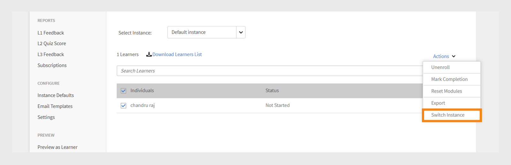
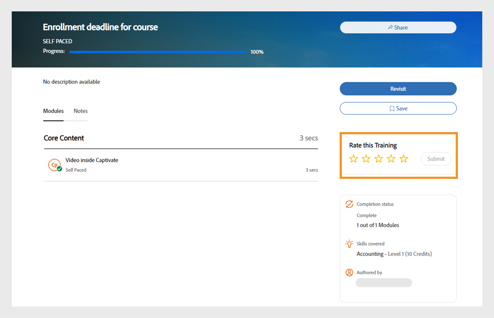

# 我的学习

阅读本文，了解如何在 Adobe Learning Manager 查看和使用课程。参与讨论并提供反馈。

作者可以创建课程。学习者可以参加课程，管理员可根据课程的参加情况跟踪学习者的表现。

## 概述 {#overview}

学习者可通过 Adobe Learning Manager 访问课程、学习计划和认证。学习者可以使用目录浏览所有可用课程或注册所选的课程。学习者可以在“学习”选项卡中查看所有注册的课程和指定给他们的课程。

>[!NOTE]
>
>学习者还可以安装Learning Manager iPad应用程序（通过Apple Store）和Learning Manager Android应用程序(通过Google Play)并在移动设备上访问课程。 所有学习者角色功能也可用于应用程序。学习者还可以离线参加课程并能在重新联机后实现无缝对接访问。有关更多信息，请参阅[iPad和Android平板电脑用户](ipad-android-tablet-users.md)功能。

## 查看学习对象 {#viewingcourses}

您可以作为学习者查看所有可用课程的列表。在主页上单击“我的学习”，或从左侧窗格中查看您已注册的所有课程。

*查看已分配的课程*

如果您还没有开始课程，可以单击课程旁的“开始”按钮。如果您已经开始使用课程，可以单击“继续”按钮。

若要查看已完成的课程，请点击该课程旁的“重新访问”按钮。

一个课程可能会有多个实例。单击课程名称以查看详细信息。在右侧窗格中，您可以查看课程每个实例的截止日期。

*查看已完成的课程*

## 课程效果 {#courseeffectiveness}

课程效果分数能帮助学习者挑选满足学习需求且效果最好的课程。课程效果评估了课程对于学习者是否有帮助。它根据多个用户对特定课程的反馈进行计算。学习者给出的反馈百分比越高，课程效果的评级也越高。

它结合了学习者针对课程内容提出的反馈、学习者的课程测试结果以及经理根据学习者的课程学习情况提供的评估反馈。

在“课程”页面中，学习者可以在课程缩略图上查看课程效果评级，如以下截图所示。您可以看到此课程的评级为 14。

*查看课程效果评级*

若要查看课程效果评级的详细信息，请单击课程效果值。此时会显示弹出窗口，如下所示。

*查看课程效果*

单击弹出窗口右下角的向下箭头可查看课程效果的计算方式。

*课程效果计算*

## 搜索课程和学习计划 {#searchingcoursesandlearningprograms}

Adobe Learning Manager 能让您轻松快速找到您想选择的课程。您可以通过以下方式搜索课程：

1. 单击右上角显示的搜索图标。此时会显示搜索字段。输入课程/学习计划名称或与课程关联的任意关键字。 您可以按元数据、注释、技能、徽章或标签搜索课程。 标签可在搜索字段中进行搜索，也就是说标签会在您输入时显示在搜索字段中。
1. 学习者可在目录页中通过类型、技能、标签和状态优化搜索结果。

您可以单击“排序方式”，然后从下拉菜单中选择相关选项以按相关性、名称或发布日期对课程进行排序。

在搜索结果页面上，您可以根据课程的&#x200B;**持续时间**&#x200B;和课程的&#x200B;**形式**&#x200B;筛选课程。 您可借此更灵活地搜索课程，并确保找到适合您的课程。

## 注册课程 {#enrollingforcourses}

学习者可以通过如下三种方式注册课程：

1. 管理员/经理可根据公司需求为某些学习者注册必修课程。
1. 经理可为其团队成员指派一些课程。您会收到一个通知，其中包含接受或拒绝该课程/学习计划的选项。学习者接受指派后，即注册到该课程/学习计划。
1. 学习者直接自行注册课程/学习计划：

   1. 如果课程/学习计划是自助注册类型，则学习者可立即注册。
   1. 如果课程/学习计划是经理审批类型，则学习者会变为&#x200B;**审批待处理**&#x200B;状态。 经理批准后，学习者即完成课程注册。
   1. 如果学习者注册了已经轮候的课程（例如教室），则必须等待，直到某些用户退出课程或管理员批准加入课程为止。

学习者可以自行选择注册一系列课程。课程选项卡会显示所有已注册/已指定的课程。

但是，您可以将鼠标移动到课程上方并单击“浏览”，从而完整了解目录下列出的任意课程。 此时会显示“注册”页面。 单击页面右上角的“注册”将课程添加到“课程”列表。

一个课程/学习计划中可以有多个实例/会话。在目录中，单击课程/学习计划磁贴名称以查看详细信息。您可以根据课程/学习计划每个实例的截止日期来注册课程/学习计划实例。

**注册感兴趣的课程**

您可以注册任何尚未计划会话的教室课程来表示关注。只要课程会话开始，您就会收到加入课程的通知。

>[!NOTE]
>
>如果学习者同时或重叠注册了两个不同的会话，则应看到一条冲突消息。

## 切换实例

注册特定课程实例的学习者可以查看课程所有可用实例的列表，并切换到更适合自己的其他实例。 切换的原因可能在于学习者错过了参加以前的实例、新实例的会话时间安排更合适，或其他原因。

学习者在课程中完成的任何进度、学习者测验分数等，都会转移到新实例中。 此功能主要用于教室和混合课程，但我们将为自学课程在内的所有类型的课程提供支持。

不论“实例切换”如何设置，页面都会显示“查看所有实例”选项。 如果一门课程包含多个实例，学习者现在将看到一个可查看所有实例的选项。

启用“实例切换”选项后，学习者可以切换到各种实例，直到完成课程。 如果禁用此选项，则学习者可以查看实例，但无法注册课程。

学习者选择&#x200B;**“查看所有实例”**&#x200B;后，即可看到所有课程实例。

_从学习者控制台查看所有实例页面_

_从学习者页面切换实例_

管理员可以为学习者切换实例。 从Admin Console中选择课程，转到&#x200B;**[!UICONTROL 学习者]**&#x200B;部分，选择用户，然后选择&#x200B;**[!UICONTROL 操作]**&#x200B;按钮。 然后，选择&#x200B;**[!UICONTROL 切换实例]**&#x200B;并选择所需的实例。

_从Admin Console切换实例_

_切换实例提示_

在学习者或管理员应用程序完成课程的任何实例之前，您无法切换实例。

作者在创建课程时，可以在启用或禁用“实例切换”之间切换。 实例切换仅适用于免费课程。

## 学习者工作流程

作为学习者，您只能在注册后对课程进行评分。 您可以在&#x200B;**主页**&#x200B;页面、**我的学习**&#x200B;页面和&#x200B;**目录**&#x200B;上查看任何课程的平均星级评分。

1. 以&#x200B;**学习者**&#x200B;身份登录。 这将加载&#x200B;**主页**。

1. 您可以通过在搜索栏中输入课程名称来搜索课程。 或者，也可以在左侧窗格中单击&#x200B;**“我的学习”**&#x200B;或&#x200B;**“目录”**，从显示的课程列表中选择。

1. 选择课程后，单击&#x200B;**[!UICONTROL 注册]**。

   
   *注册课程*

1. 选择星级对相应课程进行评分，1 为最差，5 为最好。 然后单击&#x200B;**[!UICONTROL 提交]**。

   
   *提交课程评分*

   学习者可以通过多次提供星级评分来重新提交反馈，系统会考虑最近的评分。

1. 提交后，系统将显示确认消息。

   
   *反馈确认消息*

   如果要重新提交反馈，可以单击此消息。 提交评分后，消息将显示三秒，然后会显示评分。 如果要变更星级评分，您可以选择其他星级并提交。

系统可以根据平均评分对课程进行排序。 您可以在&#x200B;**目录**&#x200B;右上角的“排序方式”下拉菜单中对用例进行排序。

## 参加课程 {#consumingnbspacourse}

注册课程后，您可以单击课程上的“开始”以开始课程。或者，单击&#x200B;**[!UICONTROL 学习]**&#x200B;选项卡中的&#x200B;**[!UICONTROL 课程]**。 选择要开始的课程。

如果您还没有开始课程，请单击课程标题旁的“开始”按钮。

您可以在一个浏览器窗口中查看课程的所有模块。

**播放器功能**

**目录** — 参加课程时，播放器会在窗口左侧窗格中显示该特定课程的目录。 您可以单击每个话题并直接浏览至该话题。

**书签** — 如果任意课程模块具有模块目录，则模块目录中的主题可标记书签以便后续参考。 标记书签后，目录条目旁会显示一个功能区图标。再次单击功能区即可删除书签。

**注意** — 参加课程时，您可以记录备注。 记录备注后，您可以保存并将其下载为 PDF 或通过电子邮件发送到任意已注册学习者的电子邮件 ID。单击“保存”时，可以选择将其保存为 PDF 文件的保存位置。

*记下课程备注*

**隐藏字幕** — 对于Adobe Captivate开发课程，如果在课程开发过程中启用了隐藏字幕，则学习者可以查看字幕。 在播放器底部单击隐藏字幕。隐藏字幕选项仅适用于 Captivate 8.0.2 HTML 内容。对于所有其他类型的模块，隐藏字幕选项不会显示在播放栏上。

**重新访问课程** — 您可以在两种情况下以两种模式重新访问某个课程：

* 在课程处于完成状态时，单击“重新访问”。
* 在课程处于未完成状态时，单击“继续”。

**全屏**&#x200B;单击播放器右下角的全屏图标即可在全屏窗口中查看课程。

**导航按钮**&#x200B;您可以单击上/下箭头，在PDF、docx和pptx内容的各页面之间进行移动。 滑动箭头可用于在所有类型的内容中移动至后续话题。

**关闭课程** 单击播放器右上角的关闭 (x) 图标即可退出课程。

*退出课程后，您可以单击课程描述页面上的“重新访问”按钮来重新访问课程。*

## 多个注册实例

如果课程有多个实例，学习者可以选择并注册特定实例。 如果需要，他们可以在实例之间切换。

## 星级评分

只有在注册课程后，学习者才能为课程提供星级反馈。 在课程的“课程概述”页面中，学习者可以对课程进行星级评分（1为最低，5为最高）。

*提供星级评分作为反馈*

学习者可以选择具体星级（共5个）并提交评分。 学习者还可以通过单击其他星级来编辑选区。 提交后，系统将显示“感谢您提供反馈”消息。

如果学习者要重新提交反馈，可以单击此消息。 重新启用&#x200B;**提交**&#x200B;按钮。 注册课程后，学习者可以多次提供星级评分。 系统会一律参考最近的评分。

学习者进行评分后，**课程概述**&#x200B;页面会显示平均星级评分和参与星级评分的学习者人数。

*课程概述*

对于所有现有帐户，此功能处于禁用状态。 管理员可以从“设置”中启用它。 启用之后，学习者才会看到星级评分。

## 内容市场

“内容市场”选项显示在“学习者”应用的左侧窗格中。 单击该选项后，您可以看到所有课程/整个目录和精选的播放列表。

在下面的页面中，您可以看到整个目录中的课程。 每个课程都会显示时长和所属主题。 您可以从页面左侧的筛选器中选择主题。

您可以预览两分钟的课程。

*在市场中预览课程*

当管理员邀请您浏览和预览大量课程时，您会看到一条通知。

作为学习者，您可以对&#x200B;**精选播放列表**&#x200B;部分中的整个目录或特定目录表示感兴趣。

*查看精选的播放列表*

在您表示对某一课程/培训感兴趣后，系统会将其记录下来，然后管理员可以获取该兴趣记录。

在“学习者”应用中，所有管理员都有权访问内容市场。 如果管理员撤销了相关访问权限，学习者将无法看到“内容市场”选项卡。

只有受管理员邀请的学习者可以浏览“内容市场”。

>[!NOTE]
>
>Internet Explorer 11不支持“内容市场”。

所有筛选器和其他选项都将在以下视频中展示。

### 预览内容

您可以浏览并预览课程并查看符合您学习需要的课程。 单击&#x200B;**“预览”**&#x200B;按钮，即可查看课程预览。 预览时间为两分钟。

*在市场中预览内容*

## 内容中心

内容中心允许管理员和行业专家(SME)从学习者应用程序中将所需的播放列表列入候选清单。 甄选后，管理员可下载购买申请表并与Adobe销售代理共享。

管理员可以邀请 SME 将其感兴趣的播放列表列入候选清单。

内容中心以学习者角色开放，所有管理员均可访问。 管理员允许 SME 将其有兴趣购买的播放列表列入候选清单。

管理员随时可通过学习者角色查看“内容中心”页面，以便轻松将播放列表列入候选清单。 为帮助将正确的播放列表列入候选清单，管理员可授权帐户中的行业专家访问此页面，但可访问人数受限。 访问管理员端的“企业培训”页面，然后采取措施提供访问权限。

## 选择课程实例 {#choosecourseinstance}

如果您以学习者身份注册了会话过期的课程实例，现在可以切换到另一个会话以继续学习课程。 仅在学习计划具有灵活性时才可执行此操作。

要更改课程实例，请执行以下步骤：

1. 打开目录 > 学习计划。

   
   *选择学习计划*

1. 使用单选按钮选择是否要查看所有课程或具有未选定实例的课程。 请注意，学习者完成实例后无法切换到其他实例。

   
   *查看所有课程或包含未选定实例的课程*

1. 课程的实例下拉菜单显示的是可用的实例。 从下拉列表中选择实例。

   
   *选择一个实例*

1. 如要申请选定的实例，请单击&#x200B;**[!UICONTROL “更新注册”]**。 更新注册选项位于页面右上角。

   新选择的实例已注册。 如果某个学习者注册了另一个学习对象中的课程实例，同时他还更新了灵活学习计划中的课程实例，则系统会在发出警告后自动从其他学习对象中取消该学习者的注册。

## 基于语言的进度管理

可以为每个区域设置单独跟踪学习者进度，以确保在播放器中的语言之间切换不会影响之前取得的进展。 每个模块的进度在用户和模块级别都会独立维护，防止学习者在探索不同区域设置的内容时覆盖进度。

例如，如果学习者的英语进度达到75%，然后切换为西班牙语，继续学习英语将从75%恢复为英语而不是重置为0%。 每种区域设置都存储其自身的进度状态，允许学习者无缝导航并完成多种语言的内容，而不会丢失其各自的进度。

基于语言的学习者进度不支持以下内容类型：

* 不支持视频和音频内容。
* 不支持第三方内容，包括Go1、LinkedIn Learning、getAbstract和Harvard ManageMentor。
* 不将数据发送到“学习记录存储区”(LRS)的内容将不跟踪或保存进度。
* 处于脱机模式时，移动应用程序用户无法跟踪此功能的进度。

## 完成课程 {#completingacourse}

学习者现在只需完成课程所需的模块数即可完成这门课程。课程完成条件取决于作者设定的必修模块数量。在注册了包含最低完成条件的课程后，您可以在课程页面的右侧窗格中查看完成条件。

*查看完成条件*

例如，如果一门特定课程的完成条件是完成两个模块中的一个，那么，完成一个模块就代表您已完成了这门课程。在这种情况下，当您完成第一个模块时，进度条就会显示完成度为 100%。

如果作者规定了模块顺序，您就必须按照顺序从第一个模块开始，直至完成所需模块数量。如果模块没有顺序规定，您就可以按照任意顺序完成指定数量的模块即可。

在完成一门课程的所需模块数后，如果您想完成选修模块，还可以重新访问该门课程。

## 查看并参与讨论 {#viewingandpariticpatingindiscussions}

作为学习者，您可以使用“讨论”选项卡与其他学习者以及您的讲师进行互动。您可以流量与您查看或注册的任何课程相关的帖子。如果管理员启用了课程讨论，您可以查看该课程的“备注”选项卡旁边的“讨论”选项卡。

单击“讨论”选项卡后，您可以看见该课程中现有的帖子以及评论。如果您已经注册了该课程，也可以发布帖子或评论让其他用户看见。输入消息后，单击“发布”。您的帖子必须至少包含 10 个字符。

帖子会立即显示在“讨论”选项卡中。您可以按“最新在前”或“最早在前”的顺序对帖子进行排序，以及删除您自己发布的帖子。 即使在取消课程注册后，您仍可查看所有帖子以及删除您编写的帖子。

*查看参与者讨论*

“讨论”选项卡不支持外部用户。

*“讨论”选项卡*

## 注册感兴趣的课程

学习者可以在无活动实例的课程中注册兴趣。

要登记利息，请执行以下操作：

1. 以学习者身份登录Adobe Learning Manager。
2. 转到&#x200B;**[!UICONTROL 目录]**&#x200B;并选择没有活动实例的课程。
3. 在“课程概述”页面上选择“**[!UICONTROL 注册感兴趣的内容]**”。

   
   学习者UI上的&#x200B;_课程概述部分，突出显示“注册感兴趣”选项_

## 课程生命周期 {#courselifecycle}

典型的课程生命周期如下所示：

**草稿** — 作者完成创建并保存课程。 在此状态下，学习者尚无法使用该课程。

**已发布** — 作者完成课程发布。 在此状态下，学习者可注册课程。

**已弃用** — 发布课程后，如果作者不希望课程继续显示在学习者的课程目录中，可将其移动至弃用状态。

**已删除** — 课程从Adobe Learning Manager应用程序中完全移除后，即显示为删除状态。 课程只有处于“草稿”或“弃用”状态时，作者才能将其删除。

*课程生命周期概述*
