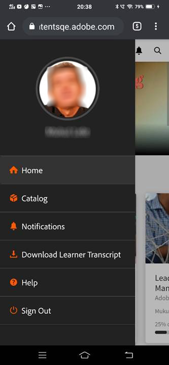

# 移动设备和平板电脑上的学习者应用程序

阅读本文，了解如何在智能手机和平板电脑上下载 Adobe Learning Manager 学习者应用程序。了解如何通过移动设备或平板电脑使用课程。

## 概述 {#overview}

Adobe Learning Manager 学习者应用软件适用于 Android 手机用户和 iPhone 用户。前往 Google Play 商店（Android 操作系统）或 iTunes（macOS 操作系统），下载 Adobe Learning Manager 应用程序。

下载并安装此应用程序后，请使用您的凭据进行登录。打开Learning Manager移动应用程序时，默认显示以下屏幕。

*Learning Manager应用程序的主页*

## 主页 {#homepage}

所有启用了“沉浸式布局”选项的帐户，都有一个支持“沉浸式布局”配置的全新主页。 主页以卡片列表形式组织如下：

|  |  |
|---|---|
|  |  |

*主页上的卡片列表*

*学习者的社交动态*

## 反馈评级 {#feedbackrating}

Adobe Learning Manager 会提示学习者对移动应用程序的使用体验进行反馈。该反馈每月显示一次，并为用户提供足够的时间间隔来体验该应用程序，然后提供反馈。

<!--
|  | |
|---|---|
-->

对于现有用户，在将应用程序更新为最新版本后，首次关闭播放器时他们应该会看到反馈弹出窗口。

请注意，系统会匿名收集反馈，此弹出窗口仅对通过应用程序设置中的配置已启用“**共享使用情况数据**”选项的用户显示。

## 下载徽章 {#downloadbadge}

学习者可以下载PDF和图像格式的徽章。 在“用户配置文件”部分，向下滚动，然后单击任意链接以下载徽章。 下载的徽章会保存在默认设备文件夹中。 该应用程序允许您在下载完成后立即打开文件夹或文件。

|  |
|---|

*下载徽章*

## 移动 Web 响应式布局 {#responsive}

完全响应式的移动Web体验，确保学习者即使没有安装移动应用程序，也可以使用其设备参加培训。

当您首次通过设备上的浏览器登录学习者应用程序时，系统将以适应移动设备的响应式布局显示学习者应用程序。

仅当帐户&#x200B;**配置为仅适用于沉浸式布局**&#x200B;时，才可享用移动 Web 响应式用户界面支持。 响应式用户界面&#x200B;**不适用于经典布局**。

<!--
<table>
 <tbody>
  <tr>
   <td>
    
<strong>Home page</strong>

    
<strong>View options</strong>

    
<strong>Start course</strong>
</td>
   <td>
    
<strong>My Learning List</strong>

    
<strong>View catalog</strong>

    
<strong>Apply filters</strong>
</td>
   <td>
    
<strong>Recommendations based on interest</strong>

    
<strong>View notifications</strong>

    
<strong>Share url</strong>
</td>
  </tr>
 </tbody>
</table>
-->

## ALM Web中的下载提示

当用户在其移动设备上打开ALM链接或使用ALM网站时，他们应该会看到一条提示，要求他们下载该应用程序以获得更好的体验。

_下载ALM应用程序_

## 移动沉浸式体验中不支持的功能 {#unsupportedfeaturesinmobileimmersiveexperience}

学习者经典体验中会显示以下工作流程：

* 多次尝试
* Flexi LP
* 文件上传情况
* 提供 L1 反馈

不支持的其他应用程序功能包括：

* 社交应用程序：如果学习者单击“主页”上的“社交”小组件，则系统会将其重定向至“经典”体验
* 配置文件设置/编辑配置文件
* 查看徽章/技能
* 排行榜：如果学习者单击“主页”上的“排行榜”小组件，则系统会将其重定向至“经典”体验
* 正在下载工作辅助。
* “搜索”中的筛选条件。

“社交学习”现在支持移动沉浸式 Web 体验。

部分功能不支持移动沉浸式应用， 如下所示：

| **区域** | **不支持** |
|---|---|
| 讨论区 | 创建讨论区、编辑讨论区、复制URL、删除、报告、排序、筛选 |
| 发布 | 创建投票类型帖子、编辑、为帖子添加多个附件、复制URL、置顶 |
| 评论/回复 | 编辑、标记为正确答案、在评论或回复中上传图像/视频/音频 |
| 媒体 | 捕获音频；仅上传音频文件 |
| 其他  | 通知、帖子视图、社交排行榜、我的关注、用户资料 |

## 支持学习者下载工作辅助 {#download-job-aid}

在移动沉浸模式下，学习者可以下载工作辅助。 点击&#x200B;**“设置”**，然后点击&#x200B;**“目录”**。 从显示的列表中下载工作辅助。

|  |
|---|

*下载工作辅助*

## 支持学习者下载学习者成绩单 {#download-learner-transcript}

在移动沉浸模式下，学习者可以下载学习者成绩单。

|  |  |
|---|---|

*下载学习者成绩单*

## 查看徽章和技能 {#viewbadgesandskills}

**查看徽章、技能和游戏点数**

默认屏幕会在用户配置文件下方显示您最近获得的徽章、技能和游戏点数。 如果使用手机，则显示最近获得的徽章。 向右滑动可查看更多信息。

**我的待处理学习**

默认情况下，屏幕上会显示您注册的课程。 环形图中会显示过期、即将到期和进行中的学习。

点击课程查看其详细信息以及您的完成日期（如适用）。您可以在此屏幕中“继续”或“重新访问”该课程，这取决于您的完成状态。

*查看待处理的学习*

**查看目录**

点击屏幕底部书本图标旁的图标。您可以立即查看所有相关学习对象的目录。您可以选择在网格版面中查看它们，也可以选择详细视图。 选择推荐可根据您的学习历史记录查看课程推荐。

*查看课程推荐*

## 排序和过滤学习对象 {#sortandfilterlearningobjects}

**排序和过滤**

单击课程或目录界面右上角的排序图标，可按字母顺序（升序或降序）或发布日期对学习对象进行排序。您也可以按类型、完成状态、技能或标签对学习对象进行过滤。点击并选择过滤条件，并点击“应用”进行过滤。

**使用搜索功能**

在手机屏幕右上角，您可以看见一个搜索图标。点击该图标可按课程元数据、唯一 ID、技能等条件搜索学习对象。

**管理配置文件、设置以及通知**

点击屏幕左上角的菜单可查看您的个人资料、通知以及帐户设置。

此菜单还允许您扫描二维码，以便标记课程的出勤情况。

您只需点击&#x200B;**扫描二维码**&#x200B;选项并扫描该代码即可。

**离线学习课程**

当您在线使用已下载的课程时，Learning Manager将访问已下载的课程，而不是进行服务器调用。

## 扫描二维码进行注册 {#qrcode}

您可扫描二维码进行课程注册。在学习管理员生成二维码后，您可以从应用程序上扫描该二维码进行课程注册。

1. 要扫描QR代码，请点击屏幕左上角的。
1. 点击&#x200B;**“扫描二维码”**。

二维码扫描功能允许学习者通过学习管理员生成的二维码执行下述任一操作：

* **注册：**&#x200B;这允许学习者通过扫描二维码来注册课程。
* **完成：**&#x200B;允许学习者通过扫描二维码将课程标记为完成。
* **注册和完成：**&#x200B;允许学习者通过扫描二维码注册课程并同时将该课程标记为完成。
* **标记出席情况：**&#x200B;学习者可以通过扫描二维码来标记特定会话的出席情况。

## 重命名学习对象 {#renaminglearningobjects}

管理员可重命名学习对象术语。要重命名，请参阅[重命名学习对象](../../administrators/feature-summary/settings.md#main-pars_header_1570157145)。

## 社交学习 {#socialmobile}

此次更新不支持以下功能。您无法：

* 创建或关注讨论区。
* 复制 URL 到帖子。
* 将帖子添加为故事或收藏或将其固定到顶部。
* 查看社交排行榜内容。

社交学习是 Adobe Learning Manager 移动应用程序中一个让用户在轻松随意环境下分享其想法和见解的平台。该学习方法是对传统学习理念的一种有益补充。

社交学习能让用户充分利用周边专业知识来获得正确且简明扼要的信息。学习者可以快速应用这些信息来完成一项任务或实现一个目标。

借助移动应用程序，用户可以通过共享内容进行互动，并对共享的内容进行验证。

此平台上可以分享的内容包括视频、音频、屏幕截图、文本、问题和投票。用户还可以与同学共享自己的在线学习内容。

此功能仅在管理员为帐户启用&#x200B;**社交学习**&#x200B;后才能在设备应用程序上使用。

## 在应用程序上启动社交学习 {#launchsociallearningontheapp}

启动应用程序后，点击&#x200B;**“社交”**&#x200B;图标。

*查看社交学习*

## 在讨论区创建帖子 {#createapostinaboard}

与其他社交平台一样，在 Adobe Learning Manager 移动应用程序中，您可以在讨论区创建帖子，同一讨论区的所有学习者均可查看和评论您的帖子并在评论中上传文件。

要创建帖子，请点按屏幕右下角的。

此时会显示以下屏幕。

*添加帖子*

<table>
 <tbody>
  <tr>
   <td>
    

</td>
   <td>
    
编写帖子或粘贴 URL。
</td>
  </tr>
  <tr>
   <td>
    

</td>
   <td>
    
使用手机摄像头拍照并随帖子上传。
</td>
  </tr>
  <tr>
   <td>
    

</td>
   <td>
    
使用手机摄像头录制视频。
</td>
  </tr>
  <tr>
   <td>
    
 
</td>
   <td>
    
使用手机录制音频。
</td>
  </tr>
  <tr>
   <td>
    

</td>
   <td>
    
在讨论区上传任意文档或文件。
</td>
  </tr>
  <tr>
   <td>
    
 
</td>
   <td>
    
提问。
</td>
  </tr>
  <tr>
   <td>
    
 
</td>
   <td>
    
随帖子创建投票。
</td>
  </tr>
 </tbody>
</table>

## 支持的内容格式 {#supportedcontentformat}

<table>
 <tbody>
  <tr>
   <td>
    
<strong>内容类型</strong>
</td>
   <td>
    
<strong>扩展名</strong>
</td>
  </tr>
  <tr>
   <td>
    
视频
</td>
   <td>
    
wmv、f4v、asf、3gp、3g2、avi、mov、h264、m4v、mp4、MPEG、mpg
</td>
  </tr>
  <tr>
   <td>
    
音频
</td>
   <td>
    
mp3、am、m4a、wav、wma、aac
</td>
  </tr>
  <tr>
   <td>
    
静态文件
</td>
   <td>
    
PDF、ppt、pptx、doc、docx、xls、xlsx
</td>
  </tr>
  <tr>
   <td>
    
图像
</td>
   <td>
    
jpg、jpeg、png、bmp、gif
</td>
  </tr>
 </tbody>
</table>

创建帖子后，选择要将帖子上传到的讨论区。点击“选择讨论区”并搜索相关讨论区。

创建帖子后，点击帖子并发布您的注释，供其他学习者查看您的帖子。

在移动应用程序中无法创建讨论区。要创建讨论区，您必须以学习者身份登录网页版应用程序。有关创建讨论区的更多信息，请参阅 [Adobe Learning Manager](/help/migrated/learners/feature-summary/social-learning-web-user.md) 中的社交学习。

## 可对帖子执行的操作 {#actionsthatcanbeperformedonapost}

* 评论帖子并根据权限查看讨论区中的帖子。
* 编辑或删除讨论区中的评论。
* 根据权限编辑或删除帖子。
* 举报涉嫌侵犯个人隐私或含有不当内容的帖子。某个帖子被举报后，系统会向讨论区管理员和版主发送通知，以便采取进一步措施。
* 喜欢或不喜欢   帖子。
* 喜欢或不喜欢条评论。

## 在其他讨论区创建帖子 {#createapostinotherboards}

您还可在其他讨论区创建帖子。

点击&#x200B;**“所有讨论区”**，您可以查看其他学习者在讨论区执行的操作。

*查看所有讨论区活动*

导航到所需讨论区并发布评论。

## 在讨论区共享媒体 {#sharemedia}

<!---->

将图片、文档、音频或视频文件共享到任意讨论区，以便其他讨论区成员可以查看您的帖子并开展互动。要共享媒体，

1. 打开要共享的媒体。
1. 点击“共享”按钮并选择“Learning Manager”。
1. 选择要共享媒体的讨论区。
1. 点击&#x200B;**帖子**。

您也可发布来自外部应用程序的任何内容，例如，您可共享来自 Reddit 或 Quora 的评论。

## 上传外部证书中的资产作为完成证明 {#externalcert}

请按以下步骤操作：

1. 使用您的学习者凭据登录到设备应用程序。
1. 搜索作者创建的证书。
1. 从外部证书列表中，选择所需证书，并进行注册。
1. 点击&#x200B;**完成证明**&#x200B;并上传文件，例如pdf或图像。

   |  |  |
   |---|---|

*上传完成证明*

1. 上传文件后，点击&#x200B;**“提交”**。 此时会显示确认消息。

**上传文件**

1. 上传文件后，点击&#x200B;**“提交”**。

   您只能上传一个文件作为完成证明。 如果尝试上传多个文件，则会显示以下消息：

   **您所做的更改将丢失。 是否要继续？**

1. 状态会变更为&#x200B;**“待审批”**，并显示为橙色。

   您无法通过移动应用程序查看或下载已上传的文件。

在经理批准提交内容后，状态将变更为&#x200B;**“已批准”**，并显示为绿色。

如果经理拒绝了提交内容，状态将变更为&#x200B;**“已拒绝”**，并显示为红色。

|  |  |  |
|---|---|---|

*查看提交状态*

在被拒绝后，您可以上传文件作为完成证明。

* 您只能在状态为&#x200B;**待提交和已拒绝**&#x200B;时提交文件。
* 当状态为&#x200B;**待审批且已批准**&#x200B;时，无法提交文件。

## 在 LinkedIn 学习中学习课程 {#linkedin}

Adobe Learning Manager 现已在学习平台中支持 LinkedIn 学习课程。现在，学习者可以在 Adobe Learning Manager 移动应用程序中学习此类 LinkedIn 学习课程。在设备应用程序中搜索课程，然后开始学习。

您如果已安装 LinkedIn 应用程序，则课程将在应用程序中打开，否则课程将在默认浏览器中打开，而您必须使用 LinkedIn 凭据登录。

如果您通过LinkedIn应用程序参加课程，则无法在Learning Manager中跟踪您的进度。 因此，建议在浏览器中而不是在LinkedIn学习应用程序中启动课程。

>[!NOTE]
>
>只有当您具备有效的Internet连接时，才能参加课程。

|  |  |  |
|---|---|---|

*在LinkedIn学习中注册课程*

在 LinkedIn 学习课程中花费的学习时间由 LinkedIn 内容/LinkedIn 平台传达给 Adobe Learning Manager 学习平台。

如果 LinkedIn 学习不发送学习时间，则无法通过我们的学习平台进行记录。在这种情况下，Learning Manager显示的学习时间为零。

## 为课堂和活动等模块提交文件 {#submitfile}

学习者可以向讲师提交课程完成证明文件。讲师可根据文件内容批准或拒绝所提交的文件。

作者只能为学习者创建教室和活动模块，以便在移动应用程序中使用。

学习者开始课程后，可以在屏幕上看到状态&#x200B;**“文件提交”**&#x200B;以及上传文件的链接，如下面的屏幕截图所示。

*文件提交状态*

要上传文件，请单击&#x200B;**“上传文件”**。

上传任何文件，然后单击&#x200B;**提交**&#x200B;按钮。

 

*提交文件*

## 支持上传的文件类型 {#supportedfiletypesforupload}

<table>
 <tbody>
  <tr>
   <td>
    
<b>内容类型</b>
</td>
   <td>
    
<b>扩展名</b>
</td>
  </tr>
  <tr>
   <td>
    
视频
</td>
   <td>
    
wmv、f4v、asf、3gp、3g2、avi、mov、h264、m4v、mp4、MPEG、mpg
</td>
  </tr>
  <tr>
   <td>
    
音频
</td>
   <td>
    
mp3、am、m4a、wav、wma、aac
</td>
  </tr>
  <tr>
   <td>
    
静态文件
</td>
   <td>
    
PDF、ppt、pptx、doc、docx、xls、xlsx
</td>
  </tr>
  <tr>
   <td>
    
图像
</td>
   <td>
    
jpg、jpeg、png、bmp、gif
</td>
  </tr>
 </tbody>
</table>

## 批准或拒绝提交的内容 {#approvalorrejectionofsubmission}

上传文件后，状态更改为&#x200B;**等待批准。** 次，便不允许再编辑投票类型帖子。讲师随后查看[待处理提交](/help/migrated/instructors/feature-summary/learners.md)的列表，并通过讲师Web应用程序批准或拒绝提交。

讲师批准提交内容后，学习者移动应用程序中的状态即变更为&#x200B;**“已批准”**。

<!---->

当讲师拒绝提交时，学习者移动应用程序上的状态将更改为&#x200B;**已拒绝**。

<!---->

要再次提交文件，请单击链接&#x200B;**“上传文件”**。

## 适用于iPad和平板电脑的Learning Manager {#captivateforipadandtablets}

在iPad或Android平板电脑上的Learning Manager应用程序中，以学习者身份登录后，您将看到以下&#x200B;**主页**&#x200B;屏幕：

<!---->

若要浏览到学习和目录功能，请点击&#x200B;**菜单**&#x200B;下拉列表并选择相应的选项。

<!---->

您可以选择以列表视图而不是磁贴/卡片视图查看课程集。

## 离线访问应用程序 {#accesstheappoffline}

您可以在 iPad 和 Android 平板电脑中离线访问 Adobe Learning Manager 应用程序。您可以下载课程和学习计划。以离线模型参加课程和学习计划，然后在连接到网络后，将内容与在线应用程序进行同步。

1. 点击顶部的&#x200B;**菜单**&#x200B;下拉列表，然后点击&#x200B;**学习**&#x200B;选项。 此时会以磁贴列表的形式显示所有可用课程。
1. 点击每个学习对象磁贴底部的下载图标，即可下载学习内容。

   

   *下载内容*

   应用程序顶部栏中会显示设备的网络状态。

   * 红色条表示设备无法使用该网络。
   * 绿色条表示网络重新联机。

用户可以通过单击绿色栏上的&#x200B;**查看联机内容**&#x200B;按钮切换回联机模式。 当用户切换到联机模式时，设备中的内容会同步。

## 移动沉浸式多物品车支持

学习者现在可以将多个课程、学习路径或认证添加到购物车并一起购买。 在ALM[&#128279;](/help/migrated/learners/feature-summary/multi-item-cart.md)中查看多项目购物车

<!--## Track device storage {#trackdevicestorage}

You can monitor your device storage periodically.

Tap the profile icon at the upper-right corner of the app and tap **Device Storage** menu option.

An app storage information dialog appears as shown below.

Using the app storage information, you can check the total space of device, app and the downloaded courses. This information enables you to download courses accordingly. To delete the downloaded courses in the device, tap delete icon adjacent to each course name.-->
