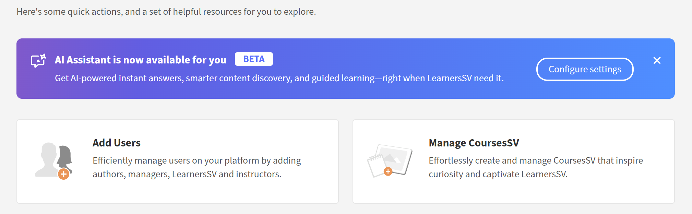

# 面向学习者的AI助理

学习者的AI Assistant (Beta)可帮助他们从指定的学习内容中快速查找答案，而无需浏览整个课程。 您可以用浅显的语言提出问题，并获得准确、重点突出的答复，并提供指向相关课程内容的源链接。

>[!IMPORTANT]
>
>面向学习者的AI Assistant目前作为Beta版功能提供。 功能、支持的场景和限制可能会随功能的变化而改变。

## 什么是适用于学习者的AI助手

AI Assistant是Adobe Learning Manager中的生成式AI聊天助手，可使用您信任的学习内容提供快速、准确的答案。 其中包括引用，以便您始终了解信息的来源。

### 功能

- **智能问答**
   - 单回合和多回合对话
   - 英语中的自然语言理解
   - 通过课程、认证、学习路径和工作辅助获得答案
   - 当查询不明确时，智能澄清问题

- **内容来源和引文**
   - 从支持的目录中的可用资源中检索答案
   - 提供引用内容，其中包含指向源材料的直接链接
   - 支持所有Learning Manager内容格式（静态和交互式）：PDF、DOCX、PPTX、XLSX、音频(MP3、WAV、M4A)、视频(MP4、MOV、WMV)、HTML、SCORM 2004和SCORM 1.2

- **用户体验**
   - 侧面板界面可供所有学习者页面访问
   - 适应内容区域的响应式设计
   - 在浏览器会话中维护的聊天历史记录
   - 新登录或页面刷新后进行清理
   - 友好、清晰、具有教育意义的基调

- **管理员控件**
   - 在帐户级别启用或禁用该功能
   - 选择为AI响应包含的目录
   - 使用条款接受要求遵循Adobe AI准则

## 支持的内容类型

AI Assistant从分配给您的学习内容中检索信息，包括：

- **文档：** PDF、Word、PowerPoint、Excel、HTML
- **媒体：**&#x200B;音频(MP3、WAV、M4A)、视频(MP4、MOV、WMV)
- **交互式内容：** SCORM 1.2、SCORM 2004
- **学习对象类型：**&#x200B;课程、学习路径、认证、工作辅助

Adobe使用可信服务安全处理您的学习内容。

### 目录和内容源限制

AI Assistant仅使用管理员明确配置的&#x200B;**内部**&#x200B;目录中的内容。

当前版本不支持以下内容源：

- **共享**&#x200B;目录
- **已获取**&#x200B;个目录
- **外部**&#x200B;目录
- **默认**&#x200B;目录
- 第三方内容库（例如LinkedIn Learning或Go1）

如果您无权访问课程或工作辅助，则AI Assistant不会显示这些内容中的信息，并且将无法访问引文链接。

## 用例

### 技术学习者

Sarah是一名销售工程师，了解显卡。 她需要快速了解技术规格和优势，以便自信地回答客户的问题。

AI助手可帮助Sarah：

- 对复杂GPU体系结构的清晰技术说明
- 深化对各种图形卡及其差异的理解
- 示例说明，以便Sarah能够将功能与真实用例关联起来

### 客户支持

Marcus是一家合作伙伴公司的支持专家。 他需要快速获得有关产品功能的答案，以帮助客户而无需升级至工程团队。

AI Assistant可帮助Marcus：

- 查找相关支持内容以回答经常询问的客户问题
- 在最初答案不够具体时提出澄清问题
- 查找相关故障排除课程的建议，以提高他的技能

### 新员工入职

詹妮弗刚加入公司，大量的培训材料令她不知所措。 她需要一种无需复习整个课程即可找到特定信息的方法。

AI助手帮助珍妮弗：

- 获取有关提交费用报告的分步指导
- 无需浏览整个目录即可发现有关公司策略的课程
- 引导她进入课程的相应部分，而不用看几个小时的视频

## AI Assistant如何使用内容

AI Assistant从您的学习内容中查找准确的答案。 下面是它的运作方式。

### AI Assistant使用的内容

AI Assistant仅使用帐户管理员启用的学习内容回答问题。 为所选目录中的内容编制索引。

AI Assistant会分析分配给您的学习内容，以生成重点相关的上下文响应：

- 每个响应都包含引用原始源内容的引用。
- 您可以选择一则引文以直接导航至相关的课程、模块或文档。
- 引用可帮助您验证信息，并在需要时浏览其他上下文。

### 流式传输响应

AI Assistant会在生成答案时逐步提供答案，因此您可以立即开始阅读，而无需等待整个响应加载。

### 引文和源透明度

每个AI Assistant响应都包含直接链接到原始课程、模块或学习对象的引用。 引用内容使您能够：

- 选择内嵌引用编号以跳转到确切引用的部分。
- 通过选择响应底部的&#x200B;**显示源**&#x200B;打开完整源列表。
- 验证信息并从权威源探索其他上下文。

> **重要**
> AI Assistant根据管理员启用的内容提供答案。 如果您无权访问引用的项目，则在尝试打开它时将看到“不受支持”消息。

## 内置提示

AI Assistant包含内置提示，可帮助您快速开始处理常见问题和情景。 这些提示将指导您如何与助理进行交互，并演示您可以提问的问题类型。

公司可以自定义内置提示，以反映其学习目标、角色、术语或特定用例。 管理员可以与其客户成功经理合作，以配置或更新内置提示。 在当前版本中，您无法直接在Adobe Learning Manager界面中自定义提示。

## 设置AI Assistant（管理员）

管理员选择哪些&#x200B;**内部**&#x200B;目录可以访问AI Assistant功能。 请确保您分配的目录仅包含适用于AI响应和引文的学习内容，并且这些目录为&#x200B;**内部**（而非&#x200B;**共享**、**已获取**&#x200B;或&#x200B;**外部**）。

在配置AI Assistant之前，请确认您具有管理员凭据，并确定目录应具有访问权限。

### 配置AI Assistant访问权限

要启用学习者AI Assistant，请执行以下操作：

1.以管理员身份登录Adobe Learning Manager。

2.从主页中选择&#x200B;**设置**。

3.从&#x200B;**设置**&#x200B;菜单中选择&#x200B;**学习者AI Assistant (Beta)**。
中显示“学习者AI助手”选项

4.选择切换开关以启用&#x200B;**学习者AI Assistant (Beta)**。
<!---->
<!--5. Select one or more user groups from the **Eligible user groups** option.-->
<!--5. Select **Save** to apply the user group settings.-->

5.从&#x200B;**合格目录**&#x200B;选项中选择一个或多个目录。

6.选择&#x200B;**保存**&#x200B;以应用目录设置。

>[!IMPORTANT]
>
>仅支持&#x200B;**内部**&#x200B;目录。 如果选择&#x200B;**共享**、**已获取**、**外部**&#x200B;或其他非内部目录，则AI Assistant将不会显示其内容，即使它显示在&#x200B;**合格目录**&#x200B;列表中。

## 启动AI Assistant（学习者）

要启动AI Assistant：

1. 以学习者身份登录Adobe Learning Manager。

2. 在主页上选择&#x200B;**询问AI助手**。
   

3. 当显示&#x200B;**“学习者AI助手”**&#x200B;屏幕时，选择&#x200B;**开始使用**。
   

>[!NOTE]
>
>首次启动AI Assistant时，必须在使用它之前提供您的同意。 同意对话框将仅在此初次启动时显示。 对于所有后续启动，您将直接转到AI Assistant以输入提示。

4.在文本字段中键入提示。
<!--  -->

5.按&#x200B;**Enter**&#x200B;接收响应。 查看您的答案、来源和建议。

您可以：

- 选择内嵌的引文号以跳转到确切引用的部分
- 通过选择响应底部的&#x200B;**显示源**，打开源的完整列表

AI Assistant包含引用和每个响应，以显示信息的来源。 每个引文直接链接到用于生成答案的原始课程、模块或学习对象。

您可以选择任何引文以在Adobe Learning Manager中打开课程页面，并在上下文中查看完整内容。 引用可帮助您验证信息、探索其他详细信息并继续从权威来源学习。

## 通过搜索访问AI Assistant

您还可以直接从搜索栏启动AI Assistant。 在搜索字段中键入您的问题，然后从显示的选项中选择&#x200B;**询问AI Assistant**。

## 针对AI Assistant响应提供反馈

您对AI Assistant (Beta)生成的响应的反馈有助于改进其准确性、相关性和整体性能。

### 喜欢或不喜欢响应

- 选择“**拇指向上**”，选择您在响应中找到的有用内容，根据需要添加注释，然后选择“**提交**”。
- 选择“**拇指朝下**”，选择响应无帮助的原因，添加任何注释，然后选择“**提交**”。

## 开始新聊天

开始新的聊天可以让您开始一个新的对话，并清除以前的上下文，以便助理可以专注于新主题，而无需参考以前的交互。

要清除当前对话并开始重新开始，请在AI Assistant屏幕中选择&#x200B;**新建聊天**，然后选择&#x200B;**是**。

AI Assistant为学习者提供快速的上下文答案，支持多种内容类型，并提供内联引用以提高透明度。 管理员可以控制访问权限，确保AI Assistant根据组织需求量身定制，并增强学习体验。

## AI Assistant问题疑难解答

> **注释**
> 配置新目录后，留出4-5小时以便对内容进行索引并可用于AI Assistant响应。

### 无法访问内容

**问题：**&#x200B;学习者有权访问AI Assistant，但收到“我对此问题没有答案”的响应。

**可能的原因：**

- 学习者的目录未包含在AI Assistant配置中。
- 选定的目录中不存在与该问题相关的内容，或者这些目录为空。
- 学习者无法看到相关内容。

**解决方案：**

- 验证学习者的目录访问权限。
- 检查AI Assistant设置中启用的目录。
- 确保这些目录中存在相关内容。
- 添加新内容以供编制索引后，请等待几小时。

### 不相关或质量较差的答案

**问题：** AI Assistant提供的答案与问题不匹配或质量较低。

**可能的原因：**

- 这个问题过于宽泛或模棱两可。
- 相关内容的元数据（描述、标记）不佳。
- 内容结构使得信息提取变得困难。

**解决方案：**

- 鼓励学习者提出更具体的问题。
- 查看和改进课程说明和元数据。
- 确保内容标题和结构清晰。
- 查看详细使用情况报告以确定模式。
- 考虑为常见问题创建工作辅助。

### 超出范围的问题

**问题：**&#x200B;学习者提出与培训内容无关的问题。

**示例：**

- 一般知识问题（“谁是总裁？”）
- 个人意见（“您对X有什么看法？”）
- 不适当的内容

AI Assistant旨在仅根据分配的学习内容回答问题，不会响应范围外的查询。
