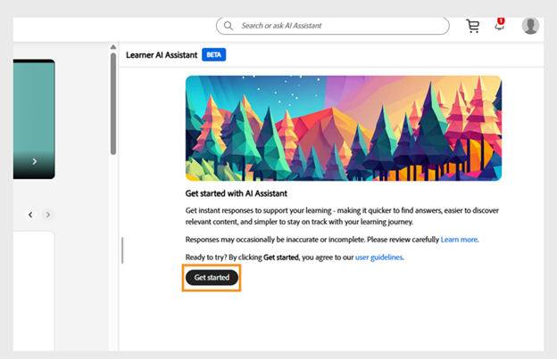

# 面向学习者的AI助理

## 简介

使用AI Assistant从指定的学习内容中获取快速、准确的答案、生成课程摘要、比较学习对象、查找操作方法答案以及创建个性化的学习路径，所有这些操作都无需浏览整个课程。

>[!IMPORTANT]
>
>面向学习者的AI Assistant目前作为Beta版功能提供。 功能、支持的场景和限制可能会随功能的变化而改变。

>[!NOTE]
>
>此功能在FedRAMP授权的环境中不可用。 有关详细信息，请参阅[FedRAMP环境中的功能可用性](/help/migrated/feature-availability-in-fedramp-authorized-environment.md)。

## 什么是适用于学习者的AI助手

AI Assistant是Adobe Learning Manager中的生成式AI聊天助手，可使用您信任的学习内容提供快速、准确的答案。 其中包括引用，以便您始终了解信息的来源。

### 功能

- **智能问答**
  - 单回合和多回合对话
  - 英语中的自然语言理解
  - 通过课程、认证、学习路径和工作辅助获得答案
  - 当查询不明确时，智能澄清问题

- **内容来源和引文**
  - 从支持的目录中的可用资源中检索答案
  - 提供引用内容，其中包含指向源材料的直接链接
  - 支持所有Learning Manager内容格式（静态和交互式）：PDF、DOCX、PPTX、XLSX、音频(MP3、WAV、M4A)、视频(MP4、MOV、WMV)、HTML、SCORM 2004和SCORM 1.2

- **用户体验**
  - 侧面板界面可供所有学习者页面访问
  - 适应内容区域的响应式设计
  - 在浏览器会话中维护的聊天历史记录
  - 新登录或页面刷新后进行清理
  - 友好、清晰、具有教育意义的基调

- **管理员控件**
  - 在帐户级别启用或禁用该功能
  - 选择为AI响应包含的目录
  - 使用条款接受要求遵循Adobe AI准则

## AI Assistant的功能

AI Assistant是生成式AI支持的聊天助手，可使用分配的学习内容回答问题。 每个答复都包含带有指向原始资料直接链接的引文，以便您可以验证相关信息并继续学习。

除了回答问题外，AI Assistant还可以：

- **总结学习对象** — 无需打开目录即可快速概览目录中的任何课程、工作辅助、学习路径或认证
- **比较学习对象** — 并排识别两个课程之间的差异，以确定哪个课程适合您的学习目标
- **回答操作问题** — 有关使用Adobe Learning Manager作为学习者的问题，来自Adobe官方帮助文档Adobe Experience League的源答案
- **查询第三方内容** — 如果管理员添加了此类目录，请询问有关Go1或LinkedIn学习课程的问题
- **创建个性化的学习路径** — 与AI Assistant进行引导式对话，以根据您的目标、背景和可用时间构建自定义、有序的学习计划。

管理员可控制AI Assistant使用的目录。 如果您无法访问课程，AI Assistant不会从中显示信息。

## 支持的内容类型

AI Assistant从分配给您的学习内容中检索信息，包括：

- **文档：** PDF、Word、PowerPoint、Excel、HTML
- **媒体：**&#x200B;音频(MP3、WAV、M4A)、视频(MP4、MOV、WMV)
- **交互式内容：** SCORM 1.2、SCORM 2004
- **学习对象类型：**&#x200B;课程、学习路径、认证、工作辅助

Adobe使用可信服务安全处理您的学习内容。

### 目录和内容源限制

AI Assistant仅使用管理员明确配置的&#x200B;**内部**&#x200B;目录中的内容。

当前版本不支持以下内容源：

- **共享**&#x200B;目录
- **已获取**&#x200B;个目录
- **外部**&#x200B;目录
- **默认**&#x200B;目录
- 第三方内容库（例如LinkedIn Learning或Go1）

如果您无权访问课程或工作辅助，则AI Assistant不会显示这些内容中的信息，并且将无法访问引文链接。

## 用例

### 技术学习者

Sarah是一名销售工程师，了解显卡。 她需要快速了解技术规格和优势，以便自信地回答客户的问题。

AI助手可帮助Sarah：

- 对复杂GPU体系结构的清晰技术说明
- 深化对各种图形卡及其差异的理解
- 示例说明，以便Sarah能够将功能与真实用例关联起来

### 客户支持

Marcus是一家合作伙伴公司的支持专家。 他需要快速获得有关产品功能的答案，以帮助客户而无需升级至工程团队。

AI Assistant可帮助Marcus：

- 查找相关支持内容以回答经常询问的客户问题
- 在最初答案不够具体时提出澄清问题
- 查找相关故障排除课程的建议，以提高他的技能

### 新员工入职

詹妮弗刚加入公司，大量的培训材料令她不知所措。 她需要一种无需复习整个课程即可找到特定信息的方法。

AI助手帮助珍妮弗：

- 获取有关提交费用报告的分步指导
- 无需浏览整个目录即可发现有关公司策略的课程
- 引导她进入课程的相应部分，而不用看几个小时的视频

## AI Assistant如何使用内容

AI Assistant从您的学习内容中查找准确的答案。 下面是它的运作方式。

### AI Assistant使用的内容

AI Assistant仅使用帐户管理员启用的学习内容回答问题。 为所选目录中的内容编制索引。

AI Assistant会分析分配给您的学习内容，以生成重点相关的上下文响应：

- 每个响应都包含引用原始源内容的引用。
- 您可以选择一则引文以直接导航至相关的课程、模块或文档。
- 引用可帮助您验证信息，并在需要时浏览其他上下文。

### 流式传输响应

AI Assistant会在生成答案时逐步提供答案，因此您可以立即开始阅读，而无需等待整个响应加载。

### 引文和源透明度

每个AI Assistant响应都包含直接链接到原始课程、模块或学习对象的引用。 引用内容使您能够：

- 选择内嵌引用编号以跳转到确切引用的部分。
- 通过选择响应底部的&#x200B;**显示源**&#x200B;打开完整源列表。
- 验证信息并从权威源探索其他上下文。

> **重要**
> AI Assistant根据管理员启用的内容提供答案。如果您无权访问引用的项目，则在尝试打开它时将看到“不受支持”消息。

## 内置提示

AI Assistant包含内置提示，可帮助您快速开始处理常见问题和情景。 这些提示将指导您如何与助理进行交互，并演示您可以提问的问题类型。

公司可以自定义内置提示，以反映其学习目标、角色、术语或特定用例。 管理员可以与其客户成功经理合作，以配置或更新内置提示。 在当前版本中，您无法直接在Adobe Learning Manager界面中自定义提示。

## 设置AI Assistant（管理员）

管理员选择哪些&#x200B;**内部**&#x200B;目录可以访问AI Assistant功能。 请确保您分配的目录仅包含适用于AI响应和引文的学习内容，并且这些目录为&#x200B;**内部**（而非&#x200B;**共享**、**已获取**&#x200B;或&#x200B;**外部**）。

在配置AI Assistant之前，请确认您具有管理员凭据，并确定目录应具有访问权限。

### 配置AI Assistant访问权限

要启用学习者AI Assistant，请执行以下操作：

1.以管理员身份登录Adobe Learning Manager。

2.从主页中选择&#x200B;**设置**。

3.从&#x200B;**设置**&#x200B;菜单中选择&#x200B;**学习者AI Assistant (Beta)**。

4.选择切换开关以启用&#x200B;**学习者AI Assistant (Beta)**。
<!---->
<!--5. Select one or more user groups from the **Eligible user groups** option.-->
<!--5. Select **Save** to apply the user group settings.-->

5.从&#x200B;**合格目录**&#x200B;选项中选择一个或多个目录。

6.选择&#x200B;**保存**&#x200B;以应用目录设置。

>[!IMPORTANT]
>
>仅支持&#x200B;**内部**&#x200B;目录。 如果选择&#x200B;**共享**、**已获取**、**外部**&#x200B;或其他非内部目录，则AI Assistant将不会显示其内容，即使它显示在&#x200B;**合格目录**&#x200B;列表中。

## 启动AI Assistant（学习者）

要启动AI Assistant：

1. 以学习者身份登录Adobe Learning Manager。

2. 在主页上选择&#x200B;**询问AI助手**。
   

3. 当显示&#x200B;**“学习者AI助手”**&#x200B;屏幕时，选择&#x200B;**开始使用**。
   

>[!NOTE]
>
>首次启动AI Assistant时，必须在使用它之前提供您的同意。 同意对话框将仅在此初次启动时显示。 对于所有后续启动，您将直接转到AI Assistant以输入提示。

4.在文本字段中键入提示。
<!--  -->

5.按&#x200B;**Enter**&#x200B;接收响应。 查看您的答案、来源和建议。

您可以：

- 选择内嵌的引文号以跳转到确切引用的部分
- 通过选择响应底部的&#x200B;**显示源**，打开源的完整列表

AI Assistant包含引用和每个响应，以显示信息的来源。 每个引文直接链接到用于生成答案的原始课程、模块或学习对象。

您可以选择任何引文以在Adobe Learning Manager中打开课程页面，并在上下文中查看完整内容。 引用可帮助您验证信息、探索其他详细信息并继续从权威来源学习。

## 通过搜索访问AI Assistant

您还可以直接从搜索栏启动AI Assistant。 在搜索字段中键入您的问题，然后从显示的选项中选择&#x200B;**询问AI Assistant**。

## 针对AI Assistant响应提供反馈

您对AI Assistant (Beta)生成的响应的反馈有助于改进其准确性、相关性和整体性能。

### 喜欢或不喜欢响应

- 选择“**拇指向上**”，选择您在响应中找到的有用内容，根据需要添加注释，然后选择“**提交**”。
- 选择“**拇指朝下**”，选择响应无帮助的原因，添加任何注释，然后选择“**提交**”。

## 开始新聊天

开始新的聊天可以让您开始一个新的对话，并清除以前的上下文，以便助理可以专注于新主题，而无需参考以前的交互。

要清除当前对话并开始重新开始，请在AI Assistant屏幕中选择&#x200B;**新建聊天**，然后选择&#x200B;**是**。

AI Assistant为学习者提供快速的上下文答案，支持多种内容类型，并提供内联引用以提高透明度。 管理员可以控制访问权限，确保AI Assistant根据组织需求量身定制，并增强学习体验。

## 从“学习助手”中的特定学习对象获取摘要和答案

Adobe Learning Manager的Learning Assistant可以生成目录中的任何课程、工作辅助、学习路径或认证的摘要。 摘要从存储在目录中的课程内容和模块成绩单中获取。

### 搜索课程

1. 从学习者主页打开&#x200B;_学习助理_。
2. 在“聊天”面板中，键入/以启动内容搜索。

>[!NOTE]
>
>无法搜索未添加到目录的学习对象。 您可以访问自己有权访问的任何内容，但“学习者助理”仅从模块内容中获取摘要。

1. 键入要总结的课程、工作辅助、学习路径或认证的名称\。 此时会显示匹配目录项目的预先类型列表。
2. 从列表中选择学习对象。

### 快速生成课程概述

如果您需要快速、可靠的课程快照，而无需完全打开课程，可使用此功能。 常见情景包括：

- 重温或整理学习资源
  *情景：*&#x200B;销售代表在六个月前完成了“Negotiation Fundamentals”课程，现在明天会接到客户续订的大电话。 他们没有重新查看所有四个模块，而是让“学习助理”对课程进行总结，并快速复习所涵盖的关键谈判策略。
- 决定是否注册_
  *情景：*&#x200B;新经理发现其目录建议使用“引导变更”，但不确定这是否适合其当前团队情况。 他们首先要求进行总结，发现它主要侧重于远程团队变更管理，并决定注册，因为这与他们需要的内容相匹配。
- 准备或引用主题_
  *情景：*&#x200B;支持工程师即将加入客户电话，咨询他们暂时没有使用的产品功能。 他们要求“学习助理”总结相关课程，而不是仔细研究45分钟的培训课程，这样他们就能在通话前快速刷新关键步骤和术语。

1. 在聊天输入中，键入一个查询，如课程摘要或课程摘要。
2. 选择&#x200B;**发送**&#x200B;以提交查询。
3. “学习助手”会根据课程模块和目录中存储的内容生成并显示摘要。

### 最佳实践

- 在搜索时使用特定的课程名称，以获得准确的前进文字结果。
- 您可以请求提供课程、工作辅助、学习计划和认证的摘要。
- 查看摘要以在注册之前快速确定课程是否符合您的学习目标。

## 在Learning Assistant中比较学习对象

Adobe Learning Manager的Learning Assistant允许您并排比较目录中最多两个学习对象。 在注册之前，使用此功能可了解两个课程在内容、范围或焦点方面的差异。

### 选择要比较的学习对象

1. 从学习者主页打开&#x200B;_学习助理_。
2. 在“聊天”面板中，键入/以启动内容搜索。
3. 键入第一个学习对象的名称。 此时会显示匹配目录项的前置类型列表。
4. 从列表中选择第一个学习对象。
5. 键入/并搜索第二个学习对象。
6. 从列表中选择第二个学习对象。

>[!NOTE]
>
>一个查询中最多可比较两个学习对象。

### 请求比较

1. 在聊天输入中，键入一个查询，例如这两个课程之间的差异或比较这些学习对象。
2. 选择&#x200B;_发送_&#x200B;以提交查询。
3. 学习助手会生成并显示一个比较，其中突出显示两个学习对象之间的内容差异。

### 最佳实践

- 在比较之前查看各个课程摘要，以简要了解各个课程。
- 使用比较结果确定哪些课程涵盖与您的角色或技能差距最相关的主题。
- 如果目录项未出现在预键入内容中，请与管理员确认这两个学习对象都是已分配目录的一部分。

## 在“学习助手”中Experience League答案

了解Adobe Learning Manager的Learning Assistant如何使用Adobe Experience League中的内容（包括相关帮助文章的链接）回答学习者问题。

### 学习助手如何使用Experience League

Adobe Learning Manager的学习助手可以从Adobe的官方帮助和文档网站[Adobe Experience League](/help/migrated/user-guide.md)中获取答案。 学习者询问程序性问题或操作问题时，学习助理可以检索相关答案，并包含完整Experience League文章的链接。

### 学习助手可以回答哪些类型的问题

Learning Assistant可以回答有关如何以学习者身份使用Adobe Learning Manager的问题。 示例包括：

- 如何注册经理指派的课程
- 如何访问学习计划或认证
- 如何查找和查看已完成的课程

当Learning Assistant在Experience League中找到相关答案时，响应中将包含指向源文章的链接，以便您浏览完整文档。

### 这与Admin Assistant有何不同

自早期版本以来，Adobe Learning Manager中的[Admin Assistant](/help/migrated/administrators/feature-summary/alm-ai-assistant.md)已为管理员提供了来自Experience League的答案。 2026年8月的增强功能将此功能扩展到面向学习者的学习助理，以便学习者无需离开平台即可获得帮助。

Admin Assistant和面向学习者的Learning Assistant均使用相同的基础Experience League内容生成答案。

## 在Learning Assistant中支持第三方内容

Adobe Learning Manager的Learning Assistant可以回答学习者针对平台上可用的任何第三方内容以及本机Adobe Learning Manager内容提出的有关学习对象的问题。 学习者必须先将Go1或LinkedIn学习目录添加到Adobe Learning Manager，然后才能查询这些课程。

### 第三方目录支持的工作方式

>[!IMPORTANT]
>
>作为先决条件，管理员必须向“学习者助理”添加所需的目录。 有关更多详细信息，请参阅[配置AI Assistant访问权限](https://experienceleague.adobe.com/en/docs/learning-manager/using/learner/learner-ai-assistant#configure-ai-assistant-access)。

管理员将Go1或LinkedIn学习目录添加到Adobe Learning Manager时，目录内容会按照预定的摄取过程进行处理。 收录完成后，该目录中的学习对象将可供学习助手查询。

管理员添加目录后，摄取通常在一到两个小时内完成。

摄取完成后，学习者可以按照查询本机LinkedIn内容的方式询问Go1或Adobe Learning Manager学习课程的相关问题。 例如，学习者可以使用/命令请求Go1课程摘要或将LinkedIn学习课程与Adobe Learning Manager课程进行比较。

- Adobe Learning Manager没有第三方内容的内容转录文本，因此转录文本不会用于检索答案。 只能从可用的元数据（如标题、描述和概述）中检索答案。
- 当前仅支持&#x200B;_英语_。

### 要求

要让Learning Assistant查询Go1或LinkedIn学习内容：

- 管理员必须将相关的Go1或LinkedIn学习目录添加到Adobe Learning Manager。
- 必须完成计划的目录收录才能查询课程。
- 学习对象必须是学习者分配的目录的一部分。

## AI Assistant问题疑难解答

> **注释**
> 配置新目录后，留出4-5小时以便对内容进行索引并可用于AI Assistant响应。

### 无法访问内容

**问题：**&#x200B;学习者有权访问AI Assistant，但收到“我对此问题没有答案”的响应。

**可能的原因：**

- 学习者的目录未包含在AI Assistant配置中。
- 选定的目录中不存在与该问题相关的内容，或者这些目录为空。
- 学习者无法看到相关内容。

**解决方案：**

- 验证学习者的目录访问权限。
- 检查AI Assistant设置中启用的目录。
- 确保这些目录中存在相关内容。
- 添加新内容以供编制索引后，请等待几小时。

### 不相关或质量较差的答案

**问题：** AI Assistant提供的答案与问题不匹配或质量较低。

**可能的原因：**

- 这个问题过于宽泛或模棱两可。
- 相关内容的元数据（描述、标记）不佳。
- 内容结构使得信息提取变得困难。

**解决方案：**

- 鼓励学习者提出更具体的问题。
- 查看和改进课程说明和元数据。
- 确保内容标题和结构清晰。
- 查看详细使用情况报告以确定模式。
- 考虑为常见问题创建工作辅助。

### 超出范围的问题

**问题：**&#x200B;学习者提出与培训内容无关的问题。

**示例：**

- 一般知识问题（“谁是总裁？”）
- 个人意见（“您对X有什么看法？”）
- 不适当的内容

AI Assistant旨在仅根据分配的学习内容回答问题，不会响应范围外的查询。

### Go1或LinkedIn学习课程未显示在“学习助理”搜索中

向管理员确认Go1或LinkedIn学习目录已添加到Adobe Learning Manager，且目录摄取已完成。 添加目录后，摄取操作最多可能需要一到两个小时。

### 最近添加的课程尚不可用

等待计划的目录同步完成。 如果课程在两小时后仍未显示，请联系您的管理员以确认目录连接处于活动状态。
