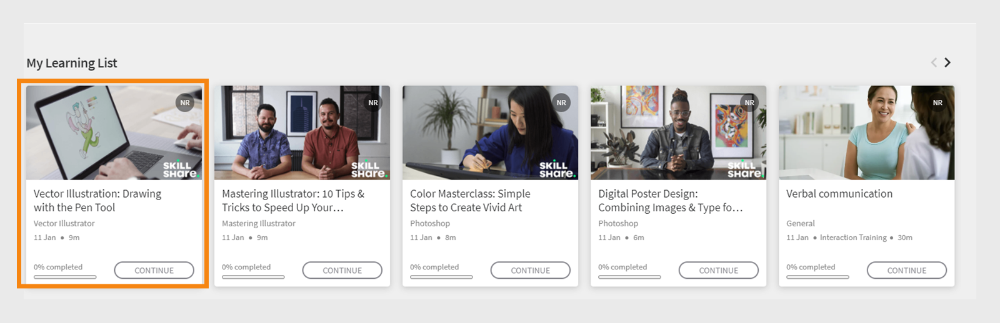

# 学习者主页

## 概述 {#overview}

管理员启用沉浸式布局后，学习者在登录应用程序时会看到经过全面改进的用户界面。

>[!NOTE]
>
>IE11浏览器不支持沉浸式布局。

## 全新的学习者UI可实现沉浸式布局

>[!IMPORTANT]
>
>我们将分阶段发布新的学习者UI。

我们使用更加时尚和更新的设计刷新了学习者UI。 新UI旨在在&#x200B;**[!UICONTROL 学习者主页]**、**[!UICONTROL 我的学习]**、**[!UICONTROL 目录]**&#x200B;和&#x200B;**[!UICONTROL 课程概述]**&#x200B;登陆页面中提供一致的用户体验。 新的视觉元素遵循当前的设计风格，使产品看起来更易于使用且更具吸引力。 此更新包括新的刊头、侧面板和当代构件。

>[!NOTE]
>
>改版后的用户界面仅适用于沉浸式布局。 移动Web/应用程序尚不支持这些更改，将在未来版本中更新这些更改。

_旧用户界面_

_新用户界面_

### 主页

主页采用全新的设计，包括改进的侧面板、顶部标题、增强的课程卡和小组件。

_新主页_

### 目录页面

目录页面采用组织有序的过滤器和增强的课程卡的全新外观，可提供更佳的用户体验。

_目录页面_

### “课程概述”页面

课程概述页面显示了一个新外观，其中包含有关课程的更多详细信息。 此页面可帮助学习者获取所需的所有信息。

_课程概述页面_

### 课程卡

课程卡还重新设计了布局，以更有效地显示详细信息。 改版的课程卡会突出显示注册所需的相关元数据。 此元数据包括正确的发布或到期日期、评分和说明以及作者或提供商。

_旧课程卡_

_新课程卡_

对于从&#x200B;**LinkedIn**&#x200B;和&#x200B;**Go1**&#x200B;平台导入的课程，课程卡将显示原始发布日期(从&#x200B;**LinkedIn**&#x200B;和&#x200B;**Go1**)。 您还可以在用户界面上查看这些特定的发布日期。

### 侧栏和搜索栏

侧边栏会使用新的UI元素进行更新，以获得更整洁的外观。 新的搜索栏没有搜索按钮，外观更整洁。 学习者可以键入关键字，然后按Enter开始搜索或在搜索栏下方选择结果。

_侧边栏和搜索栏_

### 刊头 {#masthead}

展示带有嵌入式URL的视频或图像轮播。 [管理员能以标头形式上传任何图像或视频](../../administrators/feature-summary/announcements.md#masthead)资源，并针对一组学习者设置其可见性。

*查看刊头*

### 我的学习列表 {#mylearninglist}

显示学习者已参加的培训。 这些培训以水平排列的卡片显示。 您可以单击右侧或左侧按钮浏览课程。

*查看我的学习列表*

您还可以左右滑动以浏览列表。

如要继续学习课程，请单击卡片上的&#x200B;**[!UICONTROL “继续”]**，之后系统即会启动播放器。

管理员可通过“管理”应用程序启用/禁用每个训练卡图标的外观（**设置** > **常规** > **启用训练卡图标**）。

**添加到“我的学习列表”**

将鼠标悬停在&#x200B;**根据您的兴趣领域推荐**&#x200B;和&#x200B;**根据同事的活动列表推荐**&#x200B;中的任何课程卡上，您将可看到将课程添加到&#x200B;**我的学习列表**&#x200B;的选项。 单击课程卡上的&#x200B;**[!UICONTROL +]**，课程随即添加到&#x200B;**我的学习列表**&#x200B;中。

*添加到“我的学习列表”*

## 选择技能级别 {#chooseskilllevels}

作为学习者，您可以根据以下级别筛选课程目录：

* 初学者
* 中等
* 高级

选择一个选项，然后您可以根据选择项查看相应课程目录。

*选择技能级别*

## 合规性信息板小组件

“合规性信息板”小组件可让学习者使用“合规性”标签筛选截止日期即将到来的课程/学习路径/认证。 此功能适用于所有学习者应用程序，包括ALM Teams应用程序、AEM、移动应用程序、沉浸式应用程序和SF应用程序。

_合规性信息板构件_

## 日历 {#calendar}

显示您的课程和培训排程。 浏览日历以查看后续月份的培训。

*查看已安排会话的日历*

“日历”小组件具有以下功能。 可查看的内容：

* 按月开展培训。 向左或向右滚动。
* 您可注册的后续教室培训或虚拟教室培训。
* 您已注册的后续教室培训或虚拟教室培训。
* 您已完成的教室或虚拟教室会话
* 得到经理批准的教室培训或虚拟教室培训。

您可以应用过滤器&#x200B;**[!UICONTROL 仅查看已注册的会话]**&#x200B;以仅查看日历上的已注册会话。

## 社交动态 {#socialfeed}

*查看社交动态*

了解其他用户正在谈论的内容。

此小组件汇总了某个时段的活动， 其功能包括：

* 显示活动用户以及在您范围内或组内的用户活动。
* 显示最近两周发布的帖子。

## 用户资料技能 {#profileskills}

用户资料技能可用于课程推荐。 管理员向某一用户或一组用户分配技能时，系统会将获得的技能添加至学员的用户资料技能中。 如果学员已在自己的用户资料中添加技能，则系统会将此技能包含的所有级别添加至学习者的用户资料技能中。 将鼠标悬停在技能上方时，学员可以看到技能的名称、技能来源、级别、技能完成率和积分。

*查看个人资料技能*

在学员注册参加此课程后，系统只会将按分数划分的外部技能添加至用户资料技能中。 此外，学习者还可以搜索、选择外部技能，并将其添加到自己的个人资料中。如果学习者首次登录学习者应用程序，并且学习者的技能已存在，则这些技能会显示在“我的个人资料”中。

## 根据您的兴趣领域推荐 {#recommendationbasedonyourareaofinterest}

根据您选择的兴趣领域显示培训。 推荐由机器学习算法驱动。

*查看推荐的课程*

如欲获取更具针对性的推荐，请单击&#x200B;**查看/更新**&#x200B;以更新技能。

添加技能后，系统日后将根据您的偏好作出推荐，因此针对性更强、重点更突出。

如果管理员禁用了&#x200B;**探索技能**&#x200B;选项，则您可将感兴趣的领域添加至您的技能中。

推荐课程以卡片形式显示。 将鼠标悬停在课程卡上时，您可以看到课程的更多详细信息。

同样支持产品术语。

**业界公认的技能**

如果管理员在管理应用程序中启用了&#x200B;**业界公认**&#x200B;选项，您便能看到技能网络图表。

在管理员将培训类型设置为“业界公认”后，学员才能查看这些技能。

在“技能图”可视化中，您可以搜索并添加单项或多项技能。

*技能图可视化*

如果要显示帐户中的所有技能，请启用选项&#x200B;**“显示我的帐户中包含培训的技能”**。

添加技能后，您便可看到一幅力导向图，其中所选技能为主顶点，关联技能则为较小顶点。

您选择的技能也会显示在&#x200B;**所选技能**&#x200B;部分。

*所选技能*

如要添加技能，请单击&#x200B;**[!UICONTROL 添加]**。

## 根据同事的活动推荐 {#recommendationbasedonpeeractivity}

根据同事当前参加的培训活动显示培训。 这同样也由机器学习算法驱动。 这些推荐基于同事参加的培训作出，并向选择“自定义”和“业界公认”技能的学习者提供。
