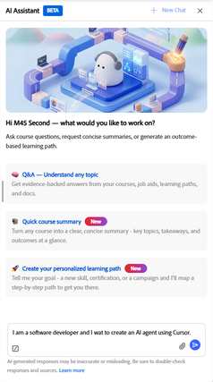
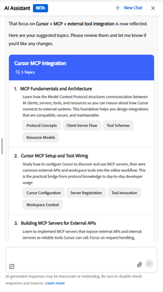

# 什么是学习路径代理

学习路径代理使用AI助手创建结构化学习路径。 与管理员分配的标准学习路径不同，此类学习路径是通过引导式对话生成的。 客服专员需要您描述目标，并构建符合您学习需要的路径。

客服专员首先从组织的内部课程目录中提取内容，并对已批准且与团队相关的课程进行优先排序。 如果您的管理员已启用第三方内容，则客服专员可能还会加入来自已连接的外部提供商的课程，以填补覆盖范围中的任何空白。 您始终会自动注册保存路径内的课程，以便您可以立即开始学习。

个性化学习路径针对两种主要用例设计：

- **有针对性的技能开发**：您需要实现特定的业务结果或快速达到绩效目标，例如准备新的责任或弥补审核中确定的技能差距。
- **构建深刻的专业知识**：您希望从初学者逐步提升到选定领域、技术或学科的专家，但需要更长的时间。

## 基于对话的方法的工作原理

探员在你家碰到你。 你首先用简单的语言描述你想学的东西，尽可能多或尽可能少的细节。 客服专员随后询问跟进问题，以了解您的角色、您面临的特定挑战以及您每周可以投入多少时间学习。

根据您的答案，客服专员会根据建议的熟练程度级别确定3至5个学习主题。 客服专员在搜索匹配的课程之前，您可以查看这些主题、请求更改或确认更改。 然后，客服专员会生成一个命名学习路径，其中显示每门课程及其说明、时长和模块计数。 在保存之前，您可以进一步调整路径。

保存路径后，您将自动注册所有课程。 该路径会显示在&#x200B;_个性化学习路径_&#x200B;部分的主页上，随时可以开始。

### 内容源和课程选择

客服专员根据与您陈述的目标的相关性、您当前的熟练程度级别、您的总可用时间以及最近内容的更新时间来选择课程。 当客服专员在可用目录中找不到与特定主题匹配的课程时，它会告诉您并建议联系您的管理员，请求该领域的其他内容。

### 主页上的个性化学习路径

所有保存的个性化学习路径均显示在主页的&#x200B;_个性化学习路径_&#x200B;栏中。 每张信息卡都显示路径名、课程数和&#x200B;_继续_&#x200B;按钮，以便从上次中断的地方继续。

### 共享学习路径

保存个性化学习路径后，您可以与同事共享它。 “共享”会向他们发送链接或电子邮件邀请。 当同事打开共享路径时，他们只需注册一个操作即可。 当团队中的多名成员具有类似的学习目标，并且您希望他们遵循相同的结构化计划时，“共享”非常有用。

### 最佳实践

- 在开始对话时尽可能详细地描述您的学习目标。 客服专员拥有的上下文越多，您的路径就越相关。
- 提前提供您的时间承诺，以便生成的路径符合您的实际计划。 客服专员理解自然语言：“每周两个晚上”或“每天30分钟”都有效。
- 在要求客服专员生成课程之前，请先查看建议主题。 与之后的课程列表修订相比，在该阶段确认或调整主题可节省时间。
- 如果主题未显示匹配的内容，请记下该主题并联系您的管理员，请求将相关课程添加到目录中。

## 配置个性化学习路径代理

在“设置”中启用AI Assistant选项时，将在Adobe Learning Manager中默认启用个性化学习路径代理。

>[!NOTE]
>
> 内容可见性遵循现有的目录访问规则。 学习者将只能从已具有访问权限的目录中查看和接收课程。 个性化学习路径客服专员不会绕过目录限制。

在每个来源中，客服专员会根据课程与学习者目标的相关性以及课程级别与学习者所陈述技能的匹配程度对课程进行排名。

如果目录中的主题没有匹配的课程，客服专员会通知学习者，并建议他们联系管理员，以请求该区域的内容。

<!-- 
### Monitor credit usage

The Personalized Learning Path agent consumes AI credits each time a learner generates a path. To monitor and manage usage:

1. In the left navigation of the administrator's home page, select **Billing**.
2. Select the **AI Credits** tab. The **Learning Path** agent appears as a line item in the features list.
3. Review current usage and adjust the credit allocation or usage limit as needed.

>[!CAUTION]
>
>If the credit limit for the Learning Path agent is reached, learners receive an in-app message that the agent is unavailable and are directed to contact an administrator. Increase the allocation to restore access. 
-->

## 使用学习者AI助理创建个性化学习路径

使用Adobe Learning Manager中的学习者AI助理生成与您的目标、背景和可用时间匹配的个性化学习路径。 然后将其保存到您的个人资料中，并立即开始学习。

### 打开学习者AI助理并开始对话

1. 从主页中选择&#x200B;**AI Assistant**。
2. 在文本字段中键入学习目标。 尽可能做到具体一点。 例如：
   - *我是软件开发人员，我想使用光标创建一个AI代理。*
   - *我刚刚被提升为经理角色，想要学习如何处理困难的对话。*
   - *我想以分析员的身份掌握财务建模。*
     

3. （可选）如果以前的会话处于打开状态，请选择&#x200B;_+新建聊天_&#x200B;以开始新的对话。

注意：

- （可选）使用&#x200B;_回形针_&#x200B;图标附加文档，如简历、经理反馈电子邮件或项目简介。 客服专员使用该文档了解有关学习目标和背景的更多上下文。
- 选择&#x200B;_发送_。

### 描述您的目标和背景

客服专员通过确认您的目标的消息进行回复，并要求提供其他上下文来定制您的路径。 它通常会询问：

- _您当前的角色和背景_&#x200B;您已经知道的信息、您担任该角色的时间长度或任何相关经验。
- _您的特定挑战或情景_&#x200B;您需要此学习立即解决的现实情况。
- _您的时间承诺_&#x200B;每周可实际投入学习的小时数。

你不需要回答每一个问题。 唯一需要的输入是您的学习目标或挑战。 客服专员将继续处理您提供的任何上下文。

>[!TIP]
>
>客服专员了解自然时间表达式。 你可以说“每周两个晚上”，“每天大约30分钟”，或者“周末几个小时”，然后客服专员将其转换为每周小时数，进行评估并与你确认。

键入您的响应，然后选择&#x200B;_发送_。

继续对话，直到客服专员为您建议的主题。

### 查看建议的主题

在收集足够的上下文后，客服专员会列出3-5个学习主题，每个主题都有一个标题、简短描述和建议的熟练程度级别。

1. 仔细阅读主题列表。 客服专员根据您共享的内容选择熟练程度级别，但您可以请求更改。
2. 要调整主题（例如，更改熟练程度级别或交换主题），请在聊天中键入反馈。 例如，我对第一个主题已经有一定的了解。 能不能将它设置为中级？
3. 如果您对建议的主题感到满意，请在聊天中回复这些主题，或者如果出现建议的确认提示，然后选择相应的确认提示，以进行确认。

### 查看学习路径

客服专员搜索可用目录并构建命名学习路径。 路径显示：

- 路径名和总估计持续时间
- 每个课程标题、描述、持续时间和模块计数
- 指示某些主题是否没有匹配的可用内容

如果某些主题没有匹配的内容：

客服专员通知您它找不到这些特定主题的课程，并建议联系您的管理员以请求这些领域的内容。 系统仍会为找到课程的主题生成路径。

<!-- - Review the path. If you want to change something, for example, remove a course, adjust the scope, or explore different topics. Type your request in the chat\. For example, Can you remove the first course and replace it with something shorter? -->
如果对路径感到满意，可让客服专员通过键入“save the learning path”（保存学习路径）来保存路径。

### 保存和访问学习路径

保存路径后，客服专员会确认保存，并自动将您注册到该路径中的所有课程。

要访问您的路径，请执行以下操作：

- 从确认消息中选择&#x200B;_转到学习路径_&#x200B;以立即打开，或
- 可随时在主页上的&#x200B;_个性化学习路径_&#x200B;条中查找该内容。

### 共享您的学习路径

在路径概述页面中，您可以与同事共享保存的路径。

1. 从主页上的&#x200B;_个性化学习路径_&#x200B;栏中打开已保存的路径。
2. 选择&#x200B;_共享_。
3. 共享生成的链接，或输入电子邮件地址以发送直接邀请。

收到共享链接的同事只需执行一项操作即可注册路径。

## 最佳实践

- 提供有关您的角色和当前挑战的背景信息。 您越具体，课程选择就越相关。
- 用自然语言提及您每周承诺的时间。 代理将在生成路径之前确认其解释。
- 在要求生成路径之前先查看建议的主题。 在该阶段调整主题比以后修订课程列表更快\。
- 如果生成的路径包含您已完成的课程，请通知客服专员。 它可能会建议替代方案。

## 常见问题解答

_在哪里可以找到我保存的个性化学习路径？_

您保存的所有路径都会显示在主页的&#x200B;_个性化学习路径_&#x200B;栏中。 每张信息卡都显示路径名和&#x200B;_继续_&#x200B;按钮。 您也可以从此处打开任何路径以查看完整的课程列表和进度。

_我可以保存多少个个性化学习路径？_

主页上的&#x200B;_个性化学习路径_&#x200B;条最多可显示10条路径。

_我应提供哪些信息来获取相关的学习路径？_

请至少说明您的学习目标或您尝试解决的特定挑战。 提供的上下文越多，路径越好。 有用信息包括您当前的角色、已担任该角色的时间、任何相关的先前经验，以及每周可实际投入学习的时间。

_如果客服专员找不到与我的主题匹配的课程，会发生什么情况？_

客服专员在对话中直接告诉您，他们找不到与您的一个或多个主题匹配的课程。 它仅使用可用课程的主题生成路径。

如果客服专员找不到您任一主题的课程，则会通知您其无法为该目标创建路径。 无论是哪种情况，请联系您的学习管理员，让其了解哪些主题没有可用内容。 他们可以将相关课程添加到目录中，以便涵盖未来的路径请求。

<!-- 
_How does the agent decide which courses to include?_

The agent prioritizes your organization's internal course catalog above external sources. It selects courses based on relevance to your stated goal, whether the course level matches your proficiency, how recently the content was published or updated, and quality signals such as ratings and completion rates\. Your administrator controls which content sources are available. 
-->

_能否调整学习路径中的主题？_

是。 在对话期间，您可以让客服专员在生成路径之前添加、删除或更改主题。 代理将更新主题列表并重新生成要匹配的路径。

_能否更改所生成路径中的各个课程？_

数字 客服专员生成路径后，课程选择即已修复。 您无法交换、删除或替换单个课程。 代理推荐的内容就是路径所包含的内容。

如果推荐的课程效果不佳，最好的方法是在生成课程之前返回并调整主题。 客服专员会根据确认的主题选择课程，因此更改主题范围或熟练程度级别将生成不同的课程集。

_为什么客服专员不断询问跟进问题？_

客服专员需要对您的学习目标足够清晰才能确定相关主题。 如果您最初传达的信息很宽泛，例如“我想学习营销”，那么它会提出一些问题来缩小范围。 提供有关您的角色、您面临的挑战以及学习后您希望能够采取的操作的更多具体细节，将有助于客服专员更快地进入主题生成阶段。