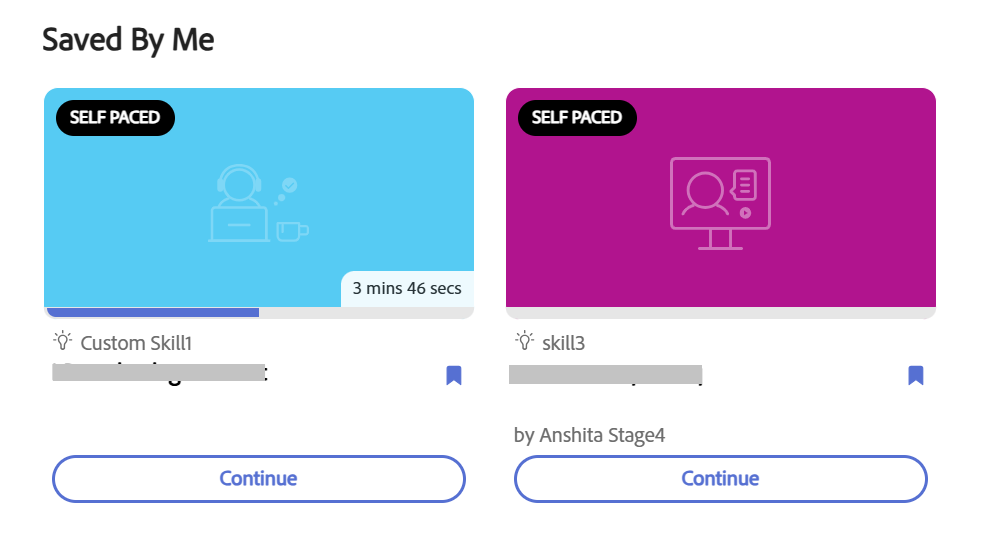

## “由我保存”构件

**由我保存**&#x200B;小组件会显示您已添加书签以便稍后使用的课程、学习路径、认证和工作辅助。 它为您提供了一个位置来查找您已标记为“已保存”的内容，而无需再次搜索目录。

管理员配置&#x200B;**[!UICONTROL 由我保存]**&#x200B;小组件后，您可以通过选择按钮保存学习对象（学习对象）。 您可以将学习对象保存在&#x200B;**[!UICONTROL 主页]**、**[!UICONTROL 我的学习]**&#x200B;和&#x200B;**[!UICONTROL 目录]**&#x200B;页面，并且保存的学习对象显示在&#x200B;**[!UICONTROL 主页]**&#x200B;页面上的&#x200B;**[!UICONTROL 由我保存]**&#x200B;类别下。

您可以通过选择相同的按钮来取消保存学习对象。

