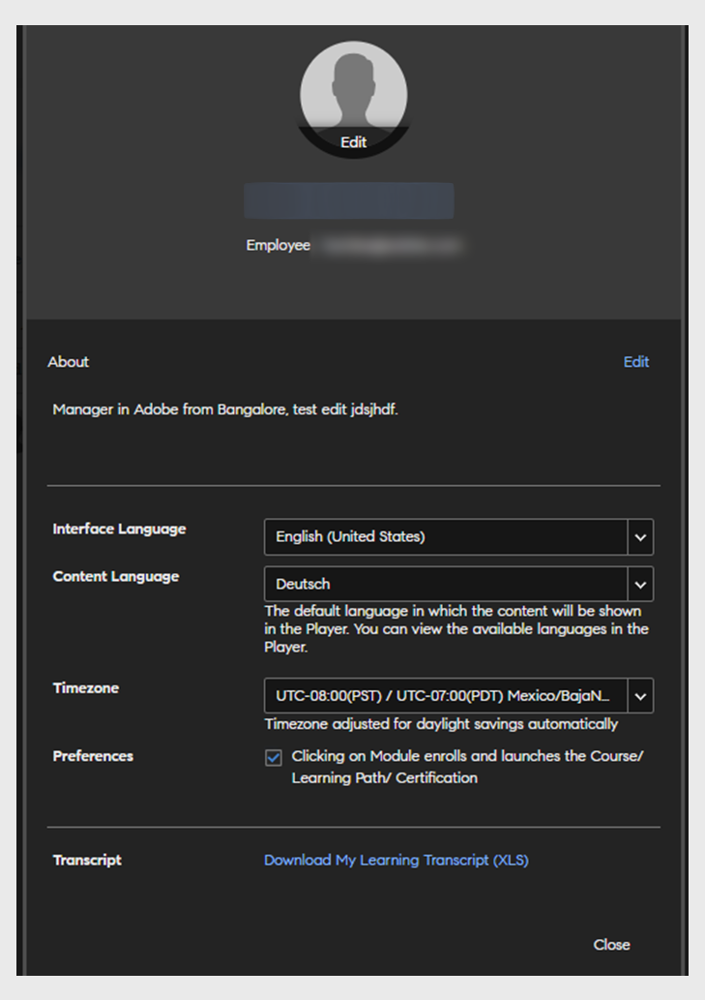

# 个人资料设置

阅读本文，了解如何进行学习者配置文件设置以及添加照片。了解如何下载配置文件对应的学习者成绩单。

## 对配置文件设置进行配置 {#configuringprofilesettings}

1. 在页面的右上角，单击配置文件或照片旁的下拉箭头。
1. 选择“配置文件设置”。
1. 您可以在显示的弹出对话框中执行以下操作：

   * 添加/更新配置文件照片：将鼠标悬停在照片上。单击&quot;上传&quot;并添加照片。单击&quot;编辑&quot;以更改照片。
   * 删除照片：将鼠标悬停在配置文件照片上。单击“删除”。
   * 单击下方的文字区域来添加“关于我”内容。
   * 单击字段旁的“编辑”来修改“关于我”内容。
   * 设置配置文件的“区域设置”。在“区域设置”下拉菜单中选择语言。
   * 设置配置文件的“当前区域设置”。
   * 设置配置文件的“时区”。
   * 下载学习者成绩单及相关数据。

   
   *查看学习者首选项*

   单击“下载我的学习成绩单 XLS”链接时，Excel 工作表会下载至您的系统。该 Excel 表包含您使用过的学习对象、每个学习对象的完成状态、对应的到期日期、已习得技能等内容的详细信息。下载此表单可快速获取学习配置文件的完整数据。

1. 如果管理员已启用摘要电子邮件且您不在 DND 列表内，则您可以订阅或退订摘要电子邮件。 启用下方选项。

   
   *订阅或取消订阅摘要电子邮件*

   根据管理员（您）所设的频率，学习者将每两周或每月收到一次电子邮件。

## 退订摘要电子邮件 {#unsubscribefromdigestemails}

收到邮件后，您可以单击 **取消订阅** 电子邮件底部的链接。

单击 **[!UICONTROL 取消订阅]**，您将被重定向到 **配置文件设置** 页面，您可以在该页面禁用接收电子邮件的选项。

## 摘要电子邮件解析 {#anatomyofadigestemail}

摘要电子邮件包含以下部分：

<table>
 <tbody>
  <tr>
   <td>
    
<b>部分</b>
</td>
   <td>
    
<b>描述</b>
</td>
  </tr>
  <tr>
   <td>
    
个人培训摘要
</td>
   <td>
    
本节通过提及培训所花费的分钟数，对学习者的培训指标进行个性化处理。

    
我们会根据学习者所花时间来定制内容，并在此过程中遵循下方定义的规则：

    
若 (time_spent) &gt;= 60 分钟，则显示以下文本：

    
<i>“在过去两周/一个月内，您已经 <b>(time_spent)</b> 技能提升培训分钟。 我们在下方列出了一些建议，可助您深入了解。” </i>

    
 如果(time_spent) &lt; 60分钟，则显示以下文本：

    
<i>“在过去两周/一个月内，您已经 <b>(time_spent)</b> 技能提升培训分钟。 我们在下方列出了一些实用建议，希望能助您快速入门，并持续进步。”</i>
</td>
  </tr>
  <tr>
   <td>
    
培训活动
</td>
   <td>
    
本部分显示该帐户培训活动的公司级别摘要。

    
培训活动摘要包含以下内容： 

    <ul>
     <li>帐户中可参与的培训数量。</li>
     <li>积极参与培训活动的共同学习者人数。</li>
     <li>同事所花费的学习时间（按小时计）。</li>
     <li>此帐户中同事在技能提升方面所花费的平均时间（按分钟计）。</li>
    </ul></td>
  </tr>
  <tr>
   <td>
    
推荐课程
</td>
   <td>
    
本部分内容已经过个性化定制，内含为不同学习者推荐的培训课程。 在本部分中列有三个培训课程，这些课程皆由“推荐引擎”甄选而出。

    
每个培训都设有“探索”按钮，单击该按钮后，系统会将学习者重定向到“学习者”应用程序主页。  
</td>
  </tr>
  <tr>
   <td>
    
排行榜
</td>
   <td>
    
排行榜会以条形图形式显示，其中每一条块皆表示各个学习者及其游戏化积分（仅当管理员为所有学习者启用“游戏化”设置后才会显示）。

    
排行榜将显示以下内容：

    <ul>
     <li>学习者所获积分。</li>
     <li>升至下一级所需的积分。</li>
    </ul>
    
系统还会显示一张小型排行榜，其中列有此用户范围内积分最高的用户以及与学习者名次相近的两名用户。

    
若排行榜为空，该部分将不会在邮件中显示。
</td>
  </tr>
  <tr>
   <td>
    
<a>社交帖子</a>
</td>
   <td>
    
本部分会显示最近发布的三条社交帖子。

    
学习者可以查看创建日期、讨论区名称、帖子标题（如有）、用户名以及创建者图标。 帖子中还可包含视频、文档、pdf 或任何其他文件。

    
各个帖子都随附链接，单击链接后，系统便会将学习者重定向到“学习者”应用程序中的“社交学习”页面。

    
如果没有最近发布的帖子，学习者所收到的邮件中将不会显示该部分内容。
</td>
  </tr>
 </tbody>
</table>

## 常见问题解答 {#frequentlyaskedquestions}

**1. 如何以学习者身份下载学习者成绩单？**

在右上角，单击您的 **[!UICONTROL 用户个人资料]** > **[!UICONTROL 配置文件设置]**. 在出现的对话框中，单击 **下载我的学习成绩单(XLS)**.

*下载学习者成绩单*
